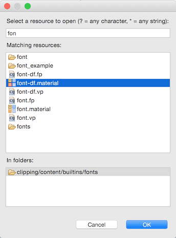

# Font files
폰트는 GUI 씬(GUI scene)에서 라벨 컴포넌트(label component)와 텍스트 노드(text node)를 렌더링 하는데 사용됩니다. 이 매뉴얼은 Defold가 폰트를 다루는 방법과 게임화면에 쓰일 폰트를 가져오는 방법에 대해 설명합니다.

폰트 파일은 TrueType, OpenType, BMFont 포멧을 사용할 수 있으며 Defold가 렌더링 할 수 있도록 그래픽형식의 포멧으로 자동으로 변환합니다. 비트맵(bitmap)과 디스턴스 필드(distance field) 두 가지의 렌더링 기술이 있으며 각각 장단점이 있습니다.

## Creating a font
Defold에서 사용할 폰트를 만들려면, **File > New > Font File** 메뉴를 선택해서 새 폰트파일을 생성할 수 있습니다. (혹은 **Project Explorer**에서 마우스 오른쪽 버튼 눌러서 파일 생성)

또한 Defold 프로젝트로 폰트를 임포트 해야합니다. TrueType이나 OpenType (혹은 BMFont, 아래 참고)  파일을 **Project Explorer**의 원하는 위치에 드래그-앤-드롭 하면 됩니다.

> 폰트의 그림자 렌더링은 현재 성능상의 이유때문에 기본적으로 비활성화 되어 있습니다. 필요한 경우엔 그림자를 렌더링하는 커스텀 쉐이더를 만들어 쓰면 됩니다(성능상 비용이 조금 들게됨). 앞으로 Defold는 사용된 기능을 기반으로 적당한 쉐이더를 선택할 수 있게 될 것입니다.

#### font
임포트한  TTF, OTF, .fnt 파일(파일을 찾으려면 [...] 버튼 클릭)을 이 속성에 설정하면 에디터는 즉시 폰트 데이터를 생성하고 폰트 에디터에서 미리보기를 보여줍니다.
#### material
폰트를 렌더링하는데 사용되는 메터리얼. 디스턴스 필드 폰트(distance field font)나 비트맵 폰트(BMFont)를 사용하려는 경우 이 값을 변경해야 합니다. (자세한 내용은 아래 참고)
#### size
픽셀단위의 문자(glyph) 크기
#### antialias
비트맵으로 구울(bake)때 안티알리아싱을 적용할 단위. 0이면 픽셀 퍼펙트(pixel perfect)로 폰트를 렌더링 합니다.
#### alpha
0.0~1.0 까지의 알파 채널 값. 0.0은 투명(transparent)하고 1.0은 불투명(opaque)함
#### outline_alpha
0.0~1.0 까지의 외곽선의 알파 채널 값
#### outline_width
픽셀단위의 외곽선 두께. 0으로 설정하면 외곽선 없음.
#### shadow_alpha
0.0~1.0 까지의 그림자 알파 채널 값
#### shadow_blur
픽셀단위의 그림자의 블러 반경(blur radius)
#### shadow_x
그림자의 가로 오프셋(horizontal offset)
#### shadow_y
그림자의 세로 오프셋(vertical offset)
#### extra_characters
기본적으로 폰트는 ASCII의 인쇄 가능한 문자(char code 32~126)들을 포함하고 있습니다. 이외의 문자를 더 추가하려면 이 속성에 추가할 문자를 입력하면 됩니다.
#### output_format
이 속성은 생성된 폰트의 타입을 제어합니다.

* TYPE_BITMAP: 폰트가 OTF나 TTF 파일인 경우에, 임포트한 폰트를 비트맵 데이터를 사용하여 텍스트 노드(text node)를 렌더링하는 폰트 시트 텍스쳐(font sheet texture)로 변환합니다. 컬러 채널은 폰트의 face shape, outline, shadow 같은 폰트의 여러 측면을 인코딩 하는데 사용되어 글꼴의 원시 모양을 red 채널로, outline은 green 채널로, shadow는 blue 채널로 미리보기를 보여 줍니다. 비트맵 타입 폰트의 픽셀의 밀도(density)는 고정되어 있으므로 정해진 사이즈 혹은  작은 사이즈로 보여주는 경우엔 깔끔하게 보일 것입니다. 비트맵 폰트는 아주 빠르게 렌더링 되지만 사이즈의 제한이 있으므로 스케일업 하는 경우엔 뭉개짐 현상이 나타납니다.

* TYPE_DISTANCE_FIELD: 임포트한 폰트를 픽셀 데이터를 사용하여 스크린 픽셀(screen pixel)이 아니라 폰트 가장자리의 거리(distances to the font edge)로서 나타내는 폰트 시트 텍스쳐(font sheet texture)로 변환합니다.

#### all_chars
이 속성을 true로 설정하면 원본 폰트 파일의 모든 문자가 출력에 포함됩니다.
#### cache_width
문자 캐쉬 비트맵(glyph cache bitmap)의 넓이를 제한하려면 이 값을 설정하십시오. 엔진이 텍스트를 렌더링할 때, 먼저 캐쉬 비트맵에서 문자(glyph)를 찾게 되는데, 캐쉬에 해당 문자가 존재하지 않는다면 렌더링하기 전에 캐쉬에 문자를 추가합니다. 캐쉬 비트맵이 너무 작아서 엔진이 렌더링 할 수 없는 경우 에러(ERROR: RENDER: Out of available cache cells! Consider increasing cache_width or cache_height for the font.)가 발생합니다. 이 값을 0으로 설정하면 캐쉬 사이즈가 자동적으로 설정됩니다.

#### cache_height
문자 캐쉬 비트맵(glyph cache bitmap)의 높이를 제한하려면 이 값을 설정하십시오.  이 값을 0으로 설정하면 캐쉬 사이즈가 자동적으로 설정됩니다.

> ASCII의 출력 가능한 문자들: space ! " # $ % & ' ( ) * + , - . / 0 1 2 3 4 5 6 7 8 9 : ; < = > ? @ A B C D E F G H I J K L M N O P Q R S T U V W X Y Z [ \ ] ^ _ ` a b c d e f g h i j k l m n o p q r s t u v w x y z { | } ~

## Bitmap BMFonts
생성된 비트맵 이외에도 Defold는 미리 구워진(prebaked) 비트맵인 "BMFont" 포멧의 폰트를 지원합니다. 이 폰트는 모든 문자 모양이 있는 PNG 폰트 시트(PNG font sheet)로 구성됩니다. 또한 **.fnt** 파일에는 사이즈와 커닝(kerning) 정보 뿐만아니라 각 문자 모양을 시트에서 찾기 위한 정보가 포함되어 있습니다.

이 폰트 타입은 TrueType 이나 OpenType 폰트 파일에서 생성된 비트맵 폰트에 비해 성능이 좋지는 않지만, 임의의 그래픽이나 컬러 효과, 그림자를 넣어 원하는 대로 꾸밀 수 있습니다.

Defold 프로젝트에 **.fnt**와 **.png** 파일을 추가해 보세요. 이 두 파일은 같은 폴더에 있어야 합니다. 새 폰트 파일을 만들고 **font** 속성값으로 **.fnt** 파일을 지정하고 **output_format** 속성을 "TYPE_BITMAP"으로 설정하세요. Defold는 비트맵을 생성하지 않는 대신 당신이 추가한 PNG 파일을 사용합니다.

> BMFont 를 만들기 위해서는 전용 툴을 사용해야 합니다. 여기 여러 옵션이 있습니다.
* Bitmap Font Generator, AngelCode에 의해 제공되는 Windows 전용 툴
* Shoebox, Windows와 MacOS를 위한 무료 Adobe Air 기반의 앱
* Hiero, Java 기반의 오픈소스
* Glyph Designer, 71 Squared의 유료 MacOS 툴
* bmGlyph, Sovapps의 유료 MacOS 툴

## Distance field fonts
디스턴스 필드(distance field) 폰트를 만들기 위해서는, **output_format** 속성에 "TYPE_DISTANCE_FIELD"를 선택하면 됩니다. 그러면 폰트로부터 디스턴스 필드 맵(distance field map)을 생성합니다. 엔진이 폰트를 렌더링하게되면, 이 디스턴스 데이터를 해석하여 날카로운 폰트의 가장자리(sharp font edge)를 만들어주는 특수한 쉐이더를 필요로 합니다. 디스턴스 필드 폰트는 비트맵 폰트에 비해 많은 성능을 소모하지만 글자의 사이즈를 조절하는데 매우 유연합니다.

이 폰트를 만들 경우(혹은 화면에 렌더링 될 때 폰트가 알맞은 쉐이더를 사용하지 않을 경우)에는 **material** 속성값을 "builtins/fonts/font-df.material"(혹은 디스턴스 필드 데이터를 다룰 수 있는 다른 메터리얼)로 변경해야 합니다. 

## Artifacts and best practices
일반적으로, 비트맵 폰트는 스케일링 없이 렌더링 될 경우엔 최선의 선택입니다. 비트맵 폰트는 디스턴스 필드 폰트보다 화면에 빠르게 렌더링 됩니다.

디스턴스 필드 폰트(Distance field font)는 폰트사이즈를 키울(upscaling) 경우에 아주 좋습니다. 반면 비트맵 폰트는 단지 픽셀로 된 이미지 이기 때문에 폰트 사이즈가 증가할 경우 픽셀의 크기도 커지게 되어 결과적으로 울퉁불퉁한 모양(blocky artifacts)이 됩니다. 아래는 48픽셀 크기의 폰트를 약 8배 정도 스케일-업 한 예제입니다.

스케일-다운하면, 상황은 반대가 됩니다. 픽셀 텍스쳐는 작아지면 렌더링 하드웨어에 의해서 안티알리아싱 처리됩니다. 아래는 위와 같은 48픽셀 크기의 폰트를 절반 크기로 줄인 예제입니다.

디스턴스 필드 폰트는 특정 상황에서 또 다른 유형의 이상현상(artifacts)을 만들어 냅니다. 만약 폰트 모양에 아주 얇은 선이 있을 경우 이 폰트를 작은 사이즈(**size** 속성)로 렌더링 하면, 디스턴스 필드 텍스쳐가 문자 모양에 중요한 점을 표현하는데 데이터가 충분하지 않으므로 아마 아래와 같이 렌더링 될 것입니다.

이 문제를 해결하려면, 더 큰 사이즈로 폰트를 만드시기 바랍니다.
