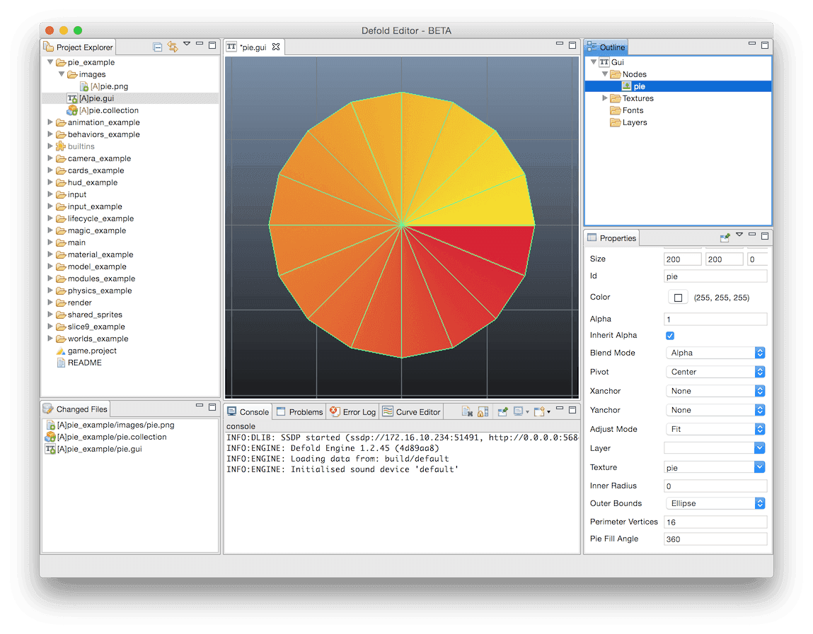
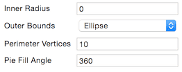
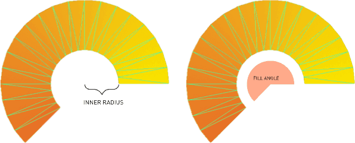

# Pie nodes
Pie 노드는 원형 또는 타원형 오브젝트를 생성하는데 사용됩니다. 간단한 형태로, pie 노드는 노드 바운딩 박스 안에서 원형 혹은 타원형으로 간단하게 표시됩니다. 넓이와 높이가 같으면 원의 지름 값으로 사용되며 넓이와 높이가 다르면 노드는 수직확장을 위해 높이값을, 수평확장을 위해 넓이 값을 사용합니다. 노드의 텍스쳐 설정은 일직선(straight)으로 반영되며 이 텍스쳐의 모서리는 노드의 바운딩 박스의 모서리와 상호 연관되게 됩니다.

Pie 노드는 다양한 모양을 만드는데 사용되는 프로퍼티들을 가지고 있습니다. 이 모든 프로퍼티는 프로그래밍 방식 ([GUI API documentation](http://www.defold.com/ref/gui/) 참고)으로 변경할 수 있으며 몇몇은 애니메이션 처리가 가능합니다.

#### Inner radius
X 축을 따라 표시된 노드의 내부 반지름(inner radius)
#### Outer bounds
노드를 외부 반지름("Ellipse")으로 확장하거나 바운딩박스("Rectangle")로 확장함
#### Perimeter vertices
노드를 360도 둘레로 둘러싸는데 필요한 꼭지점(vertex)의 수로 표현되며, 원형 모양을 그리는데 사용되는 세그먼트(segment)의 수.
#### Pie fill angle
파이의 색상을 얼마나 채울지 결정. 오른쪽에서 시작해서 반 시계 방향으로 표시됨.

**Outer bounds**는 모양(shape)을 바운딩 박스까지 확장합니다. **Inner radius** 와 **Pie fill angle**를 함께 사용하면 꽤 복잡한 모양을 만들 수 있습니다.

