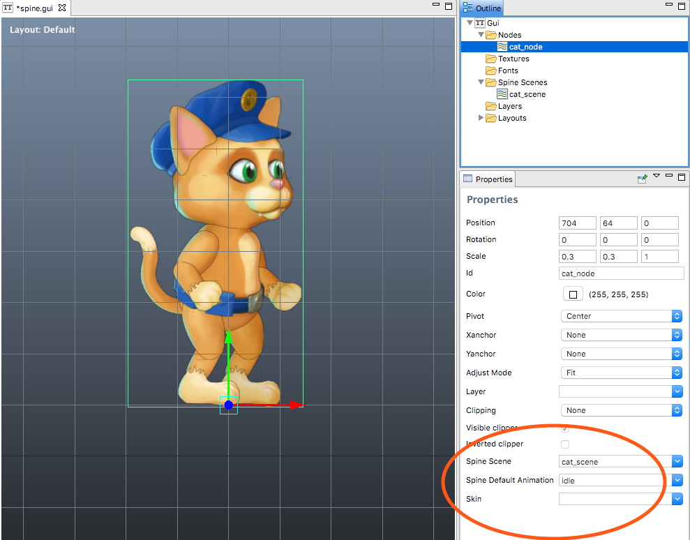

# GUI Spine nodes
게임 오브젝트에서 뿐만 아니라 GUI 애니메이션에서도 스파인 본 애니메이션을 사용할 수 있습니다. 이 매뉴얼은 GUI 씬에서 스파인 애니메이션 데이터를 임포트하는 방법을 설명합니다.

> 현재, 스파인 노드는 스파인 이벤트를 지원하지 않습니다. **SpineModel** 게임 오브젝트는 애니메이션 타임라인의 이벤트를 포함하고 게임오브젝트에 메세지를 전송할 수 있지만 스파인 노드에서는 지원되지 않습니다.

임포트된 스파인 본 애니메이션(Spine bone animation)은 게임 오브젝트 뿐 아니라 GUI 씬에서도 사용할 수 있습니다(**SpineModel** 컴포넌트를 통해서). Defold에서 스파인 본 애니메이션을 동작시키기 위해, 먼저 애니메이션 데이터를 임포트하고 스파인 씬(Spine Scene) 리소스를 설정해야 합니다. 이를 위한 설명은 [Spine animation](/manuals/spine) 문서를 참고하시기 바랍니다.

GUI 씬에서 스파인 씬 리소스의 컨텐츠를 사용하려면, **Outline** 창의 **Spine Scenes** 폴더에 마우스 오른쪽 버튼을 눌려 **Add Spine Scene** 메뉴를 선택하고 사용하려는 스파인 씬을 선택합니다.


이제 스파인 노드를 만들면(**Outline** 창의 **Nodes** 폴더에 마우스 오른쪽 버튼 누르고 **Add Spine Node** 선택) 그에 따른 새 스파인 노드의 프로퍼티들을 설정할 수 있습니다.



#### Spine Scene
이 노드의 데이터 소스로 사용할 스파인 씬
#### Spine Default Animation
씬이 초기화 될 때 자동적으로 재생할 애니메이션
#### Skin
씬이 초기화 될 때 애니메이션에 사용할 스킨

## Runtime animation control
스파인 노드는 스크립트를 통해 런타임시 제어할 수 있습니다. 노드에서 애니메이션을 시작하려면 [gui.play_spine()](http://www.defold.com/ref/gui/#gui.play_spine) 함수를 호출하기만 하면 됩니다.

```lua
local catnode = gui.get_node("cat_note")
local blend_time = 0.3
gui.play_spine(catnode, hash("run"), gui.PLAYBACK_ONCE_FORWARD, blend_time, function(self, node)
    print("Animation done!")
end)
```

## The bone hierarchy
스파인 스켈레톤에서 뼈 각각은 GUI 노드로 존재하게 됩니다. 이 노드들은 스파인 설정에서 지정된 이름에 따라 지어집니다.


예를 들어, 어떤 노드를 다른 본 노드에 연결하려면, [gui.get_spine_bone()](http://www.defold.com/ref/gui/#gui.get_spine_bone) 를 사용하여 하위의 본 노드를 이름으로 조회해서 자식 노드로 연결할 수 있습니다.

```lua
-- text 노드를 cat의 tail에 연결함
local cat = gui.get_node("cat_node")
local textnode = gui.new_text_node(vmath.vector3(400, 0, 0), "Hello tail!")
local tail = gui.get_spine_bone(cat, "tail")
gui.set_parent(textnode, tail)
```

또한 모든 본은 스파인 노드의 이름과 "/"를 접두어로 사용하여 go.get_node() 로 접근 가능합니다.

```lua
-- text 노드를 cat의 tail에 연결함
local textnode = gui.new_text_node(vmath.vector3(400, 0, 0), "Hello tail!")
local tail = gui.get_node("cat_node/tail")
gui.set_parent(textnode, tail)
```
