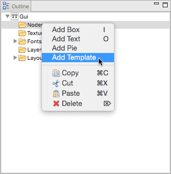
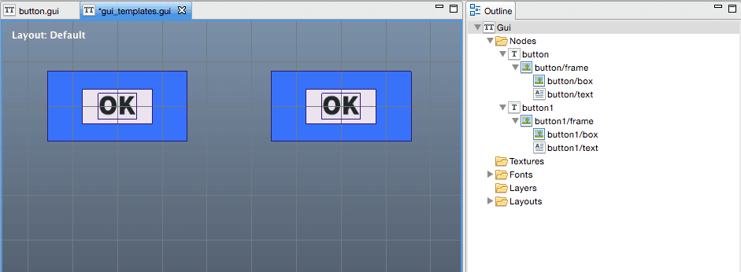
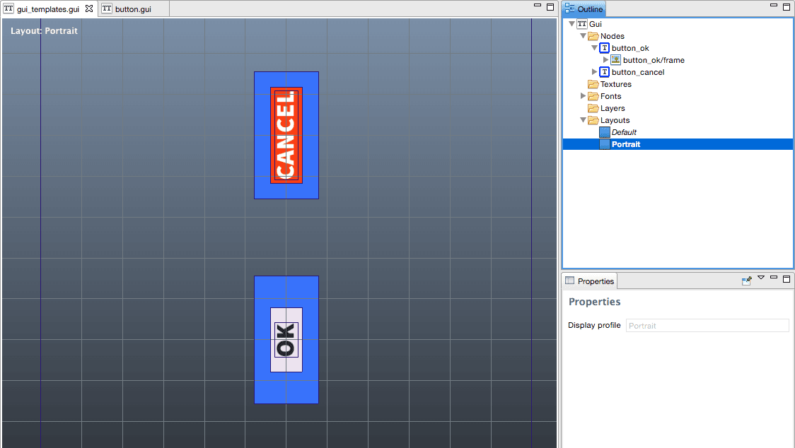

# Templates
GUI 템플릿은 "prefabs" 혹은 공유 템플릿을 기반으로 시각적 GUI 컴포넌트를 재사용하기 위한 강력하고 간단한 메커니즘을 제공합니다. 이 메뉴얼은 템플릿을 어떻게 사용하는지 설명합니다.

GUI 템플릿은 다른 컬렉션 내에 배치할 수 있는 서브 컬렉션 처럼 다른 GUI 씬에 추가할 수 있는 복합적인 노드로 구성된 GUI 씬입니다. 서브 컬렉션은 서브 컬렉션 루트(root)의 위치와 스크립트에 정의된 프로퍼티만 오버라이드(override)할 수 있지만, GUI 템플릿 노드는 모든 프로퍼티 값들을 오버라이드(override)할 수 있습니다. 또한 서브 컬렉션 처럼, GUI 템플릿 노드는 런타임 개념으로 존재하지 않으며 에디터 도구에서만 존재 합니다.

## Creating and using a template
GUI 템플릿은 일반적인 GUI 씬이므로, 템플릿을 만드는 방법은 특별한 차이가 없습니다. 우리가 버튼 템플릿 하나를 만들어 사용한다고 가정해 봅시다. 우리는 GUI 씬에 기본 버튼 하나를 만들어 파일로 저장할 수 있습니다.


이제 다른 GUI 씬에 이 버튼의 인스턴스 여러 개를 추가할 수 있습니다. 새 씬을 열거나 생성해서 **Gui ▸ Add Template Node**를 선택하고, 아니면 **Outline** 창에서  **Nodes** 폴더에 마우스 오른쪽 버튼을 눌러 드롭 다운 메뉴에서 **Add Template**를 선택합니다.



템플릿으로 사용할 GUI 씬 파일(이 예제에서는 "button.gui")을 선택합니다. 동일한 템플릿으로 기반한 인스턴스를 여러 개 추가할 수 있습니다. 만약 템플릿을 수정하면, 각 인스턴스도 에디터상에서 즉시 업데이트 되어 변경사항이 반영됩니다. 템플릿 노드에 표시되는 모든 노드들은 **Outline** 창에서 액세스 할 수 있습니다. 템플릿 밑에 있는 노드들은 "[템플릿 노드 id]/"를 접두어로 사용해 자동으로 이름이 정해집니다.



### Overloading properties
각 인스턴스 노드는 템플릿에 설정된 모든 프로퍼티를 오버로드(overload) 할 수 있습니다. 그냥 편집하려는 노드를 선택하고 변경하려는 프로퍼티를 수정하기만 하면 됩니다. 오버로드된 프로퍼티를 가진 노드들은 **Outline** 창에서 녹색으로 표시되며 오버로드된 프로퍼티는 파란색으로 표시됩니다. 파란색 프로퍼티 이름을 클릭해서 프로퍼티의 값을 기본값으로 리셋할 수 있습니다.


## Layers
레이어는 그냥 우리가 예상한대로 동작합니다. 템플릿 파일의 특정 레이아웃으로 셋팅된 프로퍼티는 해당 레이어가 존재하는 경우에 인스턴스 노드의 레이아웃에 반영됩니다. 반대로, 템플릿 노드 인스턴스에 오버로드(overloads)하면 현재 선택된 레이아웃에 영향을 줍니다.



## Scripting
템플릿 노드 메커니즘을 통해 Lua 스크립트로 추가된 노드들을 다루거나 쿼리할 수 있습니다. 노드들은 접두어 기반 템플릿 노드를 포함한 전체 이름으로 지정해야 합니다.

```lua
if gui.pick_node(gui.get_node("button_ok/frame"), x, y) then
    -- Do something...
end
```

런타임시에는 템플릿 노드를 표현할 수 없습니다. 템플릿 노드의 모든 노드들은 게임에 추가되지만 템플릿 노드는 에디터상에서만 존재합니다. 또한 스크립트를 템플릿 GUI 씬에 추가하면, 이 스크립트는 무시됩니다. 오직 한 개의 스크립트만 각 GUI씬과 엮을 수 있으며 일반적으로 **Outline** 창의 씬 루트 노드(scene root node)만 설정할 수 있습니다.


