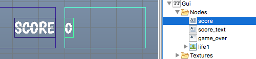

# GUI text nodes
Font는 GUI 씬에서 text 노드를 렌더링하는데 사용됩니다. 이 매뉴얼은 GUI 씬에서 텍스트를 다루는 방법에 대해 설명합니다.

## Adding text nodes
GUI text 노드에서 사용할 폰트는 GUI 컴포넌트에 추가해야 합니다. **Fonts** 폴더에서 마우스 오른쪽 버튼을 누르거나 상단 메뉴의 **GUI** 메뉴에서 단축키를 눌러 폰트를 추가합니다.


Text 노드는 몇 가지 특별한 프로퍼티를 가지고 있습니다.

#### Font
생성한 모든 text 노드는 Font 프로퍼티를 설정해야 함
#### Text
이 속성에 포함된 문자를 표시함
#### Line Break
pivot 설정에 따라 텍스트를 정렬하고 텍스트를 여러 줄로 나눌지를 결정함. 노드의 넓이에 따라 줄바꿈(wrap)이 결정됨.

## Alignment
노드의 pivot 를 설정해서 텍스트의 adjust mode를 변경할 수 있습니다.

#### Center
pivot이 "Center", "North", "South" 이면 텍스트가 중앙 정렬됩니다.
#### Left
pivot이 "West" 이면 텍스트가 왼쪽 정렬됩니다.
#### Right
pivot이 "East" 이면 텍스트가 오른쪽 정렬됩니다.


## Modifying text nodes in runtime
Text 노드는 크기, 피벗, 색상 등을 설정하는 일반적인 함수에도 반응하지만 텍스트 노드 전용의 몇몇 함수도 존재합니다.

* text 노드의 폰트를 변경하기 위해 gui.set_font() 함수 호출
* text 노드의 줄바꿈(line break)를 변경하기 위해 gui.set_line_break() 함수 호출
* text 노드의 내용을 변경하기 위해  gui.set_text() 함수 호출

```lua
function on_message(self, message_id, message, sender)
    if message_id == hash("set_score") then
        local s = gui.get_node("score")
        gui.set_text(s, message.score)
    end
end
```




