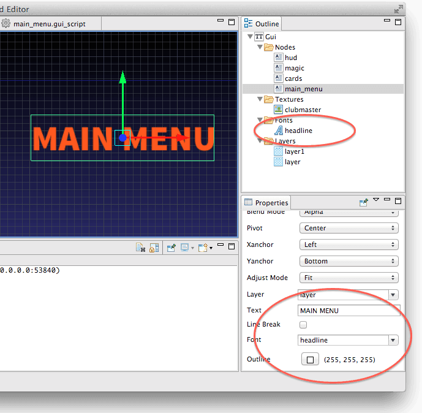
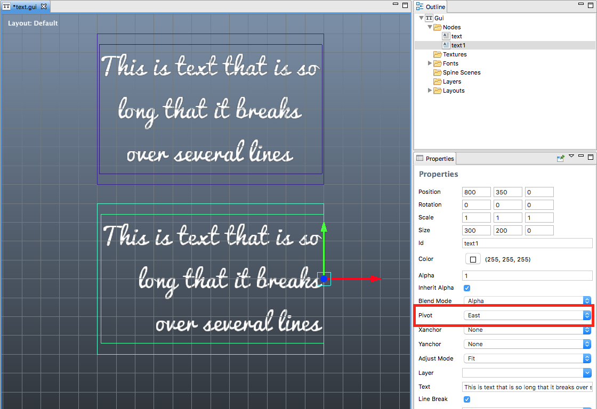

# GUI 텍스트 노드

Defold는 GUI 씬에서 텍스트를 렌더링할 수 있는 특정한 유형의 GUI 노드를 지원합니다. 프로젝트에 추가된 모든 폰트 리소스는 텍스트 노드 렌더링에 사용할 수 있습니다.

## 텍스트 노드 추가하기

GUI 텍스트 노드에서 사용하려는 폰트는 GUI 컴포넌트에 추가해야 합니다. *Fonts* 폴더를 오른쪽 클릭하거나, 상단 <kbd>GUI</kbd> 메뉴를 사용하거나, 해당 키보드 단축키를 누르세요.



텍스트 노드에는 특수 프로퍼티들이 있습니다:

*Font*
: 생성하는 모든 텍스트 노드는 *Font* 프로퍼티가 설정되어 있어야 합니다.

*Text*
: 이 프로퍼티에는 표시되는 텍스트가 들어 있습니다.

*Line Break*
: 텍스트 정렬은 피벗 설정을 따르며, 이 프로퍼티를 설정하면 텍스트가 여러 줄로 이어질 수 있습니다. 노드의 너비가 텍스트가 줄바꿈되는 위치를 결정합니다.

## 정렬

노드 피벗을 설정하여 텍스트의 정렬 모드를 변경할 수 있습니다.

*Center*
: 피벗이 `Center`, `North` 또는 `South`로 설정되어 있으면 텍스트가 가운데 정렬됩니다.

*Left*
: 피벗이 `West` 모드 중 하나로 설정되어 있으면 텍스트가 왼쪽 정렬됩니다.

*Right*
: 피벗이 `East` 모드 중 하나로 설정되어 있으면 텍스트가 오른쪽 정렬됩니다.



## 런타임에 텍스트 노드 수정하기

텍스트 노드는 크기, 피벗, 색상 등을 설정하는 모든 일반 노드 조작 함수에 응답합니다. 텍스트 노드에만 적용되는 함수도 몇 가지 있습니다:

* 텍스트 노드의 폰트를 변경하려면 [`gui.set_font()`](/ref/gui/#gui.set_font) 함수를 사용합니다.
* 텍스트 노드의 줄바꿈 동작을 변경하려면 [`gui.set_line_break()`](/ref/gui/#gui.set_line_break) 함수를 사용합니다.
* 텍스트 노드의 내용을 변경하려면 [`gui.set_text()`](/ref/gui/#gui.set_text) 함수를 사용합니다.

```lua
function on_message(self, message_id, message, sender)
    if message_id == hash("set_score") then
        local s = gui.get_node("score")
        gui.set_text(s, message.score)
    end
end
```
