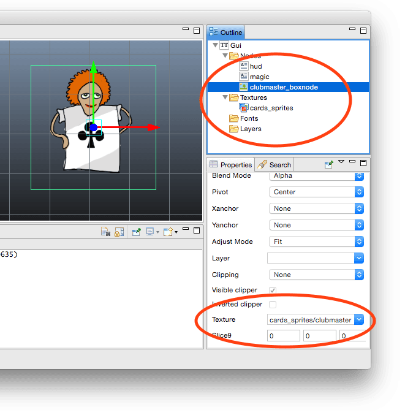
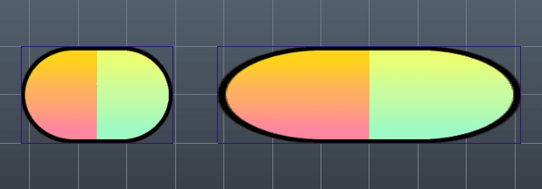
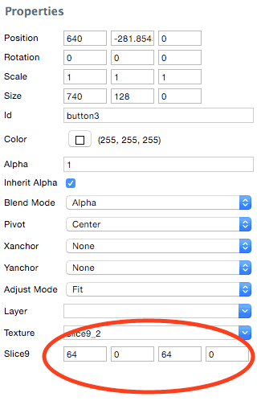
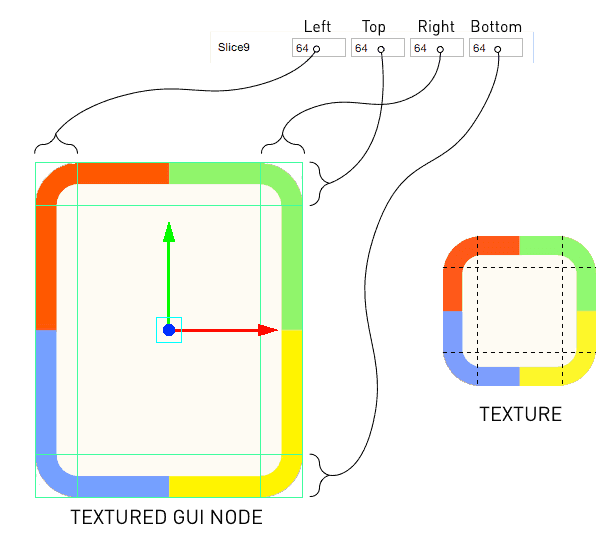
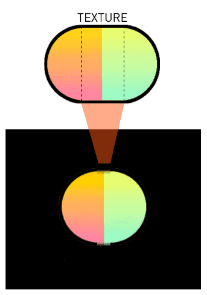
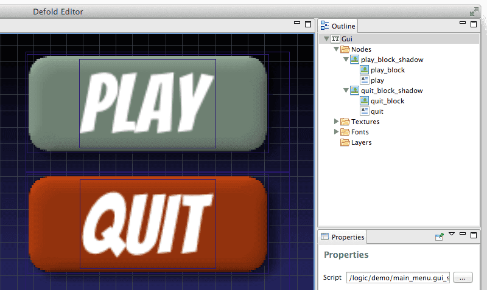
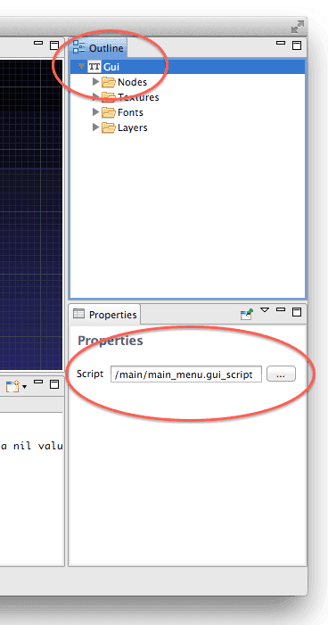
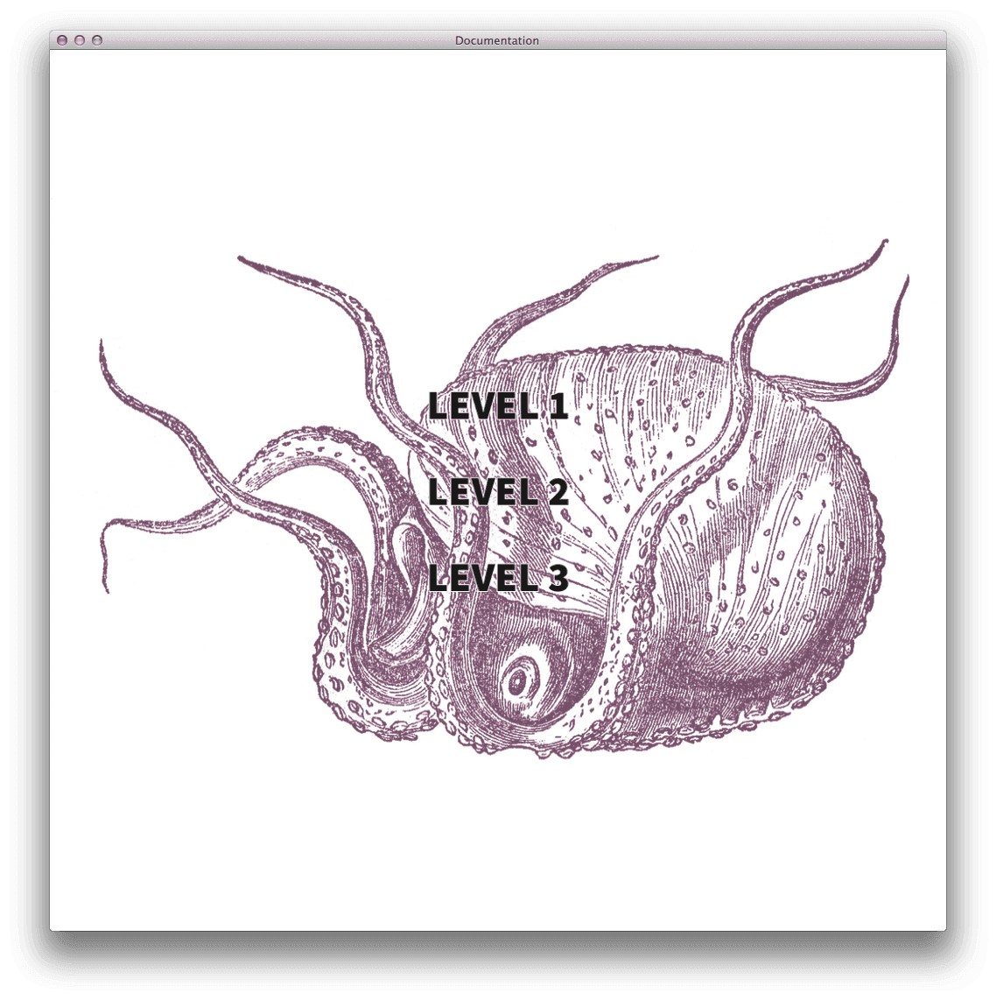
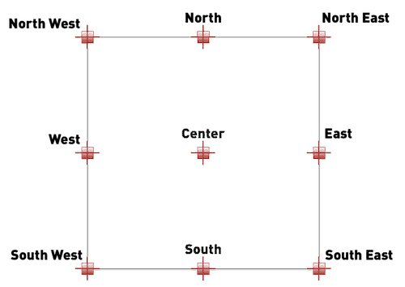

# GUI
Defold는 유저 인터페이스의 구성과 구현을 위해 맞춤형 커스텀 GUI 에디터와 강력한 스크립팅 기능을 제공합니다. 이 매뉴얼은 이러한 기능을 설명합니다.

Defold의 그래픽 유저 인터페이스(graphical user interface)는 컬렉션에 배치된 게임 오브젝트에 첨부하는 게임 오브젝트 컴포넌트입니다. 이 컴포넌트는 아래의 프로퍼티들을 가집니다.

* 유저 인터페이스의 해상도(resolution)와 종횡비(aspect ratio)를 독립적으로 렌더링하는 간단하지만 강력한 레이아웃 기능
* gui 스크립트를 통하여 논리 동작(logic behavior)을 연결할 수 있음
* 게임의 플레이 화면과는 별도로 컨텐츠 위쪽(on top)에서 렌더링됨
* 카메라 뷰가 독립적인 화면 공간의 좌표 시스템(screen-space coordinate system)에 맞춰 렌더링되며, 카메라를 움직이더라도 GUI 요소는 화면에 그대로 유지됨

GUI는 컬렉션의 좌표계에 속하지 않고, 게임 뷰와는 독립적으로 렌더링 됩니다. 그렇기 때문에 GUI를 컬렉션 에디터에서 특정 위치에 배치할 수 없으며 시각적 표현(visual representation)을 가지지도 않습니다. 하지만 GUI 컴포넌트는 컬렉션에 위치한 게임오브젝트에 상주해야 합니다. 게임 오브젝트의 위치를 바꿔도 GUI에는 영향을 미치지 않습니다.

> 렌더링 동작은 렌더 스크립트에서 변경할 수 있지만 일반적으로 화면의 특정 지점에 HUD 항목과 메뉴가 필요하기 때문에 유저 인터페이스는 게임 뷰의 상위(top)에 별도의 시각적 표현인 "레이어(layer)"를 사용하여 정렬(arrangement)하는 것이 바람직 합니다.

## Nodes
GUI 컴포넌트는 여러 개의 노드로 구성됩니다. 노드는 아래 항목에 해당하는 시각적 오브젝트입니다.

* Box node, 사각형에 색상이나 텍스쳐로 채워짐
* Text node, 자세한 것은 [Text nodes](/manuals/gui-text) 문서 참고
* Pie node, 자세한 것은 [Pie nodes](/manuals/gui-pie) 문서 참고
* Template node, 자세한 것은 [Template nodes](/manuals/gui-template) 문서 참고
* Spine node, 자세한 것은 [Spine nodes](/manuals/gui-spine) 문서 참고

노드는 단순하고 어떠한 로직도 포함하고 있지 않습니다. 에디터상에서나 런타임시 스크립트를 통하여 이동(translate or move)하거나 부-모 관계를 정렬(order)시킬 수는 있습니다. 스크립트 코드로 GUI 컴포넌트의 모든 노드들에게 직접적으로 액세스 할 수 있습니다. 노드는 스크립트로 애니메이션 시킬 수 있고(아래 [Property animation](/manuals/animation/#_property_animation) 참고) 애니메이션은 노드에서 실행될 수 있습니다(Box node의 플립북(flipbook) 애니메이션 그리고 Spine node의 본(bone) 애니메이션).

"Nodes" 폴더에서 마우스 오른쪽 버튼을 눌러 "Add Box", "Add Text", "Add Pie", "Add Template", "Add Spine Node" 중 하나를 선택해 노드를 추가합니다.


상단의 GUI 메뉴를 사용하거나 키보드 단축키 "I" 와 "O"를 사용하여 box나 text 노드를 추가할 수 있습니다. 배치된 노드는 게임 오브젝트를 움직이는 것과 같은 방법으로 컬렉션 에디터상에서 이동하고 회전시킬 수 있습니다.

### Node properties
각 노드에는 이들의 외형(appearance)을 제어하는 많은 프로퍼티가 있습니다.

* Position, Rotation, Scale, Size (애니메이션 적용 가능)
* Color, Outline, Shadow (애니메이션 적용 가능)
* Blend mode
* Adjust mode, Pivot, Xanchor, Yanchor
* Font, Text, Line-break (text node 전용)
* Index, Layer, Parent
* Clipping (box node와 pie node 전용) (자세한 것은 [Clipping](/manuals/gui-clipping) 참고)

이들 프로퍼티는 에디터의 프로퍼티 탭에서 수정(인덱스(index) 설정과 부모관계(parenting) 설정은 안됨)하거나 스크립트를 통해 수정([GUI API](http://www.defold.com/ref/gui) 참고)하는 것이 가능합니다.

이들 각 프로퍼티는 스크립트를 통해 애니메이션을 적용할 수도 있습니다. (아래 [Property animation](/manuals/animation/#_property_animation) 참고) 

## Textures and flip book animations
GUI 인터페이스 컴포넌트의 일부분으로 텍스쳐 아틀라스나 타일 소스의 이미지나 애니메이션을 사용 할 수 있습니다. 먼저 이미지 리소스(아틀라스 혹은 타일 소스)가 추가하면 이 리소스에 포함된 모든 이미지와 애니메이션을 GUI 노드에 반영할 수 있습니다. 상단의 "GUI" 메뉴를 사용하거나 키보드 단축키를 사용하거나 "Textures" 폴더에 마우스 오른쪽 버튼을 눌러서 텍스쳐를 추가해 보세요.

GUI에 추가된 텍스쳐는 box나 pie 노드에 반영할 수 있습니다.



선택된 텍스쳐 애니메이션(혹은 싱글 프레임 이미지)은 GUI 컴포넌트가 화면에 그려지면 자동적으로 재생됩니다.

box 노드의 색은 애니메이션의 색조를 조정(tint)합니다. 색조(tint color)는 이미지 데이터에 곱해지게 되는데, 즉 흰색(기본값)으로 설정하면 색조가 적용되지 않습니다.


> Box 노드는 텍스쳐가 할당되지 않았거나 알파값이 0이거나 사이즈가 0,0,0이어도 항상 렌더링 됩니다. Box 노드는 텍스쳐를 항상 할당해 두는 것이 좋습니다. 만약 빈(empty) 노드가 필요하다면 텍스쳐를 할당해 둔 채 사이즈를 0,0,0 으로 설정하십시오.

## Slice-9 texturing
많은 GUI와 HUD는 크기와 관련한 민감한 문제가 있습니다. 패널과 다이얼로그는 포함된 컨텐츠의 크기에 맞게 리사이즈할 필요가 종종 있는데, 텍스쳐를 스케일된 노드에 반영할 경우 문제가 발생합니다. 예를 들어, 버튼에 작성할 텍스트의 길이 만큼 넓이가 고정된 큰 버튼을 사용하려 한다고 칩시다. Box 노드를 만들어 텍스쳐를 반영하고 스케일을 변경하면 아래와 같이 됩니다.



Defold는 이 같은 문제를 해결하기 위해 slice-9 texturing 이라는 기능을 포함하고 있습니다. 이 기능은 노드의 스케일이 변경될 때 노드 텍스쳐 일부분의 사이즈를 유지해 줍니다. 이를 노드에 반영하면 버튼 텍스쳐는 조각나게 되고 버튼 노드의 가로 사이즈를 변경해도 양 끝의 부분은 스케일 되지 않습니다.


따라서 이 간단한 테크닉을 사용하면 어떠한 넓이의 버튼도 예쁘게 만들 수 있습니다. box 노드의 **Slice9** 프로퍼티는 텍스쳐를 어떻게 잘라낼(slice) 것인지를 제어합니다.



**Slice9**는 노드가 리사이징 될 때 고정할 마진 넓이(margin width)를 지정하는 픽셀단위의 4개 숫자로 제어합니다. 모서리 부분(corner segments)은 스케일 되지 않고 이동만 되며, 가장자리 부분(edge segments)은 하나의 축(axis)을 따라 스케일 되고, 중앙 부분(center segment)은 가로세로 둘 다 스케일 됩니다. 이 마진값은 왼쪽 부터 시계 방향으로 설정 됩니다.



렌더러에서 밉맵(mipmap)이 작동하는 방식 때문에, 텍스쳐 세그먼트(texture segments)의 스케일링은 때로 이상하게 보일 수도 있습니다. 이는 원래의 텍스쳐 사이즈보다 작게 세그먼트의 스케일을 줄이는 경우 발생하므로 렌더러는 세그먼트를 위한 낮은 해상도의 밉맵을 선택하여 이상현상을 해결합니다.



이 문제를 피하는 것은 쉽습니다. 원본 텍스쳐(source texture)에서 스케일 할 영역(segment)을 더 이상 스케일 다운이 불가능하고 오로지 스케일 업만 가능하게끔 충분히 작게 만들면 됩니다.

> 텍스쳐 메모리를 절약하기 위해서는 상단이나 하단 가장자리 영역(edge segment)을 1픽셀로 만드는 것이 바람직합니다. 하지만 이럴 경우 텍스쳐 필터링으로 인해 원치 않는 현상이 나타날 수도 있습니다. 가장자리(edge)를 좀 더 늘리면 인접한 픽셀값(neighbor pixels)으로 시작하고 중단하게 되므로 일반적으로 더 나은 결과를 얻게 됩니다.

## Index: rendering order
모든 노드들은 "Nodes" 폴더에 나열된 순서에 따라 렌더링됩니다. 목록의 맨위에 있는 노드가 첫 번째로 그려지므로 다른 노드의 뒷쪽(behind)에 나타납니다. 목록의 맨 아래에 있는 노드는 맨 마지막에 그려지므로 모든 노드들의 맨 앞(front)에 나타납니다. 목록에 있는 노드를 드래그해서 이들의 인덱스 순서를 변경할 수 있습니다.

또한 레이어를 사용해서 노드 순서를 그룹화 하고 변경할 수도 있습니다. (아래 참고)

만약 node의 Z 값을 설정해도 그리기 순서(draw order)는 바뀌지 않습니다. 노드에서 Z 값은 무시됩니다.

### Parent-child hierarchies
노드를 다른 노드로 드래그해서 부모-자식 관계를 만들 수 있습니다. 부모가 있는 노드는 부모에 반영되고 부모 피벗(parent pivot: 아래 참고)에 상대적인 트랜스폼(transform: 위치, 회전, 스케일 변경)을 상속합니다. 자식 노드들은 부모 이후에 그려지므로 부모 노드의 앞쪽에 나타나게 됩니다. 레이어를 사용하면 부모와 자식노드의 그리기 순서를 변경하고 노드의 렌더링을 최적화 할 수 있습니다. (아래 "Batch Rendering" 참고)

## Layers
레이어(layer)를 사용하면 노드를 그리는 방법을 좀 더 세밀하게 제어할 수 있습니다. 레이어를 노드에 반영하면 레이어의 일부로서 그려지게 됩니다. 레이어 그리기 순서는 일반적인 노드의 순서보다 우선하게 됩니다.


이 예제에서 "box2" 오렌지색 box 노드는 "front" 레이어의 일부이며 레이어 순서에 따라서 맨 마지막에 그려지게 됩니다. 즉 "front" 레이어의 모든 노드는 레이어에 속하지 않은 노드들과 "back" 레이어의 노드들을 뒤로 한 채 최상위에 그려지게 됩니다.

"box1"과 "box3" 둘 다 "back" 레이어로 셋팅되어 있을 경우, 이 레이어 안에서의 그리기 순서는 노드 리스트에 배치된 노드의 인덱스에 의해서 결정됩니다. "box1"이 "box3" 위에 있으므로 "box3"의 뒷쪽으로 먼저 그려지게 됩니다.

> 설정되지 않은 레이어를 사용한 자식 노드는 부모 노드의 레이어 설정을 암시적으로 상속합니다. 노드에 레이어를 설정하지 않으면 암시적으로 "null" 레이어를 추가해서 다른 레이어들 보다 먼저 그려지게 됩니다.

## Batch rendering
GUI를 가능한 효율적으로 렌더링 하기 위해서, 엔진이 GUI 노드들을 일괄적으로 모아서 그리는, 즉 엔진이 만드는 드로우콜(drawcalls)의 수를 줄이는 단계가 있습니다. 만약 노드들의 그룹이 아래의 조건을 충족하면 단일 배치(single batch) 내에서 처리될 수  있습니다.

1. 모두 box 노드 뿐이라면, 텍스쳐를 같은 아틀라스에서 사용 해야함
2. 노드들은 같은 블렌드 모드(blend mode)로 렌더링 해야 함
3. text 노드가 여러 개 라면, 동일한 폰트를 사용해야함
4. 순서대로 렌더링 되어야 함. 즉 노드 리스트에서 하위 계층에 함께 포함되거나 같은 레이어에 속해야 함 (자세한것은 아래 예제 참고)
5. 게다가, clipping 노드는 항상 일괄처리(batch)를 중단하고 각 스텐실 범위(stencil scope) 또한 일괄처리(batch)를 중단함.

계층구조(hierarchies)에서 노드들을 정렬 하는 기능은 강력하며, 노드의 복잡한 계층을 관리 가능한 단위로 그룹화 하기 쉽습니다. 하지만 계층구조(hierarchies)는 효과적으로 배치 렌더링(batch rendering)을 중단할 수도 있습니다. 아래 간단한 예제를 봅시다.



여기서는 노드 3개씩 2개의 버튼이 있으며 그림자용 텍스쳐가 있는 box 노드와 음영(shaded) 버튼 텍스쳐를 사용한 box노드, 버튼의 텍스트를 사용한 text 노드로 되어 있습니다. 우리는 이들 노드를 논리적으로 관리 가능한 계층에 넣었습니다. 버튼 그래픽은 "alpha" 블렌드 모드로 그려지고, 그림자는 "mutliply" 블렌드 모드로 그려집니다.

렌더링 파이프라인이 노드의 목록을 통과할 때, 각 개별 노드를 위해 개별적인 배치(batch)를 설정해야합니다. 왜냐하면 동일한 아틀라스를 공유하는 노드들이 이 목록을 통과하기 때문입니다. 하지만 그림자 노드는 버튼과 다른 혼합 모드(blend mode)를 사용하기 때문에, 배치(batch)는 각 노드에서 끊어지게 됩니다. 따라서 이들 두 버튼에게는 모두 6개의 개별 배치(batch)가 필요합니다.

하지만 이걸 더 개선할 수도 있습니다. 신중하게 우리의 노드에 레어이를 할당해서 우리의 버튼을 더욱 효율적으로 렌더링 할 수 있습니다. 이 예제에서는 3개의 레이어를 만들도록 합니다.

1. Shadow
2. Button
3. Text

노드를 해당 레이어에 할당하고 Layers 목록에서 레이어가 올바른 렌더링 순서로 배치되어 있는지 확인합니다.


레이어 그리기 순서가 일반적인 노드 순서보다 우선하므로 노드들은 아래 순서대로 그려지게 됩니다.

1. play_block_shadow
2. quit_block_shadow
3. play_block
4. quit_block
5. play
6. quit

아틀라스 노드, 블렌드 모드, 폰트를 공유하는 노드는 서로 인접해 있으며 렌더링 파이프라인은 이들 노드를 6개 대신 3개의 배치(batch)로 일괄처리할 수 있습니다. 이는 약 50%의 성능 향상이 있게 됩니다.

이제, 예제의 스케일을 더 넓혀서 GUI를 10개의 버튼으로 만든다고 상상해 봅시다. 우리가 적절한 레이어를 각 새로운 노드에 할당한다면, 엔진은 30개의 드로우 콜이 아니라 여전히 3개의 배치(batch) 안에서 렌더링 할 수 있습니다.

## Script
Lua 스크립트를 사용하면 GUI의 로직을 제어하고 노드에 애니메이션을 적용할 수 있습니다. GUI 스크립트는 일반적인 게임 오브젝트 스크립트와 동일하게 동작하지만 다른 종류의 파일로 저장되고 "gui" 모듈의 함수에 액세스 할 수 있습니다.

프로젝트에서 GUI 스크립트 파일을 생성하고 Outline 창에서 최상위(root) GUI 컴포넌트를 선택해서 Properties 창에서 Script 항목에 생성한 GUI 스크립트 파일을 지정합니다.



이 스크립트 파일은 기본적으로 게임 오브젝트 스크립트와 같은 함수를 가지고 있습니다.

```lua
function init(self)
end

function final(self)
end

function update(self, dt)
end

function on_message(self, message_id, message, sender)
end

function on_input(self, action_id, action)
end

function on_reload(self)
end
```

GUI 컴포넌트는 게임 오브젝트 처럼 입력(input)과 메세지(message)를 받을 수 있습니다. URL의 fragment 부분의 컴포넌트를 지정하여 GUI컴포넌트에 메세지를 보낼 수 있습니다.

```lua
local msgdata = { score = 4711, stars = 3, health = 6 }
msg.post("hud#gui", "set_stats", msgdata)
```

## Handling different resolutions and aspect ratios
GUI 컴포넌트는 게임 컨텐츠의 앞(top)에서 별도로 렌더링 되며, 게임 개발자들이 해상도(resolutions)와 종횡비(aspect ratios)가 다른 화면의 장치를 쉽게 다루기 위한 몇 가지 메커니즘이 있습니다.

Defold 게임 프로젝트는 "game project" 셋팅에서 목표 해상도(target resolution)를 지정할 수 있습니다. 하지만 여러 장치의 해상도와 종횡비 화면을 지원해야 한다면, 목표 화면에 맞추기 위해 업스케일(upscale)이나 다운스케일(downscale)이 필요할 수도 있습니다.

Defold는 GUI 컴포넌트를 게임 컨텐츠와 다르게 스케일을 처리합니다. 또한 해상도와 종횡비에 관계 없이 유저 인터페이스를 배치할 수 있는 간단하고 강력한 레이아웃 기능을 제공합니다.

GUI를 사용해 게임 앱을 만들어서 간단한 실험을 해 보도록 합시다. 화면 사이즈를 1024x1024 크기의 정사각형으로 설정하고 배경 이미지 위에 레벨 메뉴를 GUI 컴포넌트로 배치합니다. 컴퓨터에서 이를 실행하면 어떻게 보일까요?



이제 이 앱을 iPad에서 실행하면(종횡비가 4:3이고 화면 크기가 다름) 아래와 같이 보이게 됩니다.


우리는 iPad에서 게임이 화면에 채워지도록 늘어난(stretche) 것을 볼 수 있습니다. 배경의 문어 이미지는 변형되었지만 GUI 컴포넌트는 그렇지 않았습니다. text 노드는 올바른 종횡비로 렌더링 되어 화면 중앙의 위치를 유지합니다.

실행중인 Defold 게임의 창 크기를 변경해서 해상도와 종횡비를 바꾸는 것을 쉽게 시뮬레이션 할 수 있습니다. 해상도와 종횡비가 다른 장치에서 게임을 실행하는 것은 윈도우 창을 늘리고 줄이는 것과 동일합니다. 윈도우 창 크기를 변경하면 유저인터페이스 레이아웃을 제어하는 조정(adjustment)과 앵커(anchor) 규칙에 따라 GUI 컴포넌트를 다시 그리거나 재배치하는 동작이 트리거됩니다.

### Adjust mode
윈도우 사이즈가 변경되어 해상도와 종횡비도 변경되면, 모든 노드들은 Adjust Mode 프로퍼티 설정에 따라 모양이 변경(resharped) 되고 조정(adjusted) 됩니다. 이 프로퍼티는 아래 3개의 셋팅이 있습니다.

1. Fit(맞춤). 기본값. 이 노드는 바운딩 박스의 넓이나 높이 중 작은 크기에 비례하여 균일한 비율로 리사이징함.
2. Zoom(줌). 이 노드는 바운딩 박스의 넓이나 높이 중 큰 크기에 비례하여 균일한 비율로 리사이징함.
3. Stretch(늘이기). 이 노드는 화면 크기에 비례하여 모양이 바뀜.

몇 개의 노드를 사용해 GUI 컴포넌트를 포함한 아래 예제를 살펴보면 adjust mode에 대해 쉽게 이해할 수 있습니다.

* 참고용으로 배경에 모눈 텍스쳐(grid texture)를 가진 box 노드를 배치하고 **Adjust Mode**를 "Stretch"로 셋팅함
* Defold 로고 텍스쳐를 사용한 256x256 픽셀 box 노드 세 개를 배치하고 **Adjust Mode**를 각각 "Fit", "Zoom", "Stretch"로 셋팅함


이제 윈도우 사이즈가 변경될 때 box 노드들이 어떻게 바뀌는지 봅시다.


"Stretch"  노드는 새로운 모양에 따라 변경되지만 "Fit"과 "Zoom" 노드는 종횡비를 유지합니다. "Fit" 노드는 모양이 변형된 바운딩 박스(모눈 사각형 안에서)의 안쪽에서 비율을 유지하고 "Zoom" 노드는 모양이 변경된 바운딩 박스를 덮어버리며 비율을 유지합니다.

Text 노드도 똑같은 방식으로 동작합니다. adjust mode는 텍스트의 모양을 제어하는 숨겨진 바운딩 박스에 반영됩니다.

## Anchors
앵커는 창 크기가 변경될 때 노드의 위치를 바운딩 박스 내에서 제어합니다. 새 노드는 앵커가 없는 상태로 만들어지므로 화면의 중앙을 기준으로 배치됩니다.

### Node repositioning without anchors
생성된 노드의 기본 동작은 다음과 같습니다.

* GUI 컴포넌트의 좌표계는 창 사이즈의 중앙을 기준으로 균등하게 스케일 됨.
* 노드는 스케일된 좌표계에서 위치를 유지함

즉 앵커가 없는 노드들은 화면의 중앙을 기준으로 상대거리를 유지합니다. 예를 들어, 윈도우가 좌우로 늘어난다면, 추가 넓이는 GUI의 양 측면에 균등하게 분배됩니다.


또한, 윈도우가 축소(shrunk)되어 상대적으로 좁아진다면, 추가 높이는 GUI의 위 아래로 균등하게 분배됩니다.


### Node repositioning with anchors
Xanchor와 Yanchor 프로퍼티를 셋팅하면 바운딩 박스의 가장 자리를 기준으로 노드의 위치를 잠금(lock) 할 수 있습니다.

* Xanchor를 "Left"로 설정하면 노드의 수평 위치가 box의 왼쪽 가장자리로 고정됩니다.
* Xanchor를 "Right"로 설정하면 노드의 수평 위치가 box의 오른쪽 가장자리로 고정됩니다.
* Yanchor를 "Top"으로 설정하면 노드의 수직 위치가 box의 윗쪽 가장자리로 고정됩니다.
* Yanchor를 "Bottom"으로 설정하면 노드의 수직 위치가 box의 아래쪽 가장자리로 고정됩니다.

실제로 Xanchor 프로퍼티를 "Right"로 설정하고 Yanchor 프로퍼티를 "Top"으로 설정하면, 노드는 box의 오른쪽 위 모서리를 기준으로 위치를 유지하며 오른쪽 가장자리와 상단 가장자리까지와의 거리도 유지됩니다. **"Pivot"** 은 기본값 "Center"로 중심점을 유지하며, 모서리로 앵커를 지정하려면 **Pivot** 값을 적절히 조정하면 됩니다.


이 예제는 "Top"과 "Right"로 앵커가 지정된 노드를 보여줍니다. "Fit"이 조정되고 **Pivot**을 "North East"로 설정하면 윈도우 창이 늘어날 때 노드는 변형될 박스(파란색 점선 사각형) 내에서 앵커가 지정되어 맞춰지게 됩니다.

### Pivot
각 노드는 GUI 좌표계 내에서 위치(position), 스케일(scale), 회전(rotation) 속성을 가지고 있습니다. 노드는 position 속성으로 배치되며 pivot에 설정된 좌표를 기준으로 회전합니다. text노드는 pivot 설정에 따라 정렬됩니다.

노드의 기본 위치와 회전은 **Pivot** 프로퍼티가 "Center"로 설정되어 노드의 중앙을 기준으로 발생합니다. 노드의 pivot은 아래 설정 중 하나로 변경할 수 있습니다.

* Center
* North, South, East, West
* North West, North East, South West, South East

다음 그림은 각 pivot 설정의 위치를 보여줍니다.



노드의 pivot을 변경하면 노드는 새 pivot에 주어진 위치로 이동하게 됩니다. Text 노드는 "Center"일 경우 중앙 정렬되며 "West"일 경우 왼쪽 정렬, "East"일 경우 오른쪽으로 정렬됩니다.

## GUI scripts
GUI노드에는 로직 자체는 없지만 GUI 컴포넌트에 연결된 GUI 스크립트에서 노드를 직접 제어할 수 있습니다. 이 작업은 노드의 id를 사용해 참조하고 이 참조는 일반적으로 변수에 저장되어 노드를 다루는데 사용됩니다.

```lua
-- "magic" text 노드를 참조함
local magicnode = gui.get_node("magic")
-- 노드를 오렌지색으로 바꿈
local orange = vmath.vector4(1.0, 0.3, 0.0, 1.0)
gui.set_color(magicnode, orange)
```

gui.get_node() 함수를 사용해서 노드의 참조를 획득하고 GUI 모듈의 위치, 크기, 모양, 그리기 순서, 부모 관계 변경 등의 다양한 함수를 다룰 수 있습니다. 모든 노드의 프로퍼티들은 스크립트를 통해 접근 가능합니다.

### Node id:s
각 노드는 유니크한 id를 가지고 있습니다. box 노드를 생성하면 기본 id로 "box"가 설정되며, text 노드는 "text"를 기본 id로 설정되지만 유니크한 이름과 더 명확한 설명을 위해 노드의 id를 변경하는 것이 좋습니다. 만약 Defold의 GUI 에디터에서 중복 id를 감지하면 에러가 발생합니다.

### Dynamically created nodes
런타임시 스크립트에서 새 노드를 생성하려면 두 가지 방법이 있습니다.

```lua
-- 300x300 위치에 150x200 사이즈로 흰색 box 노드 생성하기
local new_position = vmath.vector3(300, 300, 0)
local new_size = vmath.vector3(150, 200, 0)
local new_boxnode = gui.new_box_node(new_position, new_size)
-- 동일한 위치에 text 노드 추가하기
local new_textnode = gui.new_text_node(new_position, "Hello!")
```

생성된 노드를 참조하는 변수를 사용하여 노드를 자유롭게 다룰 수 있습니다.

```lua
-- text노드를 10도 회전하기(z축 기준)
gui.set_rotation(new_textnode, vmath.vector3(0, 0, 10))
```

이 코드를 GUI 스크립트의 init() 함수에 넣어 실행하면 아래와 같이 됩니다.


또 다른 방법으로는 이미 존재하는 노드를 복제하여 새 노드를 생성할 수도 있습니다.

```lua
-- magic text 노드 복제하기
local magicnode = gui.get_node("magic")
local magic2 = gui.clone(magicnode)
-- 새 노드를 원본 위치의 오른쪽 상단으로 옮기기
gui.set_position(magic2, vmath.vector3(300, 300, 0))
```

### Dynamic node IDs
동적으로 노드를 생성하면 id가 할당되지 않습니다. 이것은 의도적으로 설계되었습니다. gui.new_box_node(), gui.new_text_node(), gui.new_pie_node(), gui.clone() 함수가 반환하는 레퍼런스는 노드에 액세스 하기위한 유일한 값이므로 참조를 추적하기 위해서는 이 값을 꼭 유지해야 합니다.

```lua
-- text 노드 추가
local new_textnode = gui.new_text_node(vmath.vector3(100, 100, 0), "Hello!")
-- "new_textnode"는 노드의 레퍼런스를 포함하고 있음
-- 이 노드는 id가 없지만 이미 레퍼런스를 가지고 있으므로 gui.get_node()로 호출할 필요가 없음
```

## Property animation
노드 프로퍼티의 몇몇은 비동기적으로 애니메이션을 처리할 수 있습니다. 프로퍼티를 애니메이션 처리하려면 gui.animate() 함수를 사용하여 아래 파라미터를 보내면 됩니다.

```lua
gui.animate(node, property, to, easing, duration [,delay] [,complete_function] [,playback])
```

> 이 파라미터에 대한 자세한 설명은 [go.animate()](http://www.defold.com/ref/go/#go.animate) 참고

"property" 파라미터는 일반적으로 상수값(gui.PROP_POSITION 등등)이 주어지지만 프로퍼티 가이드의 설정([Properties](/manuals/properties) 참고)도 지원합니다. 복합적인 프로퍼티 값의 특정한 컴포넌트를 애니메이션 하려면 이 방법이 편리합니다.

예를 들어, "color" 프로퍼티는 vector4 값으로 red, green, blue, alpha의 RGBA 값을 나타내는데, 벡터 컴포넌트는 "x", "y", "z" 그리고 "w"로 이름이 정해져 있으며 RGBA 순서대로 "w"는 alpha 값에 반영됩니다.

노드의 알파값을 페이드업/다운(fade up/down) 하려면 아래 코드를 사용하여 처리할 수 있습니다.

```lua
function fadeup(self, node)
        gui.animate(node, "color.w", 1.0, gui.EASING_LINEAR,
0.3, 0, fadedown, gui.PLAYBACK_ONCE_FORWARD)
end

function fadedown(self, node)
        gui.animate(node, "color.w", 0.0, gui.EASING_LINEAR,
0.3, 0, fadeup, gui.PLAYBACK_ONCE_FORWARD)
end
```

이제 fadeup() 이나 fadedown() 을 호출하여 노드의 알파값을 애니메이션 처리할 수 있습니다. "complete_function" 프로퍼티를 사용하면 애니메이션을 완료될 때 호출되게 해서 페이드 업과 페이드 다운을 끊임없이 지속되게 할 수 있습니다.

## Render script
기본 렌더 스크립트는 게임 컨텐츠의 모든 렌더링을 다루는 루아 스크립트로 되어 있으며(자세한 내용은 [Rendering](/manuals/rendering) 문서 참고), 게임의 상위에서 GUI 노드들을 렌더링 하도록 별도 방법으로 설정됩니다.

```lua
...
render.set_view(vmath.matrix4())
render.set_projection(vmath.matrix4_orthographic(0,
render.get_window_width(), 0,
render.get_window_height(), -1, 1))
render.draw(self.gui_pred)
render.draw(self.text_pred)
...
```

이 뷰는 [일반 단위 행렬(normal identity matrix)](https://ko.wikipedia.org/wiki/단위행렬)이며 직교(orthographic)로 투영(projection)됩니다. "builtins/render" 폴더에서 "default.render_script" 와 "default.render" 파일을 복사하고 project settings([Project settings](/manuals/project-settings) 참고)에서 "bootstrap" 섹션의 렌더러를 수정하여 렌더 스크립트를 커스터마이징 할 수 있습니다.

예를 들어, 모든 GUI 컴포넌트를 3D "camera" 뷰와 원근 투영(perspective projection)을 사용하여 렌더링 할 수 있습니다.

```lua
-- 뷰를 3D 포지션 카메라로 설정하기
local w = render.get_window_width() * 0.5
local h = render.get_window_height() * 0.5
local view = vmath.matrix4_look_at(vmath.vector3(w-25, h-10, 70),
vmath.vector3(w, h, -250),
vmath.vector3(0, 1.0, 0))
render.set_view(view)
-- 원근 투영시키기(Perspective projection)
render.set_projection(vmath.matrix4_perspective(2.5, 4/3, 0.1, 1000))

render.draw(self.gui_pred)
render.draw(self.text_pred)
```

이것은 렌더링되는 모든 GUI 컴포넌트들에게 영향을 줍니다. 위에서 만든 레벨 메뉴에 수정된 렌더 스크립트를 적용하면 아래 처럼 나타납니다.


