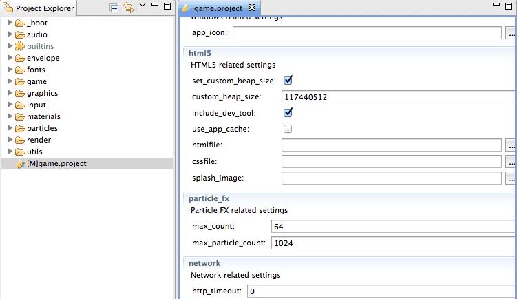
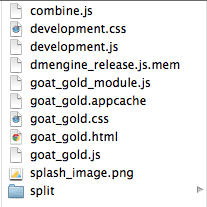

# HTML5 게임 개발하기
이 매뉴얼은 HTML5 캔버스 어플리케이션을 개발하는 과정에 대해 설명하고, 알려진 이슈들과 몇 가지 제약사항에 대해 설명합니다.

## Project configuration
*game.project* 파일에는 HTML5 을 위한 몇 가지 특정 설정값이 있으며  **html5** 섹션에서 찾을 수 있습니다.



### Customizing heap size
Defold는 Emscripten(http://en.wikipedia.org/wiki/Emscripten 참고) 를 사용하여 HTML5 을 지원하고 있습니다. 즉 어플리케이션 동작이 힙(heap) 안에서 이루어지는 샌드박스 메모리를 생성한다는 뜻입니다. 기본적으로 엔진은 많은 양의 메모리(256MB)를 할당합니다. 이는 일반적인 게임에는 충분하지만 최적화를 통해서 더 작은 메모리를 사용할 수도 있습니다. 다음 단계를 따라해 보세요.

1. **custom_heap_size** 를 원하는 바이트 값으로 설정합니다.
2. **set_custom_heap_size**를 체크해서 활성화 합니다.
3. HTML5 번들을 생성합니다. (아래 참고)

### Monitoring memory usage
개발하는 동안에는 특수한 메모리를 추적하는 컴포넌트가 포함된 번들을 생성해서 어플리케이션 메모리 사용량을 추적할 수 있습니다. 이 기능은 **include_dev_tool**를 체크해서 활성화 되며 아래에서 더 자세히 설명합니다.

### Application cache
네트워크 트래픽을 줄이고 로딩 시간을 개선하기 위해, HTML5 어플리케이션 캐쉬(https://developer.mozilla.org/en-US/docs/Web/HTML/Using_the_application_cache 참고) 내에 어플레케이션 데이터를 저장하도록 선택할 수 있습니다. 일반적으로 이 기능은 개발 중에는 사용되지 않고 브라우저는 새로 생성된 컨텐츠보다는 캐쉬된 데이터를 우선하게 됩니다. 만약 이 기능을 테스트 중에 사용한다면 빌드할 새 번들은 캐쉬 메니페스트(cache manifest)를 변경해야 새 데이터를 가져올 수 있게 됩니다. 모든 브라우저는 캐쉬를 삭제(clear)하는 기능을 제공하고 있습니다.

### Creating HTML5 content
Defold에서 HTML5 컨텐츠를 생성하는 것은 간단하며 다른 모든 지원되는 플랫폼들 처럼 동일한 패턴으로 따라하기만 하면 됩니다. 메뉴에서 **Project > Bundle > HTML5 Application…​** 를 선택합니다.


어플리케이션을 생성하기위한 폴더를 선택하라는 창이 뜹니다. 익스포트 과정이 완료되면 어플리케이션을 실행하는데 필요한 모든 파일을 볼 수 있습니다.



### Testing HTML5 Content
이제 이 컨텐츠를 웹서버가 액세스 할 수 있는 디렉토리에 설치해야 합니다. 사용 가능한 테스트 환경은 프로젝트에 따라 달라집니다. 이 환경에서는 그냥 .html 페이지를 열기만 해도 됩니다.


또한 에디터에서 HTML 컨텐츠를 직접 실행해서 로컬 브라우저에서 열 수도 있습니다. 하지만 게임의 기능에 따라 웹 서버에서 어플리케이션을 테스트 하는 것이 더 좋습니다.

### Known issues and limitations

#### Live update
Defold 어플리케이션은 에디터에서 라이브 업데이트를 받기 위해 자체적인 소형 웹 브라우저를 실행 해야만 합니다. 다른 일반적인 순수 브라우저 어플리케이션으로는 불가능합니다.
#### CORS
Cross-origin resource sharing (http://en.wikipedia.org/wiki/Cross-origin_resource_sharing 참고)는 QA환경에서는 활성화 되지 않으므로 브라우저가 웹 API와 상호작용하는 기능이 제한될 수 있습니다. Chrome을 사용할 때, '--disable-web-security' 플래그로 실행하거나 프록시 서버를 만들어서 이 문제를 해결할 수 있습니다.
#### Safari (IndexedDB)
영구적인 사용자 데이터(Persistent user data)는 IndexedDB API (https://developer.mozilla.org/en-US/docs/Web/API/IndexedDB_API 참고)를 사용해서 로컬에 저장됩니다. 이 HTML5의 기능은 현재 Safari 버전에서는 지원되지 않습니다. 따라서 이 브라우저를 사용할 경우엔 세션(sessions) 간에 데이터가 저장되지 않습니다. 이 기능은 다음 업데이트에 포함될 예정입니다.
#### Internet Explorer 11 (audio)
Defold는 HTML5 WebAudio (http://www.w3.org/TR/webaudio 참고)를 사용하여 오디오 재생을 다루며 Internet Explorer 11 에서는 이 기능이 지원되지 않습니다. 이 브라우저에서 사용하면 에러가 발생할 수 있습니다.
#### Internet Explorer 11 (WebGL)
Microsoft는 WebGL API (https://www.khronos.org/registry/webgl/specs/latest/ 참고) 구현을 완료하지 않았습니다. 따라서 다른 브라우저들 처럼 동작하지 않을 수 있습니다.
#### Internet Explorer 11 (Full screen)
풀 스크린 모드는 이 브라우저에서 제대로 동작하지 않는 경우가 있습니다.

## Customizing HTML5 applications
어플리케이션의 HTML5 버전을 생성할 때, Defold는 어플리케이션이 위치할 기본 웹 페이지를 제공하며 어플리케이션을 어떻게 표시할지 도와주는 style(css)과 script 리소스들을 참조합니다.

일반적으로, 어플리케이션을 실행하는데 필요한 모든 리소스를 가져오는데 걸리는 시간은 무시할 수 없습니다. 이런 이유로, Defold HTML5 어플리케이션은 메인 어플리케이션을 로드하는 동안 보여주는 스플래쉬 스크린(splash screen) 기능을 제공합니다.

이를 재정의 하지 않는 한, Defold는 아래 처럼 구성된 기본 페이지를 제공합니다.

\+ HTML5 캔버스 + 풀스크린 모드 버튼 + 스플래쉬 스크린 및 로직 + 필요하다면 개발 도구들

이 컨텐츠는 어플리케이션을 익스포트 할 때마다 새로 생성됩니다. 만약 이 요소들을 커스터마이징 하려면 프로젝트 설정을 수정해야 합니다. Defold 에디터의 **game.project** 를 열어서 **html5** 섹션을 찾아 보세요.


이 설정은 커스텀 HTML 파일, 스타일시트(css), 스플래시 이미지를 추가할 수 있게 해 줍니다.

> 이 작업을 시작하려면, 어플리케이션을 기본 설정으로 한 번 익스포트 한 후 익스포트된 HTML과 CSS 파일을 프로젝트로 옮겨서 위의 설명대로 설정을 변경하고 이 파일들을 수정하면 됩니다.

이 컨텐츠는 언제든 자유롭게 변경하거나 추가할 수 있지만, 몇 가지 제약 사항이 있습니다.

\+ 캔버스는 다른 스타일로 border 나 padding 을 지정하면 안됩니다. 이렇게 하면 마우스 입력 좌표가 달라질 수 있습니다. \+ 페이스북 지원이 필요한 경우엔 Javscript SDK를 로드하는 스크립트 태그가 메인 어플리케이션 스크립트 앞에 나타나야 합니다.

### Splash screens
스플래시 스크린은 기본적으로 구현됩니다. 만약 스플래쉬 스크린을 삭제하거나 커스터마이징 하려면 주의가 필요한 몇 가지 기능이 있습니다.

\+ HTML 마크업 \+ CSS 스타일 \+ Javascript 로직

Javascript를 직접 구현하는 것은 선택사항이지만, 만약 아래 함수를 포함하는 "SplashControl" 오브젝트를 구현하면 Defold 어플리케이션이 이와 관련된 정보를 돌려보내 줍니다.

#### onSetMessage(text)
이 콜백(callback)은 유저에게 표시하려는 텍스트를 수신합니다.

####onSetProgress(current, max)
어플리케이션이 로드될 때, 이 콜백은 현재 진행률(current progress)을 받습니다. "current"는 로드된 데이터의 양을 가지고 있고 "max"는 로드 할 전체 데이터의 양을 가지고 있습니다.

#### onDismissSplash()
이 콜백은 어플리케이션이 로드 되어 실행을 시작하고 캔버스를 렌더링(스플래시 스크린이 닫힐 때) 하려 할 때 어플리케이션에 의해 호출됩니다.

또한 기본 구현에는 윈도우 리사이징 이벤트를 다루는 로직도 포함하고 있습니다. 이 구현은 변경하거나 교체하려면, 메인 모듈이 제공하는 아래 두가지 헬퍼 함수를 사용할 수 있습니다.

#### Module.matchToCanvas(id)
DOM 요소의 id를 받아서 캔버스의 비율에 맞게 "width"와 "height" 속성을 조정합니다. "marginTop" 속성은 브라우저 윈도우의 캔버스를 세로 정렬하는데 사용됩니다.

#### Module.setMarginTop(id, sourcePixels)
"id" 요소의 "marginTop" 속성을 프로젝트 설정의 어플리케이션 높이와 관련된 스케일값으로 표시된 "sourcePixels" 값으로 설정합니다. 내부적으로 "sourcePixels"는 top margin에 할당되기 전에 스케일 값에 곱해집니다. 이 스케일 값은 실제 브라우저 창의 픽셀 높이에서 어플리케이션 픽셀 높이를 프로젝트 셋팅에 지정한 대로 나눕니다.

> 이 메소드들은 모듈 스크립트가 다 로드되기 전까지는 사용할 수 없습니다. 사용 예제는 기본으로 생성된 HTML 파일을 참고하시기 바랍니다.

> 스플래시 스크린 개발에 중점을 둘 경우, 로딩과 실행에 관련된 코드들을 주석처리 해서 프로세스 속도를 높일 수 있습니다.

### Tokens
HTML5 어플리케이션을 생성할 때, HTML과 CSS 파일들은 특정 토큰을 프로젝트 설정에 의존하는 값으로 교체할 수 있는 컴파일러를 통해 전달됩니다. 이 토큰은 문자 시퀀스를 이스케이프 해야하는지 말아야 하는지에 따라 항상 이중 혹은 삼중 중괄호(‘{ }‘)로 묶습니다. 이 기능은 프로젝트 설정을 자주 변경하거나 다른 프로젝트에서 메터리얼을 재사용 하려는 경우에 유용합니다.

HTML이나 CSS 컨텐츠에 따라, 아래 토큰들이 모두 지원됩니다.

#### DEFOLD_DISPLAY_WIDTH
(HTML 또는 CSS) 프로젝트 설정에 지정된 값을 display width에 씁니다.
```
function doSomething() {
    var x = {{DEFOLD_DISPLAY_WIDTH}};
    // ...
}
```

#### DEFOLD_DISPLAY_HEIGHT
(HTML 또는 CSS) 프로젝트 설정에 지정된 값을 display height에 씁니다.
```
function doSomething() {
    var y = {{DEFOLD_DISPLAY_HEIGHT}};
}
```

#### DEFOLD_SPLASH_IMAGE
(HTML 또는 CSS) 스플래시 이미지 파일의 파일명을 씁니다.
```
<image class="splashImage" src="{{DEFOLD_SPLASH_IMAGE}}"></image>
```

아래 토큰들은 HTML 파일을 처리할 때에만 지원됩니다.

#### DEFOLD_APP_TITLE
(HTML) 프로젝트의 타이틀에 기반한 문자열을 생성합니다.
```
<head>
<title>{{DEFOLD_APP_TITLE}}</title>
</head>
```

#### DEFOLD_JS
(HTML) 메인 어플리케이션의 자바스크립트 파일 이름과 일치됩니다.

#### DEFOLD_MODULE_JS
(HTML) 부트스트랩 자바스크립트 파일 이름과 일치됩니다. 이 파일은 어플리케이션 에셋을 로드하고 스플래시 이미지의 활동을 조정합니다.
```
<script type='text/javascript' src="{{DEFOLD_MODULE_JS}}"></script>;
```

#### DEFOLD_CSS
(HTML) 프로젝트 설정에 지정된 기본 또는 템플릿을 익스포트하는 동안 출력되는 CSS 파일의 파일명입니다.
```
<head>
<link rel="stylesheet" type="text/css" href="{{DEFOLD_CSS}}"></style>
</head>
```

#### DEFOLD_DEV_HEAD
(HTML) 프로젝트 설정에 따라 HTML 문서의 <head>섹션에서 사용되는 커스텀 HTML 조각을 생성합니다. 이 문자 시퀀스를 이스케이프 하면 안되기 때문에 3중 중괄호(triple braces)를 사용해야 합니다.

```
<head>
{{{DEFOLD_DEV_HEAD}}}
</head>
```

#### DEFOLD_DEV_INLINE
(HTML) 프로젝트 설정에 따라 HTML 문서의 <body>섹션에서 사용되는 커스텀 HTML 조각을 생성합니다.
```
{{{DEFOLD_DEV_INLINE}}}
<script type="text/javascript" src="//connect.facebook.net/en_US/sdk.js"></script>
<!-- etc. -->
```

> 이 인라인 블록(inline block)은 메인 어플리케이션 스크립트를 로드하기 전에 있어야 합니다. HTML 태그가 포함되어 있기 때문에 이 매크로는 문자 시퀀스가 이스케이프 되지 않도록 3중 중괄호를 써야 합니다.

#### DEFOLD_JS_INIT
(HTML) 이 태그는 일단 처리되면 Defold 어플리케이션을 로드하기 위한 코드를 추가합니다. 이를 위해선 development options을 활성화 해야 하며, 관계된 모듈들의 초기화를 수행해야 합니다.
```
{{{DEFOLD_DEV_INLINE}}}
<script type="text/javascript" src="//connect.facebook.net/en_US/sdk.js"></script>
{{{DEFOLD_JS_INIT}}}
```

> 만약 Facebook SDK 를 사용하려 한다면 이 태그를 로드하기 위해 "DEFOLD_JS_INIT" 태그 앞에 있어야 합니다. 또한 이 매크로는 HTML 태그가 포함되어 있으므로 이스케이프 하지 않기 위해 3중 중괄호로 둘러 싸야 합니다.

## HTML5 Memory Tracker
개발 중에는 간단한 메모리 추적 도구를 포함하는 HTML5 번들을 생성할 수 있습니다. 어플리케이션에 이 도구를 포함시키기 위해서는 우선 *game.project* 파일을 열어 **html5** 섹션으로 이동해야 합니다.


**include_dev_tool** 옵션을 체크하면 번들 작업이 수행될 때 이 도구를 자동으로 활성화 하고 포함시킵니다.

> 릴리즈 버전을 생성하기 전에는 이 옵션을 해제해야 합니다.

### Tool features
브라우저에서 어플리케이션을 정상적으로 실행하면 이 도구가 화면에 나타나게 됩니다.


토글 버튼을 눌러서 다양한 메모리 리포팅 섹션을 활성화 하고 비활성화 할 수 있습니다. 이 섹션들은 아래의 정보를 포함하고 있습니다.

#### Heap
힙 메모리의 전체 사이즈입니다. 이 값은 custom heap size 설정에 의해 구성될 수도 있습니다. 이 값을 튜닝하면 리소스를 최적으로 사용하는 릴리즈 버전을 만들 때 유용합니다.
#### Dynamic
동적 메모리 할당의 최대치와 현재 수치 및 전체 할당 횟수와 어플리케이션에 의해 수행된 작업의 수를 측정합니다.
#### Static
어플리케이션에 직접 빌드된 데이터를 포함하는 정적 메모리 할당을 요약합니다.
#### Stack
스택 사용을 위한 코드에 할당된 메모리 총합을 모니터링합니다. 사용된 값이 0으로 보고되면 정상 작동 중이며, 다른 값이면 엔진에 버그가 있음을 나타냅니다.

처음 두 섹션은 개발 과정중에 큰 관련이 있을 가능성이 큽니다. 특히, 성능이 우수한 어플리케이션은 동적 메모리 할당을 자주 요청하지 않습니다.

### Known limitations
이 메모리 추적 도구는 malloc() 와 free() 함수를 패치해서 작동하며 가능한 빨리 실행됩니다. 이 패치는 메소드가 전역 생성자로 선언되기 이전에 수행되지는 않습니다. 즉, 어플리케이션의 초기 단계에서 일어난 동적 할당은 데이터 사용량(usage)과 피크(peak)를 추적할 수 없습니다. 하지만 동적 메모리 영역과 위치에 관련된 값은 정확하게 추적 가능합니다.
