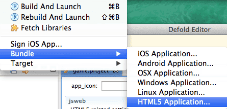

# HTML5 개발

Defold는 다른 플랫폼과 마찬가지로 일반 번들링 메뉴를 통해 HTML5 플랫폼용 게임 빌드를 지원합니다. 또한 생성된 게임은 간단한 템플릿 시스템으로 스타일을 지정할 수 있는 일반 HTML 페이지에 임베드됩니다.

*game.project* 파일에는 HTML5 전용 설정이 들어 있습니다:


## 힙 크기 {#heap-size}

Defold의 HTML5 지원은 Emscripten(참고: http://en.wikipedia.org/wiki/Emscripten)을 기반으로 합니다. 간단히 말해 어플리케이션이 동작하는 힙을 위한 샌드박스 메모리를 생성합니다. 기본적으로 엔진은 넉넉한 메모리(256MB)를 할당합니다. 일반적인 게임에는 충분한 양입니다. 최적화 과정에서 더 작은 값을 사용하도록 선택할 수도 있습니다. 이렇게 하려면 다음 단계를 따르세요:

1. *heap_size*를 원하는 값으로 설정합니다. 메가바이트 단위로 입력해야 합니다.
2. HTML5 번들을 생성합니다(아래 참고).

## HTML5 빌드 테스트

테스트하려면 HTML5 빌드에는 HTTP 서버가 필요합니다. <kbd>Project ▸ Build HTML5</kbd>를 선택하면 Defold가 서버를 생성합니다.



번들을 테스트하려면 원격 HTTP 서버에 업로드하거나, 예를 들어 번들 폴더에서 Python을 사용해 로컬 서버를 생성하면 됩니다.
Python 2:

```sh
python -m SimpleHTTPServer
```

Python 3:

```sh
python -m http.server
```

또는

```sh
python3 -m http.server
```

::: important
브라우저에서 `index.html` 파일을 여는 방식으로는 HTML5 번들을 테스트할 수 없습니다. HTTP 서버가 필요합니다.
:::

::: important
콘솔에 `"wasm streaming compile failed: TypeError: Failed to execute ‘compile’ on ‘WebAssembly’: Incorrect response MIME type. Expected ‘application/wasm’."` 오류가 표시되면, 서버가 `.wasm` 파일에 `application/wasm` MIME 타입을 사용하도록 해야 합니다.
:::

## HTML5 번들 생성 {#creating-html5-bundle}

Defold에서 HTML5 컨텐츠를 생성하는 것은 간단하며, 지원되는 다른 모든 플랫폼과 같은 패턴을 따릅니다. 메뉴에서 <kbd>Project ▸ Bundle... ▸ HTML5 Application...</kbd>를 선택합니다:


HTML5 번들은 두 가지 WebAssembly 아키텍처를 지원합니다.

* `wasm-web` - 일반적인 non-threaded WebAssembly 엔진입니다.
* `wasm_pthread-web` - thread를 사용할 수 있는 WebAssembly 엔진입니다.

둘 중 하나 또는 둘 다 포함할 수 있습니다. 둘 다 포함하면 브라우저와 호스팅 환경이 지원할 때 loader가 `wasm_pthread-web`을 선택하고, 그렇지 않으면 `wasm-web`으로 폴백합니다. 표준 타겟 이름은 [Bob 매뉴얼](/manuals/bob/#usage)을 참고하세요.

::: important
threaded 엔진에는 안전한 [cross-origin-isolated](https://developer.mozilla.org/en-US/docs/Web/API/Window/crossOriginIsolated) 페이지의 `SharedArrayBuffer`가 필요합니다. HTTPS(또는 localhost)로 번들을 제공하고, 일반적으로 다음과 같은 호환 cross-origin isolation 헤더를 서버에 설정하세요.

```txt
Cross-Origin-Opener-Policy: same-origin
Cross-Origin-Embedder-Policy: require-corp
```

페이지가 로드하는 cross-origin 리소스도 호환되는 CORS 또는 Cross-Origin-Resource-Policy 헤더를 사용해야 합니다. `wasm_pthread-web`만 포함한 번들은 이 요구 사항이 충족되지 않으면 실행할 수 없습니다. cross-origin isolation을 지원하지 않는 사이트에서 게임을 호스팅할 수 있다면 `wasm-web`을 폴백으로 포함하세요.
:::

Defold HTML5 번들에는 WebAssembly를 지원하는 최신 브라우저가 필요합니다. Internet Explorer 11은 지원되지 않습니다.

<kbd>Create bundle</kbd> 버튼을 클릭하면 어플리케이션을 생성할 폴더를 선택하라는 메시지가 표시됩니다. 익스포트 과정이 완료되면 어플리케이션 실행에 필요한 모든 파일을 확인할 수 있습니다.

## 알려진 이슈와 제약사항

* 핫 리로드 - HTML5 빌드에서는 핫 리로드가 동작하지 않습니다. Defold 어플리케이션이 에디터에서 업데이트를 받으려면 자체적인 소형 웹 서버를 실행해야 하는데, HTML5 빌드에서는 이것이 불가능합니다.
* Chrome
  * 느린 디버그 빌드 - HTML5 디버그 빌드에서는 오류를 감지하기 위해 모든 WebGL 그래픽 호출을 검증합니다. Chrome에서 테스트할 때는 이 과정이 매우 느립니다. *game.project*의 *Engine Arguments* 필드를 `--verify-graphics-calls=false`로 설정하면 이를 비활성화할 수 있습니다.
* 게임패드 지원 - HTML5에서 필요한 특별 고려사항과 절차는 [Gamepad 문서](/manuals/input-gamepads/#gamepads-in-html5)를 참조하세요.

## HTML5 번들 커스터마이징

게임의 HTML5 버전을 생성할 때 Defold는 기본 웹 페이지를 제공합니다. 이 페이지는 게임이 표시되는 방식을 결정하는 스타일과 스크립트 리소스를 참조합니다.

어플리케이션을 익스포트할 때마다 이 컨텐츠는 새로 생성됩니다. 이러한 요소 중 하나를 커스터마이징하려면 프로젝트 설정을 수정해야 합니다. 이렇게 하려면 Defold 에디터에서 *game.project*를 열고 *html5* 섹션으로 스크롤합니다:


각 옵션에 대한 자세한 내용은 [프로젝트 설정 매뉴얼](/manuals/project-settings/#html5)에서 확인할 수 있습니다.

::: important
`builtins` 폴더에 있는 기본 HTML/CSS 템플릿 파일은 수정할 수 없습니다. 수정사항을 적용하려면 필요한 파일을 `builtins`에서 복사 붙여넣기한 뒤, *game.project*에서 해당 파일을 설정하세요.
:::

::: important
canvas에는 border나 padding 스타일을 지정하면 안 됩니다. 지정하면 마우스 입력 좌표가 잘못됩니다.
:::

*game.project*에서는 `Fullscreen` 버튼과 `Made with Defold` 링크를 끌 수 있습니다.
Defold는 `index.html`에 다크 테마와 라이트 테마를 제공합니다. 기본값은 라이트 테마이며, `Custom CSS` 파일을 변경해 바꿀 수 있습니다. 또한 `Scale Mode` 필드에서 선택할 수 있는 네 가지 미리 정의된 스케일 모드가 있습니다.

::: important
*game.project*의 `Display` 섹션에서 `High Dpi` 옵션을 켜면 모든 스케일 모드의 계산에 현재 화면 DPI가 포함됩니다.
:::

### Downscale Fit and Fit

`Fit` 모드에서는 화면에 원래 비율로 전체 게임 canvas를 표시하도록 canvas 크기가 변경됩니다. `Downscale Fit`과의 유일한 차이는 웹 페이지의 내부 크기가 원래 게임 canvas보다 작을 때만 크기를 변경하고, 웹 페이지가 원래 게임 canvas보다 클 때는 확대하지 않는다는 점입니다.


### Stretch

`Stretch` 모드에서는 웹 페이지의 내부 크기를 완전히 채우도록 canvas 크기가 변경됩니다.


### No Scale
`No Scale` 모드에서는 canvas 크기가 *game.project* 파일의 `[display]` 섹션에서 미리 정의한 크기와 정확히 같습니다.


## 토큰

`index.html` 파일을 생성할 때는 [Mustache 템플릿 언어](https://mustache.github.io/mustache.5.html)를 사용합니다. 빌드하거나 번들링할 때 HTML과 CSS 파일은 프로젝트 설정에 따라 달라지는 값을 특정 토큰으로 대체할 수 있는 컴파일러를 거칩니다. 이 토큰은 문자 시퀀스를 이스케이프해야 하는지 여부에 따라 항상 이중 또는 삼중 중괄호(`{{TOKEN}}` 또는 `{{{TOKEN}}}`)로 둘러싸입니다. 프로젝트 설정을 자주 변경하거나 다른 프로젝트에서 컨텐츠를 재사용하려는 경우 이 기능이 유용할 수 있습니다.

::: sidenote
Mustache 템플릿 언어에 대한 자세한 내용은 [매뉴얼](https://mustache.github.io/mustache.5.html)에서 확인할 수 있습니다.
:::

모든 *game.project* 값은 토큰이 될 수 있습니다. 예를 들어 `Display` 섹션의 `Width` 값을 사용하려면:


*game.project*를 텍스트로 열고 사용하려는 필드의 `[section_name]`과 이름을 확인합니다. 그런 다음 `{{section_name.field}}` 또는 `{{{section_name.field}}}` 형식의 토큰으로 사용할 수 있습니다.


예를 들어 HTML 템플릿의 JavaScript에서는 다음과 같이 사용할 수 있습니다:

```javascript
function doSomething() {
    var x = {{display.width}};
    // ...
}
```

또한 다음 커스텀 토큰을 사용할 수 있습니다:

DEFOLD_SPLASH_IMAGE
: 스플래시 이미지 파일 이름을 쓰거나, *game.project*의 `html5.splash_image`가 비어 있으면 `false`를 씁니다.


```css
{{#DEFOLD_SPLASH_IMAGE}}
		background-image: url("{{DEFOLD_SPLASH_IMAGE}}");
{{/DEFOLD_SPLASH_IMAGE}}
```

exe-name
: 허용되지 않는 문자를 제거한 프로젝트 이름입니다.


DEFOLD_CUSTOM_CSS_INLINE
: *game.project* 설정에 지정된 CSS 파일을 인라인으로 삽입하는 위치입니다.


```html
<style>
{{{DEFOLD_CUSTOM_CSS_INLINE}}}
</style>
```

::: important
이 인라인 블록은 메인 어플리케이션 스크립트가 로드되기 전에 나타나야 합니다. HTML 태그가 포함되므로 문자 시퀀스가 이스케이프되지 않도록 이 매크로는 삼중 중괄호 `{{{TOKEN}}}` 안에 있어야 합니다.
:::

DEFOLD_SCALE_MODE_IS_DOWNSCALE_FIT
: `html5.scale_mode`가 `Downscale Fit`이면 이 토큰은 `true`입니다.

DEFOLD_SCALE_MODE_IS_FIT
: `html5.scale_mode`가 `Fit`이면 이 토큰은 `true`입니다.

DEFOLD_SCALE_MODE_IS_NO_SCALE
: `html5.scale_mode`가 `No Scale`이면 이 토큰은 `true`입니다.

DEFOLD_SCALE_MODE_IS_STRETCH
: `html5.scale_mode`가 `Stretch`이면 이 토큰은 `true`입니다.

DEFOLD_HEAP_SIZE
: *game.project*의 `html5.heap_size`에 지정된 힙 크기를 바이트로 변환한 값입니다.

DEFOLD_ENGINE_ARGUMENTS
: *game.project*의 `html5.engine_arguments`에 지정된 엔진 인자이며 `,` 기호로 구분됩니다.

build-timestamp
: 현재 빌드 타임스탬프(초)입니다.


## 추가 파라미터

커스텀 템플릿을 만들면 엔진 로더의 파라미터 집합을 재정의할 수 있습니다. 이를 위해 `<script>` 섹션을 추가하고 `CUSTOM_PARAMETERS` 안의 값을 재정의해야 합니다.
::: important
커스텀 `<script>`는 `dmloader.js`를 참조하는 `<script>` 섹션 뒤, `EngineLoader.load` 함수를 호출하기 전에 배치해야 합니다.
:::
예:

```
    <script id='custom_setup' type='text/javascript'>
        CUSTOM_PARAMETERS['disable_context_menu'] = false;
        CUSTOM_PARAMETERS['unsupported_webgl_callback'] = function() {
            console.log("Oh-oh. WebGL not supported...");
        }
    </script>
```

`CUSTOM_PARAMETERS`는 다음 필드를 포함할 수 있습니다:

```
'archive_location_filter':
    각 아카이브 경로마다 실행되는 필터 함수입니다.

'unsupported_webgl_callback':
    WebGL이 지원되지 않을 때 호출되는 함수입니다.

'engine_arguments':
    엔진에 전달할 인자(문자열) 목록입니다.

'custom_heap_size':
    메모리 힙 크기를 지정하는 바이트 수입니다.

'disable_context_menu':
    true이면 canvas 요소에서 오른쪽 클릭 컨텍스트 메뉴를 비활성화합니다.

'retry_time':
    오류 후 파일 로딩을 다시 시도하기 전 일시 중지 시간(초)입니다.

'retry_count':
    파일 다운로드를 시도할 때 수행하는 시도 횟수입니다.

'can_not_download_file_callback':
    'retry_count'번 시도한 후에도 파일을 다운로드할 수 없을 때 호출되는 함수입니다.

'resize_window_callback':
    resize/orientationchanges/focus 이벤트가 발생했을 때 호출되는 함수입니다.

'start_success':
    성공적으로 로드된 뒤 main이 호출되기 바로 전에 호출되는 함수입니다.

'update_progress':
    진행률이 업데이트될 때 호출되는 함수입니다. progress 파라미터는 0-100으로 업데이트됩니다.
```

## HTML5의 파일 작업

HTML5 빌드는 `sys.save()`, `sys.load()`, `io.open()` 같은 파일 작업을 지원하지만, 내부에서 이러한 작업을 처리하는 방식은 다른 플랫폼과 다릅니다. 브라우저에서 JavaScript가 실행될 때는 실제 파일 시스템 개념이 없으며 보안상의 이유로 로컬 파일 액세스가 차단됩니다. 대신 Emscripten(따라서 Defold)은 브라우저에서 데이터를 영구적으로 저장하는 데 사용되는 브라우저 내 데이터베이스인 [IndexedDB](https://developer.mozilla.org/en-US/docs/Web/API/IndexedDB_API/Using_IndexedDB)를 사용해 브라우저 안에 가상 파일 시스템을 생성합니다. 다른 플랫폼의 파일 시스템 액세스와 다른 중요한 점은 파일에 쓰는 시점과 변경사항이 실제로 데이터베이스에 저장되는 시점 사이에 약간의 지연이 있을 수 있다는 것입니다. 브라우저 개발자 콘솔에서는 보통 IndexedDB의 내용을 검사할 수 있습니다.


## HTML5 게임에 인자 전달

게임이 시작되기 전이나 시작되는 동안 게임에 추가 인자를 제공해야 하는 경우가 있습니다. 예를 들면 사용자 id, 세션 토큰, 또는 게임 시작 시 로드할 레벨일 수 있습니다. 이를 수행하는 방법은 여러 가지가 있으며, 그중 일부를 여기서 설명합니다.

### 엔진 인자

엔진이 설정되고 로드될 때 추가 엔진 인자를 지정할 수 있습니다. 이러한 추가 엔진 인자는 런타임에 `sys.get_config_string()`을 사용해 가져올 수 있습니다. 키-값 쌍을 추가하려면 `index.html`에서 엔진이 로드될 때 전달되는 `extra_params` 오브젝트의 `engine_arguments` 필드를 수정합니다:


```
    <script id='engine-setup' type='text/javascript'>
    var extra_params = {
        ...,
        engine_arguments: ["--config=foo1=bar1","--config=foo2=bar2"],
        ...
    }
```

또한 *game.project*의 HTML5 섹션에 있는 *Engine Arguments* 필드에 `--config=foo1=bar1, --config=foo2=bar2`를 추가할 수 있으며, 그러면 생성된 `index.html` 파일에 주입됩니다.

런타임에는 다음과 같이 값을 얻습니다:

```lua
local foo1 = sys.get_config_string("foo1")
local foo2 = sys.get_config_string("foo2")
print(foo1) -- bar1
print(foo2) -- bar2
```


### URL의 쿼리 인자

페이지 URL의 쿼리 파라미터로 인자를 전달하고 런타임에 읽을 수 있습니다:

```
https://www.mygame.com/index.html?foo1=bar1&foo2=bar2
```

```lua
local url = html5.run("window.location")
print(url)
```

모든 쿼리 파라미터를 Lua 테이블로 가져오는 전체 헬퍼 함수:

```lua
local function get_query_parameters()
    local url = html5.run("window.location")
    -- URL의 쿼리 부분(? 뒤의 부분)을 가져옵니다
    local query = url:match(".*?(.*)")
    if not query then
        return {}
    end

    local params = {}
    -- 모든 키-값 쌍을 순회합니다
    for kvp in query:gmatch("([^&]+)") do
        local key, value = kvp:match("(.+)=(.+)")
        params[key] = value
    end
    return params
end

function init(self)
    local params = get_query_parameters()
    print(params.foo1) -- bar1
end
```

## 최적화
HTML5 게임은 보통 저사양 기기와 느린 인터넷 연결에서도 빠르게 로드되고 잘 실행되도록 초기 다운로드 크기, 시작 시간, 메모리 사용량에 엄격한 요구사항이 있습니다. HTML5 게임을 최적화할 때는 다음 영역에 집중하는 것이 좋습니다:

* [메모리 사용량](/manuals/optimization-memory)
* [엔진 크기](/manuals/optimization-size)
* [게임 크기](/manuals/optimization-size)

## FAQ
:[HTML5 FAQ](../shared/html5-faq.md)
