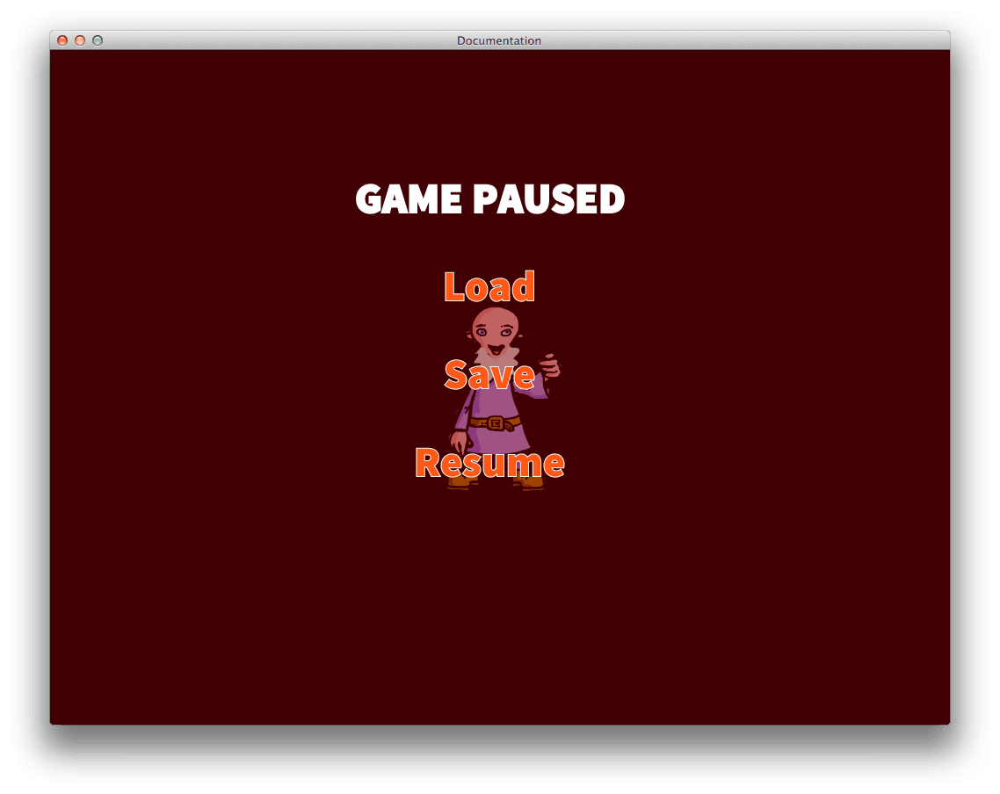

# Input
이 매뉴얼은 입력 동작(input action)을 캡쳐하고 상호작용 스크립트의 반응(interactive script reactions)을 생성하는 방법에 대해 설명합니다.

Defold는 다양한 장치로부터 입력을 받을 수 있으며 사용자의 설계와 일치하는 스크립트 로직을 작성할 수 있습니다. Defold가 지원하는 입력장치의 종류는 아래와 같습니다.

1. 키보드 (키 입력 및 텍스트 입력)
2. 마우스 (마우스휠 동작 포함)
3. 멀티터치 (iOS 및 Android 기기)
4. 게임패드 (운영체제를 통해 지원됨)

> MS윈도우에서는 현재 XBox 360 컨트롤러만 지원됩니다. 360 컨트롤러를 윈도우 장치에 연결하려면 올바르게 셋업이 되었는지 확인하고 http://www.wikihow.com/Use-Your-Xbox-360-Controller-for-Windows 를 참고 바랍니다.

모든 유저 입력은 엔진에 의해 수집(capture)되며 게임 오브젝트의 스크립트나 GUI 스크립트로 전달(dispatch)되어 입력 포커스를 획득하고 on_input() 함수를 구현할 수 있습니다.

입력이 스크립트에 도달하기 전에 입력 바인딩(input bindings)를 통해 의미 있는 동작(meaningful actions)으로 번역됩니다.


입력 포커스를 획득한 컴포넌트에 따라서 이 입력을 그냥 넘겨버릴지 on_input() 함수로 도달했는지 안했는지가 결정되게 됩니다. 아래에서 이들이 어떻게 작동하는지 자세히 살펴 보도록 하겠습니다.

## Input bindings
입력 바인딩은 Lua 스크립트로 입력값을 보내기 이전에 원시 입력(raw input)을 의미 있는 **actions**으로 번역하기 위한 테이블입니다. 입력 바인딩은 기본적으로 "game.input_binding"라는 이름으로 프로젝트 루트의 "input" 폴더에 위치해 있습니다. 하지만 엔진이 바인딩을 찾을 수 있도록 프로젝트 셋팅([Project settings](Project%20settings) 참고)을 업데이트해서 경로와 이름을 수정할 수도 있습니다.


여기 장치별로 특정한 5가지 종류의 트리거가 있습니다.

1. key_trigger 와 text_trigger 는 키보드 버튼 입력용
2. mouse_trigger 는 마우스 입력용
3. gamepad_trigger 는 시스템 게임패드용 (예: Xbox 나 Playstation 컨트롤러)
4. touch_trigger는 터치 입력의 모든 종류
5. text_trigger는 텍스트 입력용

trigger type 에 마우스 오른쪽 클릭하고 "Add TYPE_trigger…?"를 선택해서 새 트리거를 추가할 수 있습니다. 각 트리거는 두개의 필드를 가지고 있습니다.

#### input
입력을 대기할 수 있는 스크롤 목록(scroll list)
#### action
입력이 발생할때 생성되며 스크립트로 전달되는 액션의 이름. 여러 액션에 동일한 이름을 설정할 수도 있습니다. 예를 들어, **Space** 키에 "jump" 액션을 바인딩하고 게임패드 "A" 버튼에도 같은 액션을 바인딩 할 수 있습니다.

> 불행하게도 터치 입력은 다른 입력과 동일한 액션 이름을 가질수 없다는 버그가 알려져 있습니다.

예를 들어,  게임에서 좌우로 이동하기 위한 키를 바인딩 하려 한다면 아래와 같이 설정할 수 있습니다.


여기서, KEY_LEFT와 KEY_RIGHT 입력은 각각 "move_left" 와 "move_right" 라는 액션 이름으로 바인딩 되었습니다. 논리적인 액션과 하드웨어의 입력을 분리하는 이유는 나중에 하드웨어 입력이 어떤 동작을 트리거 할지 변경해야할 경우 한 곳만 수정하면 되기 때문입니다.

## Acquiring and releasing input focus
입력 동작(input action)을 듣기 위해서는, 게임 오브젝트에 스크립트(혹은 GUI 스크립트)를 생성하고 스크립트에서 "acquire_input_focus" 메세지를 자신의 게임 오브젝트로 보내면 됩니다.

```lua
function init(self)
        msg.post(".", "acquire_input_focus")
end
```

이 메세지는 Defold에게 현재 게임 오브젝트의 입력 동작을 직접 알려줍니다. 기술적으로, 이 오브젝트에게 발생하는 일은 **입력스택(input stack)**(자세한 설명은 아래 참고)에 추가됩니다. 입력 동작 듣기를 중지하기 위해서는 게임 오브젝트에 "release_input_focus" 메세지를 보내면 됩니다.

```lua
...
msg.post(".", "release_input_focus")
...
```

## on_input()
입력 동작에 반응하기 위해서는, 게임 오브젝트(입력 포커스를 획득한)의 스크립트에 on_input() 함수가 필요합니다. 게임 엔진은 이 함수에 입력 동작들을 전달(dispatch) 합니다.

```lua
function on_input(self, action_id, action)
```

이 함수는 2개의 파라미터를 취합니다. ("self" 제외) :

#### action_id
인풋 바인딩(input bindings)에서 설정된 메세지의 이름. 해쉬됨
#### action
메세지 데이터를 포함하고 있는 Lua 테이블

우리가 위에서 설정했던 "move_left" 과 "move_right" 바인딩을 다루기 위해서는 아래 코드처럼 작성하면 됩니다.

```lua
function on_input(self, action_id, action)
        if action_id == hash("move_left") and action.pressed then
                local pos = go.get_position()
                pos.x = pos.x - 100
                go.set_position(pos)
        elseif action_id == hash("move_right") and action.pressed then
                local pos = go.get_position()
                pos.x = pos.x + 100
                go.set_position(pos)
        end
end
```

> 컬렉션 프록시로 작업하려면, 컬렉션을 통해 입력이 어떻게 전달되는지를 이해하는것이 중요합니다. 만약 컬렉션 프록시를 사용해 입력을 획득할 수 없다면, 아래 [Input and Collection Proxies](#input-and-collection-proxies)를 읽어 보시기 바랍니다.

## Action fields
각각의 입력 메세지에 대해 on_input() 함수로 전달되는 액션 파라미터는 입력값, 입력의 위치, 입력 버튼의 "pressed", "repeated", "released" 상태와 같은 유용한 데이터를 포함하고 있는 Lua 테이블입니다.

#### action.pressed
입력이 검출된 첫번째 프레임에서 true, 그외에는 false
#### action.repeated
입력이 반복되고 있으면 true, 그 외에는 false. 이 값은 기본적으로 매 프레임마다 설정되지는 않지만 [프로젝트 설정(project settings)](Project settings#input)의 repeat_delay와 repeat_interval 의 설정에 따라 달라집니다.
#### action.released
입력이 해지(release)된 프레임에 true, 그 외에는 false

> 사용 가능한 액션 필드를 자세히 보고 싶다면 [on_input()](http://www.defold.com/ref/go/#on_input) 참고

## Screen positions
마우스 입력 및 터치 입력은 위치(x, y) 뿐만 아니라 이동 반경(dx, dy)도 액션 테이블에 필드를 셋팅합니다. 또한 이 입력은 실제 화면 공간에 대하여 계산된 아래와 같은 특정 필드도 셋팅합니다.

#### screen_x and screen_y
실제 화면에서의 위치
#### screen_dx and screen_dy
마지막 업데이트 이후의 실제 화면에서의 변경된 위치(delta)

이 필드는 레티나 디스플레이에서 낮은 해상도의 게임을 확대해서 실행하려 하는 경우처럼 게임월드에서의 위치와 화면에서의 픽셀 위치값이 서로 다르게 나오는 장치에서 유용합니다. 예를 들어 1024x768 해상도의 게임을 iPad에서 실행하면 2048x1536 물리 해상도에 매핑되어 "논리적" 픽셀이 4개의 실제 픽셀로 구성됩니다.

## Key triggers
키 트리거는 버튼 입력에 반응하는 간단한 키 입력입니다. 이 기능은 위에서 설정한 "move_left"와 "move_right"처럼 특정 버튼과 특정 함수를 엮는 것이 필요한 게임일 경우 유용합니다. 만약 임의의 키 입력을 읽어야 하는 경우, text triggers 를 사용하면 됩니다. (아래 참고)

## Mouse triggers
마우스 트리거는 input bindings에서 설정한 휠 입력과 마우스 버튼 입력으로 제공됩니다.

#### Mouse button inputs
마우스가 눌렸는지(press) 감지할 때 사용하면 됩니다. "MOUSE_BUTTON_LEFT", "MOUSE_BUTTON_RIGHT", "MOUSE_BUTTON_MIDDLE" 입력은 "MOUSE_BUTTON_1", "MOUSE_BUTTON_2", "MOUSE_BUTTON_3"과 동일합니다. 
현재 MOUSE_BUTTON_LEFT (또는 MOUSE_BUTTON_1)입력 액션은 단일 터치 입력(single touch inputs)에 대해서도 전송됩니다.

#### Mouse wheel inputs
스크롤 동작을 감지할 때 사용하면 됩니다. action.value 필드는 휠이 스크롤 될 때 1, 그 외에는 0 값을 가지고 있습니다. (스크롤 동작은 버튼 입력과 동일하게 처리되며 Defold는 현재 터치패드의 미세한 스크롤 입력은 지원하지 않습니다.)

#### Mouse movement
마우스 움직임은 input bindings에서 바인딩 할 수 없고 action_id 이름을 설정할 수도 없습니다. 대신, action_id는 nil로 설정되고 액션 테이블에는 마우스의 위치와 이동값(delta movement)이 채워지게 됩니다.

## Gamepad triggers
게임 패드 트리거는 게임 함수에 표준 게임 패드 입력을 바인딩해 줍니다. Defold는 운영체제를 통해 여러 게임 패드를 지원하며 아래와 같은 바인딩을 제공합니다.

1. 왼쪽, 오른쪽 스틱(방향, 클릭)
2. 왼쪽, 오른쪽 디지탈 패드
3. 왼쪽, 오른쪽 트리거
4. 왼쪽, 오른쪽 숄더 버튼
5. 시작, 뒤로가기, 가이드 버튼

> 일반적으로 Xbox 컨트롤러에서는  A, B, X, Y 버튼으로, Playstation 컨트롤러에서는 square, circle, triangle, cross 버튼으로 해석됩니다.

게임패드 입력은 액션 테이블의 gamepad 필드를 입력이 발생한 게임 패드의 번호로 설정합니다.

```lua
function on_input(self, action_id, action)
    if action_id == hash("gamepad_start") then
        ...
        if action.gamepad == 0 then
            -- gamepad 가 0이면 게임 접속을 하려는 동작임
            ...
        end
    end
end
```

## Touch triggers
터치와 멀티터치 트리거는 액션 테이블에 action.touch 이라는 하위 테이블을 채웁니다. 이 테이블의 요소들은 1~n 순서(n은 터치된 입력의 수)로 번호가 나열되며 입력 데이터가 포함되어 있습니다.

> 사용가능한 터치 액션 필드를 자세히 알고 싶다면 [on_input()](http://www.defold.com/ref/go/#on_input) 참고

테이블이 배열처럼 넘버링 되어 있으므로, 아래와 같이 쉽게 조회할 수 있습니다.

```lua
function on_input(self, action_id, action)
        if action_id == hash("touch") and #action.touch > 1 and #action.touch < 4 then
                -- 2~3개 터치지점이 발생하면 마법 스파크 파티클을 각 포인트에 스폰시키기
                for i, tpoint in ipairs(action.touch) do
                        local pos = vmath.vector3(tpoint.x, tpoint.y, 0)
                        factory.create("#factory", pos)
                end
        end
end
```

여기서는 "factory" 컴포넌트가 factory.create()를 통해 간단한 파티클 이펙트를 스폰하는데 사용되었습니다. 두 세개 손가락으로 장치의 화면을 터치하면 손가락을 따라 파티클이 따라다니며 스폰되게 됩니다.


## Text triggers
텍스트 트리거는 임의의 텍스트 입력을 읽을 수 있게 해 줍니다. 텍스트 트리거는 두 가지 종류가 있습니다.

#### TEXT
이 입력 트리거는 보통의 텍스트 입력을 캡쳐합니다.

텍스트 트리거는 액션 테이블의 "text" 필드를 입력된 문자를 포함한 문자열로 셋팅합니다. 이 동작은 버튼이 눌려질 때(press)에만 발생하며, "release"나 "repeated" 동작에는 반응하지 않습니다.

```lua
function on_input(self, action_id, action)
    if action_id == hash("text") then
        -- 입력된 문자를 "text" 노드에 이어 붙이기...
        local node = gui.get_node("text")
        local text = gui.get_text(node)
        text = text .. action.text
        gui.set_text(node, text)
    end
end
```

#### MARKED_TEXT
이 기능은 단일 입력에 매핑되는 여러 개의 키 입력같은 아시아용 키보드에 주로 사용됩니다.

예를 들어, iOS의 "Japanese-Kana" 키보드의 경우엔 10개의 키로 구성된 키보드를 가지고 있는데, 유저가 키를 조합하여 키보드의 위쪽에 사용가능한 심볼이 표시되게 됩니다.


각각의 키 입력은 별도 액션을 생성하며 "text" 필드에서 입력된 키입력의 모음을 액션 필드에 설정하게 됩니다.

```
{
  repeated = false,
  released = false,
  text = た,
  value = 0,
  pressed = false,
}
```

유저가 심볼이나 조합된 심볼을 선택하면, 보통의 텍스트 트리거 액션이 전송됩니다.

## The input stack
입력 포커스를 획득하는 게임 오브젝트는 입력을 수신하는 오브젝트 리스트에 우선 추가됩니다. 이 리스트는 인풋 스택(**input stack**)으로 불리는데, 입력 동작은 가장 상위의 오브젝트 컴포넌트로 먼저 전달되고 다름 컴포넌트로 차례로 전달되게 됩니다.


이 동작의 전달(dispatch)은 동일한 프레임 내에서 발생하므로 스택의 아래방향으로 입력이 전달되는 것을 의도적으로 조작하지 않았다면, (아래 "Consuming input" 참고) 모든 수신 컴포넌트의 on_input() 함수가 동시에 입력을 받는것 처럼 보이게 됩니다.

## Stack order
모든 입력을 획득하는 게임 오브젝트가 있다면, 인풋 스택의 상위에 차례 차례 추가되게 됩니다.

```lua
-- "listener1.script"에서
function init(self)
        msg.post(".", "acquire_input_focus")
end

-- "listener2.script"에서
function init(self)
        msg.post(".", "acquire_input_focus")
end
```

하지만, 오브젝트간의 초기화나 업데이트 순서는 알 수 없습니다. 따라서 특정한 순서로 리스너가 스택에 나타날 것이라는 보장은 되지 않습니다.

특정 순서로 스택에 리스너가 필요한 상황이라면, 메세지들을 연결하여 오브젝트간의 특정 입력 순서를 강제로 적용하면 됩니다.

```lua
-- "listener1.script"에서
function init(self)
        -- 여기서 먼저 입력을 획득하고 "listener2"로 보냄
        msg.post(".", "acquire_input_focus")
        msg.post("listener2", "acquire_input")
end

-- "listener2.script"에서
function on_message(self, message_id, message, sender)
        if message_id == hash("acquire_input") then
                -- 메세지를 받으면 입력 획득하기
                msg.post(".", "acquire_input_focus")
        end
end
```

이 코드를 실행하면 인풋 스택이 아래와 같이 정렬됩니다.


## Consuming input
컴포넌트의 on_input() 코드는 액션을 스택 아래로 보낼지 말지를 제어할 수 있습니다.

1. 만약 on_input() 코드가 false를 반환하거나 아무것도 반환하지 않으면(return문을 생략하면 lua에서 임의로 false값을 의미하는 nil을 반환함), 입력 액션을 인풋 스택의 다음 게임 오브젝트로 넘깁니다.
2. 만약 게임 오브젝트 컴포넌트의 스크립트가 on_input()에서 true를 반환하면, 이 입력은 소비(consume)되어 버리며 인풋 스택의 다음 오브젝트로 전달하지 않습니다.

> 게임 오브젝트는 여러 스크립트 컴포넌트를 가질 수 있습니다. 모든 입력 동작은 이 게임 오브젝트의 컴포넌트들에게 브로드캐스트 됩니다.

> on_input() 함수가 없는 게임 오브젝트는 on_input() 함수가 false를 반환하는 것 처럼 입력 액션을 스택 순서대로 넘기게 됩니다.


여기, 입력 소비(input consumption)가 게임의 각기 다른 파트간에 입력을 제어하는 간단하고 강력한  방법을 제공하는 몇 가지 사례가 있습니다. 예를 들어, 일시적으로 팝업 메뉴가 필요해서 게임의 한 부분에서 입력을 수신해야 하는 경우가 있습니다.

터치 입력을 통해 마법사를 컨트롤하는 게임을 만든다고 가정해 봅시다. 화면 한 구석에는 HUD 메뉴가 플레이어가 게임을 중지(pause)할지 표시하고 있습니다.


일시중지 메뉴는 처음에는 숨겨져(disable) 있으며, 유저가 "PAUSE" HUD 메뉴를 터치하면 활성화 됩니다.

```lua
function init(self)
        msg.post(".", "acquire_input_focus")
end

function on_input(self, action_id, action)
        if action_id == hash("mouse_press") and action.pressed then
                local x = action.x
                local y = action.y
                -- "pause" 노드를 가져와서 유저가 터치했는지 확인하기
                local pausenode = gui.get_node("pause")
                if gui.pick_node(pausenode, x, y) then
                        -- pause 메뉴에게 알려주기
                        msg.post("pause_menu", "show")
                end
        end
end
```



pause 메뉴는 색상이 입혀진 배경과 몇 가지 자식 메뉴 아이템으로 구성되어 있습니다. "background" 노드를 활성화/비활성화 해서 pause 메뉴 전체 GUI가 나타났다 사라졌다 할 수 있습니다.


pause 메뉴 GUI는 아래 코드로 실행됩니다.

```lua
function init(self)
        -- background 노드를 가져와 비활성화 하기
        -- 모든 것이 자식 노드로 되어있음
        local node = gui.get_node("background")
        gui.set_enabled(node, false)
end

function on_message(self, message_id, message, sender)
        if message_id == hash("show") then
                -- 우선, pause 메뉴 보이기
                local node = gui.get_node("background")
                gui.set_enabled(node, true)

                -- 이제 입력을 획득하면 우리는 입력스택 맨 위에 있겠지!
                msg.post(".", "acquire_input_focus")
        end
end

function on_input(self, action_id, action)
        if action_id == hash("mouse_press") and action.pressed then
                local x = action.x
                local y = action.y
                -- 노드를 가져와서 눌렸는지 확인하기
                local loadnode = gui.get_node("load")
                local savenode = gui.get_node("save")
                local resumenode = gui.get_node("resume")
                if gui.pick_node(loadnode, x, y) then
                        print("THE GAME WILL LOAD...")
                elseif gui.pick_node(savenode, x, y) then
                        print("THE GAME WILL SAVE...")
                elseif gui.pick_node(resumenode, x, y) then
                        -- 게임 재개(resume)하기...
                        -- 우선, pause 메뉴부터 숨기기
                        local node = gui.get_node("background")
                        gui.set_enabled(node, false)

                        -- 마지막으로 입력 해지(release)하기
                        msg.post(".", "release_input_focus")
                end
        end

        -- 입력을 수신하는 동안엔, 입력을 소비(consume)해버리자
        -- pause 메뉴가 보이는 동안엔 게임 컨트롤을 비활성화 함
        return true
end
```

pause 메뉴의 GUI 스크립트의 on_input() 함수는 메뉴가 보이는 동안엔 true를 반환합니다. 즉, 모든 입력 액션을 소모(consume)하므로 이 게임은 사용자 입력을 효과적으로 중지시킬 수 있습니다.

## Input and Collection Proxies
인풋 스택은 실제로는 전역(global)이 아니며 각 컬렉션에 대해 별도의 로컬 인풋 스택(local input stack)으로 존재합니다. 만약 게임이 컬렉션 프록시 구조로 사용된다면 컬렉션을 통해 입력이 전달되는 방식에 대해 이해할 필요가 있습니다.

입력 액션이 현재 컬렉션의 인풋 스택 아래로 전달되어 컬렉션 프록시 컴포넌트가 활성화된 게임 오브젝트에 도달하면, 이 액션은 메인 컬렉션의 스택 순서대로 넘어가기 전에, 이미 동적으로 로드된 컬렉션의 인풋 스택부터 진행됩니다. 아래 다이어그램은 이 프로세스를 명확하게 보여줍니다.


동적으로 로드된 컬렉션의 모든 on_input() 컴포넌트 코드가 입력 액션을 받기 위해서는, 컬렉션 프록시를 포함하고 있는 게임 오브젝트가 **반드시** 인풋 스택에 있어야 합니다.

컬렉션 프록시의 게임 오브젝트가 on_input() 코드를 포함하고 있지 않더라도, 입력스택의 상위에 추가하기 위해서 "acquire_input_focus" 메세지가 반드시 전송되어야 하며, 로드된 컬렉션 내에 있는 게임오브젝트도 컬렉션의 인풋 스택에 추가되기 위해 "acquire_input_focus" 메세지를 보내야 합니다.

입력 스택의 어떤 단계에서든 on_input() 함수가 true를 반환하면, 이 입력은 소비(consume)되어 어떠한 동작도 넘기지 않고 아무 일도 발생하지 않게 됩니다. 필요에 따라서, 로드된 컬렉션이 메인 컬렉션에서 수신중인 액션을 동작 못하도록 입력을 소비해 버릴 수도 있습니다.
