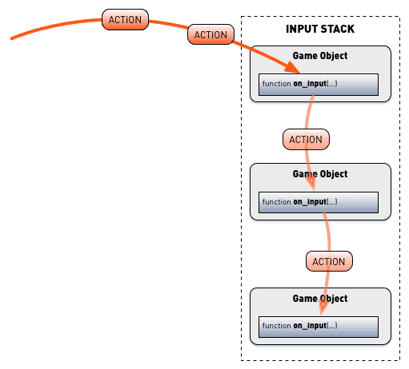

# 입력

모든 사용자 입력은 엔진이 캡쳐하고, 입력 포커스를 획득했으며 `on_input()` 함수를 구현한 게임 오브젝트의 스크립트 컴포넌트와 GUI 스크립트에 동작으로 디스패치됩니다. 이 매뉴얼은 입력을 캡쳐하기 위한 바인딩 설정 방법과 그 입력에 응답하는 코드를 작성하는 방법을 설명합니다.

입력 시스템은 간단하면서도 강력한 개념들을 사용하므로, 게임에 맞게 입력을 관리할 수 있습니다.


장치
: 컴퓨터나 모바일 장치에 내장되었거나 연결된 입력 장치는 원시 시스템 수준 입력을 Defold 런타임에 제공합니다. 다음 장치 타입이 지원됩니다:

  1. 키보드(단일 키 및 텍스트 입력)
  2. 마우스(위치, 버튼 클릭 및 마우스 휠 동작)
  3. 단일 및 멀티터치(iOS 및 Android 장치와 모바일 HTML5)
  4. 게임패드(운영체제에서 지원되고 [gamepads](/manuals/input-gamepads/#gamepads-settings-file) 파일에 매핑된 경우)

입력 바인딩
: 입력이 스크립트로 전송되기 전에 장치의 원시 입력은 입력 바인딩 테이블을 통해 의미 있는 *동작*으로 변환됩니다.

동작
: 동작은 입력 바인딩 파일에 나열한 (해쉬된) 이름으로 식별됩니다. 각 동작은 버튼이 눌렸거나 해제되었는지, 마우스 및 터치 좌표 등 입력에 관한 관련 데이터도 포함합니다.

입력 리스너
: 모든 스크립트 컴포넌트나 GUI 스크립트는 *입력 포커스를 획득*하여 입력 동작을 받을 수 있습니다. 여러 리스너가 동시에 활성화될 수 있습니다.

인풋 스택
: 입력 리스너 목록으로, 포커스를 먼저 획득한 리스너가 스택 맨 아래에 있고 마지막에 획득한 리스너가 맨 위에 있습니다.

입력 소비
: 스크립트는 받은 입력을 소비하도록 선택하여 스택 아래쪽의 리스너가 해당 입력을 받지 못하게 할 수 있습니다.

## 입력 바인딩 설정

입력 바인딩은 프로젝트 전체에 적용되는 테이블이며, 장치 입력을 스크립트 컴포넌트와 GUI 스크립트로 디스패치하기 전에 이름 있는 *동작*으로 변환하는 방식을 지정할 수 있습니다. 새 입력 바인딩 파일을 만들려면 *Assets* view에서 원하는 위치를 <kbd>오른쪽 클릭</kbd>하고 <kbd>New... ▸ Input Binding</kbd>을 선택합니다. 엔진이 새 파일을 사용하게 하려면 *game.project*의 *Game Binding* 항목을 변경합니다.


기본 입력 바인딩 파일은 모든 새 프로젝트 템플릿에서 자동으로 생성되므로 일반적으로 새 바인딩 파일을 만들 필요가 없습니다. 기본 파일은 "game.input_binding"이라고 하며 프로젝트 루트의 "input" 폴더에서 찾을 수 있습니다. 에디터에서 열려면 파일을 <kbd>더블 클릭</kbd>합니다:


새 바인딩을 만들려면 관련 트리거 타입 섹션 아래쪽의 <kbd>+</kbd> 버튼을 클릭합니다. 각 항목에는 두 필드가 있습니다:

*Input*
: 수신할 원시 입력으로, 사용 가능한 입력의 스크롤 목록에서 선택합니다.

*Action*
: 입력 동작이 생성되어 스크립트로 디스패치될 때 부여되는 동작 이름입니다. 같은 동작 이름을 여러 입력에 할당할 수 있습니다. 예를 들어 <kbd>Space</kbd> 키와 게임패드 "A" 버튼을 `jump` 동작에 바인딩할 수 있습니다. 터치 입력은 알려진 버그 때문에 다른 입력과 같은 동작 이름을 가질 수 없습니다.

## 트리거 타입

만들 수 있는 장치별 트리거 타입은 다섯 가지입니다:

Key Triggers
: 단일 키 키보드 입력입니다. 각 키는 대응하는 동작에 개별적으로 매핑됩니다. 자세한 내용은 [키 및 텍스트 입력 매뉴얼](/manuals/input-key-and-text)을 참고하세요.

Text Triggers
: 텍스트 트리거는 임의의 텍스트 입력을 읽을 때 사용합니다. 자세한 내용은 [키 및 텍스트 입력 매뉴얼](/manuals/input-key-and-text)을 참고하세요.

Mouse Triggers
: 마우스 버튼과 스크롤 휠의 입력입니다. 자세한 내용은 [마우스 및 터치 입력 매뉴얼](/manuals/input-mouse-and-touch)을 참고하세요.

Touch Triggers
: Single-touch 및 Multi-touch 타입 트리거는 네이티브 어플리케이션의 iOS 및 Android 장치와 HTML5 번들에서 사용할 수 있습니다. 자세한 내용은 [마우스 및 터치 매뉴얼](/manuals/input-mouse-and-touch)을 참고하세요.

Gamepad Triggers
: 게임패드 트리거를 사용하면 표준 게임패드 입력을 게임 함수에 바인딩할 수 있습니다. 자세한 내용은 [게임패드 매뉴얼](/manuals/input-gamepads)을 참고하세요.

### 가속도계 입력

위에 나열된 다섯 트리거 타입 외에도 Defold는 네이티브 Android 및 iOS 어플리케이션에서 가속도계 입력을 지원합니다. *game.project* 파일의 *Input* 섹션에서 *Use Accelerometer* 박스를 선택합니다.

```lua
function on_input(self, action_id, action)
    if action.acc_x and action.acc_y and action.acc_z then
        -- 가속도계 데이터에 반응
    end
end
```

## 입력 포커스 {#input-focus}

스크립트 컴포넌트나 GUI 스크립트에서 입력 동작을 수신하려면, 해당 컴포넌트를 가진 게임 오브젝트로 `acquire_input_focus` 메세지를 보내야 합니다:

```lua
-- 현재 게임 오브젝트(".")가 입력 포커스를 획득하도록 지시
msg.post(".", "acquire_input_focus")
```

이 메세지는 엔진에 게임 오브젝트의 입력 가능 컴포넌트(스크립트 컴포넌트, GUI 컴포넌트, 컬렉션 프록시)를 *인풋 스택*에 추가하라고 지시합니다. 해당 게임 오브젝트의 컴포넌트들은 인풋 스택의 맨 위에 놓이며, 마지막으로 추가된 컴포넌트가 스택 맨 위에 위치합니다. 게임 오브젝트에 입력 가능 컴포넌트가 둘 이상 있으면 모든 컴포넌트가 스택에 추가됩니다:



이미 입력 포커스를 획득한 게임 오브젝트가 다시 입력 포커스를 획득하면, 해당 컴포넌트들이 스택 맨 위로 이동합니다.


## 입력 디스패치와 on_input() {#input-dispatch-and-on_input}

입력 동작은 인풋 스택에 따라 위에서 아래로 디스패치됩니다.


스택에 있고 `on_input()` 함수를 포함하는 모든 컴포넌트는 프레임 동안 각 입력 동작마다 한 번씩 이 함수를 호출받으며, 다음 인수를 전달받습니다:

`self`
: 현재 스크립트 인스턴스입니다.

`action_id`
: 입력 바인딩에 설정된 동작의 해쉬된 이름입니다.

`action`
: 입력의 값, 위치(절대 위치와 델타 위치), 버튼 입력이 `pressed`였는지 등 동작에 대한 유용한 데이터를 담은 테이블입니다. 사용할 수 있는 action 필드에 대한 자세한 내용은 [on_input()](/ref/go#on_input)을 참고하세요.

```lua
function on_input(self, action_id, action)
  if action_id == hash("left") and action.pressed then
    -- 왼쪽으로 이동
    local pos = go.get_position()
    pos.x = pos.x - 100
    go.set_position(pos)
  elseif action_id == hash("right") and action.pressed then
    -- 오른쪽으로 이동
    local pos = go.get_position()
    pos.x = pos.x + 100
    go.set_position(pos)
  end
end
```


### 입력 포커스와 컬렉션 프록시 컴포넌트

컬렉션 프록시를 통해 동적으로 로드되는 각 게임 월드는 자체 인풋 스택을 가집니다. 로드된 월드의 인풋 스택까지 동작 디스패치가 도달하려면, 프록시 컴포넌트가 메인 월드의 인풋 스택에 있어야 합니다. 로드된 월드 스택의 모든 컴포넌트는 디스패치가 메인 스택 아래로 계속되기 전에 먼저 처리됩니다:


::: important
컬렉션 프록시 컴포넌트를 가진 게임 오브젝트에 `acquire_input_focus`를 보내는 것을 잊는 실수가 흔합니다. 이 단계를 생략하면 입력이 로드된 월드의 인풋 스택에 있는 어떤 컴포넌트에도 도달하지 못합니다.
:::


### 입력 해제

입력 동작 수신을 중지하려면 게임 오브젝트에 `release_input_focus` 메세지를 보냅니다. 이 메세지는 해당 게임 오브젝트의 모든 컴포넌트를 인풋 스택에서 제거합니다:

```lua
-- 현재 게임 오브젝트(".")가 입력 포커스를 해제하도록 지시합니다.
msg.post(".", "release_input_focus")
```


## 입력 소비

컴포넌트의 `on_input()`은 동작을 스택 아래로 계속 전달할지 여부를 능동적으로 제어할 수 있습니다:

- `on_input()`이 `false`를 반환하거나 반환문이 생략되면(Lua에서는 false로 평가되는 `nil` 반환을 의미함), 입력 동작은 인풋 스택의 다음 컴포넌트로 전달됩니다.
- `on_input()`이 `true`를 반환하면 입력이 소비됩니다. 인풋 스택 아래쪽의 어떤 컴포넌트도 이 입력을 받지 않습니다. 이는 *모든* 인풋 스택에 적용됩니다. 프록시로 로드된 월드의 스택에 있는 컴포넌트가 입력을 소비하여 메인 스택의 컴포넌트가 입력을 받지 못하게 할 수 있습니다:


입력 소비가 게임의 서로 다른 부분 사이에서 입력을 전환하는 간단하고 강력한 방법을 제공하는 좋은 사용 사례는 많습니다. 예를 들어, 일시적으로 게임에서 입력을 받는 유일한 부분이 되어야 하는 팝업 메뉴가 필요한 경우입니다:


일시정지 메뉴는 처음에는 숨겨져(비활성화) 있으며, 플레이어가 "PAUSE" HUD 항목을 터치하면 활성화됩니다:

```lua
function on_input(self, action_id, action)
    if action_id == hash("mouse_press") and action.pressed then
        -- 플레이어가 PAUSE를 눌렀나요?
        local pausenode = gui.get_node("pause")
        if gui.pick_node(pausenode, action.x, action.y) then
            -- pause 메뉴가 입력을 넘겨받도록 알립니다.
            msg.post("pause_menu", "show")
        end
    end
end
```


일시정지 메뉴 GUI는 입력 포커스를 획득하고 입력을 소비하여, 팝업 메뉴와 관련된 입력 외에는 어떤 입력도 전달되지 않게 합니다:

```lua
function on_message(self, message_id, message, sender)
  if message_id == hash("show") then
    -- pause 메뉴를 표시합니다.
    local node = gui.get_node("pause_menu")
    gui.set_enabled(node, true)

    -- 입력을 획득합니다.
    msg.post(".", "acquire_input_focus")
  end
end

function on_input(self, action_id, action)
  if action_id == hash("mouse_press") and action.pressed then

    -- 작업 수행...

    local resumenode = gui.get_node("resume")
    if gui.pick_node(resumenode, action.x, action.y) then
        -- pause 메뉴를 숨깁니다
        local node = gui.get_node("pause_menu")
        gui.set_enabled(node, false)

        -- 입력을 해제합니다.
        msg.post(".", "release_input_focus")
    end
  end

  -- 모든 입력을 소비합니다. 입력 포커스를 해제하기 전까지
  -- 인풋 스택에서 아래쪽에 있는 항목은 입력을 절대 받지 못합니다.
  return true
end
```
