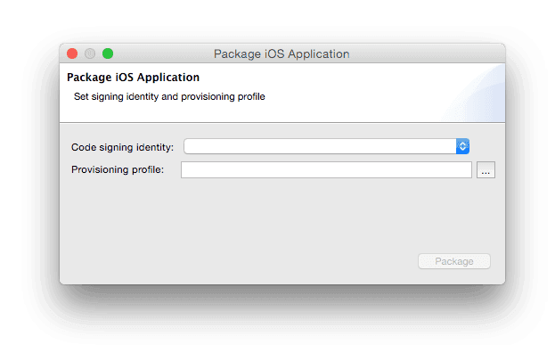
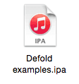

# iOS 개발

::: sidenote
iOS용 게임 번들링은 Mac 버전 Defold Editor에서만 사용할 수 있습니다.
:::

iOS에서는 빌드해서 휴대폰이나 태블릿에서 실행하려는 _모든_ 앱이 Apple에서 발급한 인증서와 provisioning profile로 서명되어야 합니다. 이 매뉴얼은 iOS용 게임을 번들링하는 데 필요한 단계를 설명합니다. 개발 중에는 컨텐츠와 코드를 기기로 직접 핫 리로드할 수 있으므로 [development app](/manuals/dev-app)을 통해 게임을 실행하는 방식이 선호되는 경우가 많습니다.

## Apple의 코드 서명 프로세스

iOS 앱과 관련된 보안은 여러 구성요소로 이루어져 있습니다. 필요한 도구에 액세스하려면 [Apple's iOS Developer Program](https://developer.apple.com/programs/)에 가입해야 합니다. 등록한 뒤 [Apple's Developer Member Center](https://developer.apple.com/membercenter/index.action)로 이동합니다.


*Certificates, Identifiers & Profiles* 섹션에는 필요한 모든 도구가 포함되어 있습니다. 여기에서 다음 항목을 생성, 삭제, 편집할 수 있습니다.

Certificates
: 개발자로 식별해 주는 Apple 발급 암호화 인증서입니다. development 인증서 또는 production 인증서를 생성할 수 있습니다. Developer 인증서를 사용하면 sandbox 테스트 환경에서 in-app purchase 메커니즘 같은 특정 기능을 테스트할 수 있습니다. Production 인증서는 App Store에 업로드할 최종 앱에 서명하는 데 사용됩니다. 테스트를 위해 기기에 앱을 넣기 전에 앱에 서명하려면 인증서가 필요합니다.

Identifiers
: 다양한 용도의 식별자입니다. 여러 앱에서 사용할 수 있는 와일드카드 식별자(예: `some.prefix.*`)를 등록할 수 있습니다. App ID에는 앱이 Passbook 통합, Game Center 등을 활성화하는지와 같은 Application Service 정보가 포함될 수 있습니다. 이러한 App ID는 와일드카드 식별자가 될 수 없습니다. Application Services가 작동하려면 어플리케이션의 *bundle identifier*가 App ID 식별자와 일치해야 합니다.

Devices
: 각 개발 기기는 UDID(Unique Device IDentifier, 아래 참고)로 등록해야 합니다.

Provisioning Profiles
: Provisioning profile은 인증서를 App ID와 기기 목록에 연결합니다. 어떤 개발자의 어떤 앱이 어떤 기기에 허용되는지 알려줍니다.

Defold에서 게임과 앱에 서명하려면 유효한 인증서와 유효한 provisioning profile이 필요합니다.

::: sidenote
Member Center 홈페이지에서 할 수 있는 작업 중 일부는 Xcode 개발 환경 안에서도 수행할 수 있습니다. 단, Xcode가 설치되어 있어야 합니다.
:::

기기 식별자(UDID)
: iOS 기기의 UDID는 Wi-Fi 또는 케이블로 기기를 컴퓨터에 연결해 확인할 수 있습니다. Xcode를 열고 <kbd>Window ▸ Devices and Simulators</kbd>를 선택합니다. 기기를 선택하면 serial number와 identifier가 표시됩니다.

  

  Xcode가 설치되어 있지 않다면 iTunes에서 identifier를 찾을 수 있습니다. 기기 아이콘을 클릭하고 기기를 선택합니다.

  

  1. *Summary* 페이지에서 *Serial Number*를 찾습니다.
  2. *Serial Number*를 한 번 클릭해 필드가 *UDID*로 바뀌게 합니다. 반복해서 클릭하면 기기에 대한 여러 정보가 표시됩니다. *UDID*가 나올 때까지 계속 클릭하면 됩니다.
  3. 긴 UDID 문자열을 오른쪽 클릭하고 <kbd>Copy</kbd>를 선택해 identifier를 클립보드에 복사합니다. 그러면 Apple's Developer Member Center에서 기기를 등록할 때 UDID 필드에 쉽게 붙여넣을 수 있습니다.

## 무료 Apple 개발자 계정으로 개발하기

Xcode 7부터는 누구나 Xcode를 설치하고 무료로 실제 기기에서 개발할 수 있습니다. iOS Developer Program에 가입할 필요가 없습니다. 대신 Xcode가 개발자용 인증서(1년 동안 유효)와 특정 기기의 앱용 provisioning profile(1주일 동안 유효)을 자동으로 발급합니다.

1. 기기를 연결합니다.
2. Xcode를 설치합니다.
3. Xcode에 새 계정을 추가하고 Apple ID로 로그인합니다.
4. 새 프로젝트를 생성합니다. 가장 단순한 "Single View App"이면 됩니다.
5. "Team"(자동 생성됨)을 선택하고 앱에 bundle identifier를 지정합니다.

::: important
Defold 프로젝트에서 같은 bundle identifier를 사용해야 하므로 bundle identifier를 기록해 두세요.
:::

6. Xcode가 앱용 *Provisioning Profile*과 *Signing Certificate*를 생성했는지 확인합니다.

   

7. 기기에서 앱을 빌드합니다. 처음에는 Xcode가 Developer mode를 활성화하라고 요청하고 디버거 지원을 위해 기기를 준비합니다. 시간이 조금 걸릴 수 있습니다.
8. 앱이 작동하는 것을 확인한 뒤 디스크에서 앱을 찾습니다. "Report Navigator"의 Build report에서 빌드 위치를 확인할 수 있습니다.

   

9. 앱을 찾은 뒤 오른쪽 클릭하고 <kbd>Show Package Contents</kbd>를 선택합니다.

   

10. "embedded.mobileprovision" 파일을 나중에 찾을 수 있는 드라이브 위치로 복사합니다.

   

이 provision 파일은 code signing identity와 함께 사용해 Defold에서 앱에 1주일 동안 서명할 수 있습니다.

provision이 만료되면 위에서 설명한 대로 Xcode에서 앱을 다시 빌드하고 새 임시 provision 파일을 받아야 합니다.

## iOS 어플리케이션 번들 생성하기

code signing identity와 provisioning profile이 있으면 에디터에서 게임용 독립 실행 어플리케이션 번들을 생성할 수 있습니다. 메뉴에서 <kbd>Project ▸ Bundle... ▸ iOS Application...</kbd>을 선택하면 됩니다.



code signing identity를 선택하고 mobile provisioning 파일을 찾습니다. 번들링할 아키텍처(32 bit, 64 bit, iOS simulator)와 variant(Debug 또는 Release)를 선택합니다. 원한다면 `Sign application` 체크박스를 해제해 서명 프로세스를 건너뛰고 나중에 수동으로 서명할 수 있습니다.

::: important
iOS simulator에서 게임을 테스트할 때는 `Sign application` 체크박스를 **반드시** 해제해야 합니다. 어플리케이션을 설치할 수는 있지만 부팅되지 않습니다.
:::

*Create Bundle*을 누르면 컴퓨터에서 번들이 생성될 위치를 지정하라는 프롬프트가 표시됩니다.

{.left}

앱에서 사용할 아이콘, launch screen storyboard 등은 [iOS section](/manuals/project-settings/#ios)의 *game.project* 프로젝트 설정 파일에서 지정합니다.

:[Build Variants](../shared/build-variants.md)

## 연결된 iPhone에 번들 설치하고 실행하기

Bundle 다이얼로그의 "Install on connected device"와 "Launch installed app" 체크박스를 사용해 빌드된 번들을 설치하고 실행할 수 있습니다.


이 기능이 작동하려면 [ios-deploy](https://github.com/ios-control/ios-deploy) 커맨드 라인 도구가 설치되어 있어야 합니다. 가장 간단한 설치 방법은 Homebrew를 사용하는 것입니다.
```
$ brew install ios-deploy
```

에디터가 ios-deploy 도구의 설치 위치를 감지하지 못하면 [Preferences](/manuals/editor-preferences/#tools)에서 위치를 지정해야 합니다.

### storyboard 생성하기

storyboard 파일은 Xcode로 생성합니다. Xcode를 시작하고 새 프로젝트를 생성합니다. iOS와 Single View App을 선택합니다.


Next를 클릭하고 프로젝트 설정을 계속 진행합니다. Product Name을 입력합니다.


Create를 클릭해 과정을 마칩니다. 이제 프로젝트가 생성되었으므로 storyboard 생성을 진행할 수 있습니다.


이미지를 드래그-앤-드롭해 프로젝트로 임포트합니다. 다음으로 `Assets.xcassets`를 선택하고 이미지를 `Assets.xcassets`에 드롭합니다.


`LaunchScreen.storyboard`를 열고 더하기 버튼(<kbd>+</kbd>)을 클릭합니다. 다이얼로그에 "imageview"를 입력해 ImageView 컴포넌트를 찾습니다.


Image View 컴포넌트를 storyboard 위로 드래그합니다.


Image 드롭다운에서 앞서 `Assets.xcassets`에 추가한 이미지를 선택합니다.


이미지를 배치하고 필요한 다른 조정을 수행합니다. Label이나 다른 UI 요소를 추가할 수도 있습니다. 완료되면 active scheme을 "Build -> Any iOS Device (`arm64`, `armv7`)"(또는 "Generic iOS Device")로 설정하고 Product -> Build를 선택합니다. 빌드 프로세스가 끝날 때까지 기다립니다.

::: sidenote
"Any iOS Device (arm64)"에 `arm64` 옵션만 있다면 "Project -> Basic -> Deployment" 설정에서 `iOS Deployment target`을 10.3으로 변경하세요. 이렇게 하면 storyboard가 `armv7` 기기(예: iPhone5c)와 호환됩니다.
:::

storyboard에서 이미지를 사용하면 해당 이미지는 `LaunchScreen.storyboardc`에 자동으로 포함되지 않습니다. 리소스를 포함하려면 *game.project*의 `Bundle Resources` 필드를 사용하세요.
예를 들어 Defold 프로젝트에 `LaunchScreen` 폴더를 만들고 그 안에 `ios` 폴더를 생성합니다(`ios` 폴더는 iOS 번들에만 이 파일들을 포함하기 위해 필요합니다). 파일을 `LaunchScreen/ios/`에 넣습니다. 이 경로를 `Bundle Resources`에 추가합니다.


마지막 단계는 컴파일된 `LaunchScreen.storyboardc` 파일을 Defold 프로젝트에 복사하는 것입니다. Finder에서 다음 위치를 열고 `LaunchScreen.storyboardc` 파일을 Defold 프로젝트로 복사합니다.

    /Library/Developer/Xcode/DerivedData/YOUR-PRODUCT-NAME-cbqnwzfisotwygbybxohrhambkjy/Build/Intermediates.noindex/YOUR-PRODUCT-NAME.build/Debug-iphonesimulator/YOUR-PRODUCT-NAME.build/Base.lproj/LaunchScreen.storyboardc

::: sidenote
포럼 사용자 Sergey Lerg가 [과정을 보여주는 비디오 튜토리얼](https://www.youtube.com/watch?v=6jU8wGp3OwA&feature=emb_logo)을 만들었습니다.
:::

storyboard 파일이 준비되면 *game.project*에서 참조할 수 있습니다.


### icon asset catalog 생성하기

asset catalog를 사용하는 것은 어플리케이션 아이콘을 관리하는 Apple의 권장 방식입니다. 실제로 App Store listing에 사용되는 아이콘을 제공하는 유일한 방법입니다. asset catalog는 storyboard와 같은 방식으로 Xcode를 사용해 생성합니다. Xcode를 시작하고 새 프로젝트를 생성합니다. iOS와 Single View App을 선택합니다.


Next를 클릭하고 프로젝트 설정을 계속 진행합니다. Product Name을 입력합니다.


Create를 클릭해 과정을 마칩니다. 이제 프로젝트가 생성되었으므로 asset catalog 생성을 진행할 수 있습니다.


지원되는 여러 아이콘 크기를 나타내는 빈 상자에 이미지를 드래그-앤-드롭합니다.


::: sidenote
Notifications, Settings 또는 Spotlight용 아이콘은 추가하지 마세요.
:::

완료되면 active scheme을 "Build -> Any iOS Device (arm64)"(또는 "Generic iOS Device")로 설정하고 <kbd>Product</kbd> -> <kbd>Build</kbd>를 선택합니다. 빌드 프로세스가 끝날 때까지 기다립니다.

::: sidenote
"Any iOS Device (arm64)" 또는 "Generic iOS Device"용으로 빌드해야 합니다. 그렇지 않으면 빌드를 업로드할 때 `ERROR ITMS-90704` 오류가 발생합니다.
:::


마지막 단계는 컴파일된 `Assets.car` 파일을 Defold 프로젝트에 복사하는 것입니다. Finder에서 다음 위치를 열고 `Assets.car` 파일을 Defold 프로젝트로 복사합니다.

    /Library/Developer/Xcode/DerivedData/YOUR-PRODUCT-NAME-cbqnwzfisotwygbybxohrhambkjy/Build/Products/Debug-iphoneos/Icons.app/Assets.car

asset catalog 파일이 준비되면 *game.project*에서 이 파일과 아이콘을 참조할 수 있습니다.


::: sidenote
App Store 아이콘은 *game.project*에서 참조할 필요가 없습니다. iTunes Connect에 업로드할 때 `Assets.car` 파일에서 자동으로 추출됩니다.
:::


## iOS 어플리케이션 번들 설치하기

에디터는 iOS 어플리케이션 번들인 *.ipa* 파일을 작성합니다. 기기에 이 파일을 설치하려면 다음 도구 중 하나를 사용할 수 있습니다.

* "Devices and Simulators" 창을 통한 Xcode
* [`ios-deploy`](https://github.com/ios-control/ios-deploy) 커맨드 라인 도구
* macOS App Store의 [`Apple Configurator 2`](https://apps.apple.com/us/app/apple-configurator-2/)
* iTunes

Xcode를 통해 사용할 수 있는 iOS simulator를 다루기 위해 `xcrun simctl` 커맨드 라인 도구를 사용할 수도 있습니다.

```
# 사용 가능한 기기 목록 표시
xcrun simctl list

# iPhone X 시뮬레이터 부팅
xcrun simctl boot "iPhone X"

# 부팅된 시뮬레이터에 your.app 설치
xcrun simctl install booted your.app

# 시뮬레이터 실행
open /Applications/Xcode.app/Contents/Developer/Applications/Simulator.app
```

:[Apple Privacy Manifest](../shared/apple-privacy-manifest.md)


## Export Compliance 정보

게임을 App Store에 제출할 때 게임에서 암호화를 사용하는 것과 관련해 Export Compliance 정보를 제공하라는 요청을 받습니다. [Apple은 이것이 필요한 이유를 설명합니다](https://developer.apple.com/documentation/security/complying_with_encryption_export_regulations):

"앱을 TestFlight 또는 App Store에 제출하면 앱이 미국 내 서버에 업로드됩니다. 미국이나 캐나다 외부에 앱을 배포하는 경우, 법인의 소재지와 관계없이 앱에는 미국 수출법이 적용됩니다. 앱이 암호화를 사용, 액세스, 포함, 구현 또는 통합하는 경우 이는 암호화 소프트웨어의 수출로 간주되며, 앱에는 미국 수출 규정 준수 요구사항과 앱을 배포하는 국가의 수입 규정 준수 요구사항이 적용됩니다."

Defold 게임엔진은 다음 목적에 암호화를 사용합니다.

* 보안 채널(즉 HTTPS 및 SSL)을 통한 호출
* Lua 코드의 저작권 보호(복제 방지)

Defold 엔진에서 이러한 암호화 사용은 미국 및 유럽연합 법에 따라 export compliance 문서 요구사항에서 면제됩니다. 대부분의 Defold 프로젝트는 면제 상태로 남지만, 다른 암호화 방법을 추가하면 이 상태가 달라질 수 있습니다. 프로젝트가 이러한 법률과 App Store 규칙의 요구사항을 충족하는지 확인하는 것은 사용자의 책임입니다. 자세한 내용은 Apple의 [Export Compliance Overview](https://help.apple.com/app-store-connect/#/dev88f5c7bf9)를 참고하세요.

프로젝트가 면제 대상이라고 판단되면 프로젝트의 `Info.plist`에서 [`ITSAppUsesNonExemptEncryption`](https://developer.apple.com/documentation/bundleresources/information-property-list/itsappusesnonexemptencryption) 키를 `False`로 설정하세요. 자세한 내용은 [Application Manifests](/manuals/extensions-manifest-merge-tool)를 참고하세요.

## FAQ
:[iOS FAQ](../shared/ios-faq.md)
