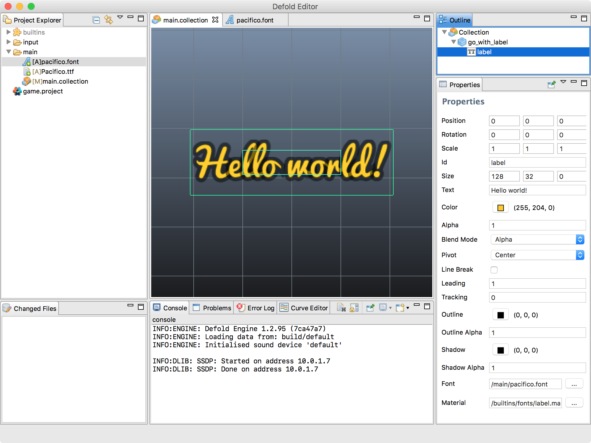

# Label
게임 오브젝트에 텍스트로 된 컨텐츠를 부착하는 것은 꽤 일반적입니다.  Defold의 GUI 지원 시스템이 있긴 하지만, 정보가 게임 오브젝트에 붙어 따라다니게 만들기는 귀찮은 일입니다. **Label** 컴포넌트는 게임 오브젝트에 텍스트 컨텐츠를 첨부하여 이를 쉽게 구현해 줍니다.

## Creating a label
라벨 컴포넌트는 게임 공간의 텍스트 조각을 화면에 렌더링합니다. 기본적으로는 스프라이트나 타일 그래픽과 함께 그려지고 정렬됩니다. 이 컴포넌트에는 텍스트를 렌더링 하는 방식을 제어하기 위한 여러 속성들이 있습니다.

라벨 컴포넌트를 만드는 방법은 아래와 같습니다.

* 게임 오브젝트에 마우스 오른쪽 버튼을 누르고 **Add Component**를 선택한 후 **Label**을 선택하고 **OK**를 누릅니다. 그러면 해당 게임 오브젝트의 내장 컴포넌트로 라벨이 추가됩니다.


* 만약 같은 템플릿으로 부터 다수의 라벨을 인스턴스화 하고 싶다면 새 **Label File**을 만들고 (**Assets pane** 창의 한 폴더에서 오른쪽 클릭하고 **New ▸ Label File** 선택) 게임 오브젝트에 오른쪽 클릭해서 **Add Component From File**을 선택한 후 아까 만든 라벨 파일을 선택하는 방식으로 여러 번 쓸 수 있습니다.

라벨 컴포넌트는 런타임 중에 혹은 개발 중에 변경 가능한 특별한 속성들을 가지고 있습니다.



#### Size
텍스트 경계 상자(text bounding box)의 크기입니다. 아래 있는 **Line Break** 속성을 설정하면 이 값을 기준으로 텍스트가 줄바꿈 됩니다.
#### Text
이 속성에 입력된 텍스트가 화면에 표시됩니다.
#### Color
텍스트의 색상
#### Alpha
텍스트의 알파값
#### Pivot
텍스트의 피벗(pivot). 텍스트 정렬(text alignment)을 변경하려면 사용하세요. (아래 참고)
#### Line Break
이 속성을 설정하면 텍스트가 여러 줄로 나뉘어 질 수 있습니다. 컴포넌트의 넓이에 따라 텍스트가 랩(wrap) 될 것인지가 결정되며 텍스트를 줄바꿈 하기 위해선 공백문자(space)가 필요합니다.
#### Leading
행간(line spacing)의 스케일 숫자. 기본값은 1이며, 0 값으로 셋팅하면 행 사이의 공간도 없으므로 한 줄로 표시됩니다.
#### Tracking
자간(letter spacing)의 스케일 숫자. 기본값은 0
#### Outline
외곽선의 색상
#### Outline Alpha
0.0~1.0값 사이의 외곽선 알파채널 값
#### Shadow
그림자의 색상
#### Shadow Alpha
0.0~1.0값 사이의 그림자 알파채널 값
#### Font
라벨에 사용할 폰트 리소스

> 기본 메터리얼은 성능상의 이유로 그림자(shadow) 렌더링이 비활성화 되어 있습니다.

## Alignment
pivot 속성을 설정하여 텍스트의 정렬 방식을 조정할 수 있습니다.

#### Center
pivot을 "Center", "North", "South" 로 설정하면, 텍스트가 중앙 정렬됩니다.
#### Left
pivot을 "West" 로 설정하면, 텍스트가 왼쪽 정렬됩니다.
#### Right
pivot을 "East" 로 설정하면, 텍스트가 오른쪽 정렬됩니다.


## Runtime manipulation
런타임시에 라벨 텍스트를 읽고 설정할 수 있을 뿐 아니라 아래와 같은 다양한 속성을 다룰 수도 있습니다.

#### color
``vector4`` 라벨의 색상
#### outline
``vector4`` 라벨의 외곽선 색상
#### scale
``number | vector3`` 라벨의 스케일, 규격화된 스케일이라면 ``number`` 타입, 각 xyz 축에 따라 개별적으로 설정한다면 ``vector3`` 타입
#### shadow
``vector4`` 라벨의 그림자 색상
#### size
``vector3`` 라벨의 크기

```lua
function init(self)
    -- 현재 스크립트와 동일한 오브젝트에 있는 "my_label" 컴포넌트의 텍스트를 설정함
    label.set_text("#my_label", "New text")
end
```

```lua
function init(self)
    -- 현재 스크립트와 동일한 게임 오브젝트에 있는 "my_label" 컴포넌트의 색상을 grey로 설정함...
    local grey = vmath.vector4(0.5, 0.5, 0.5, 1.0)
    go.set("#my_label", "color", grey)

    -- ...그리고 알파값에 0을 줘서 외곽선 삭제...
    go.set("#my_label", "outline.w", 0)

    -- ...그리고 x축으로 크기를 2배로 늘림...
    local scale_x = go.get("#my_label", "scale.x")
    go.set("#my_label", "scale.x", scale_x * 2)
end
```
