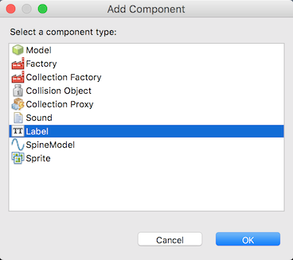
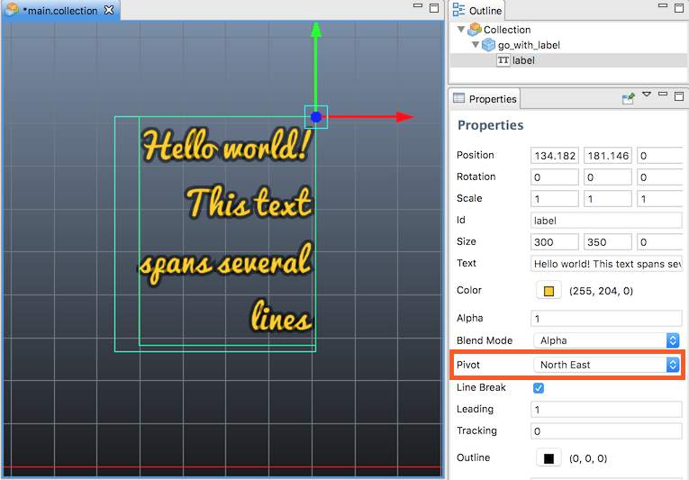

# Label

*Label* 컴포넌트는 게임 공간의 텍스트를 화면에 렌더링합니다. 기본적으로 모든 스프라이트 및 타일 그래픽과 함께 정렬되고 그려집니다. 이 컴포넌트에는 텍스트 렌더링 방식을 제어하는 여러 프로퍼티가 있습니다. Defold의 GUI도 텍스트를 지원하지만 GUI 요소를 게임 월드에 배치하는 일은 까다로울 수 있습니다. 라벨은 이 작업을 더 쉽게 해 줍니다.

## Label 만들기

Label 컴포넌트를 만들려면 게임 오브젝트를 <kbd>오른쪽 클릭</kbd>하고 <kbd>Add Component ▸ Label</kbd>을 선택합니다.



(같은 템플릿에서 여러 라벨을 인스턴스화하려면 대신 새 Label 컴포넌트 파일을 만들 수 있습니다. *Assets* 브라우저의 폴더를 <kbd>오른쪽 클릭</kbd>하고 <kbd>New... ▸ Label</kbd>을 선택한 다음, 이 파일을 원하는 게임 오브젝트에 컴포넌트로 추가합니다.)


*Font* 프로퍼티를 사용하려는 폰트로 설정하고, *Material* 프로퍼티는 폰트 타입과 맞는 메터리얼로 설정해야 합니다.


## Label 프로퍼티

*Id*, *Position*, *Rotation*, *Scale* 프로퍼티 외에도 다음 컴포넌트별 프로퍼티가 있습니다.

*Text*
: 라벨의 텍스트 컨텐츠입니다.

*Size*
: 텍스트 경계 상자의 크기입니다. *Line Break*가 설정되어 있으면 너비는 텍스트가 어느 지점에서 줄바꿈될지를 지정합니다.

*Color*
: 텍스트의 색상입니다.

*Outline*
: 외곽선의 색상입니다.

*Shadow*
: 그림자의 색상입니다.

::: sidenote
기본 메터리얼은 성능상의 이유로 그림자 렌더링이 비활성화되어 있습니다.
:::

*Leading*
: 줄 간격에 대한 스케일 값입니다. 값이 0이면 줄 간격이 없습니다. 기본값은 1입니다.

*Tracking*
: 글자 간격에 대한 스케일 값입니다. 기본값은 0입니다.

*Pivot*
: 텍스트의 피벗입니다. 텍스트 정렬을 변경할 때 사용합니다(아래 참고).

*Blend Mode*
: 라벨을 렌더링할 때 사용할 블렌드 모드입니다.

*Line Break*
: 텍스트 정렬은 피벗 설정을 따르며, 이 프로퍼티를 설정하면 텍스트가 여러 줄로 흐를 수 있습니다. 컴포넌트의 너비가 텍스트가 줄바꿈되는 위치를 결정합니다. 줄바꿈이 일어나려면 텍스트에 공백이 있어야 합니다.

*Font*
: 이 라벨에 사용할 폰트 리소스입니다.

*Material*
: 이 라벨을 렌더링할 때 사용할 메터리얼입니다. 사용하는 폰트 타입(bitmap, distance field 또는 BMFont)에 맞게 만들어진 메터리얼을 선택해야 합니다.

### Blend modes
:[blend-modes](../shared/blend-modes.md)

### 피벗과 정렬

*Pivot* 프로퍼티를 설정하여 텍스트의 정렬 모드를 변경할 수 있습니다.

*Center*
: 피벗이 `Center`, `North`, `South`로 설정되어 있으면 텍스트가 중앙 정렬됩니다.

*Left*
: 피벗이 `West` 모드 중 하나로 설정되어 있으면 텍스트가 왼쪽 정렬됩니다.

*Right*
: 피벗이 `East` 모드 중 하나로 설정되어 있으면 텍스트가 오른쪽 정렬됩니다.



## 런타임 조작

런타임에 라벨 텍스트를 가져오고 설정할 수 있으며, 그 밖의 여러 프로퍼티도 조작할 수 있습니다.

`color`
: 라벨 색상(`vector4`)

`outline`
: 라벨 외곽선 색상(`vector4`)

`shadow`
: 라벨 그림자 색상(`vector4`)

`scale`
: 라벨 스케일입니다. 균일 스케일에는 `number`를, 각 축을 개별적으로 스케일하려면 `vector3`를 사용합니다.

`size`
: 라벨 크기(`vector3`)

```lua
function init(self)
    -- 이 스크립트와 같은 게임 오브젝트에 있는
    -- "my_label" 컴포넌트의 텍스트를 설정합니다.
    label.set_text("#my_label", "New text")
end
```

```lua
function init(self)
    -- 이 스크립트와 같은 게임 오브젝트에 있는 "my_label" 컴포넌트의
    -- 색상을 설정합니다. 색상은 vector4에 저장된 RGBA 값입니다.
    local grey = vmath.vector4(0.5, 0.5, 0.5, 1.0)
    go.set("#my_label", "color", grey)

    -- ...그리고 alpha를 0으로 설정하여 외곽선을 제거합니다...
    go.set("#my_label", "outline.w", 0)

    -- ...그리고 x축 방향으로 2배 스케일합니다.
    local scale_x = go.get("#my_label", "scale.x")
    go.set("#my_label", "scale.x", scale_x * 2)
end
```

## 프로젝트 설정

*game.project* 파일에는 라벨과 관련된 몇 가지 [프로젝트 설정](/manuals/project-settings#label)이 있습니다.
