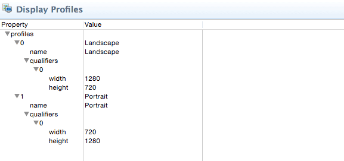
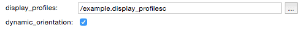
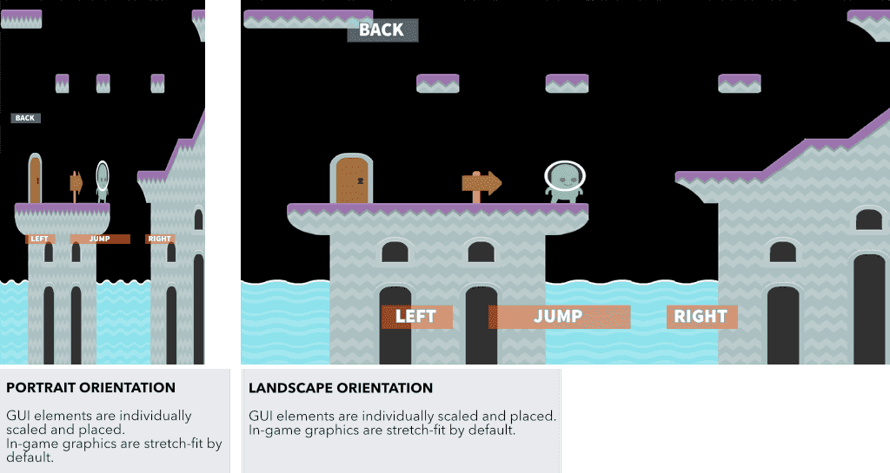

# Layouts
Defold는 모바일 장치에서 화면 방향 전환(screen orientation changes)에 따라 자동으로 조정하는 GUI 기능을 지원합니다. 이 기능을 사용하면 화면의 방향(orientation)과 종횡비(aspect ratio)에 맞게 GUI를 디자인 할 수 있습니다. 이 문서는 이 기능이 동작하는 방법에 대해 설명합니다.

GUI의 동적 레이아웃은 디스플레이 프로파일을 현재 게임이 실행중인 디스플레이의 넓이와 높이에 매칭시켜서 동작하게 됩니다.

## Display profiles
각 프로젝트는 "builtins/render/default.display_profiles"에 두 개의 프로파일을 포함하고 있습니다.



#### Landscape
폭 1280 픽셀, 높이 720 픽셀
#### Portrait
폭 720 픽셀, 높이 1280 픽셀

16:9의 종횡비를 사용하는 장치에서는 이들 프로파일로 충분합니다. 화면의 실제 물리 크기가 더 크거나 작더라도, 엔진이 비슷한 프로파일로 자동으로 선택해 줍니다. 만약 기본 프로파일을 수정해야 한다면, 내장된 파일을 프로젝트로 복사하거나 새로 생성해서 "project.settings"에서 엔진이 알 수 있게 프로파일 파일을 지정해주면 됩니다.



또한 **dynamic_orientation** 를 체크해서 장치의 방향이 바뀔 경우 엔진이 레이아웃을 자동으로 변경하도록 설정할 수 있습니다.

> 현재 iOS용 개발 앱은 **dynamic_orientation** 설정을 따르지 않고, 방향을 동적으로 항상 변경합니다.

## GUI layouts
정의된 디스플레이 프로파일은 GUI 에디터에서 레이아웃을 만드는데 사용됩니다. 에디터상에서 작업시, 다른 레이아웃을 추가하지 않으면 **Default** 레이아웃이 기본 레이아웃으로 사용됩니다. 새로운 레이아웃을 추가하려면 **Outline** 창에서 **Layouts** 폴더를 마우스 오른쪽 버튼 클릭 후 **Layout** 메뉴를 선택하세요.


> **Default** 레이아웃은 GUI 씬에 다른 레이아웃을 추가하지 않았을 경우에만 사용됩니다. 따라서 "Landscape" 레이아웃을 추가하고 "Portrait" 레이아웃도 추가하면 모든 방향에 잘 맞게 됩니다.

GUI 씬을 편집중일 때, 모든 노드들은 특정한 레이아웃에서 편집됩니다. 현재 선택된 레이아웃은  **Outline** 창에 나타나며 **bold** 글씨체로 표시됩니다.


또한 노드가 현재 선택된 레이어(**Default** 말고 다른 레이어)에서 오버라이드 된건지 아닌지에 따라 시각적 피드백을 얻을 수도 있습니다. 선택된 레이아웃으로 노드 프로퍼티를 변경하면 **Default** 레이어에 관련된 프로퍼티가 오버라이드 됩니다. 오버라이드 된 프로퍼티들은  파란색으로 표시되며 파란색 프로퍼티 이름을 클릭해서 기본값으로 프로퍼티를 리셋할 수 있습니다.


레이어는 프로퍼티만을 오버라이드 합니다. 한 레이어는 삭제하거나 새 노드를 생성할 수 없습니다. 만약 레이어에서 노드를 삭제해야 한다면 노드를 화면 밖으로 옮겨버리거나 스크립트에서 삭제할 수 있습니다. 또한 현재 선택된 레이아웃에 주목할 필요가 있습니다. 만약 프로젝트에 레이아웃 하나를 추가한다면 새 레이아웃은 현재 선택된 레이아웃에 따라 셋업되게 됩니다. 또한 노드를 복사 붙여넣기 하면 현재 선택된 레이아웃을 고려하여 복사 붙여넣기가 수행됩니다.

### Layout change messages
엔진이 장치의 회전방향에 따라 레이아웃을 전환하면, layout_changed 메세지를 GUI 컴포넌트의 스크립트로 보내줍니다. 이 메세지에는 레이아웃의 해쉬 아이디를 포함하고 있으므로 스크립트에서 어떤 레이아웃이 선택되었는지에 따라 알맞은 로직을 수행할 수 있습니다.

```lua
function on_message(self, message_id, message, sender)
    if message_id == hash("layout_changed") and message.id == hash("Landscape") then
        -- 레아이웃을 landscape로 전환
    ...
    elseif message_id == hash("layout_changed") and message.id == hash("Portrait") then
    -- 레이아웃을 portrait로 전환
    ...
    end
end
```

또한 현재 렌더 스크립트도 윈도우 창(게임 화면)이 변경되거나 방향이 전환될 경우 메세지를 받게 됩니다.

```lua
function on_message(self, message_id, message)
    if message_id == hash("window_resized") then
      -- 윈도우가 리사이징됨. message.width과 message.height에 창의 새 크기가 포함되어 있음
    end
end
```

## In game content
방향(orientation)이 전환되면, GUI 레이아웃 매니저는 노드 프로퍼티와 레이아웃에 맞게 GUI 노드들의 스케일과 위치를 자동으로 변경합니다. 게임 내 컨텐츠의 경우는 기본적으로 현재 윈도우에 맞게 늘려서(stretch-fit) 뷰가 렌더링됩니다.



당신의 게임 디자인이 게임 뷰가 렌더링 되어야 하는 방법에 따라 특정 제약이 필요한 경우, 렌더 스크립트를 변경하거나 당신이 원하는 동작, 카메라, 뷰포트, 기타 고려사항을 직접 구현할 수 있습니다.

(일부 그래픽 애셋은 Kenney가 제작했습니다 : http://kenney.nl/assets)
