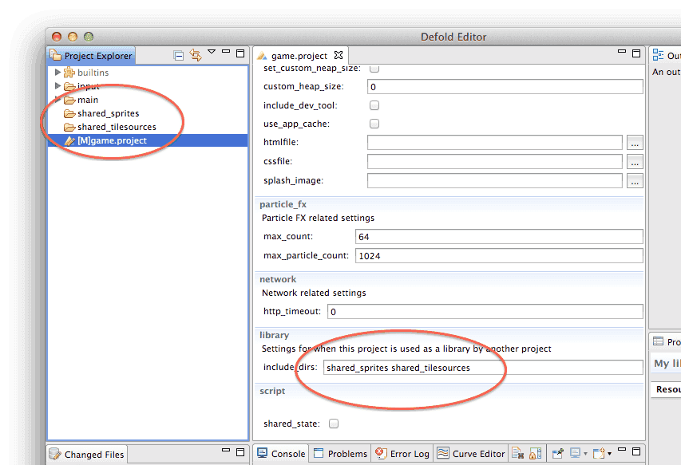
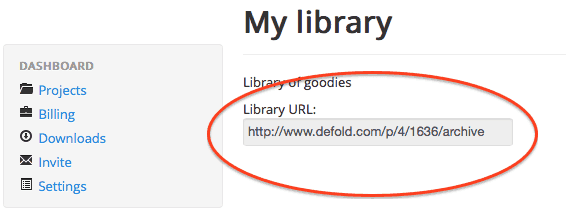
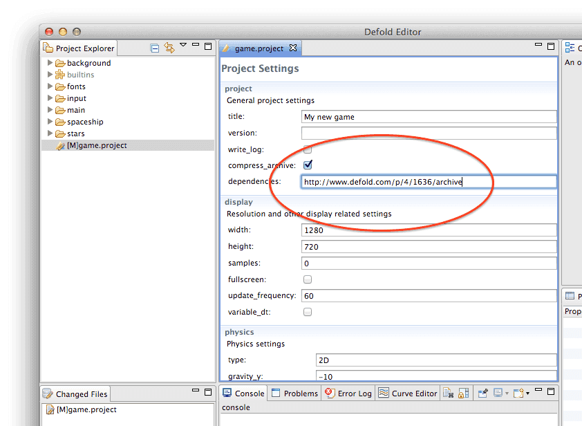
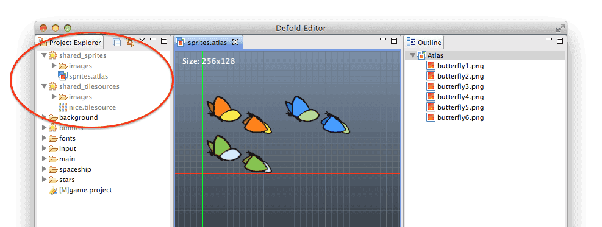
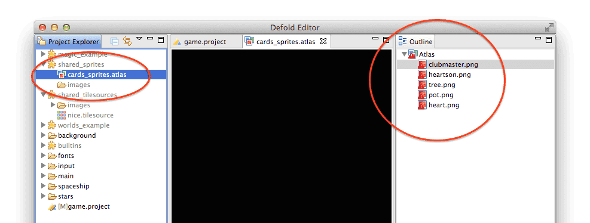

# Libraries
라이브러리 기능은 프로젝트간 에셋을 공유할 수 있게 해 줍니다. 이는 간단하지만 매우 강력한 메커니즘으로서 여러가지 방법으로 이 기능을 사용할 수 있습니다. 이 메뉴얼은 어떻게 동작하는지에 대해 설명합니다.

라이브러리는 다음 용도로 유용합니다.

* 완성된 프로젝트에서 새 프로젝트로 에셋을 복사하려 할 경우. 이전 게임의 속편을 제작할 경우 쉽게 에셋을 얻을 수 있습니다.
* 프로젝트에 복사할 수 있는 템플릿 라이브러리를 개발해서 커스터마이징 하거나 스페셜라이징 할 경우
* 직접 참조할 수 있는 완성된 오브젝트나 스크립트의 라이브러리들을 개발하는 경우.  이 방법은 애니메이션이나 사운드 에셋, 그래픽 공유 라이브러리를 개발하거나 공통 스크립트 모듈을 저장하는데 유용합니다.

## Setting up library sharing
예를 들어 공유된 스프라이트와 타일 소스를 포함하는 라이브러리를 개발하려 한다고 가정해 봅시다. 당신은 Defold 대쉬보드(자세한 내용은 [Workflow 문서](/manuals/workflow) 참고)에서 새 프로젝트를 설정하는 것으로 시작합니다. 프로젝트에서 공유하려는 폴더를 결정하고 프로젝트 셋팅에서 "include_dirs" 프로퍼티에 이 폴더들의 이름을 추가합니다. 여러 개의 폴더를 추가하려면 공백(space)로 이름을 구분하면 됩니다.



Defold 서버는 프로젝트가 공유되는 폴더를 포함하고 있다는걸 알아야 하므로 프로젝트를 Synchronize 해야 합니다. 이제 이 라이브러리를 다른 프로젝트에 추가하기 전에, 라이브러리의 위치부터 알아야 합니다.

### Library URL
라이브러리는 표준 URL을 통해 참조됩니다. 각 프로젝트는 Dashboard에서 찾을 수 있는 Library URL을 가지고 있습니다. 관련 프로젝트를 선택하고 URL을 복사거나 적어두기 바랍니다.



## Setting up library dependencies
라이브러리에 엑세스 하려는 프로젝트를 엽니다. Project settings에서 "dependencies" 프로퍼티에 아까 복사한 URL을 추가합니다. 원하는 경우 여러 종속 프로젝트를 지정할 수도 있습니다. 그냥 공백(space)으로 구분해주기만 하면 됩니다.



이제, 라이브러리 종속성을 업데이트 하기 위해 **Project > Fetch Libraries**  를 선택합니다. 이는 프로젝트를 열 때마다 자동으로 발생하므로 프로젝트를 다시 열 필요 없이 종속성이 변경될 경우에 이 작업이 수행 됩니다. 종속성 라이브러리를 추가/삭제 하거나 종속 라이브러리 중 하나가 누군가에 의해 변경되거나 동기화 되는 경우에도 발생합니다.


이제  Project Explorer에 공유된 폴더가 표시되고 공유된 모든것을 사용할 수 있습니다. 변경사항을 라이브러리 프로젝트에 동기화 하면 프로젝트에서 사용할 수 있게 됩니다.



## Troubleshooting
### Broken references
라이브러리 공유는 공유된 폴더에 위치한 파일들만 포함합니다. 만약 공유 계층구조가 아닌 위치의 에셋 참조를 생성하면 참조 경로가 깨지게 됩니다.

예를 들어, "shared_sprites" 라이브러리 폴더에는 아틀라스가 포함되어 있습니다. 아틀라스에는 PNG 이미지들이 모여져 있지만 실제로 이 이미지들은 공유되지 않은 라이브러리 프로젝트의 폴더에 있습니다.



Text Editor(기본 Atlas Editor 말고)로 아틀라스를 열어보면 수집된 이미지들의 경로를 볼 수 있습니다.

```
images {
  image: "/cards_example/images/clubmaster.png"
}
images {
  image: "/cards_example/images/heartson.png"
}
images {
  image: "/cards_example/images/tree.png"
}
images {
  image: "/cards_example/images/pot.png"
}
images {
  image: "/cards_example/images/heart.png"
}
```

이제 문제가 무엇인지 명확해 졌습니다. 아틀라스 파일은 로컬 프로젝트에 존재하지 않는 경로로 PNG 이미지들을 참조하고 있습니다. 이 문제는 "/cards_example/images" 폴더 경로를 라이브러리 프로젝트의 shared folders 목록에 추가해서 해결할 수 있습니다. 다른 방법으로는 "/cards_example/images" 폴더를 로컬에 생성하고 PNG 파일들을 복사하는 방법도 있습니다.

### Name collisions
"dependencies" Project setting 에서 여러 프로젝트의 URL을 나열할 수 있으므로 이름 충돌이 발생할 수도 있습니다. 이는 "include_dirs" Project setting에서 동일한 이름으로 종속 프로젝트 공유 폴더를 사용한 경우 발생합니다.

Defold는 "dependencies" 목록에 지정된 프로젝트 URL 순서에서 동일한 이름 중에 마지막 경로를 제외한 모든 참조를 무시함으로서 이름 충돌을 해결합니다. 예를 들어 dependencies에 3개의 라이브러리 URL이 있는데 전부 폴더명이 "items"라면, 가장 마지막에 있는 "item" 폴더만이 표시됩니다.
