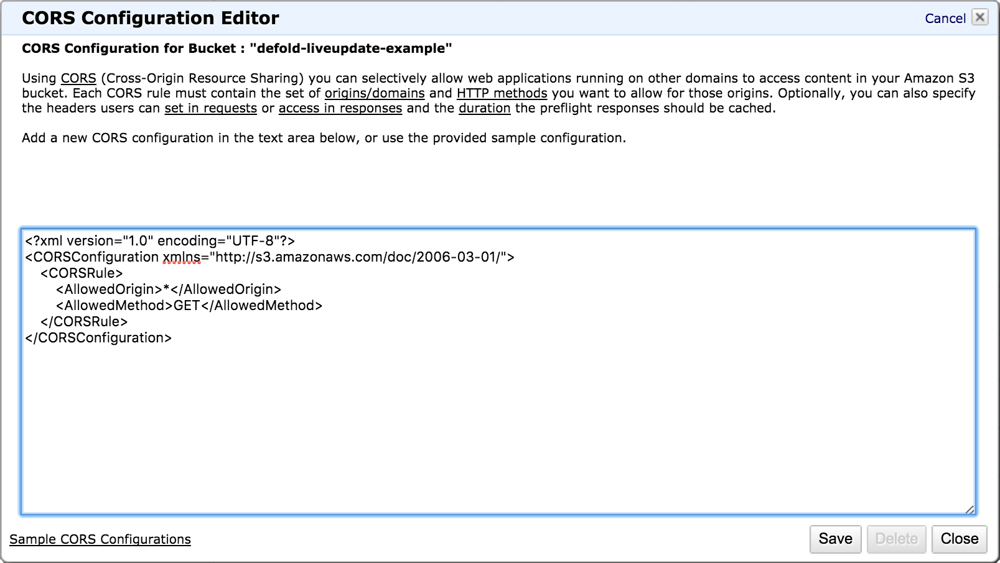
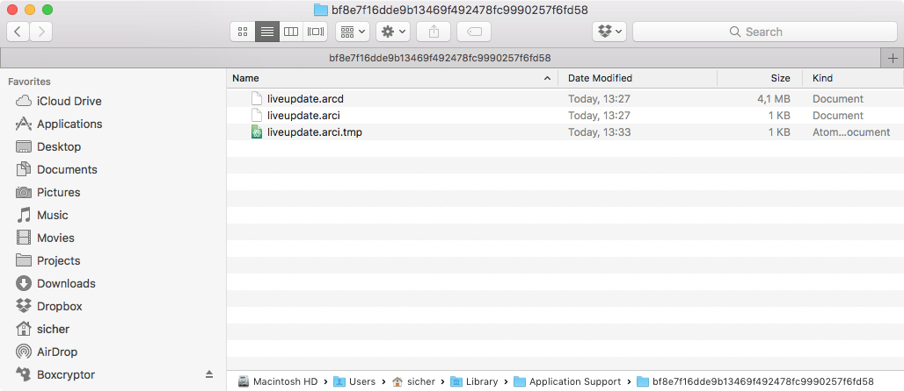

# Live update
게임을 번들(bundle)로 만들 때, Defold는 모든 게임 리소스들 플랫폼 별 패키지로 묶습니다. 대부분의 경우에는 엔진 실행 후에 즉시 모든 리소스에 접근해서 스토리지로부터 신속하게 로드하는 것을 선호합니다. 하지만 리소스 로딩을 나중으로 미루는 것을 원할 경우도 있습니다. 예를 들어,

* 당신의 게임은 에피소드 시리즈를 특징으로 가지고 있으며, 유저가 게임의 나머지 부분을 계속 할지를 결정하기 이전에 플레이어가 플레이 할 수 있는 첫 번째 판만 포함되어 있기를 원한다.

* 당신의 게임은 HTML5를 타겟으로 하고 있다. 스토리지에서 어플리케이션을 로딩한다는 것은 브라우저에서 전체 어플리케이션 패키지를 다운로드 해야 한다는것을 뜻한다. 이러한 플랫폼에서는 게임 리소스의 나머지를 다운로드 하기 전에 최소한의 시작 패키지를 보내서 앱을 빠르게 실행하는 것이 나을지도 모른다.

* 당신의 게임에는 게임에 표시될 때까지 다운로드를 연기하려는 아주 큰 리소스들(이미지, 동영상 등)이 포함되어 있다. 이것은 인스톨 사이즈를 줄이기 위함이다.

라이브 업데이트 기능은 빌드시에 번들에서 의도적으로 제외한 리소스들을 런타임시 어플리케이션 번들로 리소스를 불러와 저장하게 해주는 메커니즘이며, 이를 사용하여 컬렉션 프록시의 컨셉을 확장합니다.

## Preparing content for Live update
우리가 큰 고해상도 이미지 리소스들을 포함한 게임을 만들고 있다고 가정해 봅시다. 이 게임은 이 이미지들을 스프라이트 게임 오브젝트에 넣어 컬렉션에서 유지 시키려고 합니다.


이러한 컬렉션을 동적으로 로드하려면, 간단하게는 컬렉션 프록시 컴포넌트를 추가하고 "monalisa.collection"를 지정하면 됩니다. 이제 게임은 "load" 메세지를 컬렉션 프록시로 보내서 스토리지에서 메모리로 컬렉션에 있는 컨텐츠를 언제 로드할지 선택할 수 있습니다. 하지만 우리는 한 발 더 나아가서 컬렉션에 포함된 리소스의 로딩을 제어하려고 합니다.

이 작업은 컬렉션 프록시 프로퍼티의 **Exclude** 체크박스를 체크하면, 어플리케이션 번들을 생성할때 번들러(bundler)에게  "monalisa.collection"의 모든 컨텐츠를 남겨 달라고 말해 줌으로써 수행됩니다.


## Live update settings
번들러가 어플리케이션 번들을 생성할때, 제외 된 리소스를 어딘가에는 저장해야 합니다. 라이브 업데이트를 위한 프로젝트 셋팅은 이들 리소스들의 위치를 다룹니다. 이 셋팅은 **Project ▸ Live update Settings…** 에서 찾을 수 있습니다.


여기엔 Defold가 설정을 저장할 수 있는 두 가지 방법이 있습니다. 라이브 업데이트 셋팅 창에서 **Mode** 드롭다운 버튼을 열어 저장 방식을 선택해 보세요.

#### Amazon
이 옵션은 Defold에게 아마존 웹 서비스(AWS) S3 버켓에 제외된 리소스를 자동으로 업로드 하라고 지시합니다.   AWS **Credential profile** 에 이름을 입력하고 적당한 **Bucket**과 **Prefix** 를 선택하세요. [AWS 계정을 셋업하는 자세한 방법은 아래에서 확인해 주세요.](#setting-up-amazon-web-service)

#### Zip
이 옵션은 Defold에게 제외된 리소스를 포함한 Zip 압축 파일을 생성하라고 지시합니다. 이 압축 파일은 **Export path**에 설정한 경로에 저장됩니다.

## Scripting with excluded collection proxies
번들링(bundling)에서 제외된 컬렉션 프록시는 일반적인 컬렉션 프록시 처럼 동작합니다. 하나의 중요한 차이점으로는 번들 스토리지에서 사용할 수 없는 리소스가 있다면, "load" 메세지를 전송하는 것이 실패하게 된다는 것입니다.

그러므로 "load" 메세지를 보내기 전에, 누락된 리소스가 있는지 확인해야 하며, 누락된 리소스가 없다면 다운로드 후 저장하면 됩니다. 다음은 리소스가 아마존 S3에 "my-resources"라는 prefix와 "my-game-bucket" 라는 bucket으로 저장되어 있다고 가정한 예제 코드입니다.

```lua
function init(self)
    self.resources_pending = 0                                 [1]
    msg.post("#", "attempt_load_resources")
end

-- 이 함수는 컬렉션 프록시를 로드하는데 필요한 다운로드된 리소스를 저장하려 할 때마다 호출 됩니다.
local function resource_store_response(self, hexdigest, status)
    if status == true then
        -- 리소스를 성공적으로 로드함
        print("Resource data stored: " .. hexdigest)

        -- 다음 리소스를 위해 하나 빼기...
        self.resources_pending = self.resources_pending - 1

        -- 전부 성공적으로 저장됨, 이제 프록시 컬렉션을 로드할 때가 됨
        if self.resources_pending == 0 then
            msg.post("#proxy", "load")            [8]
        end
    else
        -- ERROR! 데이터 저장 실패!
        print("Failed to store resource data: " .. hexdigest)
    end
end

function on_message(self, message_id, message, sender)
    if message_id == hash("attempt_load_resources") then
        local missing_resources = collectionproxy.missing_resources("#proxy")            [2]

        -- 아직 시도하지 않은 누락된 리소스를 위해 다운로드 요청을 개시함
        for _,resource_hash in ipairs(missing_resources) do
            msg.post("#", "attempt_download", { resource_hash = resource_hash})
        end

        self.resources_pending = #missing_resources            [3]

        -- 만약 에디터상에서 실행하는거면 모든 리소스가 이미 로드된거로 됨
        if self.resources_pending == 0 then
            msg.post("#proxy", "load")
        end
    elseif message_id == hash("attempt_download") then
        local manifest = resource.get_current_manifest()            [4]
        local base_url = "https://my-game-bucket.s3.amazonaws.com/my-resources/"            [5]
        http.request(base_url .. message.resource_hash, "GET", function(self, id, response)
                if response.status == 200 or response.status == 304 then            [6]
                    -- ok로 응답(response) 받음
                    print("storing " .. message.resource_hash)
                    resource.store_resource(manifest, response.response, message.resource_hash, resource_store_response)            [7]
                else
                    -- ERROR! 리소스 다운로드 실패!
                    print("Failed to download resource: " .. message.resource_hash)
                end
            end)
    elseif message_id == hash("proxy_loaded") then
        msg.post(sender, "init")
        msg.post(sender, "enable")
    end
end
```

* **[1]** 프록시 컬렉션을 로드하기 전에 얼마나 많은 리소스를 다운로드 하고 저장해야 하는지 알려주는 간단한 카운터. 이 코드는 에러를 전혀 처리하지 않고 있으므로 실제 제품용 코드에서는 다운로드와 저장 작업시 더 많은 처리가 필요함.
* **[2]** 다운로드와 저장이 필요한 모든 리소스들을 획득함
* **[3]** 누락된 리소스들의 수를 저장해서 카운트 다운 함
* **[4]** 번들의 모든 리소스들을 나열하고 사용가능 여부를 확인한 이후의 현재 메니페스트가 필요함
* **[5]** 리소스를 아마존 S3 에 저장함. 만약 Zip 파일로 저장한다면, 파일을 어딘가에 호스팅하고 http.request()로 다운로드 할 때 파일의 위치를 참조해야 함
* **[6].** 파일이 크래쉬 나면 아마존이 304 status를 리턴함
* **[7].** 데이터를 들고 있으므로 저장을 시도함
* **[8].** 스토리지에 성공적으로 저장했으면 리소스 카운터가 0이 됨. 이제 컬렉션 프록시에 "load" 메세지를 보내도 안전함. 특정 지점에서 다운로드나 저장이 실패한 경우엔 리소스 카운터가 0이 될 수 없음

위의 로딩 코드를 사용해서 어플리케이션을 테스트 할 수 있습니다. 하지만 에디터상에서 실행하면 아무것도 다운로드 하지 않습니다. 왜냐하면 라이브 업데이트는 번들(bundle)의 기능이기 때문입니다. 에디터 환경에서 실행하면 어떤 리소스도 제외(exclude)되지 않습니다. 이 동작이 잘 돌아가는지 확인하려면, 번들로 만들어서 실행해야 합니다.

## Bundling with Live update
라이브 업데이트를 이용해 번들을 만드는 것은 쉽습니다. **Project ▸ Bundle** 메뉴를 선택하고 어플리케이션 번들을 만들기 원하는 플랫폼을 선택하면 번들링 다이얼로그 창이 열립니다.


번들링(dundling) 할 때, 제외 리소스(excluded resource)들은 어플리케이션 번들에서 제외됩니다.  **Publish Live update content** 체크박스를 체크하면 라이브 업데이트를 어떻게 셋팅했는지(위 내용 참고)에 따라 아마존에 올릴지 Zip 파일을 생성할지를 Defold에게 알려줍니다.

**Package**를 클릭하고 어플리케이션 번들이 만들어질 위치를 선택합니다. 이제 어플리케이션을 시작해서 모두 예상대로 동작하는지 확인할 수 있습니다.

## Setting up Amazon Web Service
아마존 서비스와 Defold 라이브 업데이트 기능을 함께 사용하기 위해서는 아마존 웹 서비스 계정이 필요합니다. 아직 계정이 준비되지 않았다면 https://aws.amazon.com/ 에서 생성할 수 있습니다.

이 섹션에서는 아마존 웹 서비스에서 제한된 액세스 권한으로 새 유저를 생성하는 방법을 설명하고, 게임 클라이언트가 아마존 S3의 리소스를 탐색 할 수 있도록 설정하는 방법도 함께 설명합니다. 아마존 S3 를 설정하는 자세한 정보는 [Amazon S3 문서](http://docs.aws.amazon.com/AmazonS3/latest/dev/Welcome.html)를 참고 바랍니다.

### 1. Create a bucket for Live update resources
Services 메뉴를 열고 Storage 카테고리([Amazon S3 Console](https://console.aws.amazon.com/s3))에 있는 S3를 선택합니다. 기존 버켓(bucket)들과 새 버켓을 만드는 옵션을 볼 수 있습니다. 기존 버켓을 사용할 수도 있지만, 액세스 영역을 쉽게 제한할 수 있도록 라이브 업데이트 리소스(Live update resources)를 위한 새 버켓을 만들기 추천합니다.


### 2. Add a bucket policy to your bucket
사용하려는 버켓을 선택하고 **Properties** 패널을 열어 패널에서 **Permissions** 옵션을 확장하세요. **Add bucket policy** 버튼을 클릭해서 버켓 정책을 열어보세요. 이 샘플의 버켓 정책은 아무 유저나 버켓의 파일들을 탐색할 수 있게 해주고, 게임 클라이언트가 라이브 업데이트 리소스를 다운로드 할 수 있게 해줍니다. 버켓 정책에 대한 추가정보를 보고 싶다면, [Amazon 문서](https://docs.aws.amazon.com/AmazonS3/latest/dev/using-iam-policies.html)를 참고하세요.

```json
{
    "Version": "2012-10-17",
    "Statement": [
        {
            "Sid": "AddPerm",
            "Effect": "Allow",
            "Principal": "*",
            "Action": "s3:GetObject",
            "Resource": "arn:aws:s3:::defold-liveupdate-example/*"
        }
    ]
}
```


### 3. Add a CORS configuration to your bucket (Optional)
[Cross-Origin Resource Sharing (CORS)](https://en.wikipedia.org/wiki/Cross-origin_resource_sharing)는 JavsScript를 사용하여 웹사이트에서 서로 다른 도메인의 리소스를 탐색하게 해 주는 메커니즘입니다. 만약 당신의 게임을 HTML5로 배포하려 한다면, CORS 설정을 당신의 버켓에 추가해야 합니다.

사용하려는 버켓을 선택하고 **Properties** 패널을 열어 패널에서 **Permissions** 옵션을 확장하세요. **Add CORS Configuration** 버튼을 클릭해서 버켓 정책을 열어보세요. 아래 샘플의 Configuration 은 와일드카드(\*) 도메인을 지정해서 어떤 웹사이트에서든 액세스되게 할 수 있지만, 게임을 실행할 웹사이트의 도메인을 알고 있다면 액세스를 제한하는 것도 가능합니다. Amazon CORS configuration 에 대한 더 많은 정보를 알고 싶다면 [Amazon 문서](https://docs.aws.amazon.com/AmazonS3/latest/dev/cors.html)를 참고 바랍니다.

```xml
<?xml version="1.0" encoding="UTF-8"?>
<CORSConfiguration xmlns="http://s3.amazonaws.com/doc/2006-03-01/">
    <CORSRule>
        <AllowedOrigin>*</AllowedOrigin>
        <AllowedMethod>GET</AllowedMethod>
    </CORSRule>
</CORSConfiguration>
```



### 4. Create IAM policy
**Services** 메뉴를 열고 Security, Identity & Compliance 카테고리([Amazon IAM Console](https://console.aws.amazon.com/iam))에 있는 **IAM**를 선택합니다. 왼쪽에 있는 메뉴에서 **Policies**를 선택하면 기존 정책들과 새 정책을 만드는 옵션을 볼 수 있습니다.

**Create Policy** 버튼을 클릭하고 Create Your Own Policy 를 선택하세요. 아래 예제의 정책은 유저가 Defold 프로젝트의 라이브 업데이트에 설정했던 모든 버켓들의 목록을 볼 수 있게 해줍니다. 또한 Access Control List (ACL)을 획득하여 라이브 업데이트 리소스에 지정된 버켓에 리소스를 업로드 할 수 있게 해줍니다. Amazon Identity 그리고  Access Management (IAM) 의 더 자세한 정보를 알고 싶다면 [Amazon 문서](http://docs.aws.amazon.com/IAM/latest/UserGuide/access.html)를 참고 바랍니다.


```json
{
    "Version": "2012-10-17",
    "Statement": [
        {
            "Effect": "Allow",
            "Action": [
                "s3:ListAllMyBuckets"
            ],
            "Resource": "arn:aws:s3:::*"
        },
        {
            "Effect": "Allow",
            "Action": [
                "s3:GetBucketAcl"
            ],
            "Resource": "arn:aws:s3:::defold-liveupdate-example"
        },
        {
            "Effect": "Allow",
            "Action": [
                "s3:PutObject"
            ],
            "Resource": "arn:aws:s3:::defold-liveupdate-example/*"
        }
    ]
}
```


### 5. Create a user for programmatic access
**Services** 메뉴를 열고 Security, Identity & Compliance 카테고리([Amazon IAM Console](https://console.aws.amazon.com/iam))에 있는 **IAM**를 선택합니다. 왼쪽에 있는 메뉴에서 **Users** 를 선택하면 기존 유저들과 새 유저를 만드는 옵션을 볼 수 있습니다. 기존 유저를 사용하는 것도 좋지만, 액세스 영역을 쉽게 제한할 수 있도록 라이브 업데이트 리소스(Live update resources)를 위한 새 유저를 만들기 추천합니다.

**Add User** 버튼을 클릭하고 username을 제공하고 **Access type** 으로 **Programmatic access** 를 선택합니다. 그리고 **Next: Permissions** 를 눌러서 **Attach existing policies directly**를 선택하고 위의 4. 에서 만들었던 정책을 선택합니다.

이 작업을 완려하면  **Access key ID** 와 **Secret access key** 가 제공됩니다.

> 이 페이지에서 나간 이후에는 다시 아마존에서 이 키를 조회 할 수 없으므로, 이들 키를 저장해 두는 것이 **매우 중요**합니다.

### 6. Create a credentials profile file
이제까지는 버켓을 만들고, 버켓 정책을 구성하고, CORS 설정을 추가하고, 새 유저를 생성하고, 유저 정책을 생성 했습니다. 이제 남은 한 가지는 Defold 에디터가 사용자를 대신해 버켓에 액세스 할 수 있도록 [credentials profile](https://aws.amazon.com/blogs/security/a-new-and-standardized-way-to-manage-credentials-in-the-aws-sdks) 파일을 생성하는 것입니다.

당신의 home 폴더에 ".aws" 라는 새 디렉토리를 생성하고, 그 폴더에 "credentials" 파일을 생성하세요.

```
$ mkdir ~/.aws
$ touch ~/.aws/credentials
```

"~/.aws/credentials" 파일은 프로그래밍 방식으로 AWS에 접근할 수 있게 해주는 자격증명이 포함되어 있으며 이는 AWS credentials 을 관리하는 표준화된 방법입니다. 문서편집기로 이 파일을 열어 당신의 **Access key ID** 와 **Secret access key**를 아래 형식으로 입력합니다.

```
[defold-liveupdate-example]
aws_access_key_id = <Access key ID>
aws_secret_access_key = <Secret access key>
```

이 defold-liveupdate-example 예제에서 <>괄호 안에 지정해야 하는 식별자는 Defold 편집기에서 프로젝트의 라이브 업데이트 셋팅을 구성할때 제공했던 식별자와 동일합니다.


## The manifest
메니페스트는 각 리소스의 해쉬값 뿐만 아니라 빌드에 포함된 모든 리소스들의 목록을 들고 있는 내부 데이터 구조(internal data structure)입니다. 라이브 업데이트 기능은 메니페스트를 사용하여 빌드된 게임의 파트를 추척하고, 로드할 수 있는 외부 소스를 나열하고, 로드된 데이터가 손상되지 않았는지 확인합니다.

유저 관점에서 메니페스트는 숫자 핸들(numeric handle)이며, 엔진을 관리하는 세부 정보는 남겨 둡니다.

> 현재는 초기 빌드 메니페스트(initial build manifest)만 사용 가능합니다. 새 메니페스트를 저장하는 기능은 시스템에 계획된 업데이트 사항입니다. 이는 알려지지 않은 출품된 게임의 리소스를 빌드 타임에 수정하거나 추가할 수 있게 해 줍니다.

## Development caveats
### Debugging
게임을 번들 버전으로 실행하면, 콘솔에 직접 액세스 할 수 없게 되어 디버깅에 문제가 발생합니다. 하지만, 커맨드 라인 혹은 번들 디렉토리의 실행파일을 직접 더블클릭해서 어블리케이션을 실행 할 수 있습니다.


이제 게임이 시작되고 쉘 윈도우에 print() 문을 출력하게 됩니다.


### Forcing re-download of resources
어플리케이션이 리소스를 저장하려 하면, 로컬 컴퓨터나 휴대장치의 디스크에 저장됩니다. 만약 어플리케이션을 재시작해도, 이 리소스들은 여전히 그대로 있습니다. 개발중인 경우는 때로 리소스들을 삭제해야할 경우도 있고 강제로 다시 다운로드 해야할 경우도 있습니다. sys.get_save_file() 함수는 Defold가 리소스를 저장하는 경로를 반환합니다. 저 폴더에서, Defold는 생성된 번들의 해쉬 이름을 사용하여 폴더를 만듭니다. 만약 이 폴더의 파일들을 삭제하면, 어플리케이션은 메니페스트의 리소스를 무효처리(invalidate) 하므로 당신은 이를 다시 다운로드하고 저장할 수 있게 됩니다.



## Known issues
* 현재는 빌드타임에 생성한 메니페스트만 액세스할 수 있습니다. 가까운 시일 내에 새 메니페스트를 저장하도록 할 예정입니다. 이는 기존 리소스를 수정하거나 라이브 업데이트를 통해 새 리소스를 게임에 추가할 수 있게 해 줍니다.

* 현재 resource.store_resource() 는 메인 스레드를 차단(block)하고 있습니다. 즉, 큰 리소스를 저장하면 끊김 현상이 발생할 수 있습니다.
