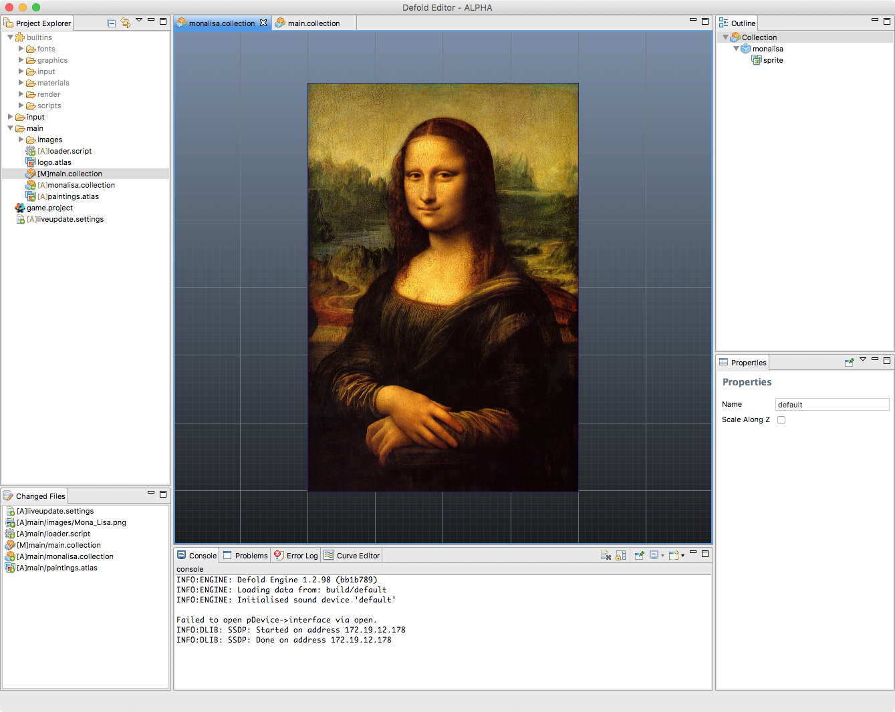
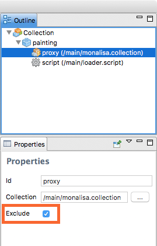
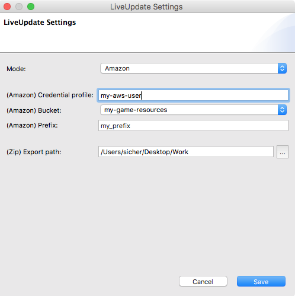
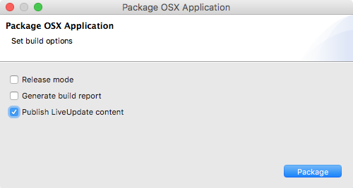
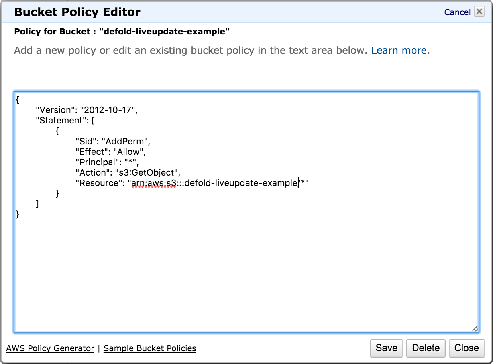
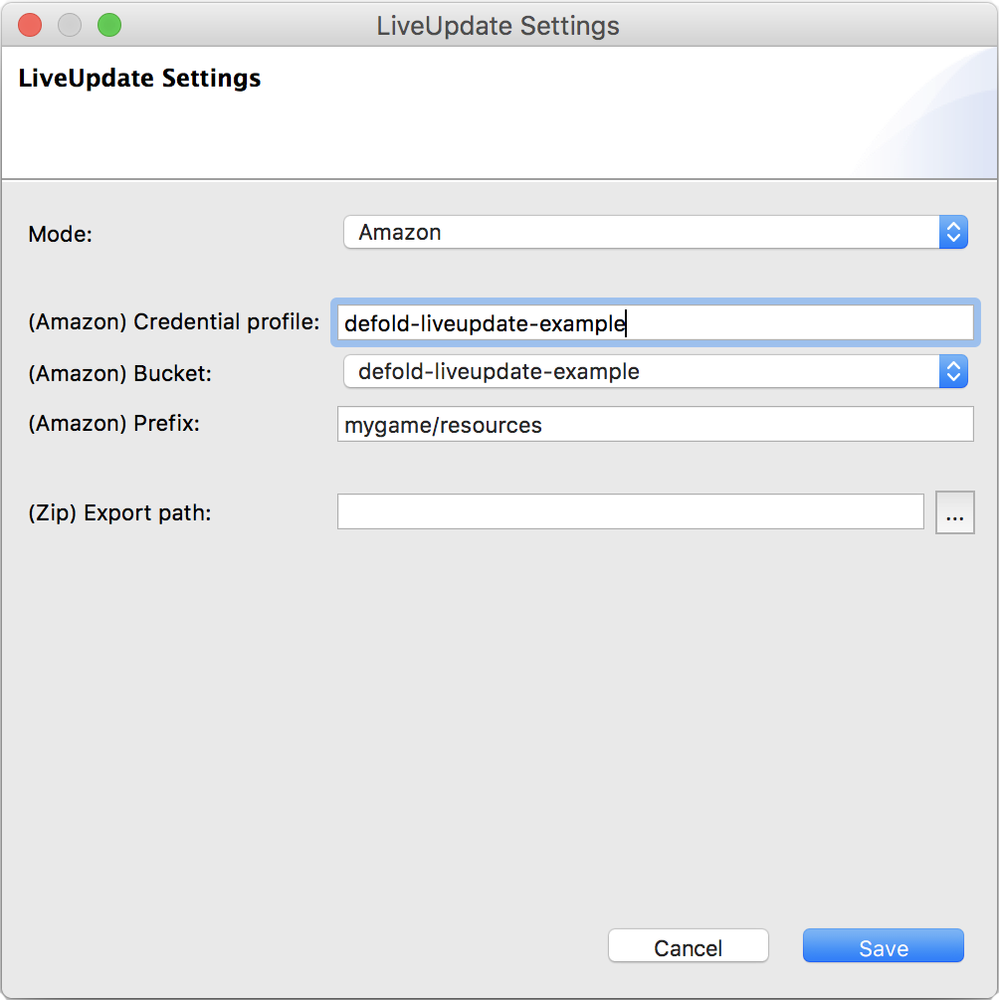
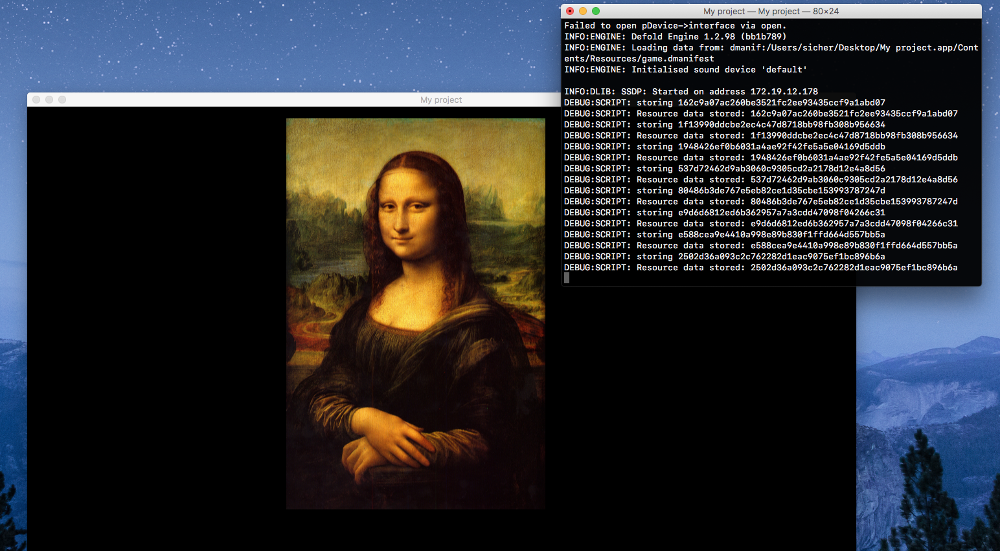
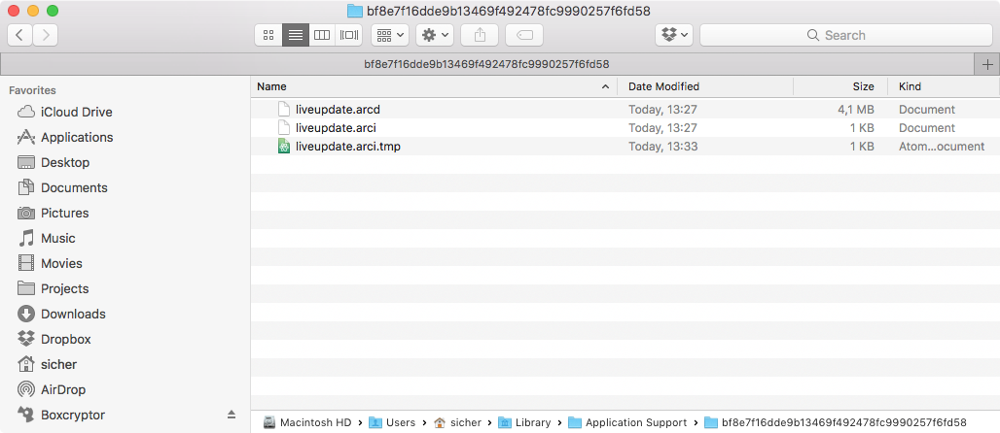

# Live update
게임을 번들(bundle)로 만들 때, Defold는 모든 게임 리소스들 플랫폼 별 패키지로 묶습니다. 대부분의 경우에는 엔진 실행 후에 즉시 모든 리소스에 접근해서 스토리지로부터 신속하게 로드하는 것을 선호합니다. 하지만 리소스 로딩을 나중으로 미루는 것을 원할 경우도 있습니다. 예를 들어,

* 당신의 게임은 에피소드 시리즈를 특징으로 가지고 있으며, 유저가 게임의 나머지 부분을 계속 할지를 결정하기 이전에 플레이어가 플레이 할 수 있는 첫 번째 판만 포함되어 있기를 원한다.

* 당신의 게임은 HTML5를 타겟으로 하고 있다. 스토리지에서 어플리케이션을 로딩한다는 것은 브라우저에서 전체 어플리케이션 패키지를 다운로드 해야 한다는것을 뜻한다. 이러한 플랫폼에서는 게임 리소스의 나머지를 다운로드 하기 전에 최소한의 시작 패키지를 보내서 앱을 빠르게 실행하는 것이 나을지도 모른다.

* 당신의 게임에는 게임에 표시될 때까지 다운로드를 연기하려는 아주 큰 리소스들(이미지, 동영상 등)이 포함되어 있다. 이것은 인스톨 사이즈를 줄이기 위함이다.

라이브 업데이트 기능은 빌드시에 번들에서 의도적으로 제외한 리소스들을 런타임시 어플리케이션 번들로 리소스를 불러와 저장하게 해주는 메커니즘이며, 이를 사용하여 컬렉션 프록시의 컨셉을 확장합니다.

## Preparing content for Live update
우리가 큰 고해상도 이미지 리소스들을 포함한 게임을 만들고 있다고 가정해 봅시다. 이 게임은 이 이미지들을 스프라이트 게임 오브젝트에 넣어 컬렉션에서 유지 시키려고 합니다.



이러한 컬렉션을 동적으로 로드하려면, 간단하게는 컬렉션 프록시 컴포넌트를 추가하고 "monalisa.collection"를 지정하면 됩니다. 이제 게임은 "load" 메세지를 컬렉션 프록시로 보내서 스토리지에서 메모리로 컬렉션에 있는 컨텐츠를 언제 로드할지 선택할 수 있습니다. 하지만 우리는 한 발 더 나아가서 컬렉션에 포함된 리소스의 로딩을 제어하려고 합니다.

이 작업은 컬렉션 프록시 프로퍼티의 **Exclude** 체크박스를 체크하면, 어플리케이션 번들을 생성할때 번들러(bundler)에게  "`monalisa.collection`"의 모든 컨텐츠를 남겨 달라고 말해 줌으로써 수행됩니다.



## Live update settings
번들러가 어플리케이션 번들을 생성할때, 제외 된 리소스를 어딘가에는 저장해야 합니다. 라이브 업데이트를 위한 프로젝트 셋팅은 이들 리소스들의 위치를 다룹니다. 이 셋팅은 **Project ▸ Live update Settings…** 에서 찾을 수 있습니다.



여기에는 Defold가 제외된 리소스를 저장할 수 있는 세 가지 방법이 있습니다. 라이브 업데이트 설정 창에서 **Mode** 드롭다운 버튼을 열어 저장 방식을 선택해 보세요.

#### Amazon
이 옵션은 Defold에게 아마존 웹 서비스(AWS) S3 버켓에 제외된 리소스를 자동으로 업로드 하라고 지시합니다.   AWS **Credential profile** 에 이름을 입력하고 적당한 **Bucket**과 **Prefix** 를 선택하세요. [AWS 계정을 셋업하는 자세한 방법은 아래에서 확인해 주세요.](#setting-up-amazon-web-service)

#### Zip
이 옵션은 Defold에게 제외된 리소스를 포함한 Zip 압축 파일을 생성하라고 지시합니다. 이 압축 파일은 **Export path**에 설정한 경로에 저장됩니다.

#### Folder
이 옵션은 제외된 리소스를 모두 포함하는 폴더를 생성하라고 Defold에 지시합니다. `Zip` 과 비슷하지만 압축 파일 대신 디렉터리를 사용합니다. 업로드 전에 파일을 후처리하거나 나중에 직접 다시 압축하고 싶을 때 유용합니다.

## Scripting with excluded collection proxies
번들링(bundling)에서 제외된 컬렉션 프록시는 일반적인 컬렉션 프록시 처럼 동작합니다. 하나의 중요한 차이점으로는 번들 스토리지에서 사용할 수 없는 리소스가 있다면, "load" 메세지를 전송하는 것이 실패하게 된다는 것입니다.

현재의 아카이브 기반 워크플로우에서는 보통 특정 프록시에 어떤 아카이브가 필요한지 미리 결정하고, 로드하기 전에 먼저 마운트합니다. 프록시가 제외된 컨텐츠를 참조하는지 확인해야 한다면 `collectionproxy.get_resources()` 를 사용하세요. 기존의 `collectionproxy.missing_resources()` 는 개별 리소스를 내려받던 예전 Live Update 흐름에 속하며 이제는 더 이상 권장되지 않습니다.

기본값인 *Strip Live Update Entries from Main Manifest* 옵션을 켠 상태에서는:

* 프록시에 필요한 컬렉션이 들어 있는 Live Update 아카이브가 아직 마운트되지 않았다면 `collectionproxy.get_resources("#proxy")` 는 빈 테이블 `{}` 를 반환합니다.
* 해당 Live Update 아카이브를 마운트한 뒤에는 `collectionproxy.get_resources("#proxy")` 가 그 프록시에 속한 리소스 해시를 담은 비어 있지 않은 테이블을 반환합니다. 예:

```lua
{
    "a1b2c3...", -- 대상 컬렉션
    "d4e5f6...", -- 게임 오브젝트
    "7890ab...", -- 스크립트
}
```

아래 예제는 아카이브가 `game.http_url` 설정에 지정된 URL을 통해 제공된다고 가정합니다.

```lua
-- 어떤 아카이브가 어떤 컨텐츠를 담고 있는지 추적해야 합니다.
-- 이 예제에서는 필요한 리소스를 담은 liveupdate 아카이브 하나만 사용합니다.
local lu_infos = {
    liveupdate = {
        name = "liveupdate",
        priority = 10,
    }
}

local function get_lu_info_for_level(level_name)
    if level_name == "level1" then
        return lu_infos["liveupdate"]
    end
end

local function mount_zip(self, name, priority, path, callback)
    liveupdate.add_mount(name, "zip:" .. path, priority, function(_uri, _path, _status) -- [1]
        callback(_uri, _path, _status)
    end)
end

local function has_mount(name)
    for _, mount in ipairs(liveupdate.get_mounts()) do
        if mount.name == name then
            return true
        end
    end
    return false
end

function init(self)
    self.http_url = sys.get_config_string("game.http_url", nil) -- [2]

    local level_name = "level1"
    local info = get_lu_info_for_level(level_name) -- [3]

    msg.post("#", "load_level", { level = "level1", info = info }) -- [4]
end

function on_message(self, message_id, message, sender)
    if message_id == hash("load_level") then
        local proxy_resources = collectionproxy.get_resources("#" .. message.level) -- [5]

        -- Strip Live Update Entries from Main Manifest 가 켜져 있으면,
        -- 관련 아카이브를 마운트하기 전까지는 이 테이블이 비어 있습니다.
        -- 마운트 후에는 프록시에 속한 리소스 해시들이 들어 있습니다.
        if message.info and #proxy_resources == 0 and not has_mount(message.info.name) then
            msg.post("#", "download_archive", message) -- [6]
        else
            msg.post("#" .. message.level, "load")
        end

    elseif message_id == hash("download_archive") then
        local zip_filename = message.info.name .. ".zip"
        local download_path = sys.get_save_file("mygame", zip_filename)
        local url = self.http_url .. "/" .. zip_filename

        http.request(url, "GET", function(self, id, response) -- [7]
            if response.status == 200 or response.status == 304 then
                mount_zip(self, message.info.name, message.info.priority, download_path, function(uri, path, status) -- [8]
                    msg.post("#", "load_level", message)
                end)
            else
                print("아카이브를 다운로드하지 못했습니다 ", download_path, "from", url, ":", response.status)
            end
        end, nil, nil, {path=download_path})
    elseif message_id == hash("proxy_loaded") then
        msg.post(sender, "init")
        msg.post(sender, "enable")
    end
end
```

* **[1]** `liveupdate.add_mount()` 는 이름, 우선순위, zip 파일을 지정해서 하나의 아카이브를 마운트합니다. 엔진을 재시작하지 않아도 즉시 사용할 수 있습니다.
* **[2]** 아카이브는 S3 같은 온라인 위치에 저장해 두어야 합니다.
* **[3]** collection proxy 이름을 기준으로 어떤 아카이브를 받아야 하는지 결정합니다.
* **[4]** 시작 시점에 레벨을 로드하려고 시도합니다.
* **[5]** `collectionproxy.get_resources()` 로 프록시의 제외된 컨텐츠를 확인합니다. 기본 stripped-manifest 설정에서는 관련 아카이브를 마운트하기 전까지 `{}` 를 반환하고, 마운트 후에는 프록시에 속한 리소스 해시 테이블을 반환합니다.
* **[6]** 프록시가 Live Update 컨텐츠를 사용하고 아직 해당 아카이브가 마운트되지 않았다면, 프록시를 로드하기 전에 아카이브를 다운로드하고 마운트합니다.
* **[7]** HTTP 요청으로 아카이브를 `download_path` 에 다운로드합니다.
* **[8]** 다운로드가 끝나면 실행 중인 엔진에 아카이브를 마운트합니다.

위의 로딩 코드를 사용해서 어플리케이션을 테스트 할 수 있습니다. 하지만 에디터상에서 실행하면 아무것도 다운로드 하지 않습니다. 왜냐하면 라이브 업데이트는 번들(bundle)의 기능이기 때문입니다. 에디터 환경에서 실행하면 어떤 리소스도 제외(exclude)되지 않습니다. 이 동작이 잘 돌아가는지 확인하려면, 번들로 만들어서 실행해야 합니다.

## Bundling with Live update
라이브 업데이트를 이용해 번들을 만드는 것은 쉽습니다. **Project ▸ Bundle** 메뉴를 선택하고 어플리케이션 번들을 만들기 원하는 플랫폼을 선택하면 번들링 다이얼로그 창이 열립니다.



번들링할 때 제외 리소스(excluded resource)들은 어플리케이션 번들에서 제외됩니다. **Publish Live update content** 체크박스를 체크하면 라이브 업데이트를 어떻게 설정했는지(위 내용 참고)에 따라 아마존에 업로드할지 Zip 파일을 생성할지를 Defold에게 알려줍니다. 게시되는 Live Update 컨텐츠에는 원격 전달에 필요한 전체 리소스 목록을 담고 있는 `liveupdate.game.dmanifest` 가 계속 포함됩니다.

아카이브 기반 Live Update 컨텐츠를 게시할 때는 *Strip Live Update Entries from Main Manifest* (`liveupdate.exclude_entries_from_main_manifest`) 옵션이 기본으로 켜져 있습니다. 이 옵션이 켜져 있으면 Live Update 전용 리소스가 번들된 `game.dmanifest` 에서 제거되어 번들 크기와 런타임 메모리 사용량을 줄일 수 있습니다. 제외된 항목을 계속 번들된 `game.dmanifest` 에 남겨 두는 예전 동작이 꼭 필요할 때만 이 옵션을 끄세요.

기본 설정에서는 관련 아카이브를 마운트하기 전까지 `collectionproxy.get_resources()` 가 `{}` 를 반환하고, 마운트 후에는 해당 프록시의 리소스 해시들을 반환합니다.

**Package**를 클릭하고 어플리케이션 번들이 만들어질 위치를 선택합니다. 이제 어플리케이션을 시작해서 모두 예상대로 동작하는지 확인할 수 있습니다.

## Setting up Amazon Web Service
아마존 서비스와 Defold 라이브 업데이트 기능을 함께 사용하기 위해서는 아마존 웹 서비스 계정이 필요합니다. 아직 계정이 준비되지 않았다면 https://aws.amazon.com/ 에서 생성할 수 있습니다.

이 섹션에서는 아마존 웹 서비스에서 제한된 액세스 권한으로 새 유저를 생성하는 방법을 설명하고, 게임 클라이언트가 아마존 S3의 리소스를 탐색 할 수 있도록 설정하는 방법도 함께 설명합니다. 아마존 S3 를 설정하는 자세한 정보는 [Amazon S3 문서](http://docs.aws.amazon.com/AmazonS3/latest/dev/Welcome.html)를 참고 바랍니다.

### 1. Create a bucket for Live update resources
Services 메뉴를 열고 Storage 카테고리([Amazon S3 Console](https://console.aws.amazon.com/s3))에 있는 S3를 선택합니다. 기존 버켓(bucket)들과 새 버켓을 만드는 옵션을 볼 수 있습니다. 기존 버켓을 사용할 수도 있지만, 액세스 영역을 쉽게 제한할 수 있도록 라이브 업데이트 리소스(Live update resources)를 위한 새 버켓을 만들기 추천합니다.


### 2. Add a bucket policy to your bucket
사용하려는 버켓을 선택하고 **Properties** 패널을 열어 패널에서 **Permissions** 옵션을 확장하세요. **Add bucket policy** 버튼을 클릭해서 버켓 정책을 열어보세요. 이 샘플의 버켓 정책은 아무 유저나 버켓의 파일들을 탐색할 수 있게 해주고, 게임 클라이언트가 라이브 업데이트 리소스를 다운로드 할 수 있게 해줍니다. 버켓 정책에 대한 추가정보를 보고 싶다면, [Amazon 문서](https://docs.aws.amazon.com/AmazonS3/latest/dev/using-iam-policies.html)를 참고하세요.

```json
{
    "Version": "2012-10-17",
    "Statement": [
        {
            "Sid": "AddPerm",
            "Effect": "Allow",
            "Principal": "*",
            "Action": "s3:GetObject",
            "Resource": "arn:aws:s3:::defold-liveupdate-example/*"
        }
    ]
}
```



### 3. Add a CORS configuration to your bucket (Optional)
[Cross-Origin Resource Sharing (CORS)](https://en.wikipedia.org/wiki/Cross-origin_resource_sharing)는 JavsScript를 사용하여 웹사이트에서 서로 다른 도메인의 리소스를 탐색하게 해 주는 메커니즘입니다. 만약 당신의 게임을 HTML5로 배포하려 한다면, CORS 설정을 당신의 버켓에 추가해야 합니다.

사용하려는 버켓을 선택하고 **Properties** 패널을 열어 패널에서 **Permissions** 옵션을 확장하세요. **Add CORS Configuration** 버튼을 클릭해서 버켓 정책을 열어보세요. 아래 샘플의 Configuration 은 와일드카드(\*) 도메인을 지정해서 어떤 웹사이트에서든 액세스되게 할 수 있지만, 게임을 실행할 웹사이트의 도메인을 알고 있다면 액세스를 제한하는 것도 가능합니다. Amazon CORS configuration 에 대한 더 많은 정보를 알고 싶다면 [Amazon 문서](https://docs.aws.amazon.com/AmazonS3/latest/dev/cors.html)를 참고 바랍니다.

```xml
<?xml version="1.0" encoding="UTF-8"?>
<CORSConfiguration xmlns="http://s3.amazonaws.com/doc/2006-03-01/">
    <CORSRule>
        <AllowedOrigin>*</AllowedOrigin>
        <AllowedMethod>GET</AllowedMethod>
    </CORSRule>
</CORSConfiguration>
```


### 4. Create IAM policy
**Services** 메뉴를 열고 Security, Identity & Compliance 카테고리([Amazon IAM Console](https://console.aws.amazon.com/iam))에 있는 **IAM**를 선택합니다. 왼쪽에 있는 메뉴에서 **Policies**를 선택하면 기존 정책들과 새 정책을 만드는 옵션을 볼 수 있습니다.

**Create Policy** 버튼을 클릭하고 Create Your Own Policy 를 선택하세요. 아래 예제의 정책은 유저가 Defold 프로젝트의 라이브 업데이트에 설정했던 모든 버켓들의 목록을 볼 수 있게 해줍니다. 또한 Access Control List (ACL)을 획득하여 라이브 업데이트 리소스에 지정된 버켓에 리소스를 업로드 할 수 있게 해줍니다. Amazon Identity 그리고  Access Management (IAM) 의 더 자세한 정보를 알고 싶다면 [Amazon 문서](http://docs.aws.amazon.com/IAM/latest/UserGuide/access.html)를 참고 바랍니다.


```json
{
    "Version": "2012-10-17",
    "Statement": [
        {
            "Effect": "Allow",
            "Action": [
                "s3:ListAllMyBuckets"
            ],
            "Resource": "arn:aws:s3:::*"
        },
        {
            "Effect": "Allow",
            "Action": [
                "s3:GetBucketAcl"
            ],
            "Resource": "arn:aws:s3:::defold-liveupdate-example"
        },
        {
            "Effect": "Allow",
            "Action": [
                "s3:PutObject"
            ],
            "Resource": "arn:aws:s3:::defold-liveupdate-example/*"
        }
    ]
}
```


### 5. Create a user for programmatic access
**Services** 메뉴를 열고 Security, Identity & Compliance 카테고리([Amazon IAM Console](https://console.aws.amazon.com/iam))에 있는 **IAM**를 선택합니다. 왼쪽에 있는 메뉴에서 **Users** 를 선택하면 기존 유저들과 새 유저를 만드는 옵션을 볼 수 있습니다. 기존 유저를 사용하는 것도 좋지만, 액세스 영역을 쉽게 제한할 수 있도록 라이브 업데이트 리소스(Live update resources)를 위한 새 유저를 만들기 추천합니다.

**Add User** 버튼을 클릭하고 username을 제공하고 **Access type** 으로 **Programmatic access** 를 선택합니다. 그리고 **Next: Permissions** 를 눌러서 **Attach existing policies directly**를 선택하고 위의 4. 에서 만들었던 정책을 선택합니다.

이 작업을 완려하면  **Access key ID** 와 **Secret access key** 가 제공됩니다.

> 이 페이지에서 나간 이후에는 다시 아마존에서 이 키를 조회 할 수 없으므로, 이들 키를 저장해 두는 것이 **매우 중요**합니다.

### 6. Create a credentials profile file
이제까지는 버켓을 만들고, 버켓 정책을 구성하고, CORS 설정을 추가하고, 새 유저를 생성하고, 유저 정책을 생성 했습니다. 이제 남은 한 가지는 Defold 에디터가 사용자를 대신해 버켓에 액세스 할 수 있도록 [credentials profile](https://aws.amazon.com/blogs/security/a-new-and-standardized-way-to-manage-credentials-in-the-aws-sdks) 파일을 생성하는 것입니다.

당신의 home 폴더에 ".aws" 라는 새 디렉토리를 생성하고, 그 폴더에 "credentials" 파일을 생성하세요.

```
$ mkdir ~/.aws
$ touch ~/.aws/credentials
```

"~/.aws/credentials" 파일은 프로그래밍 방식으로 AWS에 접근할 수 있게 해주는 자격증명이 포함되어 있으며 이는 AWS credentials 을 관리하는 표준화된 방법입니다. 문서편집기로 이 파일을 열어 당신의 **Access key ID** 와 **Secret access key**를 아래 형식으로 입력합니다.

```
[defold-liveupdate-example]
aws_access_key_id = <Access key ID>
aws_secret_access_key = <Secret access key>
```

이 defold-liveupdate-example 예제에서 <>괄호 안에 지정해야 하는 식별자는 Defold 편집기에서 프로젝트의 라이브 업데이트 셋팅을 구성할때 제공했던 식별자와 동일합니다.



## Deprecated legacy manifest flow
개별 리소스를 다운로드하고 런타임에서 매니페스트를 직접 교체하던 예전 Live Update 흐름은 이제 더 이상 권장되지 않습니다.

특히 `collectionproxy.missing_resources()`, 폐기된 매니페스트 API (`liveupdate.get_current_manifest()`, `liveupdate.store_resource()`, `liveupdate.store_manifest()`, `liveupdate.store_archive()`, `liveupdate.is_using_liveupdate_data()`), 그리고 오래된 `resource.*` 보조 함수 (`resource.get_current_manifest()`, `resource.store_resource()`, `resource.store_manifest()`, `resource.store_archive()`, `resource.is_using_liveupdate_data()`) 는 새 프로젝트에서 사용하지 않는 것이 좋습니다.

현재 권장되는 방식은 Live Update 아카이브를 게시한 뒤 `liveupdate.add_mount()` 로 마운트하고, `liveupdate.get_mounts()` 와 `liveupdate.remove_mount()` 로 관리하며, 필요할 때만 `collectionproxy.get_resources()` 로 프록시의 제외된 컨텐츠를 확인하는 것입니다. 예전 매니페스트 서명 키는 더 이상 이 파이프라인에 포함되지 않습니다. `liveupdate.settings` 의 `publickey` 와 `privatekey` 는 폐기되었고 더 이상 사용되지 않으며, `game.public.der` 도 더 이상 생성되거나 번들에 포함되지 않습니다.

Live Update 컨텐츠를 게시하면 Defold는 여전히 `liveupdate.game.dmanifest` 파일을 생성하지만, 이 파일은 번들링과 게시 과정의 일부로 자동 처리됩니다. 더 이상 매니페스트를 수동으로 다운로드하거나 저장할 필요가 없고, 매니페스트 서명을 위한 공개/개인 키 쌍을 설정할 필요도 없습니다.

## Development caveats
### Debugging
게임을 번들 버전으로 실행하면, 콘솔에 직접 액세스 할 수 없게 되어 디버깅에 문제가 발생합니다. 하지만, 커맨드 라인 혹은 번들 디렉토리의 실행파일을 직접 더블클릭해서 어블리케이션을 실행 할 수 있습니다.


이제 게임이 시작되고 쉘 윈도우에 print() 문을 출력하게 됩니다.



### Forcing re-download of resources
어플리케이션이 리소스를 저장하려 하면, 로컬 컴퓨터나 휴대장치의 디스크에 저장됩니다. 만약 어플리케이션을 재시작해도, 이 리소스들은 여전히 그대로 있습니다. 개발중인 경우는 때로 리소스들을 삭제해야할 경우도 있고 강제로 다시 다운로드 해야할 경우도 있습니다. sys.get_save_file() 함수는 Defold가 리소스를 저장하는 경로를 반환합니다. 저 폴더에서, Defold는 생성된 번들의 해쉬 이름을 사용하여 폴더를 만듭니다. 만약 이 폴더의 파일들을 삭제하면, 어플리케이션은 메니페스트의 리소스를 무효처리(invalidate) 하므로 당신은 이를 다시 다운로드하고 저장할 수 있게 됩니다.


