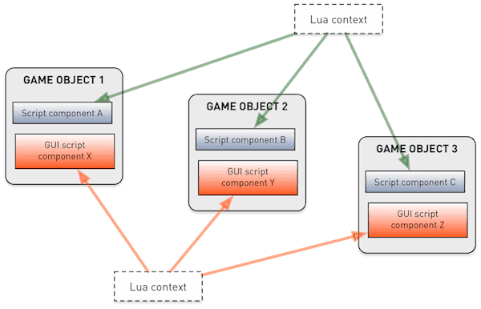
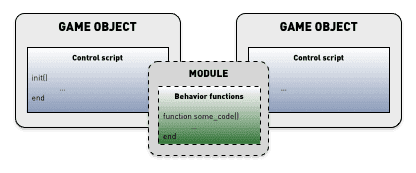

# Defold의 Lua

Defold 엔진에는 스크립팅을 위한 Lua 언어가 내장되어 있습니다. Lua는 강력하고 빠르며 쉽게 임베드할 수 있는 가벼운 동적 언어입니다. 비디오 게임 스크립팅 언어로 널리 사용됩니다. Lua 프로그램은 간단한 절차적 문법으로 작성됩니다. 이 언어는 동적 타입 언어이며 바이트코드 인터프리터로 실행됩니다. 증분 가비지 컬렉션을 사용하는 자동 메모리 관리 기능도 제공합니다.

이 매뉴얼은 일반적인 Lua 프로그래밍의 기본 사항과 Defold에서 Lua로 작업할 때 고려해야 할 점을 빠르게 소개합니다. Python, Perl, Ruby, JavaScript 또는 비슷한 동적 언어를 사용해 본 경험이 있다면 금방 시작할 수 있습니다. 프로그래밍이 처음이라면 초보자를 위한 Lua 책으로 시작하는 것이 좋습니다. 선택할 수 있는 자료는 많이 있습니다.

## Lua 버전

Defold는 게임과 다른 성능 중심 소프트웨어에 적합하도록 고도로 최적화된 Lua 버전인 [LuaJIT](https://luajit.org/)을 사용합니다. Lua 5.1과 완전히 상위 호환되며 모든 표준 Lua 라이브러리 함수와 전체 Lua/C API 함수 세트를 지원합니다.

LuaJIT은 여러 [언어 확장](https://luajit.org/extensions.html)과 일부 Lua 5.2 및 5.3 기능도 추가합니다.

Defold가 모든 플랫폼에서 동일하게 동작하도록 하는 것이 목표지만, 현재 플랫폼별 Lua 언어 버전에는 몇 가지 사소한 차이가 있습니다.
* iOS는 JIT 컴파일을 허용하지 않습니다.
* Nintendo Switch는 JIT 컴파일을 허용하지 않습니다.
* HTML5는 LuaJIT 대신 Lua 5.1.4를 사용합니다.

::: important
지원되는 모든 플랫폼에서 게임이 동작하도록 보장하려면 Lua 5.1의 언어 기능만 사용하는 것을 강력히 권장합니다.
:::

### 표준 라이브러리와 익스텐션
Defold에는 모든 [Lua 5.1 표준 라이브러리](http://www.lua.org/manual/5.1/manual.html#5)와 socket 및 bit 연산 라이브러리가 포함되어 있습니다.

  - base (`assert()`, `error()`, `print()`, `ipairs()`, `require()` 등)
  - coroutine
  - package
  - string
  - table
  - math
  - io
  - os
  - debug
  - socket ([LuaSocket](https://github.com/diegonehab/luasocket) 제공)
  - bitop ([BitOp](http://bitop.luajit.org/api.html) 제공)

모든 라이브러리는 [레퍼런스 API 문서](/ref/go)에 문서화되어 있습니다.

## Lua 책과 자료

### 온라인 자료
* [Programming in Lua (first edition)](http://www.lua.org/pil/contents.html) 이후 판은 인쇄본으로 제공됩니다.
* [Lua 5.1 reference manual](http://www.lua.org/manual/5.1/)
* [Learn Lua in 15 Minutes](http://tylerneylon.com/a/learn-lua/)
* [Awesome Lua - tutorial section](https://github.com/LewisJEllis/awesome-lua#tutorials)

### 책
* [Programming in Lua](https://www.amazon.com/gp/product/8590379868/ref=dbs_a_def_rwt_hsch_vapi_taft_p1_i0) - Programming in Lua는 이 언어에 대한 공식 도서이며, Lua를 사용하려는 모든 프로그래머에게 탄탄한 기초를 제공합니다. 언어의 핵심 설계자인 Roberto Ierusalimschy가 저술했습니다.
* [Lua programming gems](https://www.amazon.com/Programming-Gems-Luiz-Henrique-Figueiredo/dp/8590379841) - 이 글 모음은 Lua를 잘 프로그래밍하는 방법에 대한 기존의 지식과 실무를 기록합니다.
* [Lua 5.1 reference manual](https://www.amazon.com/gp/product/8590379833/ref=dbs_a_def_rwt_hsch_vapi_taft_p1_i4) - 온라인으로도 제공됩니다(위 참조).
* [Beginning Lua Programming](https://www.amazon.com/Beginning-Lua-Programming-Kurt-Jung/dp/0470069171)

### 동영상
* [Learn Lua in one video](https://www.youtube.com/watch?v=iMacxZQMPXs)

## 문법

프로그램은 간단하고 읽기 쉬운 문법을 사용합니다. 명령문은 한 줄에 하나씩 작성하며 명령문의 끝을 표시할 필요가 없습니다. 선택적으로 세미콜론 `;`을 사용해 명령문을 구분할 수 있습니다. 코드 블록은 키워드로 구분되며 `end` 키워드로 끝납니다. 주석은 블록으로 작성하거나 줄 끝까지 작성할 수 있습니다.

```lua
--[[
여러 줄에 걸쳐 이어질 수 있는
블록 주석입니다.
--]]

a = 10
b = 20 ; c = 30 -- 한 줄의 두 명령문

if my_variable == 3 then
    call_some_function(true) -- 줄 주석입니다.
else
    call_another_function(false)
end
```

## 변수와 데이터 타입

Lua는 동적 타입 언어입니다. 즉, 변수에는 타입이 없고 값에 타입이 있습니다.
정적 타입 언어와 달리 원하는 어떤 값이든 어떤 변수에든 할당할 수 있습니다.

Lua에는 여덟 가지 기본 타입이 있습니다.

`nil`
: 이 타입은 `nil` 값만 가집니다. 보통 할당되지 않은 변수처럼 유용한 값이 없음을 나타냅니다.

  ```lua
  print(my_var) -- 'my_var'에 아직 값이 할당되지 않았으므로 'nil'이 출력됩니다.
  ```

boolean
: `true` 또는 `false` 값을 가집니다. 조건이 `false` 또는 `nil`이면 거짓으로 처리됩니다. 그 외의 모든 값은 참으로 처리됩니다.

  ```lua
  flag = true
  if flag then
      print("flag is true")
  else
      print("flag is false")
  end

  if my_var then
      print("my_var is not nil nor false!")
  end

  if not my_var then
      print("my_var is either nil or false!")
  end
  ```

number
: 숫자는 내부적으로 64비트 _정수_ 또는 64비트 _부동 소수점_ 숫자로 표현됩니다. Lua는 필요에 따라 이 표현들을 자동으로 변환하므로 일반적으로 신경 쓸 필요가 없습니다.

  ```lua
  print(10) --> '10' 출력
  print(10.0) --> '10'
  print(10.000000000001) --> '10.000000000001'

  a = 5 -- 정수
  b = 7/3 -- 실수
  print(a - b) --> '2.6666666666667'
  ```

string
: 문자열은 임베드된 0 (`\0`)을 포함하여 어떤 8비트 값이든 담을 수 있는 불변 바이트 시퀀스입니다. Lua는 문자열 내용에 대해 어떤 가정도 하지 않으므로 원하는 어떤 데이터든 저장할 수 있습니다. 문자열 리터럴은 작은따옴표나 큰따옴표로 작성합니다. Lua는 런타임에 숫자와 문자열을 변환합니다. 문자열은 `..` 연산자로 연결할 수 있습니다.

  문자열에는 다음 C 스타일 이스케이프 시퀀스를 사용할 수 있습니다.

  | 시퀀스 | 문자 |
  | -------- | --------- |
  | `\a`     | 벨       |
  | `\b`     | 백스페이스 |
  | `\f`     | 폼 피드  |
  | `\n`     | 줄바꿈    |
  | `\r`     | 캐리지 리턴 |
  | `\t`     | 수평 탭 |
  | `\v`     | 수직 탭   |
  | `\\`     | 백슬래시      |
  | `\"`     | 큰따옴표   |
  | `\'`     | 작은따옴표   |
  | `\[`     | 왼쪽 대괄호    |
  | `\]`     | 오른쪽 대괄호   |
  | `\ddd`   | `ddd`가 최대 세 개의 _십진_ 숫자 시퀀스일 때 해당 숫자 값으로 표시되는 문자 |

  ```lua
  my_string = "hello"
  another_string = 'world'
  print(my_string .. another_string) --> "helloworld"

  print("10.2" + 1) --> 11.2
  print(my_string + 1) -- 오류, "hello"를 변환할 수 없습니다.
  print(my_string .. 1) --> "hello1"

  print("one\nstring") --> one
                       --> string

  print("\097bc") --> "abc"

  multi_line_string = [[
  Here is a chunk of text that runs over several lines. This is all
  put into the string and is sometimes very handy.
  ]]
  ```

function
: 함수는 Lua에서 일급 값입니다. 즉, 함수를 다른 함수의 파라미터로 전달하거나 값으로 반환할 수 있습니다. 함수에 할당된 변수는 함수에 대한 참조를 포함합니다. 변수를 익명 함수에 할당할 수도 있지만, Lua는 편의를 위해 편의 문법(`function name(param1, param2) ... end`)을 제공합니다.

  ```lua
  -- 함수에 'my_plus' 할당
  my_plus = function(p, q)
      return p + q
  end

  print(my_plus(4, 5)) --> 9

  -- 변수 'my_mult'에 함수를 할당하는 편리한 문법
  function my_mult(p, q)
      return p * q
  end

  print(my_mult(4, 5)) --> 20

  -- 함수를 파라미터 'func'로 받음
  function operate(func, p, q)
      return func(p, q) -- 제공된 함수를 파라미터 'p'와 'q'로 호출
  end

  print(operate(my_plus, 4, 5)) --> 9
  print(operate(my_mult, 4, 5)) --> 20

  -- 더하는 함수를 만들고 반환
  function create_adder(n)
      return function(a)
          return a + n
      end
  end

  adder = create_adder(2)
  print(adder(3)) --> 5
  print(adder(10)) --> 12
  ```

table
: 테이블은 Lua의 유일한 데이터 구조화 타입입니다. 테이블은 리스트, 배열, 시퀀스, 심볼 테이블, 집합, 레코드, 그래프, 트리 등을 표현하는 데 사용되는 연관 배열 _오브젝트_입니다. 테이블은 항상 익명이며 테이블을 할당한 변수에는 테이블 자체가 아니라 테이블에 대한 참조가 들어갑니다. 테이블을 시퀀스로 초기화할 때 첫 번째 인덱스는 `0`이 아니라 `1`입니다.

  ```lua
  -- 테이블을 시퀀스로 초기화
  weekdays = {"Sunday", "Monday", "Tuesday", "Wednesday",
              "Thursday", "Friday", "Saturday"}
  print(weekdays[1]) --> "Sunday"
  print(weekdays[5]) --> "Thursday"

  -- 시퀀스 값을 가진 레코드로 테이블 초기화
  moons = { Earth = { "Moon" },
            Uranus = { "Puck", "Miranda", "Ariel", "Umbriel", "Titania", "Oberon" } }
  print(moons.Uranus[3]) --> "Ariel"

  -- 빈 생성자 {}로 테이블 생성
  a = 1
  t = {}
  t[1] = "first"
  t[a + 1] = "second"
  t.x = 1 -- t["x"] = 1과 같음

  -- 테이블의 키, 값 쌍을 순회
  for key, value in pairs(t) do
      print(key, value)
  end
  --> 1   first
  --> 2   second
  --> x   1

  u = t -- 이제 u는 t와 같은 테이블을 참조
  u[1] = "changed"

  for key, value in pairs(t) do -- 여전히 t를 순회합니다.
      print(key, value)
  end
  --> 1   changed
  --> 2   second
  --> x   1
  ```

userdata
: `userdata`는 임의의 C 데이터를 Lua 변수에 저장할 수 있도록 제공됩니다. Defold는 Hash 값(hash), URL 오브젝트(url), Math 오브젝트(vector3, vector4, matrix4, quaternion), 게임 오브젝트, GUI 노드(node), 렌더 predicate(predicate), 렌더 타겟(render_target), 렌더 상수 버퍼(constant_buffer)를 저장하는 데 Lua `userdata` 오브젝트를 사용합니다.

thread
: thread는 독립적인 실행 스레드를 나타내며 코루틴을 구현하는 데 사용됩니다. 자세한 내용은 아래를 참고하세요.

## 연산자

산술 연산자
: 수학 연산자 `+`, `-`, `*`, `/`, 단항 `-`(부정) 및 지수 `^`입니다.

  ```lua
  a = -1
  print(a * 2 + 3 / 4^5) --> -1.9970703125
  ```

  Lua는 런타임에 숫자와 문자열 사이를 자동으로 변환합니다. 문자열에 숫자 연산을 적용하면 문자열을 숫자로 변환하려고 시도합니다.

  ```lua
  print("10" + 1) --> 11
  ```

관계/비교 연산자
: `<`(~보다 작음), `>`(~보다 큼), `<=`(~보다 작거나 같음), `>=`(~보다 크거나 같음), `==`(같음), `~=`(같지 않음)입니다. 이 연산자들은 항상 `true` 또는 `false`를 반환합니다. 서로 다른 타입의 값은 서로 다른 값으로 간주됩니다. 타입이 같으면 값에 따라 비교됩니다. Lua는 테이블, `userdata`, 함수를 참조로 비교합니다. 이런 값 두 개는 같은 오브젝트를 참조할 때만 같은 것으로 간주됩니다.

  ```lua
  a = 5
  b = 6

  if a <= b then
      print("a is less than or equal to b")
  end

  print("A" < "a") --> true
  print("aa" < "ab") --> true
  print(10 == "10") --> false
  print(tostring(10) == "10") --> true
  ```

논리 연산자
: `and`, `or`, `not`입니다. `and`는 첫 번째 인자가 `false`이면 첫 번째 인자를 반환하고, 그렇지 않으면 두 번째 인자를 반환합니다. `or`는 첫 번째 인자가 `false`가 아니면 첫 번째 인자를 반환하고, 그렇지 않으면 두 번째 인자를 반환합니다.

  ```lua
  print(true or false) --> true
  print(true and false) --> false
  print(not false) --> true

  if a == 5 and b == 6 then
      print("a is 5 and b is 6")
  end
  ```

연결
: 문자열은 `..` 연산자로 연결할 수 있습니다. 숫자는 연결될 때 문자열로 변환됩니다.

  ```lua
  print("donkey" .. "kong") --> "donkeykong"
  print(1 .. 2) --> "12"
  ```

길이
: 단항 길이 연산자 `#`입니다. 문자열의 길이는 바이트 수입니다. 테이블의 길이는 시퀀스 길이이며, 값이 `nil`이 아닌 `1` 이상의 연속된 인덱스 개수입니다. 참고: 시퀀스 안에 `nil` 값인 "구멍"이 있으면 길이는 `nil` 값 앞의 어떤 인덱스도 될 수 있습니다.

  ```lua
  s = "donkey"
  print(#s) --> 6

  t = { "a", "b", "c", "d" }
  print(#t) --> 4

  u = { a = 1, b = 2, c = 3 }
  print(#u) --> 0

  v = { "a", "b", nil }
  print(#v) --> 2
  ```

## 흐름 제어

Lua는 일반적인 흐름 제어 구문을 제공합니다.

if---then---else
: 조건을 검사하고 조건이 참이면 `then` 부분을 실행하며, 그렇지 않으면 선택적인 `else` 부분을 실행합니다. `if` 문을 중첩하는 대신 `elseif`를 사용할 수 있습니다. 이는 Lua에 없는 switch 문을 대체합니다.

  ```lua
  a = 5
  b = 4

  if a < b then
      print("a is smaller than b")
  end

  if a == '1' then
      print("a is 1")
  elseif a == '2' then
      print("a is 2")
  elseif a == '3' then
      print("a is 3")
  else
      print("I have no idea what a is...")
  end
  ```

while
: 조건을 검사하고 참인 동안 블록을 실행합니다.

  ```lua
  weekdays = {"Sunday", "Monday", "Tuesday", "Wednesday",
              "Thursday", "Friday", "Saturday"}

  -- 각 요일 출력
  i = 1
  while weekdays[i] do
      print(weekdays[i])
      i = i + 1
  end
  ```

repeat---until
: 조건이 참이 될 때까지 블록을 반복합니다. 조건은 본문 뒤에 검사되므로 최소 한 번은 실행됩니다.

  ```lua
  weekdays = {"Sunday", "Monday", "Tuesday", "Wednesday",
              "Thursday", "Friday", "Saturday"}

  -- 각 요일 출력
  i = 0
  repeat
      i = i + 1
      print(weekdays[i])
  until weekdays[i] == "Saturday"
  ```

for
: Lua에는 두 가지 `for` 루프가 있습니다. 숫자 `for`는 2개 또는 3개의 숫자 값을 사용하고, 제네릭 `for`는 _이터레이터_ 함수가 반환하는 모든 값을 순회합니다.

  ```lua
  -- 1부터 10까지 숫자 출력
  for i = 1, 10 do
      print(i)
  end

  -- 1부터 10까지 숫자를 출력하되 매번 2씩 증가
  for i = 1, 10, 2 do
      print(i)
  end

  -- 10부터 1까지 숫자 출력
  for i=10, 1, -1 do
      print(i)
  end

  t = { "a", "b", "c", "d" }
  -- 시퀀스를 순회하며 값 출력
  for i, v in ipairs(t) do
      print(v)
  end
  ```

break와 return
: `for`, `while`, `repeat` 루프의 내부 블록에서 빠져나오려면 `break` 문을 사용합니다. 함수에서 값을 반환하거나 함수 실행을 끝내고 호출자에게 돌아가려면 `return`을 사용합니다. `break` 또는 `return`은 블록의 마지막 명령문으로만 나타날 수 있습니다.

  ```lua
  a = 1
  while true do
      a = a + 1
      if a >= 100 then
          break
      end
  end

  function my_add(a, b)
      return a + b
  end

  print(my_add(10, 12)) --> 22
  ```

## 로컬, 전역, 렉시컬 스코핑

선언하는 모든 변수는 기본적으로 전역입니다. 즉, Lua 런타임 컨텍스트의 모든 부분에서 사용할 수 있습니다. 변수를 명시적으로 `local`로 선언하면 해당 변수는 현재 범위 안에서만 존재합니다.

각 Lua 소스 파일은 별도의 범위를 정의합니다. 파일의 최상위 레벨에서 `local`로 선언하면 해당 변수는 Lua 스크립트 파일에 로컬입니다. 각 함수는 또 다른 중첩 범위를 만들고, 각 제어 구조 블록은 추가 범위를 만듭니다. `do`와 `end` 키워드를 사용해 명시적으로 범위를 만들 수도 있습니다. Lua는 렉시컬 스코프를 사용합니다. 즉, 어떤 범위는 자신을 둘러싼 범위의 _로컬_ 변수에 완전히 접근할 수 있습니다. 로컬 변수는 사용하기 전에 선언되어야 한다는 점에 주의하세요.

```lua
function my_func(a, b)
    -- 'a'와 'b'는 이 함수에 로컬이며 이 함수 범위에서 사용할 수 있습니다.

    do
        local x = 1
    end

    print(x) --> nil. 'x'는 do-end 범위 밖에서 사용할 수 없습니다.
    print(foo) --> nil. 'foo'는 'my_func' 뒤에 선언되어 있습니다.
    print(foo_global) --> "value 2"
end

local foo = "value 1"
foo_global = "value 2"

print(foo) --> "value 1". 'foo'는 선언 뒤 최상위 범위에서 사용할 수 있습니다.
```

스크립트 파일에서 함수를 `local`로 선언하는 경우(일반적으로 좋은 생각입니다) 코드 순서에 주의해야 합니다. 서로 호출하는 함수가 있다면 전방 선언을 사용할 수 있습니다.

```lua
local func2 -- 'func2' 전방 선언

local function func1(a)
    print("func1")
    func2(a)
end

function func2(a) -- 또는 func2 = function(a)
    print("func2")
    if a < 10 then
        func1(a + 1)
    end
end

function init(self)
    func1(1)
end
```

다른 함수 안에 함수를 작성하면 그 함수 역시 자신을 둘러싼 함수의 로컬 변수에 완전히 접근할 수 있습니다. 이는 매우 강력한 구조입니다.

```lua
function create_counter(x)
    -- 'x'는 'create_counter' 안의 로컬 변수입니다.
    return function()
        x = x + 1
        return x
    end
end

count1 = create_counter(10)
count2 = create_counter(20)
print(count1()) --> 11
print(count2()) --> 21
print(count1()) --> 12
```

## 변수 섀도잉

블록 안에서 선언된 로컬 변수는 같은 이름을 가진 바깥 블록의 변수를 가립니다.

```lua
my_global = "global"
print(my_global) -->"global"

local v = "local"
print(v) --> "local"

local function test(v)
    print(v)
end

function init(self)
    v = "apple"
    print(v) --> "apple"
    test("banana") --> "banana"
end
```

## 코루틴

함수는 처음부터 끝까지 실행되며 중간에 멈출 방법이 없습니다. 코루틴은 이를 가능하게 하며, 어떤 경우에는 매우 편리합니다. 게임 오브젝트를 y 위치 `0`에서 프레임 1부터 프레임 5까지 매우 구체적인 y 위치들로 이동시키는 특정한 프레임별 애니메이션을 만들고 싶다고 가정해 봅시다. `update()` 함수(아래 참조)의 카운터와 위치 목록으로 이 문제를 해결할 수도 있습니다. 하지만 코루틴을 사용하면 확장하고 다루기 쉬운 매우 깔끔한 구현을 얻을 수 있습니다. 모든 상태는 코루틴 자체 안에 들어 있습니다.

코루틴이 yield하면 제어권을 호출자에게 반환하지만 실행 지점을 기억하므로 나중에 그 지점부터 계속할 수 있습니다.

```lua
-- 이것이 코루틴입니다.
local function sequence(self)
    coroutine.yield(120)
    coroutine.yield(320)
    coroutine.yield(510)
    coroutine.yield(240)
    return 440 -- 마지막 값을 반환
end

function init(self)
    self.co = coroutine.create(sequence) -- 코루틴을 생성합니다. 'self.co'는 thread 오브젝트입니다.
    go.set_position(vmath.vector3(100, 0, 0)) -- 초기 위치 설정
end

function update(self, dt)
    local status, y_pos = coroutine.resume(self.co, self) -- 코루틴 실행을 계속합니다.
    if status then
        -- 코루틴이 아직 종료되지 않았거나 죽지 않았다면 yield된 반환값을 새 위치로 사용합니다.
        go.set_position(vmath.vector3(100, y_pos, 0))
    end
end
```


## Defold의 Lua 컨텍스트

선언하는 모든 변수는 기본적으로 전역입니다. 즉, Lua 런타임 컨텍스트의 모든 부분에서 사용할 수 있습니다. Defold에는 이 컨텍스트를 제어하는 *game.project*의 *shared_state* 설정이 있습니다. 이 옵션이 설정되어 있으면 모든 스크립트, GUI 스크립트, 렌더 스크립트가 같은 Lua 컨텍스트에서 평가되고 전역 변수는 모든 곳에서 보입니다. 이 옵션이 설정되어 있지 않으면 엔진은 스크립트, GUI 스크립트, 렌더 스크립트를 별도 컨텍스트에서 실행합니다.



Defold는 여러 개의 별도 게임 오브젝트 컴포넌트에서 같은 스크립트 파일을 사용할 수 있도록 합니다. 로컬로 선언된 변수는 같은 스크립트 파일을 실행하는 컴포넌트 사이에서 공유됩니다.

```lua
-- 'my_global_value'는 모든 스크립트, gui_script, 렌더 스크립트, 모듈(Lua 파일)에서 사용할 수 있습니다.
my_global_value = "global scope"

-- 이 값은 이 특정 스크립트 파일을 사용하는 모든 컴포넌트 인스턴스 사이에서 공유됩니다.
local script_value = "script scope"

function init(self, dt)
    -- 이 값은 이 스크립트 컴포넌트 인스턴스에서 사용할 수 있습니다.
    self.foo = "self scope"

    -- 이 값은 init() 안에서 선언된 뒤 사용할 수 있습니다.
    local local_foo = "local scope"
    print(local_foo)
end

function update(self, dt)
    print(self.foo)
    print(my_global_value)
    print(script_value)
    print(local_foo) -- local_foo는 init() 안에서만 보이므로 nil이 출력됩니다.
end
```

## 성능 고려사항

부드러운 60 FPS로 실행되도록 의도된 고성능 게임에서는 작은 성능 실수도 경험에 큰 영향을 줄 수 있습니다. 고려할 만한 단순한 일반 사항이 있고, 문제가 없어 보이지만 실제로는 문제가 될 수 있는 사항도 있습니다.

먼저 단순한 것부터 보겠습니다. 불필요한 루프가 없는 직관적인 코드를 작성하는 것은 일반적으로 좋은 생각입니다. 때로는 목록을 순회해야 하지만, 목록이 충분히 크다면 주의해야 합니다. 이 예제는 꽤 괜찮은 노트북에서 1밀리초를 조금 넘는 시간 동안 실행됩니다. 각 프레임이 16밀리초뿐인 경우(60 FPS) 엔진, 렌더 스크립트, 물리 시뮬레이션 등이 그 시간의 일부를 사용하고 있다면 큰 차이를 만들 수 있습니다.

```lua
local t = socket.gettime()
local table = {}
for i=1,2000 do
    table[i] = vmath.vector3(i, i, i)
end
print((socket.gettime() - t) * 1000)

-- DEBUG:SCRIPT: 0.40388
```

의심스러운 코드를 벤치마크하려면 `socket.gettime()`에서 반환된 값(시스템 epoch 이후의 초)을 사용하세요.

## 메모리와 가비지 컬렉션

Lua의 가비지 컬렉션은 기본적으로 백그라운드에서 자동 실행되며 Lua 런타임이 할당한 메모리를 회수합니다. 많은 가비지를 수집하는 작업은 시간이 많이 걸릴 수 있으므로 가비지 컬렉션이 필요한 오브젝트 수를 줄이는 것이 좋습니다.

* 로컬 변수 자체는 비용이 없으며 가비지를 생성하지 않습니다. (예: `local v = 42`)
* 각각의 _새로운 고유한_ 문자열은 새 오브젝트를 만듭니다. `local s = "some_string"`을 작성하면 새 오브젝트가 만들어지고 `s`가 그 오브젝트에 할당됩니다. 로컬 `s` 자체는 가비지를 생성하지 않지만 문자열 오브젝트는 생성합니다. 같은 문자열을 여러 번 사용해도 추가 메모리 비용은 없습니다.
* 테이블 생성자(`{ ... }`)가 실행될 때마다 새 테이블이 생성됩니다.
* _function 문_을 실행하면 클로저 오브젝트가 생성됩니다. (정의된 함수를 호출하는 것이 아니라 `function () ... end` 문을 실행하는 경우)
* Vararg 함수(`function(v, ...) end`)는 함수가 _호출될_ 때마다 생략 부호에 대한 테이블을 생성합니다(Lua 5.2 이전 버전이거나 LuaJIT을 사용하지 않는 경우).
* `dofile()` 및 `dostring()`
* `userdata` 오브젝트

새 오브젝트를 생성하는 대신 이미 가진 오브젝트를 재사용할 수 있는 경우는 많습니다. 예를 들어 다음 코드는 각 `update()`의 끝에서 흔히 볼 수 있습니다.

```lua
-- 속도 초기화
self.velocity = vmath.vector3()
```

`vmath.vector3()`를 호출할 때마다 새 오브젝트가 생성된다는 사실은 잊기 쉽습니다. `vector3` 하나가 얼마나 많은 메모리를 사용하는지 알아봅시다.

```lua
print(collectgarbage("count") * 1024)       -- 88634
local v = vmath.vector3()
print(collectgarbage("count") * 1024)       -- 88704. 총 70바이트가 할당됨
```

`collectgarbage()` 호출 사이에 70바이트가 추가되었지만, 여기에는 `vector3` 오브젝트 이상의 할당이 포함됩니다. `collectgarbage()` 결과를 출력할 때마다 문자열이 만들어지고, 이 문자열 자체가 22바이트의 가비지를 추가합니다.

```lua
print(collectgarbage("count") * 1024)       -- 88611
print(collectgarbage("count") * 1024)       -- 88633. 22바이트 할당
```

따라서 `vector3`의 크기는 70-22=48바이트입니다. 큰 양은 아니지만 60 FPS 게임에서 매 프레임 _하나_씩 생성하면 초당 2.8 kB의 가비지가 생깁니다. 매 프레임 `vector3`를 하나씩 만드는 스크립트 컴포넌트가 360개라면 초당 1 MB의 가비지가 생성됩니다. 숫자는 매우 빠르게 누적될 수 있습니다. Lua 런타임이 가비지를 수집할 때는 특히 모바일 플랫폼에서 귀중한 몇 밀리초를 많이 소모할 수 있습니다.

할당을 피하는 한 가지 방법은 `vector3`를 생성한 뒤 같은 오브젝트로 계속 작업하는 것입니다. 예를 들어 `vector3`를 초기화하려면 다음 구조를 사용할 수 있습니다.

```lua
-- 새 오브젝트를 만드는 self.velocity = vmath.vector3() 대신
-- 기존 속도 벡터 오브젝트의 컴포넌트를 0으로 만듭니다.
self.velocity.x = 0
self.velocity.y = 0
self.velocity.z = 0
```

기본 가비지 컬렉션 방식이 시간에 민감한 일부 어플리케이션에 최적이 아닐 수 있습니다. 게임이나 앱에서 끊김이 보인다면 [`collectgarbage()`](/ref/base/#collectgarbage) Lua 함수를 통해 Lua의 가비지 수집 방식을 조정할 수 있습니다. 예를 들어 낮은 `step` 값으로 매 프레임 짧은 시간 동안 컬렉터를 실행할 수 있습니다. 게임이나 앱이 얼마나 많은 메모리를 사용하는지 파악하려면 현재 가비지 바이트 수를 다음과 같이 출력할 수 있습니다.

```lua
print(collectgarbage("count") * 1024)
```

## 모범 사례

일반적인 구현 설계 고려사항 중 하나는 공유 동작을 위한 코드를 어떻게 구조화할지입니다. 여러 접근 방식이 가능합니다.

모듈의 동작
: 동작을 모듈에 캡슐화하면 서로 다른 게임 오브젝트의 스크립트 컴포넌트(및 GUI 스크립트) 사이에서 코드를 쉽게 공유할 수 있습니다. 모듈 함수를 작성할 때는 일반적으로 엄격한 함수형 코드로 작성하는 것이 가장 좋습니다. 저장된 상태나 부작용이 꼭 필요하거나 더 깔끔한 설계로 이어지는 경우도 있습니다. 모듈에 내부 상태를 저장해야 한다면 컴포넌트가 Lua 컨텍스트를 공유한다는 점을 알고 있어야 합니다. 자세한 내용은 [모듈 문서](/manuals/modules)를 참고하세요.

  

  또한 모듈 함수에 `self`를 전달해 모듈 코드가 게임 오브젝트 내부를 직접 수정하는 것이 가능하더라도, 매우 강한 결합을 만들게 되므로 이 방식은 강력히 권장하지 않습니다.

캡슐화된 동작을 가진 헬퍼 게임 오브젝트
: Lua 모듈에 스크립트 코드를 담을 수 있는 것처럼, 스크립트 컴포넌트를 가진 게임 오브젝트에도 담을 수 있습니다. 차이는 게임 오브젝트에 담는 경우 메세지 전달을 통해서만 엄격하게 통신할 수 있다는 점입니다.

  

컬렉션 안에서 헬퍼 동작 오브젝트와 게임 오브젝트 그룹화
: 이 설계에서는 미리 정의된 이름(사용자가 타겟 게임 오브젝트 이름을 일치하도록 변경해야 함)이나 타겟 게임 오브젝트를 가리키는 `go.property()` URL을 통해 다른 타겟 게임 오브젝트에 자동으로 작용하는 동작 게임 오브젝트를 만들 수 있습니다.

  

  이 구성의 이점은 타겟 오브젝트가 들어 있는 컬렉션에 동작 게임 오브젝트를 놓기만 하면 된다는 점입니다. 추가 코드는 전혀 필요 없습니다.

  많은 수의 게임 오브젝트를 관리해야 하는 상황에서는 이 설계가 적합하지 않습니다. 각 인스턴스마다 동작 오브젝트가 복제되고 각 오브젝트가 메모리를 사용하기 때문입니다.
