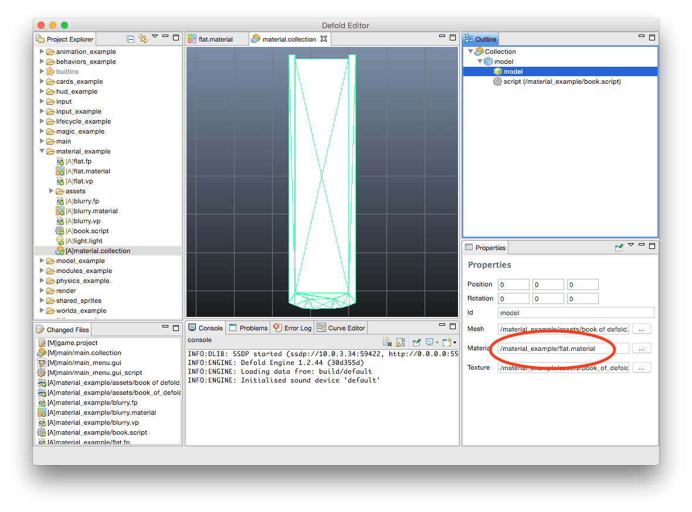

# Materials
메터리얼은 그래픽 컴포넌트들(스프라이트, 타일맵, 폰트, GUI노트 등)을 어떻게 렌더링되어 표현하는지 Defold의 방식입니다. 이 매뉴얼은 메터리얼(materials), 쉐이더 상수(shader constants), 샘플러(samplers) 들이 어떻게 동작하는지 설명합니다.

## Overview
메터리얼은 렌더링 할 오브젝트를 선택하기 위해 렌더링 파이프 라인(rendering pipeline)에 사용되는 정보인 Tags를 포함하고 있습니다. 또한 사용 가능한 그래픽 API를 통해 컴파일 된 후 각 프레임마다 컴포넌트가 렌더링될 때 그래픽 하드웨어에서 실행되는 쉐이더 프로그램에 대한 참조도 포함하고 있습니다. 버텍스 쉐이더(vertex shader)는 컴포넌트의 기하 구조(geometry)를 계산하며, 이는 오브젝트의 각 버텍스를 전달하기 전에 작업을 수행하게 됩니다. 계산 결과로 만들어진 기초 요소(primitives)는 래스터(rasterized)화 되거나 fragment(조각) 혹은 픽셀로 나눠지게 됩니다. 이들 각각의 프래그먼트들은 프래그먼트 쉐이더(fragment shader: 때로는 픽셀 쉐이더라고도 불림)를 통하여 실행됩니다. 이 프래그먼트 쉐이더의 목적은 결과 픽셀(resulting pixel)의 색상을  결정하는 것이며, 어떤 방식으로든 계산(calculation), 텍스쳐 조회(texture lookup), 조합(combinations)에 의해 수행될 수 있습니다.


Defold는 모바일 장치에서 렌더링 하기 위해 OpenGL ES 2.0을 사용합니다. 데스크탑 환경에서는 보통 다른 버전의 OpenGL이 사용되지만, 요즘의 하드웨어와 드라이버는 적절하게 호환되고 있습니다. OpenGL ES 2.0 (임베디드 시스템을 위한 OpenGL) 과 OpenGL ES 쉐이딩 언어의 자세한 사양은 https://www.khronos.org/registry/gles/ 에서 볼 수 있습니다.

데스크탑 환경에서는 OpenGL ES 2.0 에서 지원되지 않는 기능을 사용하여 쉐이더를 만들고 컴파일 하는 것이 가능합니다. 다만 이렇게 하면 상호 호환이 깨질 수 있습니다.

## Creating a material
자, 단순한 평면(지향성 빛(directional light)이 없는)이지만 질감이 있는 메터리얼(textured material)을 만들어 봅시다.

1. **Project Explorer** 창에서 대상 폴더를 선택합니다.
2. **File > New…​ > Material File** 메뉴를 선택합니다. (**Project Explorer** 창에서 오른쪽 클릭 후 **New…​ > Material File**을 선택해도 됩니다.)
3. 새 메터리얼 파일의 이름을 지정합니다.
4. 새 메터리얼을 **Material Editor**에서 엽니다.


이제 버텍스(vertex)와 프레그먼트 쉐이더(fragment shader) 프로그램 파일을 만들어야 합니다. 현재 이 작업 단계는 좀 복잡합니다.

1. **File > New…​ > Script File** 을 선택해서 스크립트 파일 만들기
2. 이 스크립트 파일의 확장자를 ".vp" (Vertex Program)로 바꿉니다.
3. 스크립트 파일을 하나 더 만듭니다.
4. 이 스크립트 파일의 확장자를 ".fp" (Fragment Program)로 바꿉니다.

메터리얼의 아래 속성을 사용하여 서로 연관된 두 프로그램 파일을 지정합니다.


### Material tags
당신의 렌더 스크립트(render script)가 새 메터리얼을 사용하는 컴포넌트를 렌더링 할 수 있으므로 당신은 메터리얼을 위한 태그(tag)를 설정해야 합니다. 태그는 엔진에서 render.predicate()에 의해 함께 렌더링해야 하는 컴포넌트들을 수집하기위해 사용되며 비트마스크(bitmask)로 표시됩니다. 이를 수행하는 방법을 알고 싶다면 [Rendering](/manuals/rendering)문서를 참고 바랍니다.

> 프로젝트에서 사용할 수 있는 최대 태그의 수는 32개 입니다.


### Constants
버텍스 쉐이더는 각 버텍스가 클리핑 공간(clipping space)으로 바뀔 수 있도록 메트릭스를 필요로 하며 두 개의 버텍스 상수(vertex constants)를 설정하면 됩니다.

1. 상수 한 개는 "world"로 이름을 짓고 type을 CONSTANT_TYPE_WORLD 로 설정합니다. 이를 통해 엔진은  "world"가 월드 메트릭스를 포함하고 있다는 것을 알 수 있습니다.
2. 두번째는 "view_proj"로 이름을 짓고 type을 CONSTANT_VIEW_PROJECTION 으로 설정합니다. 이를 통해 엔진은 "view_proj"가 프로젝션 메트릭스(projection matrix)와 곱해진 뷰 메트릭스(view matrix)를 포함하고 있다는 것을 알 수 있습니다.


### Shader programs
메터리얼이 동작하기 위해서, 우리는 버텍스와 쉐이더 프로그램을 수정해야 합니다.

*Vertex shader ("flat.vp")*
```
// view_proj 와 world 는 버텍스 상수로 설정되며
// 우리는 버텍스 쉐이더 프로그램에서 이를 "uniform"으로 선언하여 엑세스함
//
uniform mediump mat4 view_proj;
uniform mediump mat4 world;

// position이 원래의 버텍스 포지션을 유지함
attribute mediump vec4 position;

// texcoord0 는 이 버텍스를 위해 텍스쳐 좌표를 가지고 있음
attribute mediump vec2 texcoord0;

// 버텍스 간의 텍스쳐 좌표를 보간하는 변수를 정의함
// 프레그먼트 쉐이더(fragment shader)는 이 값을 읽게됨
varying mediump vec2 var_texcoord0;

void main()
{
    // view, projection, world 메트릭스를 하나로 곱함
    mediump mat4 mvp = view_proj * world;

    // var_texcoord0에 이 버텍스의 위치인 texcoord0를 설정함
    var_texcoord0 = texcoord0;

    // 버텍스 위치를 mvp matrix로 이동(translate)함
    // vec4(position.xyz, 1.0) 는 이 위치의 w 컴포넌트가 항상 1.0임을 보장함
    gl_Position = mvp * vec4(position.xyz, 1.0);
}
```

*Fragment shader ("flat.fp")*
```
// 이 프레그먼트의 텍스쳐 좌표는 버텍스 사이에 다양하게 있음
varying mediump vec2 var_texcoord0;

// 컴포넌트의 텍스쳐 데이터는 sampler2D를 통해 액세스됨
uniform sampler2D diffuse_texture;

void main()
{
    // 이 프레그먼트 좌표에서 텍스쳐의 색상을 찾고 이를 프레그먼트 색상으로 설정함
    gl_FragColor = texture2D(diffuse_texture, var_texcoord0);
}
```

### Setting the material
각 그래픽 오브젝트의 타입은 **Material** 속성을 가지고 있으며 각 컴포넌트마다 특정 메터리얼을 설정할 수 있습니다. 메터리얼을 설정하지 않으면, 기본 메터리얼이 자동으로 선택됩니다. 직접 새로 만든 메터리얼을 사용하여 모델 렌더(model render)를 만들기 위해서는, **Material** 속성을 설정하여 메터리얼 파일을 참조하면 됩니다. [Models](/manuals/model) 문서에서 어떻게 3D 모델을 Defold로 임포트 하는지 가이드를 볼 수 있습니다.



이제 모델의 결과 렌더링을 볼 수 있습니다. 상상한 만큼의 흥미로운 메터리얼은 아니지만, 경험을 쌓기엔 좋은 출발점이 될 것입니다. 만약 당신이 쉐이더 프로그래밍을 처음 시작한다면, 렌더링 파이프라인이 동작하는 방법을 이해하기 위해 이 간단한 샘플에 시간을 들여야 합니다.


## Shader constants
유니폼(Uniforms)은 엔진에서 버텍스와 프레그먼트 쉐이더 프로그램으로 전달되는 값입니다. 이들은 쉐이더 프로그램에서 uniform 키워드로 선언되며 material 파일에서 vertex_constant 속성이나 fragment_constant 속성으로 정의되어야 합니다. 쉐이더 상수(shader constatns)는 각 렌더 패스(render pass)에서 일정하며 각 프레임당 한 번씩 발생합니다. 아래 타입을 사용할 수 있습니다.

#### CONSTANT_TYPE_USER
쉐이더 프로그램으로 보내려는 커스텀 데이터를 위해 사용되는 커스텀 상수(custom constant)입니다. 상수 정의(constant definition)에 있는 상수를 초기값으로 사용할 수 있지만 sprite.set_constant(),  sprite.reset_constant(), tilemap.set_constant(), tilemap.reset_constant(), particlefx.set_constant(), particlefx.reset_constant() 함수를 통해 변경할 수 있습니다.
#### CONSTANT_TYPE_WORLD
월드 메트릭스(world matrix)
#### CONSTANT_TYPE_VIEW
뷰 메트릭스(view matrix)
#### CONSTANT_TYPE_PROJECTION
프로젝션 메트릭스(projection matrix)
#### CONSTANT_TYPE_VIEWPROJ
뷰와 프로젝션 메트릭스를 곱한 메트릭스
#### CONSTANT_TYPE_WORLDVIEW
월드와 뷰와 프로젝션 메트릭스를 곱한 메트릭스

## Constant buffers
렌더링 파이프라인(rendering pipeline)이 그리기 작업을 할 때는 기본 시스템 상수 버퍼(default system constants buffer)에서 상수값들을 가져옵니다. 커스텀 상수 버퍼는 기본 상수값을 오버라이딩(override) 하는데 사용되며, 대신 렌더 스크립트(render script)에서 쉐이더 프로그램 변수를 프로그래밍 방식으로 설정할 수 있습니다. 그리고 나서 이들은 render.draw() 함수로 전달 됩니다.

```lua
self.constants = render.constant_buffer()                   [1]
self.constants.tint = vmath.vector4(1, 0, 0, 1)             [2]
...
render.draw(self.my_pred, self.constants)                   [3]
```
- [1] 새로운 상수 버퍼를 만듬
- [2] "tint" 상수를 밝은 빨강색으로 설정
- [3] 우리의 커스텀 상수를 사용하여 predicate 그리기

버퍼의 상수 요소(element)는 Lua 테이블처럼 인덱스 될 수 있지만 pairs() 나 ipairs() 로 반복 할 수 는 없습니다.

## Uniform texture samplers
선언된 sampler 2D는 자동적으로 그래픽 컴포넌트에 참조된 텍스쳐에 바인딩 됩니다. 현재는 메터리얼 파일에 샘플러를 지정할 필요가 없지만, 원하는 경우 샘플러를 설정할 수 있습니다. 아래를 참고 바랍니다.


```
// 컴포넌트의 텍스쳐 데이터는 sampler2D를 통해 액세스됨
uniform sampler2D diffuse_texture;
...

// 이 프레그먼트 좌표에서 텍스쳐 색을 탐색하고
// 이 색으로 프레그먼트 색을 설정함
gl_FragColor = texture2D(diffuse_texture, var_texcoord0);
...
```

> 현재 Defold는 메터리얼 당 한 개의 텍스쳐만 지원합니다

## Sampler settings
당신은 선택적으로 메터리얼 파일에 특정 샘플러를 설정할 수 있습니다. 샘플러에서 쉐이더 프로그램에서 사용된 이름을 따라 이름을 정하고 wrap과 filter를 원하는 대로 설정하면 됩니다.


### Wrap modes
wrap 모드는 U 및 V 축을 독립적으로 설정할 수 있습니다.

#### WRAP_MODE_REPEAT
[0,1] 범위 밖의 텍스쳐 데이터가 반복됨
#### WRAP_MODE_MIRRORED_REPEAT
[0,1] 범위 밖의 텍스쳐 데이터가 반복되지만 모든 두번째의 반복은 미러링됨
#### WRAP_MODE_CLAMP_TO_EDGE
1.0보다 큰 값의 텍스쳐 데이터는 1.0으로 설정되고 0.0보다 작은 값은 0.0으로 설정됨 (예를 들어 가장자리의 픽셀(edge pixel)은 가장자리로 반복됨)

### Filter modes
확대(filter_mag)와 축소(filter_min)를 개별적으로 필터링 하기 위한 설정을 할 수 있습니다. Nearest 필터링은 Linear interpolation(선형 보간)에 비해 계산을 적게 하지만 계단 현상(aliasing artifacts)이 나타날 수 있습니다. Linear interpolation 필터링은 결과물을 부드럽게 만들어 줍니다.

#### FILTER_MODE_NEAREST
픽셀 중심에 가장 가까운 좌표의 텍셀(texel)이 사용됩니다.
#### FILTER_MODE_LINEAR
픽셀의 중심에 가장 가까이에 있는 텍셀의 2x2 배열의 가중 선형 평균(weighted linear average)을 사용합니다.
#### FILTER_MODE_NEAREST_MIPMAP_NEAREST
개별 밉맵(mipmap) 내에서 가장 가까운 텍셀 값을 선택합니다.
#### FILTER_MODE_NEAREST_MIPMAP_LINEAR
가장 가까운 밉맵 두 개에서 가장 가까운 텍셀(nearest texel)을 선택하여 이 두 값 사이를 선형적으로 보간합니다.
#### FILTER_MODE_LINEAR_MIPMAP_NEAREST
개별 밉맵 내에서 선형적으로 보간합니다.
#### FILTER_MODE_LINEAR_MIPMAP_LINEAR
선형 보간을 사용하여 두 맵을 각각 계산하고 이 두 값 사이를 선형적으로 보간합니다.

## Vertex shader attributes
특성(attribute)은 개별 버텍스와 관련된 값입니다. 각기 다른 컴포넌트 타입은 각기 다른 특성 모음을 가지고 있습니다. 이 특성에 엑세스 하기 위해서는 쉐이더 프로그램에서 선언하기만 하면 됩니다. 

```
// 이 버텍스를 위한 포지션과 텍스쳐 좌표
attribute mediump vec4 position;
attribute mediump vec2 texcoord0;
...
```

사용 가능한 특성은 아래와 같습니다.

#### Sprite
position, texcoord0
#### Tilegrid
position, texcoord0
#### Spine model
position, texcoord0
#### GUI node
position, textcoord0, color
#### ParticleFX
position, texcoord0, color
#### Mesh
position, texcoord0, normal
#### Font
position, texcoord0, face_color, outline_color, shadow_color
