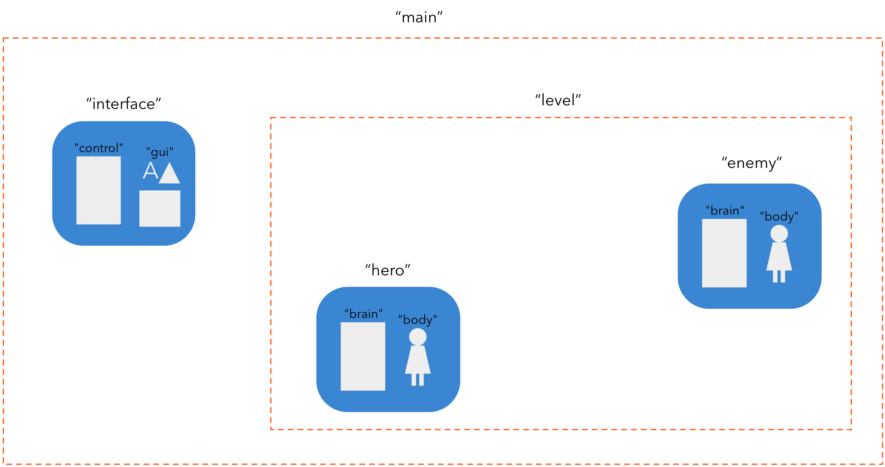
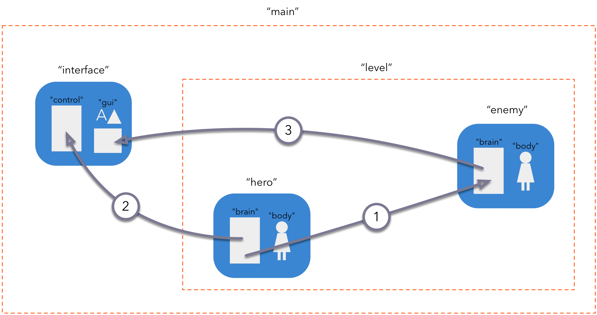

# 메세지 전달

메세지 전달은 Defold 게임 오브젝트(game object)가 서로 통신하는 메커니즘입니다. 이 매뉴얼은 Defold의 [주소 지정 메커니즘](/manuals/addressing)과 [기본 빌딩 블록](/manuals/building-blocks)을 기본적으로 이해하고 있다고 가정합니다.

Defold는 Java, C++, C#처럼 상속과 멤버 함수를 가진 클래스 계층구조를 설정해서 어플리케이션을 정의하는 방식의 객체 지향을 사용하지 않습니다. 대신 Defold는 간단하고 강력한 객체 지향 설계로 Lua를 확장합니다. 이 설계에서는 오브젝트 상태가 스크립트 컴포넌트 내부에 보관되고, `self` 참조를 통해 액세스할 수 있습니다. 또한 오브젝트 간 통신 수단으로 비동기 메세지 전달을 사용하면 오브젝트를 완전히 분리할 수 있습니다.


## 사용 예제

먼저 간단한 사용 예제 몇 가지를 살펴보겠습니다. 다음과 같이 구성된 게임을 만든다고 가정해 봅시다.

1. GUI 컴포넌트가 있는 게임 오브젝트를 포함하는 main 부트스트랩 컬렉션입니다. 이 GUI는 미니맵과 점수 카운터로 구성됩니다. 또한 id가 "level"인 컬렉션도 있습니다.
2. "level"이라는 이름의 컬렉션에는 두 개의 게임 오브젝트가 있습니다. 하나는 영웅 플레이어 캐릭터이고, 하나는 적입니다.



::: sidenote
이 예제의 컨텐츠는 두 개의 별도 파일에 들어 있습니다. main 부트스트랩 컬렉션용 파일 하나와 id가 "level"인 컬렉션용 파일 하나가 있습니다. 하지만 Defold에서 파일 이름은 _중요하지 않습니다_. 중요한 것은 인스턴스에 할당한 식별 정보입니다.
:::

게임에는 오브젝트 간 통신이 필요한 몇 가지 간단한 메커니즘이 있습니다.



① 영웅이 적을 때림
: 이 메커니즘의 일부로, "hero" 스크립트 컴포넌트에서 "enemy" 스크립트 컴포넌트로 `"punch"` 메세지를 보냅니다. 두 오브젝트가 컬렉션 계층구조에서 같은 위치에 있으므로 상대 주소 지정을 선호합니다.

  ```lua
  -- "hero" 스크립트에서 "enemy" 스크립트로 "punch" 보내기
  msg.post("enemy#controller", "punch")
  ```

  이 게임에는 강도가 하나뿐인 펀치 동작만 있으므로 메세지에는 이름인 "punch" 외에 더 많은 정보가 필요하지 않습니다.

  적의 스크립트 컴포넌트에는 메세지를 받을 함수를 만듭니다.

  ```lua
  function on_message(self, message_id, message, sender)
    if message_id == hash("punch") then
      self.health = self.health - 100
    end
  end
  ```

  이 경우 코드는 메세지의 이름만 확인합니다. 이름은 `message_id` 파라미터에서 해쉬된 문자열로 전달됩니다. 이 코드는 메세지 데이터나 발신자를 신경 쓰지 않으므로, "punch" 메세지를 보내는 *누구든지* 불쌍한 적에게 피해를 입힙니다.

② 영웅이 점수를 얻음
: 플레이어가 적을 물리칠 때마다 플레이어 점수가 증가합니다. `"update_score"` 메세지도 "hero" 게임 오브젝트의 스크립트 컴포넌트에서 "interface" 게임 오브젝트의 "gui" 컴포넌트로 전송됩니다.

  ```lua
  -- 적을 물리쳤습니다. 점수 카운터를 100 올립니다.
  self.score = self.score + 100
  msg.post("/interface#gui", "update_score", { score = self.score })
  ```

  이 경우 "interface"는 이름 계층구조의 루트에 있지만 "hero"는 그렇지 않으므로 상대 주소를 쓸 수 없습니다. 메세지는 스크립트가 붙어 있는 GUI 컴포넌트로 전송되며, 따라서 이 컴포넌트는 메세지에 맞게 반응할 수 있습니다. 스크립트, GUI 스크립트, 렌더 스크립트 간에는 메세지를 자유롭게 보낼 수 있습니다.

  `"update_score"` 메세지는 점수 데이터와 결합되어 있습니다. 데이터는 `message` 파라미터에서 Lua 테이블로 전달됩니다.

  ```lua
  function on_message(self, message_id, message, sender)
    if message_id == hash("update_score") then
      -- 점수 카운터를 새 점수로 설정합니다.
      local score_node = gui.get_node("score")
      gui.set_text(score_node, "SCORE: " .. message.score)
    end
  end
  ```

③ 미니맵의 적 위치
: 플레이어는 화면의 미니맵을 사용해 적의 위치를 찾고 추적합니다. 각 적은 "interface" 게임 오브젝트의 "gui" 컴포넌트로 `"update_minimap"` 메세지를 보내 자신의 위치를 알릴 책임이 있습니다.

  ```lua
  -- 현재 위치를 보내 인터페이스 미니맵을 업데이트합니다.
  local pos = go.get_position()
  msg.post("/interface#gui", "update_minimap", { position = pos })
  ```

  GUI 스크립트 코드는 각 적의 위치를 추적해야 하며, 같은 적이 새 위치를 보내면 이전 위치를 대체해야 합니다. 메세지의 발신자(`sender` 파라미터로 전달됨)를 위치를 담은 Lua 테이블의 키로 사용할 수 있습니다.

  ```lua
  function init(self)
    self.minimap_positions = {}
  end

  local function update_minimap(self)
    for url, pos in pairs(self.minimap_positions) do
      -- 맵의 위치를 업데이트합니다.
      ...
    end
  end

  function on_message(self, message_id, message, sender)
    if message_id == hash("update_score") then
      -- 점수 카운터를 새 점수로 설정합니다.
      local score_node = gui.get_node("score")
      gui.set_text(score_node, "SCORE: " .. message.score)
    elseif message_id == hash("update_minimap") then
      -- 새 위치로 미니맵을 업데이트합니다.
      self.minimap_positions[sender] = message.position
      update_minimap(self)
    end
  end
  ```

## 메세지 보내기

위에서 보았듯이 메세지를 보내는 메커니즘은 매우 간단합니다. `msg.post()` 함수를 호출하면 메세지가 메세지 큐에 게시(post)됩니다. 그런 다음 엔진은 매 프레임마다 큐를 순회하면서 각 메세지를 타겟 주소로 전달합니다. 일부 시스템 메세지(`"enable"`, `"disable"`, `"set_parent"` 등)는 엔진 코드가 처리합니다. 엔진은 또한 물리 충돌 시 `"collision_response"` 같은 시스템 메세지를 생성하여 오브젝트에 전달합니다. 스크립트 컴포넌트로 보낸 사용자 메세지의 경우, 엔진은 `on_message()`라는 특수한 Defold Lua 함수를 호출할 뿐입니다.

존재하는 모든 오브젝트나 컴포넌트로 임의의 메세지를 보낼 수 있으며, 메세지에 응답할지는 수신자 쪽 코드에 달려 있습니다. 스크립트 컴포넌트로 메세지를 보냈는데 스크립트 코드가 그 메세지를 무시해도 괜찮습니다. 메세지를 처리할 책임은 전적으로 수신하는 쪽에 있습니다.

엔진은 메세지 타겟 주소를 검사합니다. 알 수 없는 수신자에게 메세지를 보내려고 하면 Defold가 콘솔에 에러를 표시합니다.

```lua
-- 존재하지 않는 오브젝트로 게시를 시도합니다.
msg.post("dont_exist#script", "hello")
```

```txt
ERROR:GAMEOBJECT: Instance '/dont_exists' could not be found when dispatching message 'hello' sent from main:/my_object#script
```

`msg.post()` 호출의 전체 시그니처는 다음과 같습니다.

`msg.post(receiver, message_id, [message])`

receiver
: 타겟 컴포넌트 또는 게임 오브젝트의 id입니다. 게임 오브젝트를 타겟으로 지정하면 메세지가 해당 게임 오브젝트의 모든 컴포넌트에 브로드캐스트된다는 점에 유의하세요.

message_id
: 메세지 이름을 나타내는 문자열 또는 해쉬된 문자열입니다.

[message]
: 메세지 데이터 키-값 쌍을 담은 선택적 Lua 테이블입니다. 거의 모든 타입의 데이터를 메세지 Lua 테이블에 포함할 수 있습니다. 숫자, 문자열, 불리언, URL, 해쉬, 중첩 테이블을 전달할 수 있습니다. 함수는 전달할 수 없습니다.

  ```lua
  -- 중첩 테이블이 포함된 테이블 데이터를 보냅니다.
  local inventory_table = { sword = true, shield = true, bow = true, arrows = 9 }
  local stats = { score = 100, stars = 2, health = 4, inventory = inventory_table }
  msg.post("other_object#script", "set_stats", stats)
  ```

::: sidenote
`message` 파라미터 테이블 크기에는 엄격한 제한이 있습니다. 이 제한은 2킬로바이트로 설정되어 있습니다. 현재는 테이블이 소비하는 정확한 메모리 크기를 알아내는 간단한 방법이 없지만, 테이블에 값을 삽입하기 전후에 `collectgarbage("count")`를 사용하여 메모리 사용량을 모니터링할 수 있습니다.
:::

### 약칭

Defold는 완전한 URL을 지정하지 않고 메세지를 보낼 때 사용할 수 있는 두 가지 편리한 약칭을 제공합니다.

:[Shorthands](../shared/url-shorthands.md)


## 메세지 받기

메세지를 받으려면 타겟 스크립트 컴포넌트에 `on_message()`라는 이름의 함수가 있는지 확인하면 됩니다. 이 함수는 네 개의 파라미터를 받습니다.

`function on_message(self, message_id, message, sender)`

`self`
: 스크립트 컴포넌트 자체에 대한 참조입니다.

`message_id`
: 메세지의 이름을 담습니다. 이 이름은 _해쉬_되어 있습니다.

`message`
: 메세지 데이터를 담습니다. Lua 테이블입니다. 데이터가 없으면 테이블은 비어 있습니다.

`sender`
: 발신자의 전체 URL을 담습니다.

```lua
function on_message(self, message_id, message, sender)
    print(message_id) --> hash: [my_message_name]

    pprint(message) --> {
                    -->   score = 100,
                    -->   value = "some string"
                    --> }

    print(sender) --> url: [main:/my_object#script]
end
```

## 게임 월드 간 메세지 보내기

컬렉션 프록시(Collection proxy) 컴포넌트를 사용해 새 게임 월드를 런타임에 로드하는 경우, 게임 월드 간에 메세지를 주고받고 싶을 것입니다. 프록시를 통해 컬렉션을 로드했고, 그 컬렉션의 *Name* 프로퍼티가 "level"로 설정되어 있다고 가정해 봅시다.


컬렉션이 로드되고, 초기화되고, 활성화되면 수신자 주소의 "socket" 필드에 게임 월드 이름을 지정하여 새 월드의 모든 컴포넌트나 오브젝트로 메세지를 게시할 수 있습니다.

```lua
-- 새 게임 월드의 플레이어에게 메세지를 보냅니다.
msg.post("level:/player#controller", "wake_up")
```
프록시가 동작하는 방식에 대한 더 자세한 설명은 [컬렉션 프록시](/manuals/collection-proxy) 문서에서 찾을 수 있습니다.

## 메세지 체인

게시된 메세지가 결국 디스패치되면 수신자의 `on_message()`가 호출됩니다. 반응 코드에서 새 메세지를 게시하고, 그 메세지들이 메세지 큐에 추가되는 일은 꽤 흔합니다.

엔진이 디스패치를 시작하면 메세지 큐를 순회하면서 각 메세지 수신자의 `on_message()` 함수를 호출하고, 메세지 큐가 빌 때까지 계속합니다. 디스패치 패스가 큐에 새 메세지를 추가하면 엔진은 또 다른 패스를 수행합니다. 하지만 엔진이 큐를 비우려고 시도하는 횟수에는 엄격한 제한이 있으며, 이는 한 프레임 안에서 완전히 디스패치될 수 있는 메세지 체인의 길이에 실질적인 제한을 둡니다. 다음 스크립트를 사용하면 각 `update()` 사이에 엔진이 수행하는 디스패치 패스 수를 쉽게 테스트할 수 있습니다.

```lua
function init(self)
    -- 오브젝트 init 중에 긴 메세지 체인을 시작하고
    -- 여러 update() 단계에 걸쳐 계속 실행합니다.
    print("INIT")
    msg.post("#", "msg")
    self.updates = 0
    self.count = 0
end

function update(self, dt)
    if self.updates < 5 then
        self.updates = self.updates + 1
        print("UPDATE " .. self.updates)
        print(self.count .. " dispatch passes before this update.")
        self.count = 0
    end
end

function on_message(self, message_id, message, sender)
    if message_id == hash("msg") then
        self.count = self.count + 1
        msg.post("#", "msg")
    end
end
```

이 스크립트를 실행하면 다음과 비슷하게 출력됩니다.

```txt
DEBUG:SCRIPT: INIT
INFO:ENGINE: Defold Engine 1.2.36 (5b5af21)
DEBUG:SCRIPT: UPDATE 1
DEBUG:SCRIPT: 10 dispatch passes before this update.
DEBUG:SCRIPT: UPDATE 2
DEBUG:SCRIPT: 75 dispatch passes before this update.
DEBUG:SCRIPT: UPDATE 3
DEBUG:SCRIPT: 75 dispatch passes before this update.
DEBUG:SCRIPT: UPDATE 4
DEBUG:SCRIPT: 75 dispatch passes before this update.
DEBUG:SCRIPT: UPDATE 5
DEBUG:SCRIPT: 75 dispatch passes before this update.
```

이 특정 Defold 엔진 버전은 `init()`과 첫 번째 `update()` 호출 사이에 메세지 큐에서 10번의 디스패치 패스를 수행한다는 것을 알 수 있습니다. 그런 다음 이후 각 update 루프에서는 75번의 패스를 수행합니다.
