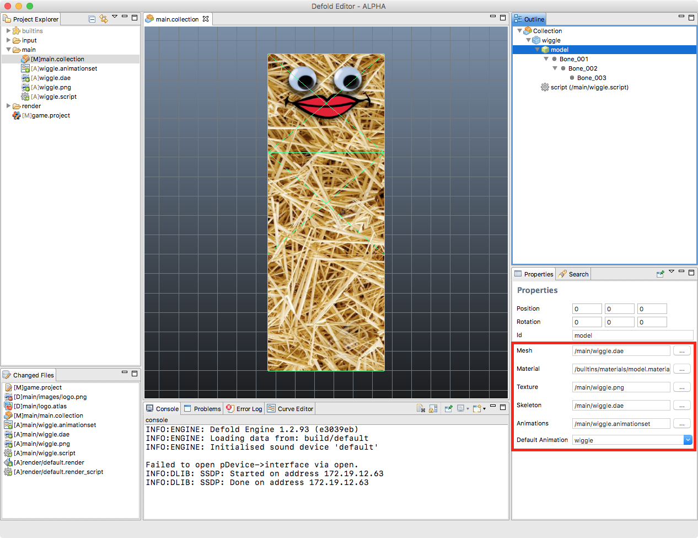

# Model component
Defold는 3D 엔진의 기능을 사용하고 있습니다. 2D 메터리얼을 사용하더라도 모든 렌더링은 3D로 처리되지만 화면에는 직교(orthographic)로 투영되어 2D 처럼 보이게 됩니다. 이 매뉴얼은 어떻게 3D 모델, 스켈레톤, 애니메이션을 게임에 불러오는지 설명합니다.

Defold는 3D 에셋이나 모델을 컬렉션에 포함해서 3D 컨텐츠를 완전하게 활용하는 것이 가능합니다. 3D 에셋만을 사용해서 완전한 3D 게임을 만들 수도 있고 2D 컨텐츠와 섞어서 개발 할 수도 있습니다.

## Creating a model
예제를 봅시다. 우리는 블렌더(Blender)로 간단한 모델을 만들어 UV 매핑 텍스쳐를 입히고 스켈레톤을 만들고 간단한 애니메이션도 만들었습니다. 이제 우리는 이 모델을 Defold로 가져오려 합니다.

> 블렌더(Blender)는 강력하고 유명한 3D 모델링, 애니메이션, 렌더링 프로그램입니다. http://www.blender.org 에서 무료로 다운로드 가능하고 Windows, Max OS X, Linux 에서 동작합니다.

모델이 완료되면 확장자가 **.dae**인 파일을 생성하기 위해 Blender Collada exporter를 선택합니다. 여기서 모델을 구성하는 모든 점(vertex), 선(edge), 면(face) 뿐만아니라 UV좌표(UV coordinate: 텍스쳐 이미지 일부분이 특정 메쉬의 어느 부분으로 매핑되는지), 스켈레톤의 뼈대, 애니메이션 데이터를 포함하는 메쉬(mesh) 파일을 익스포트 할 수 있습니다.

> 폴리곤 메쉬(polygon mesh)에 대한 자세한 설명은 http://en.wikipedia.org/wiki/Polygon_mesh 를 참고 바랍니다. UV좌표(UV coordinates)와 UV매핑(UV mapping)에 대한 설명은 http://en.wikipedia.org/wiki/UV_mapping 를 참고 바랍니다.

이제, 모델을 임포트 하기 위해,  **.dae** 파일과 텍스쳐 이미지를 **Project Explorer**의 원하는 위치로 간단히 드래그-앤-드롭 하면 됩니다.

## Creating a model component
모델 컴포넌트는 다른 게임 오브젝트 컴포넌트와 마찬가지로 아래 두 가지 방법으로 생성할 수 있습니다:

1. **Project Explorer**창에서 마우스 오른쪽 버튼을 누르고 **New > Model File** 선택해서 **Model file** 생성하기
2. **Outline**창에서 게임 오브젝트에 마우스 오른쪽 버튼 누르고 **Add Component** 선택하고 **Model**을 선택해서 게임 오브젝트에 직접 내장(embed)되는 컴포넌트 생성하기

배치된 모델은 몇 가지 속성을 지정할 수 있습니다.

#### Mesh
이 속성은 사용할 메쉬를 포함하는 Collada **.dae** 파일을 참조합니다.
#### Material
이 속성은 텍스쳐를 입힌 3D 오브젝트를 위한 메터리얼을 설정합니다. 기본으로 사용할 수 있는 내장 "model.material" 파일을 제공합니다.
#### Texture
이 속성은 오브젝트에 반영할 텍스쳐 이미지 파일을 지정합니다.
#### Skeleton
이 속성은 애니메이션을 위한 스켈레톤을 포함하는 Collada **.dae** 파일을 참조합니다.
#### Animations
이 속성은 모델에서 사용하려는 애니메이션을 포함하는 **Animation Set File**을 참조합니다.
#### Default Animation
이 속성은 모델에서 자동적으로 플레이 될 기본 애니메이션(Animation Set 으로부터)을 지정합니다.

배치된 모델 컴포넌트를 사용해서 컴포넌트와 캡슐화된 게임 객체를  자유롭게 다루고 편집할 수 있으며, 일반 씬 에디터(**Scene Editor**) 도구를 사용하여 모델을 취향대로 자유롭게 이동(move), 회전(rotate), 확대축소(scale)할 수 있습니다.

