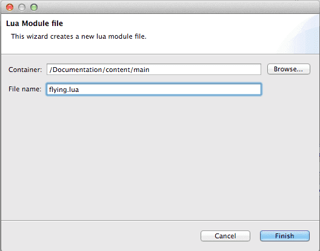

# Modules
Lua 모듈을 사용하면 재사용 가능한 코드를 생성하고 프로젝트를 구조화 할 수 있습니다. 이 메뉴얼은 Defold에서 이를 사용하는 방법에 대해 설명합니다.

이 기능은 일반적으로 프로젝트의 중복을 피하는데 좋은 아이디어입니다. 각기 다른 게임 오브젝트를 동일하게 동작시키기 위해 스크립트 코드를 복사 붙여넣기로 복제 할 수도 있지만, 스크립트 코드를 게임 오브젝트간 공유해서 단일 스크립트 코드를 변경하는 것으로 게임 오브젝트들에게 즉각적으로 영향을 주게 할 수 있습니다.

Defold는 공유 코드를 사용하여 스크립트 파일에 다른 스크립트 파일을 포함할 수 있게 해 줍니다. 또한 Lua 모듈은 GUI 스크립트 파일과 게임 오브젝트의 재사용을 위해 외부 스크립트 파일의 데이터와 기능을 캡슐화 해서 사용할 수도 있습니다.

## Requiring files
우리가 여러 종류의 나비를 특징으로 가진 어플리케이션을 개발중이라고 가정해 봅시다. 우리는 이 나비들의 몇몇 동작을 만들고 이 동작을 공유하려 합니다. 이 작업을 위해서는 우선 게임 오브젝트에 스크립트 파일을 생성하도록 합니다.


"blue_butterfly.script"에 아래 코드를 입력합니다:

```lua
require "modules_example.flying"

function init(self)
        fly_randomly()
end

function on_message(self, message_id, message, sender)
        if message_id == hash("fly_randomly_done") then
                fly_randomly()
        end
end
```

우리는 **fly_randomly()** 를 **init()** 에서 호출해서 나비를 랜덤한 위치로 날아가게 할 생각입니다. 애니메이션이 완료되면, "fly_randomly_done" 메세지를 받아서 또 그 즉시 나비를 새 랜덤 위치로 보냅니다.

첫 번째 줄 "require modules_example.flying"는 "modules_example" 폴더(어플리케이션 로직이 저장된 위치에서)에서 "flying.lua" 스크립트 파일을 읽습니다.

> require 구문에 필요한 파일명의 문법은 조금 특별합니다. Lua는 파일명의 .(쩜) 문자를 경로 구분자(path separators)로 변경합니다. (Mac OS X와 Linux에서 /, Windows에서 \)

"flying.lua"을 생성하려면 프로젝트에 새 Lua Module File을 추가하고 이름을 바꾸면 됩니다.





```lua
-- 원래 위치를 저장해야함
local origin

-- 원본 위치에서 "radius" 거리만큼 랜덤한 위치로 날려보냄
-- 날려 보낸 후 "fly_randomly_done" 메세지를 되돌려 보냄
function fly_randomly(radius)
        -- radius 를 지정하지 않았으면 100으로 셋팅
        radius = radius or 100
        local go_id = go.get_id()
        -- 원래 위치 저장
        if origin == nil then
                origin = go.get_world_position(go_id)
        end

        -- 원래 위치에서 "radius" 까지의 최대 거리의 랜덤 위치 알아내기
        local rand_angle = math.random(0, 3.141592 * 2)
        local rand_radius = math.random(radius)
        local offset = vmath.rotate(vmath.quat_rotation_z(rand_angle),
                                    vmath.vector3(rand_radius, 0, 0))
        local rand_pos = origin + offset
        -- 너무 빠른 애니메이션을 방지하기 위해 radius에 대해 스케일된 랜덤 재생시간(duration)을 셋팅함
        local rand_duration = math.random(radius) / 100 + (radius / 200)
        -- 애니메이션 처리, 완료 후에 메세지를 돌려보냄
        go.animate(".", "position", go.PLAYBACK_ONCE_FORWARD,
                rand_pos, go.EASING_INOUTSINE, rand_duration, 0.0,
                function ()
                        msg.post("#", "fly_randomly_done")
                end)
end
```

이 코드는 아주 잘 동작하며 나비를 원래 위치(origin) 주변으로 랜덤하게 움직이게 합니다. 이제 우리는 노란색 나비의 게임 오브젝트를 컬렉션에 추가해 보도록 합시다.


랜덤하게 날아다니는 코드는 이미 있으므로, 노란색 나비에 아래 스크립트를 추가해 봅시다.

```lua
require "modules_example.flying"

function init(self)
        -- 노란 나비는 더 넓은 비행 반경을 가짐
        fly_randomly(200)
end

function on_message(self, message_id, message, sender)
        if message_id == hash("fly_randomly_done") then
                fly_randomly(200)
        end
end
```

코드를 실행하면 두 나비가 동일한 원점을 기준으로 겹쳐 날아다니기 시작합니다. 여기서 일어나는 일을 이해하려면, Defold가 [Lua contexts](Lua%20in%20Defold)를 관리하는 방법을 다시 살펴보시기 바랍니다.

여기엔 파란색과 노란색 나비에게는 두 게임 오브젝트간 글로벌 데이터를 공유하면서 생긴 부작용이 있었습니다. origin 변수의 정의(definition)부분을 다시 살펴봅시다.

```lua
-- 원래 위치를 저장해야함
local origin
```

"local"로 정의한다는 것은 현재 Lua context의 local 이라는 것을 의미합니다. 모든 게임 오브젝트들이 동일한 Lua context에서 평가(evaluate)된 후, 노란색과 파란색 나비는 완전 동일한 origin 변수를 사용하게 됩니다. 나비 오브젝트 중 하나는 이 origin 변수를 셋팅하고, 다른 나비 오브젝트가 또 이 origin 변수의 같은 값을 사용하게 됩니다.

```lua
        -- "origin"을 동일한 컨텍스트에서 누가 이미 셋팅했다면 또 셋팅할 필요 없음
        if origin == nil then
                origin = go.get_world_position(go_id)
        end
```

우리는 이 버그를 쉽게 해결하는 방법을 곧 살펴볼 예정입니다. 하지만 우선 더 미묘한 문제부터 살펴 보도록 합시다.

## Name spaces
위의 Lua 파일에서, 우리는 데이터를 저장하는데 사용되는 origin 변수를 정의했습니다. 이 변수명은 나중에 문제를 일으킬 수도 있습니다. 예를 들어, 전혀 다른 상황의 "origin" 이라는 이름을 사용하며 다른 종류로 동작하는 나비를 추가해야한다고 가정해 봅시다. 이것은 이름 충돌이 일어나게 됩니다. 이름 충돌을 방지하는 방법 중 하나는 변수나 함수 모두에게 파일명으로 접두어를 붙이는 방법이 있습니다.

```lua
local flying_origin

function flying_fly_randomly(radius)
        ...
```

이 방법은 잘 동작하지만, Lua는 데이터와 스크립트 코드를 구성하는 간단하고 우아한 방법인 모듈(modules)을 제공합니다.

## Modules
Lua 모듈은 동작(behaviours)과 함수(functions)를 위한 컨테이너로 사용하는 Lua 테이블입니다. 여기 "flaying.lua"의 모듈 버전이 있습니다. 여기엔 위에서 다루었던 데이터 공유 문제를 해결하기 위한 수정사항도 포함되어 있습니다.

```lua
-- "M" 테이블에 모듈을 포함시킴
local M = {}

-- 테이블을 원래 위치를 저장하도록 사용함
-- 모듈이 모든 게임 오브젝트의 공유된 Lua context의 일부분이 되므로 origin 변수를 직접적으로 저장할 수 없음, 하나 이상의 GO가 이 모듈을 사용하면 덮어 씌워짐
M.origins = {}

-- 원본 위치에서 "radius" 거리만큼 랜덤한 위치로 날려보냄
-- 날려 보낸 후 "fly_randomly_done" 메세지를 되돌려 보냄
function M.fly_randomly(radius)
        -- radius 를 지정하지 않았으면 100으로 셋팅
        radius = radius or 100
        -- 원래 위치를 인덱싱하는 현재 오브젝트의 id가 필요함
        -- "."을 사용할 수 없음
        local go_id = go.get_id()
        -- 저장된적이 없으면 현재 위치를 origins에 저장함
        if flying.origins[go_id] == nil then
                flying.origins[go_id] = go.get_world_position(go_id)
        end

        -- 원래 위치에서 "radius" 까지의 최대 거리의 랜덤 위치 알아내기
        local rand_angle = math.random(0, 3.141592 * 2)
        local rand_radius = math.random(radius)
        local offset = vmath.rotate(vmath.quat_rotation_z(rand_angle),
                                    vmath.vector3(rand_radius, 0, 0))
        local rand_pos = flying.origins[go_id] + offset
        -- 너무 빠른 애니메이션을 방지하기 위해 radius에 대해 스케일된 랜덤 재생시간(duration)을 셋팅함
        local rand_duration = math.random(radius) / 100 + (radius / 200)
        -- 애니메이션 처리, 완료 후에 메세지를 돌려보냄
        go.animate(".", "position", go.PLAYBACK_ONCE_FORWARD,
                rand_pos, go.EASING_INOUTSINE, rand_duration, 0.0,
                function ()
                        msg.post("#", "fly_randomly_done")
                end)
end

return M
```

이전 스크립트와의 차이점은 데이터(**flying.origins**)와 함수(**flying.fly_randomly()**) 로 채워진 flying 테이블을 생성한 것이 다릅니다. 우리는 이 테이블을 리턴해서 모듈을 완료하고, 이 모듈을 사용하기 위해 나비의 스크립트를 아래처럼 변경하면 됩니다.

```lua
flying = require "modules_example.flying"

function init(self)
        flying.fly_randomly()
end

function on_message(self, message_id, message, sender)
        if message_id == hash("fly_randomly_done") then
                flying.fly_randomly()
        end
end
```

외부 파일을 요청(require)하면, 요청된 스크립트의 리턴값을 변수에 할당합니다.

```lua
flying = require "modules_example.flying"
```

모듈이 데이터와 모듈 코드 전부를 포함한 테이블을 리턴하면 flying 변수를 통해 테이블을 참조할 수 있습니다. 테이블 이름은 임의로 지어도 상관 없으므로 아래와 같이 작성해도 됩니다.

```lua
banana = require "modules_example.flying"

function init(self)
        banana.fly_randomly()
end

function on_message(self, message_id, message, sender)
        if message_id == hash("fly_randomly_done") then
                banana.fly_randomly()
        end
end
```

즉, 동일한 이름을 가진 두 개의 모듈을 사용할 수도 있어서 서로 다른 변수명으로 로컬에 할당하는 것도 가능합니다.

모듈 메커니즘을 사용하여 이제 우리는 이름 충돌을 피하고 공유된 기능을 캡슐화 할 수 있게 되었습니다.

## Best practices

### Naming conventions
모듈 테이블을 정의하는 방법은 여러 가지가 있지만, public 함수나 값이 포함된 테이블의 표준 이름으로 **M** (http://lua-users.org/wiki/ModuleDefinition 참고)을 사용하는 것을 추천합니다. **M** 이름을 사용하는 것은 동일한 이름의 함수로 모듈 테이블을 따라해 버리는 실수 따위를 방지하는데 도움이 됩니다.

```lua
--- 모듈 설명
-- @module foobar
local M = {}

--- bar 상수값 설명
-- @field BAR
local M.BAR = "bar"

local function private_function()
end

-- 모듈이 싱글턴이 아닌 상태(non-singleton)를 유지 해야 하는 경우, 현 상태의 "인스턴스"를 리턴하는 함수를 생성해야 함. 그 다음 이 인스턴스는 모듈 함수로 넘겨짐
-- @foobar의 인스턴스를 리턴
function M.create()
        local foobar = {
                foo = "foo"
        }
        return foobar
end

--- 이 함수에서는 뭔가 작업합니다...
-- @function do_something
-- @param foobar
-- @return foo
function M.do_something(foobar)
        return foobar.foo
end

--- 이 함수에서도 뭔가 작업합니다...
-- @function do_something_else
-- @param foobar
-- @return foobar
function M.do_something_else(foobar)
        return M.do_something(foobar) + M.BAR
end

return M
```

### Allow monkey patching
> "몽키 패치(monkey patch)는 원본 소스 코드를 변경하지 않고 동적 언어의 런타임 코드를 수정하거나 확장하는 한 방법입니다."
— Wikipedia

Lua는 동적 언어이므로 내장된 모듈 전부를 수정하는 것이 가능합니다. 이는 테스트와 디버깅이 주 목적일 경우 대단히 강력하고 유용합니다. 몽키 패치는 강력한 커플링을 쉽게 유도하므로 일반적으로 좋은 생각은 아닙니다. 하지만 새 모듈을 작성하는 경우에는 몽키 패치가 가능하게 커스텀 모듈을 만드는 것이 좋습니다. Lua는 아래와 같이 할 수 있게 해 줍니다.

```lua
-- mymodule.lua
local M = {}

M.foo = function()
  print('이것은 public 모듈 함수이다.')
end

setmetatable(M, {
  __newindex = function(m, t)
    error('유저가 ' .. t .. ' 속성을 모듈에 추가하려고 시도했다!')
  end
})

return M
```

위의 트릭은 좋은 아이디어는 아닙니다. 모듈에 무엇을 사용할지 결정하는 것은 유저에게 맡기는 것이 좋습니다.

### Beware of locals
위에서 언급한 스타일로 모듈을 정의하지 않기로 했다면, local을 사용하는 방법을 조심해야 합니다. 여기 예제가 있습니다. ([kiki.to](http://kiki.to/blog/2014/04/04/rule-3-allow-monkeypatching/) 에서 발췌):

```lua
local M = {}

local function sum(a, b)
    return a + b
end

local function mult(a, b)
    local result = 0
    for i=1,b do
        result = sum(result, a)
    end
    return result
end

M.sum = sum
M.mult = mult

return M
```

이것은 아주 간단한 계산기 모듈입니다. 이 모듈 테이블이 마지막에 어떻게 public 함수들을 할당하는지 잘 살펴보십시오. 또한 local **mult()** 함수가 local **sum()** 함수를 어떻게 사용하는지도 살펴보십시오. 이렇게 하는 것이 조금 빠를 수도 있지만 여기엔 미묘한 문제가 있을 수 있습니다. 만약 우리가 어떤 이유로 아래와 같이 모듈을 몽키 패치(monkey patch) 하려 한다면:

```lua
local summult = require("summult")
summult.sum = function(a,b) return 1 end
print(summult.mult(5,2))
```

이제, 재정의 된 후에도 **summult.mult(5,2)** 는 여전히 10을 리턴(1을 예상했겠지만)합니다. 이 문제는 유저가 모듈 테이블에서 **sum()** 함수를 변경 했지만 **multi()** 내부적으로는 여전히 local과 수정되지 않은 함수를 사용하기 때문입니다.

### global scope를 오염시키지 말고 내부 상태(internal state)를 노출시키거나 새어나오지 않게 하기
이 모범사례는 모듈에만 국한된 것은 아니지만 전역 범위(global scope)에서 상태를 저장하거나 함수를 정의하면 안되는 중요성을 다시 한 번 상기할 가치가 있습니다. 전역 범위에서 상태를 저장하는 명백한 위험성 중 하나는 모듈의 상태가 노출된다는 것이 있으며 다른 위험성으로는 동일한 global 변수를 사용할 때 두 모듈에서 문제가 발생할 수도 있다는 것입니다. Defold는 동일한 컬렉션의 오브젝트 간에만 Lua context를 공유하므로 진정한 의미의 전역 범위(global scope)는 존재하지 않습니다.

개발하는 동안에는 global table을 모니터링 해서 global table이 수정될 때 마다 **error()** 를 발생시키는 것이 좋습니다.

> 자세한 정보는 Lua Wiki 페이지 http://lua-users.org/wiki/DetectingUndefinedVariables 참고

이 코드는 global table을 보호하는데 사용될 수 있습니다.

```lua
-- 새 인덱스로부터 테이블을 보호하기 위한 모듈. 일반적으로 global scope를 보호하는데 사용됨
-- https://gist.github.com/britzl/546d2a7e32a3d75bab45 에서 최신 버전 가져오기
-- @module superstrict
-- @usage
--
--  -- Defold 사용 예제
--  -- gameobject와 gui script의 라이프사이클 함수들을 허용함
--  -- 또한 데스크탑에서 더미 구현을 위해 facebook과 iap 모듈 할당을 허용함
--  -- whitelist가 패턴이 일치하는지를 다루고 이 예제에서 '__' 접두어가 있는 모든 함수 또한 전역 범위(global scope)에서 허용 됨
--  local superstrict = require("superstrict")
--  superstrict.lock(_G, { "go", "gui", "msg", "url", "sys", "render", "factory", "particlefx", "physics", "sound", "sprite", "image", "tilemap", "vmath", "matrix4", "vector3", "vector4", "quat", "hash", "hash_to_hex", "hashmd5", "pprint", "iap", "facebook", "push", "http", "json", "spine", "zlib", "init", "final", "update", "on_input", "on_message", "on_reload", "__*" })
--
--  -- 허용됨
--  __allowed = "abc"
--
--  -- 허용됨
--  facebook = dummy_fb
--
--  -- 허용됨
--  function init(self)
--  end
--
--  -- 에러 발생함
--  if foo == "bar" then
--  end
--
--  -- 에러 발생함
--  function global_function_meant_to_be_local()
--  end
--
local M = {}

-- 테이블과 whitelist 이름을 매핑함
local whitelisted_names = {}

-- 잠겨진 테이블에 허용되지 않는 액세스를 할 필요가 있으므로 누구도 에러 함수로 엉망으로 만들지 않도록 확인할 것
local _error = error


--- 테이블의 키가 whitelist에 있는지 없는지 체크
-- @param t whitelist 이름을 체크하려는 테이블
-- @param n 체크하려는 변수의 이름
-- @return true n이 t의 whitelist에 포함되어 있다면
local function is_whitelisted(t, n)
    for _,whitelisted_name in pairs(whitelisted_names[t] or {}) do
        if n:find(whitelisted_name) then
            return true
        end
    end
    return false
end

--- 보호된 새 인덱스
-- 지정된 이름이 whitelist 테이블에 있는지 체크함.
-- 없으면 에러 발생시킴
-- @param t 새 인덱스가 셋팅된 테이블
-- @param n 테이블에 셋팅된 변수 이름
-- @param v 셋팅된 값
local function lock_newindex(t, n, v)
    if is_whitelisted(t, n) then
        rawset(t, n, v)
        return
    end

    _error("테이블 [" .. tostring(t) .. "] 은 잠겼습니다. '" .. n .. "'에 값을 쓰려고 시도중입니다. 당신은 whitelist에 추가하거나 local로 '" .. n .. "' 을 선언해야 합니다.", 2)
end

--- 보호된 __index
-- 정의되지 않은 값을 읽으려 하면 에러 발생
-- @param t 새 인덱스가 셋팅된 테이블
-- @param n 테이블에 셋팅된 변수 이름
local function lock_index(t, n)
    if is_whitelisted(t, n) then
        return rawget(t, n)
    end

    _error("테이블 [" .. tostring(t) .. "] 은 잠겼습니다. 정의되지 않은 값 '" .. n .. "'을 읽으려 시도중입니다.", 2)
end

--- 테이블 잠그기. 테이블에 새 값(함수 및 변수)이 할당되는 것을 방지함
-- 일반적인 용도로는 global scope를 실수로 할당하지 못하게 lock(_G) 를 호출해 보호하는 것임
-- @param t 잠그려는 테이블
-- @param whitelist 테이블에 허용된 이름의 목록
function M.lock(t, whitelist)
    assert(t, "잠그려면 테이블을 넘겨야 함")
    whitelisted_names[t] = whitelist or {}
    local mt = getmetatable(t) or {}
    mt.__newindex = lock_newindex
    mt.__index = lock_index
    setmetatable(t, mt)
end

---
-- 테이블 언락하기
-- @param t 언락하려는 테이블
function M.unlock(t)
    assert(t, "언락하려면 테이블을 넘겨야 함")
    local mt = getmetatable(t) or {}
    mt.__newindex = rawset
    mt.__index = rawget
    setmetatable(t, mt)
end

return M
```

또한 모듈을 사용자에게 노출하는 대신에 내부 상태를 다룰 수 있는 함수를 제공해야 합니다.  만약 내부 상태를 다루는 함수를 제공하면 모듈의 사용자에게 영향을 미치지 않으면서 모듈의 내부 작업만 리펙토링 하기 쉬워집니다. 상태를 캡슐화 하는 것은 OOP 언어에서 일반적이지만 Lua 모듈 개발에서도 마찬가지로 적용됩니다.

### Stateless or stateful modules?
상태가 있는 모듈(stateful modules)은 내부 상태를 유지하여 모듈의 모든 사용자 간에 공유되는 싱글톤(singleton)과 비교할 수 있습니다.

```lua
local M = {}

-- 모듈의 모든 사용자가 이 테이블을 공유함
local state = {}

function M.do_something(foobar)
    table.insert(state, foobar)
end

return M
```

상태가 없는 모듈(stateless modules)은  어떠한 내부 상태도 유지하지 않습니다. 대신 모듈 사용자에게 local인 개별 테이블로 상태를 노출(externalize )하는 메커니즘을 제공합니다. 상태가 없는 모듈로 접근하는 대부분의 방법으로는 **create()** 혹은 **new()** 같은 모듈 내의 생성자 함수를 호출하는 것에 종종 의존합니다.  생성자 함수는 상태가 저장된 테이블을 리턴하며, 구현에 따라서 때로는 모듈 함수 자체가 되기도 합니다.

### state table만 사용하는 Stateless modules
아마도 가장 쉬운 방법은 상태(state)만을 포함한 새 테이블을 반환하는 생성자 함수를 사용하는 것일 겁니다. 이 상태(state)는 state table을 다루는 모든 함수의 첫 번째 파라메터로 명시적으로 모듈로 보냅니다.

```lua
local M = {}

local function private_function(self, bar)
    return self.public_variable .. bar
end

function M.public_function(self, bar)
    return private_function(self, bar)
end

function M.new(foo)
    local instance = {
        public_variable = foo
    }
    return instance
end

return M
```

아래와 같이 모듈을 사용할 수 있습니다.

```lua
local foobar = require(“foobar”)
local fb = foobar.new(“foo”)
print(fb.public_variable)
print(foobar.public_function(fb, “bar”))
```

### metatables를 사용하는 Stateless modules
> Metatables는 Lua의 강력한 기능입니다. 어떻게 동작하는지 좋은 튜토리얼은 http://nova-fusion.com/2011/06/30/lua-metatables-tutorial/ 에서 찾을 수 있습니다.

또 다른 접근법으로는 호출 때마다 모듈의 public 함수들과 상태를 포함한 새 테이블을 리턴하는 생성자 함수를 사용하는 방법이 있습니다.

```lua
local M = {}

local function private_function(self, bar)
    return self.public_variable .. bar
end

function M:public_function(bar)
    return private_function(self, bar)
end

function M.new(foo)
    local instance = {
        public_variable = foo
    }
    return setmetatable(instance, { __index = M })
end

return M
```

아래 방법으로 이 모듈을 사용할 수 있습니다.

```lua
local foobar = require(“foobar”)
local fb = foobar.new(“foo”)
print(fb.public_variable)
print(fb:public_function(“bar”))
```

> 모듈에서 함수를 정의하고 호출할 때 콜론(:) 연산자를 사용합니다. o:foo(x) 과 같은 표현식은 o.foo(o, x) 의 다른 표현이며, 함수 선언시에는 첫 번째 파라미터로 self가 추가됩니다.

> 더 자세한 내용은 http://www.lua.org/pil/5.html 참고

### Stateless modules using closures
모듈을 정의하는 세 번째 방법으로는 Lua closures(http://www.lua.org/pil/6.1.html 참고)를 사용하는 방법이 있습니다. 함수는 인스턴스를 리턴하고 클로저는 인스턴스와 private, public 데이터와 함수들을 포함하고 있습니다. 여기서는 metatables를 사용할 때 처럼 인자값(명시적으로나 암시적으로나 콜론(:) 연산자를 사용하는)으로 인스턴스를 넘길 필요가 없습니다. 또한 이 방법은 함수 호출이 "__index" metamethods 를 통할 필요가 없으므로 metatables을 사용하는 것 보다 다소 빠릅니다. 한 가지 단점은 각 클로저가 메소드의 복제본을 포함하므로 메모리 소모가 크다는 점입니다. 또 다른 단점은 깔끔한 방법으로 인스턴스 메소드를 몽키 패치(monkey patch)할 수 없다는 점이 있습니다.

```lua
local M = {}

function M.new(foo)
    local instance = {
        public_variable = foo
    }

    local private_variable = ""

    local private_function = function(bar)
        return instance.public_variable .. private_variable .. bar
    end

    instance.public_function = function(bar)
        return private_function(bar)
    end

    return instance
end

return M
```

아래와 같은 방법으로 모듈을 사용하십시오.

```lua
local foobar = require(“foobar”)
local fb = foobar.new(“foo”)
print(fb.public_variable)
print(fb.public_function(“bar”))
```

### 모듈과 모듈 함수는 명확한 목적으로 가지고 예상대로 동작하는 것이 좋습니다.
모듈은 주로 재사용을 단순화 하고 동작을 캡슐화 하기 위해 만들어 졌습니다. 모듈을 작성할 때, 예상한 동작이 모듈, 함수, 인자의 이름이 보이는 대로 간단히 추리할 수 있도록 설계하는 것이 중요합니다.

만약 모듈 계정의 함수 이름이  **login(username, password)** 이라면 특정 유저이름과 비밀번호를 사용하여 계정에 로그인 하는 함수라고 추리하기가 쉽습니다.

### 모듈과 모든 public 함수들을 문서화 하세요.
모듈 또는 함수를 문서화 하면, 함수나 인자 이름으로 추정하기 어려운 정보를 기억해 내기 쉬워집니다. 많은 경우, 짧고 잘 이름지어진 함수나 인자는 모듈이 어떻게 동작하고 무엇을 사용하고 함수 호출로부터 무엇을 기대하는지 예측하기 충분하지만, 문서화로는 반환값, 전제조건, 사용예제를 명시할 수 있습니다. LDoc 표준을 사용하여 문서화를 해보세요.

> 자세한 LDoc 문서 표준은 https://github.com/stevedonovan/LDoc 에서 찾을 수 있습니다.
