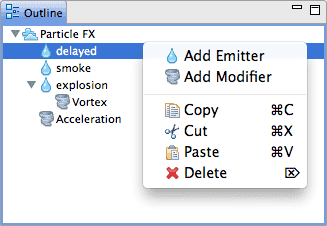
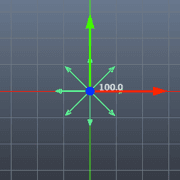
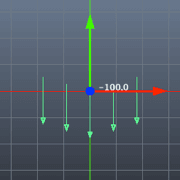

# Particle FX
이 매뉴얼은 파티클FX 컴포넌트가 어떻게 동작하는지, 파티클의 시각적 효과를 어떻게 생성하고 수정하는지 설명합니다.

## ParticleFX Overview Video
파티클 효과를 사용하면 게임의 시각적 매력을 높이는 것이 가능합니다. 아래 비디오에서 Defold의 파티클 효과가 어떻게 동작하는지 참고 바랍니다.

[유튜브 링크: https://youtu.be/qzyB1lXNDKQ
](https://www.youtube.com/watch?v=qzyB1lXNDKQ)

## Concepts
* **ParticleFX** - 파티클 효과를 나타내는 컴포넌트
* **Emitter** - 모양에 따라 일정하게 분포된 파티클 입자를 방출(emit)하는 위치가 지정된 모형(positioned shape)
* **Modifier** - 스폰된 파티클들의 속도(velocity), 가속도(acceleration), 저항(drag), 방사형(radial), 회오리형(vortex)에 영향을 줌
* **Tile source** - 텍스쳐와 플립북 애니메이션을 추가해서 사용됨 ([2D graphics](/manuals/2dgraphics) 문서 참고)

파티클FX 파일을 생성하고 열어보면 Outline창에서 마우스 오른쪽 버튼을 눌러 emiter와 modifier를 추가할 수 있습니다.

## Previewing
파티클 효과를 미리보기 하려면, 씬 에디터를 사용하면 됩니다. [Scene Editing](/manuals/scene-editing) 에서 자세한 설명을 볼 수 있습니다. 스페이스 키를 사용하면 파티클 효과의 미리보기를 시작하고 중지할 수 있습니다. 파티클 효과가 플레이중인지 아닌지와 상관 없이, 실시간으로 조정(tweak)하면서 파티클을 업데이트 할 수 있습니다.

## Value tweaking
숫자로 된 모든 속성들은 alt키를 누른채 마우스 휠(혹은 트랙패드에서 스크롤 제스쳐)을 사용하여 조정할 수 있습니다. alt키를 ctrl키와 같이 눌러 사용하면 10배가 증가된 값으로 조정할 수 있습니다.

## Keying Properties

시간 대에 따라 다른 속성값을 키를 만들어 삽입(keying)할 수 있습니다. 다시 말해, 이들 값은 시간에 따라 변할 수 있다는 것을 의미합니다. 아래에서 이 기능을 가진 속성들을 볼 수 있습니다:

* 키값을 삽입하려면:
    * Properties 창에서 텍스트 필드에 대고 마우스 오른쪽 버튼을 눌러서 Curve를 선택하면 곡선이 추가되고 텍스트 필드의 배경 색상이 녹색으로 바뀝니다.
    * Curve Editor 창(하단의 탭 중에서 사용 가능)으로 가서 곡선을 수정합니다. 점(point)과 탄젠트(tangent)를 클릭 드래그 할 수 있습니다. 더블클릭 하면 점이 추가되고 삭제됩니다. (Curve Editor 창에서 곡선에 마우스 오른쪽 버튼을 눌러도 됩니다.)
* 키 속성(Keyed properties)은 Properties창에서 수정할 수 없습니다. 오직 Curve Editor 창에서만 가능합니다.
* 키 속성을 삭제하려면 해당 텍스트 필드에서 마우스 오른쪽 버튼 눌러 다시 Curve를 선택하면 됩니다.
* F키를 누르면 Curve Editor의 곡선 전체가 보이게끔 크기를 자동으로 맞춥니다(auto-zoom).

### Spread
속성에 두 개의 필드가 있는 경우, 첫번째 필드는 값(value)이고 두번째 필드는 스프레드(Spread)입니다. 값(value)은 당신이 기준으로 지정한 값이고, 스프레드(Spread)는 스폰된 각 파티클에 반영되는 랜덤값의 범위입니다. 예를 들어 값이 50이고 스프레드가 10이면, 스폰된 각 파티클은 50을 기준으로 +/- 10의 값을 가지게 됩니다.

## Reference

### Emitter Properties (방사체 속성들)
* Id - emitter 식별자 (특별한 emitter를 위해 렌더링 상수(render constants)를 설정해야 할 때 사용됨)
* Mode - emitter가 실행기간(duration)에 도달하면 멈출지(once), 재시작할지(loop) 설정함
* Duration - 몇 초 동안 파티클 입자를 방출(emit)할지 설정
* Space - 스폰된 입자들이 존재할 기하학적인 공간. World는 파티클이 게임 월드에 남겨져 emitter와 독립적으로 움직이며, Emitter는 emitter의 위치와 상대적으로 움직임
* Position/rotation - 파티클FX 컴포넌트와 관계된 emitter를 변형(transform)함
* Tile Source - 파티클에 텍스쳐를 입히거나 애니메이션 처리를 위해 타일 소스 파일을 설정함
* Animation - 타일소스의 어떤 애니메이션을 파티클에 사용할지 설정함
* Material - 파티클을 쉐이딩 하는데 필요한 메터리얼을 설정함
* Blend Mode - 블렌딩을 위해 Alpha, Add, Add Alpha, Multiply를 설정함
* Particle Orientation - 파티클이 향하는 방향을 설정함. Default(유닛 방향) 혹은 Initial Direction 설정 가능
* Inherit Velocity - 파티클들이 상속받는 emitter의 속력을 설정함. 이 값은 Space 속성이 World로 셋팅되어 있을 때 사용 가능함. emitter의 속도는 매 프레임 마다 추정(estimate)됨
* Max Particle Count - emitter에서 얼마나 많은 파티클 입자가 동시에 존재하는지 설정
* Type - emitter의 모형(shape)
    * Circle - 2D 원형은 중심점에서 바깥 방향으로 파티클을 방출함. 지름은 Emitter Size X 값으로 설정 가능
    * 2D Cone - 2D 원뿔은 아래쪽 코너에서 원뿔의 윗방향으로 파티클을 방출함. Emitter Size X 값으로 상단의 지름을 설정하고 Y 값으로 높이를 설정함
    * Box - 3D 박스는 로컬 Y 축(axis)을 따라 파티클을 방출함. Emitter Size X, Y, Z 값으로 각각 넓이, 높이, 깊이를 설정함
    * Sphere - 3D 구체는 중심점에서 바깥 방향으로 파티클을 방출함. 지름은 Emitter Size X 값으로 설정 가능
    * Cone - 3D 원뿔은 아래쪽 코너에서 원뿔의 윗방향으로 파티클을 방출함. Emitter Size X 값으로 상단의 지름을 설정하고 Y 값으로 높이를 설정함
* Start Delay - 파티클FX가 시작된 후 emitter가 파티클을 방출하기 전까지 얼마나 대기할지 설정함

### Keyable Emitter Properties (조정 가능한 방사체 속성들)
이들 속성들은 값(value)과 스프레드(spread)라는 2개의 필드를 가지고 있습니다. 이 값들은 emitter의 플레이 시간(duration) 동안 조정할 수 있습니다. 스프레드는 각각 스폰된 파티클 입자들이 랜덤하게 변하는 값의 범위를 어떻게 할 것인지 정의합니다. 스프레드는 현재 값에 합산됩니다.

* Spawn Rate - 초당 얼마나 많은 파티클을 방출할지 설정
* Emitter Size X/Y/Z - emitter 모형(shape)의 크기(dimensions)(위의 설명 참고)
* Particle Life Time - 스폰된 파티클이 얼마나 오래 살아 있는가를 설정
* Initial Speed - 스폰된 파티클에 초반에 얼마나 빨리 움직이는지 설정
* Initial Size - 스폰된 파티클이 초반에 얼마나 큰지 설정
* Initial Red/Green/Blue/Alpha - 파티클들의 컬러 값들을 설정

### Keyable Particle Properties (조정 가능한 파티클 속성들)
이 속성값들은 파티클의 수명에 따라 조정(keying)될 수 있습니다.

* Life Scale - 파티클의 크기를 수명동안 얼마나 확대축소할지 설정
* Life Red/Green/Blue/Alpha - 파티클의 색상을 수명동안 어떻게 색칠(tint)할지 설정

### Modifier Properties (수정자 속성들)
* Position/rotation - 부모와 상대적인(relative) modifier를 변형(transform)
* 종류
    * Acceleration - 위치값이 없는(no position) 가속도의 방향. 중력 같은걸 표현할 때 이 값을 사용함
    * Drag - 입자의 속도에 비례하여 가속을 감속시키는 저항값. 공기 저항이나 유체(fluid) 같은걸 표현 할 때 이 값을 사용함
    * Radial - 방사형(radial)은 중심에서 파티클을 방사하거나 중심으로 끌어 당김. 작은 행성 같은걸 표현할 때 사용함
    * Vortex - 회오리형(vortex)은 중심점 주위에 원형이나 나선형 방향으로 파티클 입자들에 영향을 줌. 블랙홀이나 토네이도 같은걸 표현할 때 사용
* Max Distance - 파티클 입자들이 현재 Modifier에 영향을 받게 되는 최대 거리를 설정함. Radial과 Vortex에서만 설정 가능함.

### Keyable Modifier Properties (조정 가능한 수정자 속성들)
이들 속성들은 값(value)과 스프레드(spread)라는 2개의 필드를 가지고 있습니다. 이 값들은 emitter의 플레이 시간(duration) 동안 조정될 수 있습니다. 스프레드는 각각 스폰된 파티클 입자들이 랜덤하게 변하는 값의 범위를 어떻게 할 것인지 정의합니다. 스프레드는 현재 값에 합산됩니다.

* Magnitude - 수정자가 파티클에 미치는 효과의 양을 설정함

