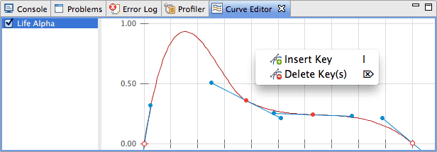

# Particle FX

파티클 효과는 게임의 시각적 표현을 강화하는 데 사용됩니다. 폭발, 핏자국, 궤적, 날씨 또는 그 밖의 어떤 효과든 만들 수 있습니다.


파티클 효과는 여러 emitter와 선택적 modifier로 구성됩니다.

Emitter
: Emitter는 모양 전체에 균등하게 분포된 파티클을 방출하는, 위치가 지정된 모양입니다. Emitter에는 파티클 생성뿐 아니라 개별 파티클의 이미지 또는 애니메이션, 수명, 색상, 모양, 속도를 제어하는 프로퍼티가 포함됩니다.

Modifier
: Modifier는 스폰된 파티클의 속도에 영향을 주어 특정 방향으로 가속하거나 감속하게 만들고, 방사형으로 이동하거나 한 점 주위를 소용돌이치게 만듭니다. Modifier는 단일 emitter의 파티클이나 특정 emitter에 영향을 줄 수 있습니다.

## 효과 만들기

*Assets* 브라우저의 컨텍스트 메뉴에서 <kbd>New... ▸ Particle FX</kbd>를 선택합니다. 새 파티클 효과 파일의 이름을 지정합니다. 이제 에디터가 [Scene Editor](/manuals/editor/#the-scene-editor)를 사용해 파일을 엽니다.

*Outline* 창에는 기본 emitter가 표시됩니다. Emitter를 선택하면 아래 *Properties* 창에 해당 프로퍼티가 나타납니다.


효과에 새 emitter를 추가하려면 *Outline*의 루트를 <kbd>right click</kbd>하고 컨텍스트 메뉴에서 <kbd>Add Emitter ▸ [type]</kbd>을 선택합니다. Emitter 프로퍼티에서 emitter 타입을 변경할 수 있습니다.

새 modifier를 추가하려면 *Outline*에서 modifier를 둘 위치(효과 루트 또는 특정 emitter)를 <kbd>right click</kbd>하고 <kbd>Add Modifier</kbd>를 선택한 다음 modifier 타입을 선택합니다.


효과 루트에 있는 modifier(emitter의 자식이 아닌 modifier)는 효과의 모든 파티클에 영향을 줍니다.

Emitter의 자식으로 추가된 modifier는 해당 emitter에만 영향을 줍니다.

## 효과 미리보기

* 효과를 미리 보려면 메뉴에서 <kbd>View ▸ Play</kbd>를 선택합니다. 효과를 제대로 보려면 카메라를 축소해야 할 수 있습니다.
* 효과를 일시 정지하려면 <kbd>View ▸ Play</kbd>를 다시 선택합니다.
* 효과를 멈추려면 <kbd>View ▸ Stop</kbd>을 선택합니다. 다시 재생하면 초기 상태부터 다시 시작됩니다.

Emitter 또는 modifier를 편집하면 효과가 일시 정지되어 있어도 결과가 에디터에 즉시 표시됩니다.


## Emitter 프로퍼티

Id
: Emitter 식별자입니다(특정 emitter에 렌더 상수를 설정할 때 사용).

Position/Rotation
: ParticleFX 컴포넌트를 기준으로 한 emitter의 변형(transform)입니다.

Play Mode
: Emitter가 재생되는 방식을 제어합니다.
  - `Once`는 duration에 도달하면 emitter를 멈춥니다.
  - `Loop`는 duration에 도달하면 emitter를 다시 시작합니다.

Size Mode
: 플립북 애니메이션의 크기를 정하는 방식을 제어합니다.
  - `Auto`는 각 플립북 애니메이션 프레임의 크기를 원본 이미지와 같게 유지합니다.
  - `Manual`은 size 프로퍼티에 따라 파티클 크기를 설정합니다.

Emission Space
: 스폰된 파티클이 존재할 기하 공간입니다.
  - `World`는 파티클이 emitter와 독립적으로 움직이게 합니다.
  - `Emitter`는 파티클이 emitter를 기준으로 움직이게 합니다.

Duration
: Emitter가 파티클을 방출할 시간(초)입니다.

Start Delay
: Emitter가 파티클 방출을 시작하기 전에 기다릴 시간(초)입니다.

Start Offset
: Emitter가 파티클 시뮬레이션 안에서 시작할 시간(초), 다시 말해 emitter가 효과를 미리 준비(prewarm)할 시간입니다.

Image
: 파티클 텍스쳐링과 애니메이션에 사용할 이미지 파일(Tile source 또는 Atlas)입니다.

Animation
: 파티클에 사용할 *Image* 파일의 애니메이션입니다.

Material
: 파티클 쉐이딩에 사용할 메터리얼입니다.

Blend Mode
: 사용 가능한 블렌드 모드는 `Alpha`, `Add`, `Multiply`입니다.

Max Particle Count
: 이 emitter에서 나온 파티클이 동시에 존재할 수 있는 최대 개수입니다.

Emitter Type
: Emitter의 모양입니다.
  - `Circle`은 원 안의 무작위 위치에서 파티클을 방출합니다. 파티클은 중심에서 바깥쪽으로 향합니다. 원의 지름은 *Emitter Size X*로 정의됩니다.

  - `2D Cone`은 평평한 원뿔(삼각형) 안의 무작위 위치에서 파티클을 방출합니다. 파티클은 원뿔의 위쪽으로 향합니다. *Emitter Size X*는 위쪽 너비를 정의하고 *Y*는 높이를 정의합니다.

  - `Box`는 박스 안의 무작위 위치에서 파티클을 방출합니다. 파티클은 박스의 로컬 Y축을 따라 위쪽으로 향합니다. *Emitter Size X*, *Y*, *Z*는 각각 너비, 높이, 깊이를 정의합니다. 2D 사각형의 경우 Z 크기를 0으로 유지합니다.

  - `Sphere`는 구 안의 무작위 위치에서 파티클을 방출합니다. 파티클은 중심에서 바깥쪽으로 향합니다. 구의 지름은 *Emitter Size X*로 정의됩니다.

  - `Cone`은 3D 원뿔 안의 무작위 위치에서 파티클을 방출합니다. 파티클은 원뿔의 위쪽 원반을 통해 바깥으로 향합니다. *Emitter Size X*는 위쪽 원반의 지름을 정의하고 *Y*는 원뿔의 높이를 정의합니다.

  

Particle Orientation
: 방출된 파티클의 방향을 정하는 방식입니다.
  - `Default`는 방향을 단위 방향으로 설정합니다.
  - `Initial Direction`은 방출된 파티클의 초기 방향을 유지합니다.
  - `Movement Direction`은 파티클의 속도에 따라 방향을 조정합니다.

Inherit Velocity
: 파티클이 emitter의 속도를 얼마나 상속할지 나타내는 스케일 값입니다. 이 값은 *Space*가 `World`로 설정된 경우에만 사용할 수 있습니다. Emitter의 속도는 매 프레임 추정됩니다.

Stretch With Velocity
: 파티클 stretch를 이동 방향에 맞춰 스케일하려면 체크합니다.

### 블렌드 모드
:[blend-modes](../shared/blend-modes.md)

## 키를 지정할 수 있는 Emitter 프로퍼티

이 프로퍼티에는 값과 스프레드라는 두 필드가 있습니다. 스프레드는 스폰된 각 파티클에 무작위로 적용되는 변형값입니다. 예를 들어 값이 50이고 스프레드가 3이면 스폰된 각 파티클은 47에서 53 사이의 값(50 +/- 3)을 갖습니다.


키 버튼을 체크하면 프로퍼티 값이 emitter의 duration 동안 곡선으로 제어됩니다. 키가 지정된 프로퍼티를 초기화하려면 키 버튼의 체크를 해제합니다.


*Curve Editor*(하단 뷰의 탭 중 하나에서 사용 가능)는 곡선을 수정하는 데 사용됩니다. 키가 지정된 프로퍼티는 *Properties* 뷰에서 편집할 수 없고 *Curve Editor*에서만 편집할 수 있습니다. 곡선 모양을 수정하려면 포인트와 탄젠트를 <kbd>Click and drag</kbd>합니다. 제어 포인트를 추가하려면 곡선을 <kbd>Double-click</kbd>합니다. 제어 포인트를 제거하려면 해당 포인트를 <kbd>double click</kbd>합니다.



모든 곡선이 보이도록 Curve Editor를 자동 확대하려면 <kbd>F</kbd>를 누릅니다.

다음 프로퍼티는 emitter의 재생 시간 동안 키를 지정할 수 있습니다.

Spawn Rate
: 초당 방출할 파티클 수입니다.

Emitter Size X/Y/Z
: Emitter 모양의 크기입니다. 위의 *Emitter Type*을 참고하세요.

Particle Life Time
: 스폰된 각 파티클의 수명(초)입니다.

Initial Speed
: 스폰된 각 파티클의 초기 속도입니다.

Initial Size
: 스폰된 각 파티클의 초기 크기입니다. *Size Mode*를 `Automatic`으로 설정하고 이미지 소스로 플립북 애니메이션을 사용하면 이 프로퍼티는 무시됩니다.

Initial Red/Green/Blue/Alpha
: 파티클의 초기 색상 컴포넌트 틴트 값입니다.

Initial Rotation
: 파티클의 초기 회전 값(도)입니다.

Initial Stretch X/Y
: 파티클의 초기 stretch 값(단위)입니다.

Initial Angular Velocity
: 스폰된 각 파티클의 초기 각속도(도/초)입니다.

다음 프로퍼티는 파티클의 수명 동안 키를 지정할 수 있습니다.

Life Scale
: 각 파티클의 수명에 따른 스케일 값입니다.

Life Red/Green/Blue/Alpha
: 각 파티클의 수명에 따른 색상 컴포넌트 틴트 값입니다.

Life Rotation
: 각 파티클의 수명에 따른 회전 값(도)입니다.

Life Stretch X/Y
: 각 파티클의 수명에 따른 stretch 값(단위)입니다.

Life Angular Velocity
: 각 파티클의 수명에 따른 각속도(도/초)입니다.

## Modifier

파티클의 속도에 영향을 주는 네 가지 modifier 타입을 사용할 수 있습니다.

`Acceleration`
: 일반적인 방향의 가속도입니다.

`Drag`
: 파티클 속도에 비례해 파티클의 가속도를 줄입니다.

`Radial`
: 위치를 향해 파티클을 끌어당기거나 위치에서 밀어냅니다.

`Vortex`
: 해당 위치 주위에서 원형 또는 나선형 방향으로 파티클에 영향을 줍니다.

  

## Modifier 프로퍼티

Position/Rotation
: 부모를 기준으로 한 modifier의 변형(transform)입니다.

Magnitude
: Modifier가 파티클에 미치는 효과의 양입니다.

Max Distance
: 이 modifier가 파티클에 영향을 줄 수 있는 최대 거리입니다. Radial과 Vortex에서만 사용됩니다.

## 파티클 효과 제어하기

스크립트에서 파티클 효과를 시작하고 중지하려면 다음과 같이 합니다.

```lua
-- 현재 게임 오브젝트의 "particles" 효과 컴포넌트 시작
particlefx.play("#particles")

-- 현재 게임 오브젝트의 "particles" 효과 컴포넌트 중지
particlefx.stop("#particles")
```

GUI 스크립트에서 파티클 효과를 시작하고 중지하는 방법은 [GUI Particle FX 매뉴얼](/manuals/gui-particlefx#controlling-the-effect)에서 자세히 확인할 수 있습니다.

::: sidenote
파티클 효과 컴포넌트가 속했던 게임 오브젝트가 삭제되어도 파티클 효과는 계속 파티클을 방출합니다.
:::
자세한 내용은 [Particle FX 레퍼런스 문서](/ref/particlefx)를 참고하세요.

## 메터리얼 상수

기본 파티클 효과 메터리얼에는 `particlefx.set_constant()`로 변경하고 `particlefx.reset_constant()`로 초기화할 수 있는 다음 상수가 있습니다([자세한 내용은 메터리얼 매뉴얼 참고](/manuals/material/#vertex-and-fragment-constants)).

`tint`
: 파티클 효과의 색상 틴트(`vector4`)입니다. vector4는 틴트를 나타내는 데 사용되며 x, y, z, w는 각각 빨강, 초록, 파랑, 알파 틴트에 대응합니다. [예제는 API 레퍼런스](/ref/particlefx/#particlefx.set_constant:url-constant-value)를 참고하세요.


## 프로젝트 설정

*game.project* 파일에는 파티클과 관련된 몇 가지 [프로젝트 설정](/manuals/project-settings#particle-fx)이 있습니다.
