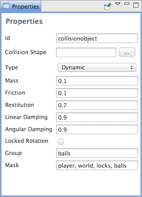

# Physics
Defold는 2D 물리 시뮬레이션을 위해 [Box2D](http://www.box2d.org/) 물리 엔진을 개량한 버전을 포함하고 있으며 뉴턴의 물리 법칙에 따라 다른 종류의 충돌 오브젝트간의 상호작용을 시뮬레이션 합니다. 이 메뉴얼은 물리가 동작하는 방법에 관해 설명합니다.

## Collision objects
충돌 오브젝트는 물리 동작으로 게임 오브젝트를 확장하는데 사용되는 컴포넌트입니다. 충돌 오브젝트는 서로 다른 물리 속성(무게, 반발력, 마찰력 같은)을 가지고 있으며, 한 개 혹은 그 이상의 모형(shape) 컴포넌트를 첨부해서 공간 확장을 할 수 있습니다. Defold는 여러 종류의 충돌 오브젝트를 지원하고 있습니다:


#### Static objects
정적 객체는 스스로 반응하지는 않지만 다른 오브젝트가 충돌하게 되면 반응합니다. 이는 움직이지 않는 건축물 같은 지형(바닥, 벽 등등)에 유용합니다(성능상 이득임). 정적 오브젝트는 움직이거나 변경할 수 없습니다.

#### Dynamic objects
물리 엔진은 모든 충돌(collision)을 해결하고 힘(forces)의 결과를 반영합니다. 이는 현실적으로 움직여야 하는 오브젝트에 유용합니다. 수동으로 제어할 수 있는 유일한 방법은 이 동적 오브젝트에 힘을 가하는 것 뿐입니다.

#### Kinematic objects
이 타입은 다른 물리 오브젝트와 충돌하지만 충돌을 해결하는 작업을 직접 처리(아니면 그냥 무시하거나)해야 합니다. 키네마틱 오브젝트는 충돌이 발생하면서 모든 리액션을 직접 세밀하게 제어하는 것을 원하는 경우에 유용합니다.

#### Triggers
트리거는 간단한 충돌을 등록하는 오브젝트입니다. 이는 어떤 오브젝트(플레이어 캐릭터 같은)가 특정한 지점에 도달했을 때 발생하는 이벤트가 필요한 게임로직에 유용합니다.

## Editing collision objects
에디터는 충돌 오브젝트를 게임 오브젝트에 쉽게 배치할 수 있게 해 줍니다.


충돌 오브젝트는 하나 혹은 그 이상의 물리 모형(physics shapes)으로 구성됩니다.

* Box shapes
* Sphere shapes
* Capsule shapes (3D 물리에서만 동작함!)

당신은 위의 모형(shape)을 추가하고 변형 도구(transform tool)을 사용하여 스케일, 회전, 포지션을 수정할 수 있습니다. 각 충돌 오브젝트는 아래와 같은 속성들을 가집니다.



"Collision Shape" 속성은 일반 원시 모형(primitive shape)을 사용하지 않는 타일맵의 지형(geometry)을 사용합니다. 자세한 것은 [Tilesource collision shapes](#tilesource-collision-shapes) 에서 살펴 보도록 하겠습니다.

**Type** 속성은 충돌 오브젝트의 종류("Dynamic", "Kinematic", "Static", "Trigger")를 설정하는데 사용됩니다. "Dynamic"으로 설정하면 **Mass**(질량) 속성을 0이 아닌 값으로 설정해야 합니다. 또한 동적(Dynamic) 혹은 정적(Static) 오브젝트를 위해서는 **Friction**(마찰력) 과 **Restitution**(반발력) 값을 설정 해야 합니다.

> 만약 "Dynamic"  타입으로 설정하고 mass를 0이 아닌 값으로 셋팅하는 것을 깜빡 한다면 컴파일시 에러가 발생합니다: **"ERROR: GAMESYS: Invalid mass 0.000000 for shape type 0"**

## Friction
마찰력은 오브젝트가 다른 오브젝트과 붙어서 현실감 있게 미끄러지게 만드는 것을 가능하게 합니다. 이 값은 일반적으로 0(마찰력이 전혀없으므로 엄청 미끌거림)과 1(강력한 마찰력으로 엄청 거칠어짐) 사이로 설정되며 양수 값(positive value)만 유효합니다.

마찰력의 강도는 수직항력(normal force: 쿨롱 마찰(Coulomb friction)으로도 불림)에 비례합니다. 마찰력이 두 모형(shapes) 사이에서 계산되면, 두 오브젝트의 마찰값이 기하평균(geometric mean)에 의해 결합됩니다.

```lua
combined_friction = math.sqrt(shape1_friction * shape2_friction)
```

즉, 두 오브젝트 중 하나라도 마찰이 없는 경우에 이들 사이의 접촉면은 마찰이 없는 것으로 계산됩니다.

## Restitution
반발력 값은 오브젝트의 탄성(bounciness)을 설정합니다. 이 값은 일반적으로 0(비탄성 충돌로서 오브젝트가 전혀 튕기지 않음)에서 1(완전한 탄성 충돌로서 오브젝트의 속도와 같은 값으로 튕겨나감) 사이로 설정 됩니다.

두 오브젝트 사이의 반발력은 아래 공식으로 결합됩니다.

```lua
combined_restitution = math.max(shape1_restitution, shape2_restitution)
```

> 모형(shape)이 여러 개의 접촉면(multiple contacts)으로 개발 되었다면, Box2D가 iterative solver(반복적으로 물리 충돌을 해결하는 해결사)를 사용하기 때문에 반발력은 대략적으로 시뮬레이션 됩니다. 또한 Box2D는 충돌 속도가 너무 작을 때에는 비탄성 충돌(inelastic collisions)을 사용하여 bounce-jitter(바운스시에 덜덜 떨리는 현상)를 방지합니다.

## Linear and angular damping
감쇠(damping)는 몸체의 선형(linear) 속도와 각형(angular) 속도를 감소 시킵니다. 이는 접촉면에서만 발생하는 마찰력과는 다르며, 공기보다 무거운 공간을 지나가듯이 떠다니는 것을 표현하는데 사용됩니다. 유효한 값은 0부터 1까지의 값입니다.

Box2D는 안정성과 성능때문에 감쇠값을 대략적으로 계산합니다. 작은 값의 감쇠 효과는 시간 흐름에 영향을 받지 않는 반면, 큰 감쇠 값은 시간 흐름에 따라 달라집니다. 만약 고정된 시간 간격(fixed time step)으로 게임을 실행한다면, 이것은 문제가 되지 않습니다.

## Locked rotation
이 속성을 설명하면 어떤 영향을 미치는지와 관계 없이 충돌 오브젝트의 회전을 완전히 비활성화 합니다.

## Group and Mask
이 기능은 특정 유형의 오브젝트가 다른 특정 유형의 오브젝트와 충돌하면서 또 다른 제3의 오브젝트와는 충돌하지 않게 필터링하는데 유용합니다. 예를 들어, 아래와 같이 멀티플레이어 슈팅 게임에서 필요할 수 있습니다.

1. 플레이어 캐릭터가 총알 오브젝트를 발사함
2. 총알 오브젝트는 적 오브젝트와 충돌 해야함
3. 총알 오브젝트는 플레이어 캐릭터와는 충돌하지 말아야 함
4. 플레이어 캐릭터는 적 오브젝트와 충돌 해야함
5. 플레이어와 적 오브젝트들은 게임세상의 타일(tile)에는 충돌함

물리 엔진은 물리 오브젝트를 그룹화 하고 어떻게 충돌해야 하는지에 대해 필터링 할 수 있게 해 줍니다. 이는 충돌 그룹(collision group)의 이름으로 다룰 수 있습니다. 아래 두 가지 속성은 어떻게 오브젝트가 다른 오브젝트와 충돌하는지를 제어합니다.

#### Group
오브젝트가 속해야 하는 충돌 그룹의 이름입니다. 16개의 다른 그룹을 가질 수 있으며 당신의 게임에 어울리는 이름(예를 들어 "players", "bullets", "enemies", "world" 등등)으로 지으면 됩니다.

#### Mask
이 오브젝트가 충돌해야 하는 다른 그룹의 이름입니다. 그룹 하나의 이름을 지정하거나 쉼표(,)로 여러 그룹의 이름을 지정해도 됩니다. 만약 이 Mask 필드가 빈값으로 되어 있다면, 오브젝트는 아무것도 충돌하지 않습니다.

> 각 충돌은 두 개의 오브젝트와 관련되어 있으므로, 두 오브젝트 상호간에 Group의 이름을 Mask 필드에 서로 지정해야 합니다.


위의 샘플 슈팅게임의 충돌 계획을 달성하려면, 아래와 같이 설정하면 됩니다.

#### Players
Group: "players", Mask: "world, enemies"
#### Bullet
Group: "bullets", Mask: "enemies"
#### Enemies
Group: "enemies", Mask: "players, bullets"
#### World
Group: "world", Mask: "players, enemies"

## Tilesource collision shapes
Defold 에디터에는 타일 소스를 위한 물리 모양(shape)을 빠르게 생성하는 도구가 있습니다. 타일소스 에디터에서, 충돌을 위해 기초로 사용할 이미지를 선택하기만 하면 됩니다. 이 에디터는 100%로 투명하지 않은 픽셀을 고려하여, 각 타일 주변으로 볼록한 모형(convex shape)을 자동으로 생성합니다.


이 에디터는 타일에 할당된 충돌 그룹의 색상으로 이 모형(shape)들을 그려줍니다. 타일 소스당 여러 개의 충돌 그룹을 가질 수 있으며 에디터에 의해 그룹 색상이 자동으로 선택됩니다.


타일 물리 모양(tile physics shape)을 특정한 충돌 그룹으로 설정하고 싶다면, group을 선택하고 shape을 클릭하세요. 이들 충돌 그룹으로부터 타일 모형(tile shape)을 삭제하려면, "Tile source"의 최상위(root)를 선택하고 타일을 클릭하세요.

타일 소스로부터 충돌 모형(collision shape)을 사용하려면, 원하는 게임 오브젝트에 충돌 오브젝트(Collision Object)를 만들고 Collision Shape 속성에 타일 소스를 선택하면 됩니다.


1. 타일 맵에 연결된 타일소스가 충돌을 위해 설정된 이미지를 가지고 있는지 확인하세요. 이는 에디터 창에서 텍스쳐의 상단에 선으로 렌더링 되어야 합니다.
2. 충돌을 지원하는 타일들에 대하여 타일 소스의 충돌 그룹이 색칠 되었는지 확인하세요.
3. 추가한 충돌 오브젝트 컴포넌트의 타입을 Static으로 설정하세요.
4. Group과 Mask 속성을 설정하세요.
5. 타일을 사용하여 충돌시키려는 충돌 오브젝트의 Group과 Mask 속성값을 확인하세요.

## Collision messages
두 오브젝트가 충돌하면, 엔진은 두 오브젝트의 컴포넌트 모두에게 메세지를 브로드캐스트 합니다.

### collision_response
이 메세지는 모든 충돌 오브젝트에 대해 전송되며 아래의 필드를 설정합니다.

#### other_id
충돌 오브젝트가 충돌한 상대 인스턴스의 아이디 (hash)
#### other_position
충돌 오브젝트가 충돌한 상대 인스턴스의 월드 좌표 (vector3)
#### group
상대 충돌 오브젝트의 충돌 그룹 (hash)

collision_response 메세지는 오브젝트의 실제 교차구간(intersection)에 대해 자세한 정보가 필요 없는 충돌을 해결하는데 적합합니다. 예를 들어 총알이 적을 맞췄음을 감지하려는 경우가 있습니다. 각 프레임마다 충돌하는 오브젝트 쌍(pair)을 위해 메세지 중 하나만 전송됩니다.

### contact_point_response
이 메세지는 충돌하는 오브젝트 중 하나가 Dynamic 이거나 Kinematic일 경우 전송되며 아래의 필드를 설정합니다.

#### position
충돌 지점(contact point)의 월드 포지션 (vector3)
#### normal
상대 오브젝트에서 현재 오브젝트를 향한 충돌 지점(contact point)의 월드 공간(world space)에서의 법선 (vector3)
#### relative_velocity
상대 오브젝트에서 관찰된 충돌 오브젝트의 상대속도 (vector3)
#### distance
오브젝트간의 거리(양수(+)로 된 number)
#### applied_impulse
접촉이 일으킨 충격량 (number)
#### life_time
접촉의 수명 (현재 사용되지 않음!) (number)
#### mass
현재 충돌 오브젝트의 kg 질량 (number)
#### other_mass
상대 충돌 오브젝트의 kg 질량 (number)
#### other_id
상대 충돌 오브젝트의 인스턴스 아이디 (hash)
#### other_position
상대 충돌 오브젝트의 월드좌표 (vector3)
#### group
상대 충돌 오브젝트의 충돌 그룹 (hash)

오브젝트를 완벽하게 분리해야하는 게임의 경우, contact_point_response 메세지는 필요한 모든 정보를 제공합니다. 하지만 충돌 쌍(collision pair)이 주어지므로, 프레임 마다 다수의 contact_point_response 메세지가 수신될 수 있습니다.

## Triggers
트리거는 가벼운 충돌 오브젝트입니다. 트리거와 충돌하면 collision_response 메세지가 전송됩니다. 게다가 트리거는 충돌이 시작(begin)되었거나 끝(end)났을 경우 특별한 trigger_response 또한 전송합니다. 이 메세지에는 아래 필드가 있습니다.

#### other_id
충돌 오브젝트가 충돌한 인스턴스의 아이디 (hash)
#### enter
상호작용을 시작했다면 true, 상호작용을 끝냈다면 false.

## Resolving Kinematic collisions
키네마틱 충돌 오브젝트를 사용하면 충돌을 스스로 해결하고 침투된 오브젝트를 움직여야 합니다. 오브젝트의 분리를 대충 구현하자면 아래와 같습니다.

```lua
function on_message(self, message_id, message, sender)
  -- 충돌 다루기
  if message_id == hash("contact_point_response") then
    local newpos = go.get_position() + message.normal * message.distance
    go.set_position(newpos)
  end
end
```

이 코드는 상대 물리 오브젝트가 키네마틱 오브젝트를 뚫고 들어왔을 경우 서로 떼어놓는 처리를 하지만, 이는 많은 경우에 너무 나가거나(overshoots) 흔들려(jitter) 보이게 됩니다. 키네마틱 오브젝트를 충돌로부터 적절하게 처리하려면 아래와 같은 상황을 고려해야 합니다.


여기서 우리는 Object A와 Object B, 두 개의 contact point 메세지를 얻을 것입니다. 위의 단순한 분리 과정을 실행하면, 침투 벡터(penetration vectors)가 각각 추가되어, 아래 처럼 분리될 것입니다.


대신, 우리는 접촉 지점(contact point)을 반복하면서 이미 이전 분리(previous separation)가 완전히 혹은 부분적으로 해결되었는지 확인해야 합니다. 위의 충돌 예제에서는 Object A 에서부터 Character Collision Shape의 분리작업을 시작합니다.


우리는 Object A의 법선을 따라서 캐릭터 오브젝트를 침투거리(위에서 붉은색 점선 화살표)만큼 이동시킵니다. Object B의 법선을 따라 우리가 수행해야 하는 마지막 움직임이 이미 첫번째로 분리된 Object A에 대하여 부분적으로 겹쳐진 것을 쉽게 알 수 있습니다. 우리는 원래의 화살표(녹색 점선) 대신에 녹색으로 채워진 화살표의 벡터를 따라 분리작업을 하기만 하면 됩니다.

Object B에서 이전 움직임(previous movement)의 거리를 계산하는 것은 간단합니다.


이 거리는 Object B에 대한 Object A의 침투벡터를 투영하여 계산할 수 있습니다. 마지막 이동(movement)을 찾으려면 그저 원래의 침투 백터에서 l을 빼면(subtract) 됩니다. 임의의 침투 수가 있다면, 벡터로 실제 이동값들을 합산하고 각 침투벡터에 대하여 차례대로 투영하면 됩니다.  전체 구현은 아래와 같습니다.

```lua
function on_message(self, message_id, message, sender)
    -- 충돌 다루기
    if message_id == hash("contact_point_response") then
        -- 충돌에서 벗어나는데 필요한 정보 얻기
        -- 여러번 충돌지점을 되돌리면서, 누적해가며 이동하는 방법으로 계산 해야함
        if message.distance > 0 then
            -- 우선 누적된 보정값에 침투 벡터를 투영합니다.
            local proj = vmath.project(self.correction, message.normal * message.distance)
            if proj < 1 then
                -- 넘어가버리지 않도록 투사(projections)에 신경 쓸것
                local comp = (message.distance - message.distance * proj) * message.normal
                -- 보상(compensation) 반영하기
                go.set_position(go.get_position() + comp)
                -- 보정값을 누적합산하기
                self.correction = self.correction + comp
            end
        end
    end
end
```

## Best practices

### Triggers
트리거 충돌 오브젝트는 제한적인게 많습니다. 만약 플레이어가 트리거로 이동했을 때 충돌의 강약과 비례하는 크기 만큼의 소리가 나야 한다고 가정해 봅시다. 이를 위해서는 트리거에 침투한 거리(penetration distance)를 알아내야 합니다.  여기서, 일반 트리거 충돌 오브젝트로는 이를 처리할 수 없으므로, 키네마틱 오브젝트를 대신 사용하여 충돌 데이터의 침투거리만 사용하고 충돌을 위한 분리(separation of collisions)는 처리하지 않으면 됩니다.

> 키네마틱 오브젝트는 트리거에 비해 성능 비용이 많이 들기 때문에 현명하게 사용해야 합니다.

### Choosing between Dynamic or Kinematic objects
플레이어 캐릭터가 레벨을 따라 움직이는 플랫포머류의 게임을 만든다고 가정해 봅시다. 여기서 플레이어 캐릭터를 Dynamic 물리 오브젝트로, 월드객체를 Static 물리 오브젝트로 만드는것이 일단 좋은 생각인 것 처럼 느껴집니다. 그리고 키 입력을 하면 플레이어 오브젝트에 다양한 물리적 힘을 가하는 것으로 움직임을 처리할 수 있습니다.

이렇게 개발하다 보면 구현 자체는 가능하지만 멋진 결과물을 만들어 내기는 매우 어렵습니다. 게임의 제어가 동일한 물리엔진에서 동일한 방법으로 처리되므로 다른 수천가지 게임들과 다를 바 없게 느껴질 수도 있기 때문입니다. 이 문제는 Box2D 물리 시뮬레이션이 현실같은 뉴턴의 법칙을 따른 반면, 플랫포머 게임의 물리 법칙은 근본적으로 조금 다르기 때문에 벌어집니다. 뉴턴 방식의 물리 시뮬레이션을 비 뉴턴 방식으로 만들려면 많은 노력이 필요합니다.

여러 문제 중 하나를 예를 들면, 가장자리(edges)에서 발생하는 문제가 있는데, 플레이어가 플랫폼 가장자리에 걸쳐지면 현실의 상자처럼 모서리에 걸쳐 기울어 지게 됩니다.


이 문제는 캐릭터 충돌 오브젝트의 "Locked Rotation" 속성을 설정해서 해결할 수 있습니다. 그러나 이 문제의 핵심은 이 제한적인 물리 시뮬레이션을 넘어 직접 통제하려면 디자이너나 프로그래머의 힘을 빌어 캐릭터를 움직이는 것이 낫다는 것입니다.

그러므로 플레이어 캐릭터를 키네마틱 물리 오브젝트로 구현하는것을 강력히 추천드립니다. 물리 엔진은 충돌을 감지하고 처리하고 충돌한 오브젝트들을 분리하는데 필요한 만큼만 사용하십시오. 이러한 접근 방식은 초반엔 많은 작업이 필요하지만, 나중에는 플레이어의 경험을 뭔가 더 멋지고 개성있게 튜닝할 수 있습니다.

(그래픽 에셋 일부는 Kenney: http://kenney.nl/assets 가 제작했습니다.)
