# 프로퍼티 애니메이션

모든 숫자형 프로퍼티(`numbers`, `vector3`, `vector4` 및 쿼터니언)와 쉐이더 상수는 내장 애니메이션 시스템에서 `go.animate()` 함수를 사용해 애니메이션할 수 있습니다. 엔진은 지정한 재생 모드와 easing 함수에 따라 프로퍼티를 자동으로 "tween"합니다. 커스텀 easing 함수도 지정할 수 있습니다.

  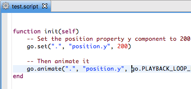
  

## 프로퍼티 애니메이션

게임 오브젝트 또는 컴포넌트 프로퍼티를 애니메이션하려면 `go.animate()` 함수를 사용합니다. GUI 노드 프로퍼티에 대응하는 함수는 `gui.animate()`입니다.

```lua
-- position 프로퍼티의 y 컴포넌트를 200으로 설정합니다
go.set(".", "position.y", 200)
-- 그런 다음 애니메이션합니다
go.animate(".", "position.y", go.PLAYBACK_LOOP_PINGPONG, 100, go.EASING_OUTBOUNCE, 2)
```

지정한 프로퍼티의 모든 애니메이션을 중지하려면 `go.cancel_animations()`를 호출하고, GUI 노드에서는 `gui.cancel_animations()`를 호출합니다:

```lua
-- 현재 게임 오브젝트의 euler z 회전 애니메이션을 중지합니다
go.cancel_animations(".", "euler.z")
```

`position` 같은 복합 프로퍼티의 애니메이션을 취소하면 하위 컴포넌트(`position.x`, `position.y` 및 `position.z`)의 모든 애니메이션도 함께 취소됩니다.

[프로퍼티 매뉴얼](/manuals/properties)에는 게임 오브젝트, 컴포넌트, GUI 노드에서 사용할 수 있는 모든 프로퍼티가 포함되어 있습니다.

## GUI 노드 프로퍼티 애니메이션

거의 모든 GUI 노드 프로퍼티를 애니메이션할 수 있습니다. 예를 들어 노드의 `color` 프로퍼티를 완전 투명으로 설정해 보이지 않게 만든 다음, 색상을 흰색(즉, 색조 없음)으로 애니메이션하여 서서히 나타나게 할 수 있습니다.

```lua
local node = gui.get_node("button")
local color = gui.get_color(node)
-- 색상을 흰색으로 애니메이션합니다
gui.animate(node, gui.PROP_COLOR, vmath.vector4(1, 1, 1, 1), gui.EASING_INOUTQUAD, 0.5)
-- outline의 빨간색 색상 컴포넌트를 애니메이션합니다
gui.animate(node, "outline.x", 1, gui.EASING_INOUTQUAD, 0.5)
-- 그리고 x 위치 100으로 이동합니다
gui.animate(node, hash("position.x"), 100, gui.EASING_INOUTQUAD, 0.5)
```

## 완료 콜백

프로퍼티 애니메이션 함수 `go.animate()` 및 `gui.animate()`는 마지막 인자로 선택적 Lua 콜백 함수를 지원합니다. 이 함수는 애니메이션이 끝까지 재생되면 호출됩니다. 루프 애니메이션에서는 호출되지 않으며, `go.cancel_animations()` 또는 `gui.cancel_animations()`로 애니메이션을 수동 취소한 경우에도 호출되지 않습니다. 콜백은 애니메이션 완료 시 이벤트를 트리거하거나 여러 애니메이션을 이어서 재생하는 데 사용할 수 있습니다.

## Easing

Easing은 애니메이션되는 값이 시간에 따라 어떻게 변하는지 정의합니다. 아래 이미지는 easing을 만들기 위해 시간에 따라 적용되는 함수들을 보여 줍니다.

다음은 `go.animate()`에 유효한 easing 값입니다:

|---|---|
| `go.EASING_LINEAR` | |
| `go.EASING_INBACK` | `go.EASING_OUTBACK` |
| `go.EASING_INOUTBACK` | `go.EASING_OUTINBACK` |
| `go.EASING_INBOUNCE` | `go.EASING_OUTBOUNCE` |
| `go.EASING_INOUTBOUNCE` | `go.EASING_OUTINBOUNCE` |
| `go.EASING_INELASTIC` | `go.EASING_OUTELASTIC` |
| `go.EASING_INOUTELASTIC` | `go.EASING_OUTINELASTIC` |
| `go.EASING_INSINE` | `go.EASING_OUTSINE` |
| `go.EASING_INOUTSINE` | `go.EASING_OUTINSINE` |
| `go.EASING_INEXPO` | `go.EASING_OUTEXPO` |
| `go.EASING_INOUTEXPO` | `go.EASING_OUTINEXPO` |
| `go.EASING_INCIRC` | `go.EASING_OUTCIRC` |
| `go.EASING_INOUTCIRC` | `go.EASING_OUTINCIRC` |
| `go.EASING_INQUAD` | `go.EASING_OUTQUAD` |
| `go.EASING_INOUTQUAD` | `go.EASING_OUTINQUAD` |
| `go.EASING_INCUBIC` | `go.EASING_OUTCUBIC` |
| `go.EASING_INOUTCUBIC` | `go.EASING_OUTINCUBIC` |
| `go.EASING_INQUART` | `go.EASING_OUTQUART` |
| `go.EASING_INOUTQUART` | `go.EASING_OUTINQUART` |
| `go.EASING_INQUINT` | `go.EASING_OUTQUINT` |
| `go.EASING_INOUTQUINT` | `go.EASING_OUTINQUINT` |

다음은 `gui.animate()`에 유효한 easing 값입니다:

|---|---|
| `gui.EASING_LINEAR` | |
| `gui.EASING_INBACK` | `gui.EASING_OUTBACK` |
| `gui.EASING_INOUTBACK` | `gui.EASING_OUTINBACK` |
| `gui.EASING_INBOUNCE` | `gui.EASING_OUTBOUNCE` |
| `gui.EASING_INOUTBOUNCE` | `gui.EASING_OUTINBOUNCE` |
| `gui.EASING_INELASTIC` | `gui.EASING_OUTELASTIC` |
| `gui.EASING_INOUTELASTIC` | `gui.EASING_OUTINELASTIC` |
| `gui.EASING_INSINE` | `gui.EASING_OUTSINE` |
| `gui.EASING_INOUTSINE` | `gui.EASING_OUTINSINE` |
| `gui.EASING_INEXPO` | `gui.EASING_OUTEXPO` |
| `gui.EASING_INOUTEXPO` | `gui.EASING_OUTINEXPO` |
| `gui.EASING_INCIRC` | `gui.EASING_OUTCIRC` |
| `gui.EASING_INOUTCIRC` | `gui.EASING_OUTINCIRC` |
| `gui.EASING_INQUAD` | `gui.EASING_OUTQUAD` |
| `gui.EASING_INOUTQUAD` | `gui.EASING_OUTINQUAD` |
| `gui.EASING_INCUBIC` | `gui.EASING_OUTCUBIC` |
| `gui.EASING_INOUTCUBIC` | `gui.EASING_OUTINCUBIC` |
| `gui.EASING_INQUART` | `gui.EASING_OUTQUART` |
| `gui.EASING_INOUTQUART` | `gui.EASING_OUTINQUART` |
| `gui.EASING_INQUINT` | `gui.EASING_OUTQUINT` |
| `gui.EASING_INOUTQUINT` | `gui.EASING_OUTINQUINT` |

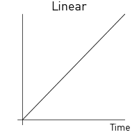

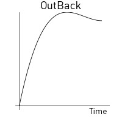


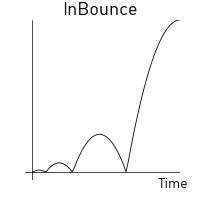
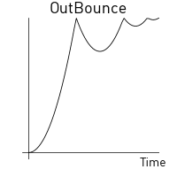

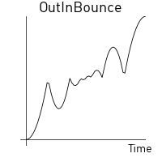
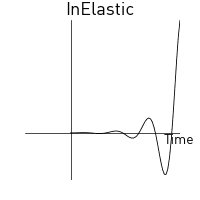
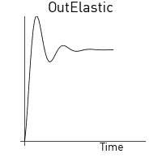
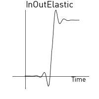
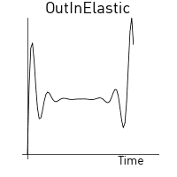
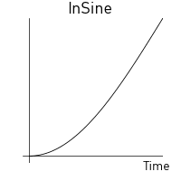


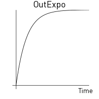
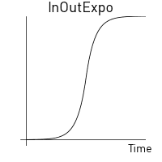

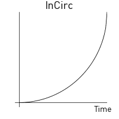
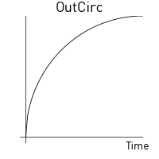
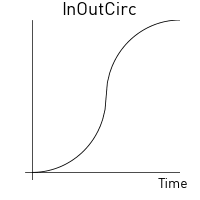


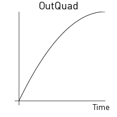

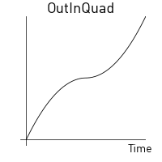


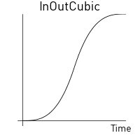


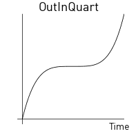


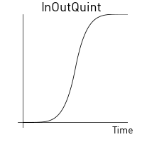
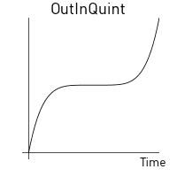

## 커스텀 easing

값 집합을 담은 `vector`를 정의한 다음 위의 미리 정의된 easing 상수 중 하나 대신 해당 vector를 제공하여 커스텀 easing 곡선을 만들 수 있습니다. vector 값은 시작 값(`0`)에서 타겟 값(`1`)까지의 곡선을 표현합니다. 런타임은 vector에서 값을 샘플링하고, vector에 표현된 지점 사이의 값을 계산할 때 선형으로 보간합니다.

예를 들어 다음 vector는:

```lua
local values = { 0, 0.4, 0.2, 0.2, 0.5, 1 }
local my_easing = vmath.vector(values)
```

다음 곡선을 만듭니다:


아래 예제는 사각 곡선에 따라 게임 오브젝트의 y 위치가 현재 위치와 200 사이를 점프하듯 바뀌게 합니다:

```lua
local values = { 0, 0, 0, 0, 0, 0, 0, 0,
                 1, 1, 1, 1, 1, 1, 1, 1,
                 0, 0, 0, 0, 0, 0, 0, 0,
                 1, 1, 1, 1, 1, 1, 1, 1,
                 0, 0, 0, 0, 0, 0, 0, 0,
                 1, 1, 1, 1, 1, 1, 1, 1,
                 0, 0, 0, 0, 0, 0, 0, 0,
                 1, 1, 1, 1, 1, 1, 1, 1 }
local square_easing = vmath.vector(values)
go.animate("go", "position.y", go.PLAYBACK_LOOP_PINGPONG, 200, square_easing, 2.0)
```


