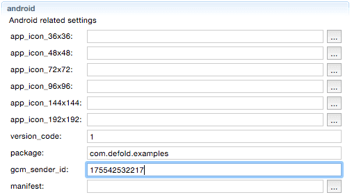

# Push notifications
이 문서는 당신의 게임 또는 어플리케이션에서 로컬 또는 원격 푸쉬 알림을 구현하고 설정하는 방법에 대해 설명합니다.

푸쉬 알림은 iOS와 Android 장치에서 사용 가능하며 업데이트나 변경사항을 플레이어에게 알리는데 사용됩니다. 핵심 기능은 iOS와 Android가 비슷한 기능을 가지고 있지만 플랫폼간 고려해야할 몇몇 차이점이 있습니다.

푸쉬 알림을 서버에서 대상 장치로 보내려면, 앱에 특정 정보의 비트(bits)가 필요합니다. 가장 복잡한 부분은 보안 정보로 구성되어 있으므로 알림 시스템은 알림을 수신하는 클라이언트가 정당한지(legitimity)를 인증할 수 있습니다. 또한 알림 서버에서 보안 정보가 필요할 수 도 있습니다. 따라서 Apple 또는 Google 서버가 당신의 서버가 정당한 알림 송신자(notification sender)인지를 인증할 수도 있습니다. 마지막으로, 알림을 보낼 경우, 특정 사용자의 장치로 알림을 직접적으로 고유하게 보낼 수 있어야 합니다. 이를 위해 특정 디바이스(사용자)에게 고유한 토큰을 사용하거나 탐색해야 합니다.

## iOS setup
> Apple 푸쉬 알림 서비스(Push Notification Service)에 대해 알고 싶다면, Apple 의 문서를 읽고 서비스가 어떻게 작동하는지 먼저 알아보는 것이 좋습니다. https://developer.apple.com/library/ios/documentation/NetworkingInternet/Conceptual/RemoteNotificationsPG/Chapters/ApplePushService.html 를 참고 바랍니다.

iOS에서는 알림을 보내기 위해 다음 정보가 필요합니다.

* App ID 에서 푸쉬 알림을 활성화 해야 함
* 유효한 App ID를 포함한 프로비져닝 프로파일도 필요함
* Apple 푸쉬 알림 서비스의 SSL 인증서(Certificate)가 있어야 Apple 서버에 알림 데이터를 보낼 수 있음

이 모든 것을 위해서는 [Apple Developer Member center](https://developer.apple.com/membercenter) 로 이동해서 푸쉬 알림을 활성화 하기 위한 AppI를 수정해야 합니다.


또한 Apple 푸쉬 알림 서비스의 SSL 인증서(Certificate)를 생성해야 합니다.


푸쉬 알림을 보낼 서버에는 인증서가 필요합니다. 개발 중에는 인증서를 다운로드, 설치하고 [APNS-Pusher](https://github.com/KnuffApp/APNS-Pusher) 또는 [NWPusher](https://github.com/noodlewerk/NWPusher) 과 같은 푸쉬 테스트 앱을 실행해 볼 수 있습니다.

AppID에서 새 프로비져닝 프로파일을 생성하고 당신의 장치에 넣는 작업을 해야 합니다. Xcode를 통하거나 "Member Center" 페이지에서 직접 수행할 수 있습니다.


Apple의 샌드박스 서버가 업데이트 되는 동안 시간이 걸리므로 푸쉬 작업이 즉시 동작하지 않을 수 있습니다.

이제 몇 가지 테스트 코드를 실행해 봅시다.

```lua
local function push_listener(self, payload, origin)
    -- 페이로드(payload)가 도착함
    pprint(payload)
end

function init(self)
    local sysinfo = sys.get_sys_info()
    if sysinfo.system_name == "Android" then
        msg.post("#", "push_android")
    elseif sysinfo.system_name == "iPhone OS" then
        msg.post("#", "push_ios")
    end
end

function on_message(self, message_id, message)
    if message_id == hash("push_ios") then
        local alerts = {push.NOTIFICATION_BADGE, push.NOTIFICATION_SOUND, push.NOTIFICATION_ALERT}
        push.register(alerts, function (self, token, error)
            if token then
                local t = ""
                for i = 1,#token do
                    t = t .. string.format("%02x", string.byte(token, i))
                end
                -- device token 출력
                print(t)
            else
                -- Error
                print(error.error)
            end
        end)
        push.set_listener(push_listener)
    elseif message_id == hash("push_android") then
        push.register(nil, function (self, token, error)
            if token then
                -- device token 출력
                print(token)
            else
                -- Error
                print(error.error)
            end
        end)
        push.set_listener(push_listener)
    end
end
```

모두 잘 동작하면 알림 리스너(notification listener)가 등록되고 사용할 수 있는 토큰(token)을 얻게 됩니다.

```
DEBUG:SCRIPT: 1f8ba7869b84b10df69a07aa623cd7f55f62bca22cef61b51fedac643ec61ad8
```

푸쉬 테스트 앱을 실행중인 경우, device token과 APN service SSL certificate을 사용하여 당신의 장치에 알림을 보내 보도록 합니다.


알림은 테스트 어플리케이션 내에서 push_listener() 함수에 도달한 후 즉시 클라이언트에 도착해야 합니다.

```
DEBUG:SCRIPT:
{
  aps = {
    badge = 42,
    alert = Testing.. (1),
    sound = default,
  }
}
```

그러면 iOS 홈 화면에서 아래와 같이 나타납니다.


어플리케이션 내에서 뱃지 개수(badge count)를 업데이트 하려면, push.set_badge_count() 함수를 사용하시기 바랍니다.

## Android setup

> Google 은 Google Cloud Messaging 에 대한 폭넓은 문서를 가지고 있습니다.  https://developers.google.com/cloud-messaging/gcm 부터 읽어 보시기 바랍니다.

Android에서는 알림을 보내려면 아래와 같은 정보가 필요합니다.

* 어플리케이션에 내장되는 GCM Sender ID
* Google 서버를 통해 알림 전송을 활성화 하기 위한 Server API Key

이 설정은 매우 간단하며 http://developers.google.com 에서 "Android"를 클릭 후 "Google Cloud Messaging" 항목을 참고하여 시작할 수 있습니다.


페이지 하단에는 "Get a configuration file" 이라는 버튼이 있습니다.


이 버튼을 클릭하고 다음 순서를 따라하면 마지막에 Server API Key 와 Sender ID 를 획득할 수 있습니다.


Sender ID 를 복사해서 Defold 프로젝트 셋팅의  **gcm_sender_id** 필드에 붙여넣기 합니다.



이제 클라이언트의 모든 준비가 끝났습니다. 위의 코드 예제는 Android에서도 잘 동작하므로 이를 실행하고 device token id를 복사해 둡니다.

```
DEBUG:SCRIPT: APA91bHkcKm0QHAMUCEQ_Dlpq2gzset6vh0cz46kDDV6230C5rFivyWZMCxGXcjxRDKg1PK4z1kWg3xnUVqSDiO_4_RiG8b8HeYJfaoW1ho4ukWYXjq5RE0Sy-JTyrhqRusUP_BxRTcE
```

이제 우리가 필요한 정보는 모두 얻었습니다. Google의 알림은 Web API 를 통해 전송되므로 **curl** 을 사용하여 테스트 메세지를 전송할 수 있습니다.

```bash
$ curl  -X POST  -H "Content-type: application/json"  -H 'Authorization: key=SERVER_KEY' -d '{"registration_ids" : ["TOKEN_ID"], "data": {"alert": "Hello"}}' https://android.googleapis.com/gcm/send
```

**SERVER_KEY** 과 **TOKEN_ID** 를 당신이 받은 키로 바꿔서 실행하세요.

## Local push notifications
원격 알림 뿐만아니라 로컬 푸쉬 알림도 지원됩니다. 약간의 설정으로 로컬 알림을 스케쥴링 할 수 있습니다.

```lua
-- 3초 내로 로컬 푸쉬 스케줄
local payload = '{"data" : {"field" : "Some value", "field2" : "Other value"}}'
id, err = push.schedule(3, "A notification!", "Hello there", payload, { action = "get going" })
```

이 id는 예약된 알림을 고유하게 식별하고 나중에 저장될 수 있습니다. push.schedule() 의 마지막 파라메터는 플랫폼별 설정을 포함하고 있는 테이블입니다.

#### action
(iOS 전용) "slide to unlock(밀어서 잠금해제)" 텍스트의 "unlock(잠금해제)"를 교체하는 언락 슬라이더(unlock slider)의 값 또는 얼럿(alert)의 오른쪽 버튼의 타이틀로 사용되는 얼럿 액션 문자열(alert action string)
#### badge_count
(iOS 전용) 뱃지 아이콘(icon badge)의 숫자 값. 뱃지를 삭제하려면 0으로 설정
#### priority
(Android 전용) 우선순위(priority)는 알림을 표시하는 방법에 대해 장치 UI에 알려주는 힌트입니다. 여기엔  -2 ~ 2 사이의 값으로 5단계의 우선순위 레벨이 있습니다. 특별히 지정하지 않으면 2를 기본 우선순위 단계로 사용합니다.

### Inspecting scheduled notifications
API 는 현재 스케쥴된 알림을 검사하기 위한 두 가지 함수를 제공합니다.

```lua
n = push.get_scheduled(id)
pprint(n)
```

id로 스케쥴된 알림의 상세 정보를 포함하는 테이블을 리턴합니다.

```
DEBUG:SCRIPT:
{
  payload = {"data":{"field":"Some value","field2":"Other value"}},
  title = A notification!,
  priority = 2,
  seconds = 19.991938,
  message = Hello there,
}
```

**seconds** 는 알림이 시작되는데 남은 시간(초)를 나타냅니다. 또한 전체 알림 스케쥴을 포함한 테이블을 탐색하는 것도 가능합니다.

```lua
all_n = push.get_all_scheduled()
pprint(all_n)
```

알림 id로 나열된 데이터를 포함하는 테이블을 반환합니다.

```
DEBUG:SCRIPT:
{
  0 = {
    payload = {"data":{"field":"Some value","field2":"Other value"}},
    title = A notification!,
    priority = 2,
    seconds = 6.009774,
    message = Hey hey,
  }
  1 = {
    payload = {"data":{"field":"Some value","field2":"Other value"}},
    title = Another notification!,
    priority = 2,
    seconds = 12.652521,
    message = Hello there,
  }
  2 = {
    payload = {"data":{"field":"Some value","field2":"Other value"}},
    title = Hey, much notification!,
    priority = 2,
    seconds = 15.553719,
    message = Please answer!,
  }
}
```
