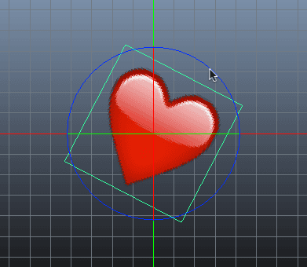

# Scene editing
Defold에는 여러 종류의 에디터가 있지만 씬에디터는 가장 많이 사용되는 에디터입니다. 모든 게임 오브젝트와 컬렉션, 게다가 몇몇 종류의 컴포넌트는 이 에디터에서 생성되고 편집됩니다.

* 뷰 이동하기: **``Alt`` + 가운데 버튼** (3버튼 마우스일 경우) 혹은 **``Option+Ctrl`` + 마우스 버튼** (1버튼 마우스일 경우)
* 뷰 줌인아웃하기: **``Alt`` + 오른쪽 버튼** (3버튼 마우스일 경우) 혹은 **``Ctrl`` + 마우스 버튼** (1버튼 마우스일 경우). 마우스 휠 버튼으로 줌인아웃 할 수도 있습니다.

마우스 휠 버튼이 있다면 뷰를 줌아웃 할 수 있습니다. macOS에서는 트랙패드에 두 손가락을 스와이프 업/다운 하면 마우스 휠을 움직이는 것과 동일하므로 확대/축소를 할 수 있습니다.

뷰를 윈도우에서 전체 씬이 보이게 리셋하려면 **Scene > Frame Objects** 메뉴를 선택하거나 **``F``**를 눌러 주세요.

## Manipulating objects(오브젝트 다루기)

#### Selecting
메인 창에서 오브젝트를 클릭하여 선택할 수 있으며, 에디터 뷰에서 오브젝트를 둘러싼 녹색 박스가 나타나 강조표시 됩니다.

또한 다음 방법으로도 선택할 수 있습니다:

1. 뷰에서 오브젝트가 없는 빈 공간을 클릭한 후, 드래그 한 영역에 포함된 모든 오브젝트를 선택합니다.
2. 아웃라인 뷰(Outline view)에서 오브젝트를 클릭합니다.
3. **``Shift``**를 누른 상태에서 에디터뷰의 여러 오브젝트를 클릭하여 선택할 수 있습니다. 혹은 **``⌘``** (Mac)이나 **``Control``** (PC/Linux)을 누를 수도 있습니다.
4. 아웃라인 뷰에서 오브젝트 한개를 클릭한 후, **``Shift``**를 누른채로 두번째 오브젝트를 클릭하면 이 두 오브젝트 사이의 모든 오브젝트들이 선택됩니다.
5.  **``⌘``** (Mac)이나 **``Control``** (PC/Linux)을 누른 채로 아웃라인 뷰에서 여러 오브젝트를 클릭하여 선택합니다.

#### Move Tool
오브젝트를 옮기기 위해서는 **Move Tool**을 사용합니다. **Scene > Move Tool** 메뉴를 선택하거나 **``W``**키를 누르면 활성화 됩니다.

오브젝트를 선택하면 이 오브젝트를 이동시키는데 사용되는 3개의 조작 지점이 나타납니다. 중앙의 작은 녹색 사각형을 클릭한채로 드래그하면 오브젝트를 자유롭게 이동시킬 수 있습니다.

또한 화살표를 클릭한 채 드래그하면 선택된 축에 따라 오브젝트를 이동시킬 수도 있습니다. 붉은 색 화살표는 **X**축으로만 이동시킬 수 있으며, 녹색 화살표는 **Y**축으로만 이동시킬 수 있습니다.

#### Moving against the grid(그리드에 맞춰 이동하기)
**``Shift``**를 누른채로 Move Tool을 사용하여 게임 오브젝트의 중앙을 격자에 맞추어 이동시킬 수 있습니다. 기본 격자 크기는 100입니다. 격자 크기를 변경하려면 **Defold Editor > Preferences…** 메뉴에서  grid size값을 변경할 수 있습니다.

#### Rotate Tool
**Rotate Tool**은 **Scene > Rotate Tool** 메뉴 혹은 **``E``**키를 눌러서 선택할 수 있습니다.

이 도구는 사용자가 조작할 수 있게 3개의 핸들로 구성되어 있습니다. 2D 오브젝트에서는 **Z**축을 기준으로 회전하는 핸들을 사용 할 수 있으며, 오브젝트 주변에 파란색 원형으로 표시됩니다. 바로 그 핸들을 클릭/드래그 하여 오브젝트를 회전시킬 수 있습니다.

**X** 혹은 **Y**축을 기준으로 회전시키고 싶다면, 녹색이나 붉은색 원형을 클릭/드래그 하십시오. 현재 뷰가 이들 축에 직각으로 위치해 있기 때문에, 녹색과 붉은색 원형이 십자선으로 표시됩니다: 가로는 녹색, 세로는 빨간색.

#### Scale Tool
**Scale Tool**은 **Scene > Scale Tool**메뉴 혹은 **``R``**버튼으로 선택할 수 있습니다.

붉은색이나 녹색의 핸들을 클릭/드래그하여 오브젝트의 크기를 조절할 수 있습니다. 게임 오브젝트는 **X**축이나 **Y**축으로 자유롭게 늘이거나 줄여서 확대축소가 가능합니다.

> 현재 Sprite 이미지는 에디터상에서 확대축소 할 수 없습니다. 하지만 런타임시에 자유형식으로 확대축소를 지원합니다. 자세한 것은 2D Graphic 문서를 참고하십시오.

## Selecting what is showing in the Scene Editor (씬 에디터에서 표시할 항목 선택하기)
수 많은 오브젝트와 물리객체, 트리거, 그래픽에셋들이 겹쳐진 레이어가 있는 복잡한 컬렉션에서 작업하는 경우 씬 에디터에서 특정한 타입의 시각적 정보를 비활성화 하는것은 종종 편리합니다. 씬 에디터는 에디터 상에서 각기 다른 종류의 렌더링 정보를 활성화 혹은 비활성화 할 수 있습니다. **Scene > Show** 메뉴를 선택하여 에디터에 표시될 항목을 선택하십시오.

이 선택사항은 에디터에 저장되어 모든 씬에디터 인스턴스에 적용됩니다. 또한 당신의 선택은 세션 사이에서도 저장되어 Defold 에디터를 닫고 다음날 열어도 이 설정은 그대로 유지됩니다.
