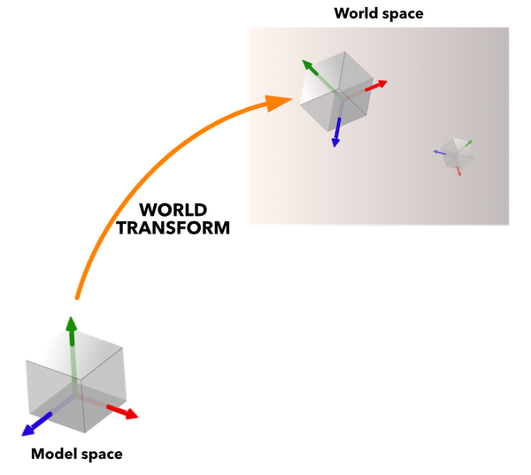

# 쉐이더

쉐이더 프로그램은 그래픽 렌더링의 핵심입니다. 쉐이더는 GLSL(GL Shading Language)이라는 C와 비슷한 언어로 작성된 프로그램이며, 그래픽 하드웨어가 실행하여 기반 3D 데이터(버텍스)나 화면에 최종적으로 나타나는 픽셀("프래그먼트")에 대한 작업을 수행합니다. 쉐이더는 스프라이트 그리기, 3D 모델 조명 처리, 전체 화면 후처리 효과 생성 등 매우 다양한 작업에 사용됩니다.

이 매뉴얼은 Defold의 렌더링 파이프라인이 GPU 쉐이더와 어떻게 인터페이스하는지 설명합니다. 컨텐츠용 쉐이더를 만들려면 메터리얼 개념과 렌더 파이프라인이 어떻게 동작하는지도 이해해야 합니다.

* 렌더 파이프라인에 대한 자세한 내용은 [Render 매뉴얼](/manuals/render)을 참고하세요.
* 메터리얼에 대한 자세한 내용은 [Material 매뉴얼](/manuals/material)을 참고하세요.
* 컴퓨트 프로그램에 대한 자세한 내용은 [Compute 매뉴얼](/manuals/compute)을 참고하세요.

OpenGL ES 2.0(OpenGL for Embedded Systems)과 OpenGL ES Shading Language의 명세는 [Khronos OpenGL Registry](https://www.khronos.org/registry/gles/)에서 확인할 수 있습니다.

데스크탑 컴퓨터에서는 OpenGL ES 2.0에서 사용할 수 없는 기능을 사용해 쉐이더를 작성할 수 있다는 점에 유의하세요. 그래픽 카드 드라이버가 모바일 장치에서는 동작하지 않는 쉐이더 코드를 문제없이 컴파일하고 실행할 수도 있습니다.


## 컨셉

버텍스 쉐이더
: 버텍스 쉐이더는 버텍스를 생성하거나 삭제할 수 없고, 버텍스의 위치만 변경할 수 있습니다. 버텍스 쉐이더는 보통 버텍스 위치를 3D 월드 공간에서 2D 화면 공간으로 변환하는 데 사용됩니다.

  버텍스 쉐이더의 입력은 버텍스 데이터(`attributes` 형태)와 상수(`uniforms`)입니다. 일반적인 상수는 버텍스 위치를 화면 공간으로 변환하고 투영하는 데 필요한 matrix입니다.

  버텍스 쉐이더의 출력은 계산된 버텍스의 화면 위치(`gl_Position`)입니다. 또한 `varying` 변수를 통해 버텍스 쉐이더에서 프래그먼트 쉐이더로 데이터를 전달할 수도 있습니다.

프래그먼트 쉐이더
: 버텍스 쉐이더가 끝나면, 결과 primitive의 각 프래그먼트(또는 픽셀)에 어떤 색상을 지정할지 결정하는 것은 프래그먼트 쉐이더의 역할입니다.

  프래그먼트 쉐이더의 입력은 상수(`uniforms`)와 버텍스 쉐이더가 설정한 모든 `varying` 변수입니다.

  프래그먼트 쉐이더의 출력은 특정 프래그먼트의 색상 값(`gl_FragColor`)입니다.

컴퓨트 쉐이더
: 컴퓨트 쉐이더는 GPU에서 어떤 종류의 작업이든 수행하는 데 사용할 수 있는 범용 쉐이더입니다. 그래픽 파이프라인의 일부가 아니며, 컴퓨트 쉐이더는 별도의 실행 컨텍스트에서 실행되고 다른 쉐이더의 입력에 의존하지 않습니다.

  컴퓨트 쉐이더의 입력은 상수 버퍼(`uniforms`), 텍스쳐 이미지(`image2D`), 샘플러(`sampler2D`), storage buffer(`buffer`)입니다.

  컴퓨트 쉐이더의 출력은 명시적으로 정의되어 있지 않습니다. 버텍스 및 프래그먼트 쉐이더와 달리 반드시 생성해야 하는 특정 출력이 없습니다. 컴퓨트 쉐이더는 범용이므로 어떤 종류의 결과를 생성할지는 프로그래머가 직접 정의해야 합니다.

월드 matrix
: 모델 shape의 버텍스 위치는 모델의 원점을 기준으로 저장됩니다. 이를 "모델 공간"이라고 합니다. 반면 게임 월드는 "월드 공간"이며, 여기서는 각 버텍스의 위치, 방향, 스케일이 월드 원점을 기준으로 표현됩니다. 이 둘을 분리해 두면 게임엔진은 모델 컴포넌트에 저장된 원래 버텍스 값을 파괴하지 않고 각 모델을 이동, 회전, 확대/축소할 수 있습니다.

  모델이 게임 월드에 배치되면 모델의 로컬 버텍스 좌표를 월드 좌표로 변환해야 합니다. 이 변환은 *월드 transform matrix*로 수행되며, 이 matrix는 모델의 버텍스를 게임 월드의 좌표 시스템에 올바르게 배치하기 위해 어떤 translation(이동), 회전, 스케일을 적용해야 하는지 알려줍니다.

  

뷰 및 프로젝션 matrix
: 게임 월드의 버텍스를 화면에 올리려면, 각 버텍스의 3D 좌표를 먼저 카메라 기준 좌표로 변환합니다. 이 작업은 _뷰 matrix_로 수행됩니다. 그다음 버텍스는 _프로젝션 matrix_를 통해 2D 화면 공간으로 투영됩니다.

  

Attributes
: 개별 버텍스와 연결된 값입니다. Attributes는 엔진이 쉐이더로 전달하며, attribute에 액세스하려면 쉐이더 프로그램에서 선언하기만 하면 됩니다. 컴포넌트 타입마다 서로 다른 attribute 집합이 있습니다.
  - 스프라이트에는 `position`과 `texcoord0`이 있습니다.
  - Tilegrid에는 `position`과 `texcoord0`이 있습니다.
  - GUI 노드에는 `position`, `textcoord0`, `color`가 있습니다.
  - ParticleFX에는 `position`, `texcoord0`, `color`가 있습니다.
  - 모델에는 `position`, `texcoord0`, `normal`이 있습니다.
  - 폰트에는 `position`, `texcoord0`, `face_color`, `outline_color`, `shadow_color`가 있습니다.

상수
: 쉐이더 상수는 렌더 draw call이 진행되는 동안 일정하게 유지됩니다. 상수는 메터리얼 파일의 *Constants* 섹션에 추가한 다음 쉐이더 프로그램에서 `uniform`으로 선언합니다. Sampler uniform은 메터리얼의 *Samplers* 섹션에 추가한 다음 쉐이더 프로그램에서 `uniform`으로 선언합니다. 버텍스 쉐이더에서 버텍스 변환을 수행하는 데 필요한 matrix는 상수로 제공됩니다.

  - `CONSTANT_TYPE_WORLD`는 오브젝트의 로컬 좌표 공간에서 월드 공간으로 매핑하는 *월드 matrix*입니다.
  - `CONSTANT_TYPE_VIEW`는 월드 공간에서 카메라 공간으로 매핑하는 *뷰 matrix*입니다.
  - `CONSTANT_TYPE_PROJECTION`은 카메라에서 화면 공간으로 매핑하는 *프로젝션 matrix*입니다.
  - 미리 곱해진 $world * view$, $view * projection$, $world * view$ matrix도 사용할 수 있습니다.
  - `CONSTANT_TYPE_USER`는 원하는 용도로 사용할 수 있는 `vec4` 타입 상수입니다.

  [Material 매뉴얼](/manuals/material)에서는 상수를 지정하는 방법을 설명합니다.

샘플러
: 쉐이더는 *sampler* 타입 uniform 변수를 선언할 수 있습니다. 샘플러는 이미지 소스에서 값을 읽는 데 사용됩니다.

  - `sampler2D`는 2D 이미지 텍스쳐에서 샘플링합니다.
  - `sampler2DArray`는 2D 이미지 배열 텍스쳐에서 샘플링합니다. 주로 paged atlas에 사용됩니다.
  - `samplerCube`는 6개 이미지 cubemap 텍스쳐에서 샘플링합니다.
  - `image2D`는 이미지 오브젝트로 텍스쳐 데이터를 로드하고, 필요하면 저장합니다. 주로 컴퓨트 쉐이더의 storage 용도로 사용됩니다.

  샘플러는 GLSL 표준 라이브러리의 텍스쳐 lookup 함수에서만 사용할 수 있습니다. [Material 매뉴얼](/manuals/material)에서는 샘플러 설정을 지정하는 방법을 설명합니다.

UV 좌표
: 2D 좌표는 버텍스와 연결되며 2D 텍스쳐의 한 지점에 매핑됩니다. 따라서 텍스쳐의 일부 또는 전체를 버텍스 집합으로 설명된 shape 위에 칠할 수 있습니다.

  

  UV-map은 일반적으로 3D 모델링 프로그램에서 생성되어 mesh에 저장됩니다. 각 버텍스의 텍스쳐 좌표는 attribute로 버텍스 쉐이더에 제공됩니다. 그런 다음 버텍스 값에서 보간된 각 프래그먼트의 UV 좌표를 찾기 위해 `varying` 변수가 사용됩니다.

Varying 변수
: `Varying` 타입 변수는 버텍스 stage와 프래그먼트 stage 사이에서 정보를 전달하는 데 사용됩니다.

  1. 버텍스 쉐이더에서 각 버텍스에 대해 varying 변수가 설정됩니다.
  2. 래스터라이제이션 중에는 렌더링되는 primitive의 각 프래그먼트에 대해 이 값이 보간됩니다. shape의 버텍스까지의 프래그먼트 거리가 보간 값을 결정합니다.
  3. 이 변수는 프래그먼트 쉐이더가 호출될 때마다 설정되며 프래그먼트 계산에 사용할 수 있습니다.

  

  예를 들어 삼각형의 각 코너에 `vec3` RGB 색상 값을 `varying`으로 설정하면 전체 shape에 걸쳐 색상이 보간됩니다. 마찬가지로 직사각형의 각 버텍스에 텍스쳐 맵 lookup 좌표(또는 *UV 좌표*)를 설정하면 프래그먼트 쉐이더가 shape 전체 영역에 대한 텍스쳐 색상 값을 lookup할 수 있습니다.

  

## 모던 GLSL 쉐이더 작성

Defold 엔진은 여러 플랫폼과 그래픽 API를 지원하므로, 개발자가 어디서나 동작하는 쉐이더를 쉽게 작성할 수 있어야 합니다. 에셋 파이프라인은 이를 주로 두 가지 방식으로 달성합니다(이후 이 방식을 `shader pipelines`라고 부릅니다).

1. 레거시 파이프라인: 쉐이더를 ES2 호환 GLSL 코드로 작성합니다.
2. 모던 파이프라인: 쉐이더를 SPIR-v 호환 GLSL 코드로 작성합니다.

Defold 1.9.2부터는 새 파이프라인을 활용하는 쉐이더 작성을 권장하며, 이를 위해 대부분의 쉐이더를 최소 버전 140(OpenGL 3.1)으로 작성된 쉐이더로 마이그레이션해야 합니다. 쉐이더를 마이그레이션하려면 다음 요구 사항이 충족되었는지 확인하세요.

### 버전 선언
쉐이더의 맨 위에 최소 #version 140을 넣습니다.

```glsl
#version 140
```

빌드 과정에서 쉐이더 파이프라인은 이 방식으로 선택되며, 그래서 기존 쉐이더도 계속 사용할 수 있습니다. version preprocessor를 찾을 수 없으면 Defold는 레거시 파이프라인으로 fallback합니다.

### Attributes
버텍스 쉐이더에서는 `attribute` 키워드를 `in`으로 바꿉니다.

```glsl
// 다음 대신:
// attribute vec4 position;
// 이렇게 작성합니다:
in vec4 position;
```

참고: 프래그먼트 쉐이더(및 컴퓨트 쉐이더)는 버텍스 입력을 받지 않습니다.

### Varyings
버텍스 쉐이더에서는 varyings에 `out` 접두어를 붙여야 합니다. 프래그먼트 쉐이더에서는 varyings가 `in`이 됩니다.

```glsl
// 버텍스 쉐이더에서는 다음 대신:
// varying vec4 var_color;
// 이렇게 작성합니다:
out vec4 var_color;

// 프래그먼트 쉐이더에서는 다음 대신:
// varying vec4 var_color;
// 이렇게 작성합니다:
in vec4 var_color;
```

### Uniforms(Defold에서는 상수라고 부름)

Opaque uniform 타입(samplers, images, atomics, SSBOs)은 마이그레이션이 필요 없으며, 지금처럼 그대로 사용할 수 있습니다.

```glsl
uniform sampler2D my_texture;
uniform image2D my_image;
```

Non-opaque uniform 타입은 `uniform block` 안에 넣어야 합니다. uniform block은 uniform 변수의 모음이며, `uniform` 키워드로 선언합니다.

```glsl
uniform vertex_inputs
{
    mat4 mtx_world;
    mat4 mtx_proj;
    mat4 mtx_view;
    mat4 mtx_normal;
    ...
};

void main()
{
    // uniform block의 개별 멤버는 그대로 사용할 수 있습니다
    gl_Position = mtx_proj * mtx_view * mtx_world * vec4(position, 1.0);
}
```

uniform block의 모든 멤버는 메터리얼과 컴포넌트에 개별 상수로 노출됩니다. render constant buffer나 `go.set`, `go.get` 사용에는 마이그레이션이 필요 없습니다.

### 내장 변수

프래그먼트 쉐이더에서 `gl_FragColor`는 버전 140부터 deprecated되었습니다. 대신 `out`을 사용하세요.

```glsl
// 다음 대신:
// gl_FragColor = vec4(1.0, 0.0, 0.0, 1.0);
// 이렇게 작성합니다:
out vec4 color_out;

void main()
{
    color_out = vec4(1.0, 0.0, 0.0, 1.0);
}
```

### 텍스쳐 함수

`texture2D`와 `texture2DArray` 같은 특정 텍스쳐 샘플링 함수는 더 이상 존재하지 않습니다. 대신 `texture` 함수만 사용하세요.

```glsl
uniform sampler2D my_texture;
uniform sampler2DArray my_texture_array;

// 다음 대신:
// vec4 sampler_2d = texture2D(my_texture, uv);
// vec4 sampler_2d_array = texture2DArray(my_texture_array, vec3(uv, slice));
// 이렇게 작성합니다:
vec4 sampler_2d = texture(my_texture, uv);
vec4 sampler_2d_array = texture(my_texture_array, vec3(uv, slice));
```

### 정밀도

이전에는 OpenGL ES 컨텍스트와 호환되려면 변수, 입력, 출력 등에 명시적인 precision을 설정해야 했습니다. 이제는 더 이상 필요하지 않으며, 지원하는 플랫폼에서는 precision이 자동으로 설정됩니다.

### 모두 합치기

마지막 예제로, 위 규칙을 모두 적용하여 내장 스프라이트 쉐이더를 새 포멧으로 변환하면 다음과 같습니다.

```glsl
#version 140

uniform vx_uniforms
{
    mat4 view_proj;
};

// position은 월드 공간에 있습니다
in vec4 position;
in vec2 texcoord0;

out vec2 var_texcoord0;

void main()
{
    gl_Position = view_proj * vec4(position.xyz, 1.0);
    var_texcoord0 = texcoord0;
}
```

```glsl
#version 140

in vec2 var_texcoord0;

out vec4 color_out;

uniform sampler2D texture_sampler;

uniform fs_uniforms
{
    vec4 tint;
};

void main()
{
    // 모든 런타임 텍스쳐는 이미 premultiplied alpha를 사용하므로 tint도 premultiply합니다
    vec4 tint_pm = vec4(tint.xyz * tint.w, tint.w);
    color_out = texture(texture_sampler, var_texcoord0.xy) * tint_pm;
}

```

## 쉐이더에 snippet 포함하기

Defold의 쉐이더는 프로젝트 안에 있는 `.glsl` 확장자 파일의 소스 코드 포함을 지원합니다. 쉐이더에서 glsl 파일을 포함하려면 큰따옴표 또는 꺾쇠괄호와 함께 `#include` pragma를 사용합니다. Include는 프로젝트 상대 경로이거나, include하는 파일을 기준으로 한 상대 경로여야 합니다.

```glsl
// /main/my-shader.fp 파일에서

// 절대 경로
#include "/main/my-snippet.glsl"
// 파일이 같은 폴더에 있음
#include "my-snippet.glsl"
// 파일이 'my-shader'와 같은 레벨의 하위 폴더에 있음
#include "sub-folder/my-snippet.glsl"
// 파일이 부모 디렉토리의 하위 폴더에 있음, 즉 /some-other-folder/my-snippet.glsl
#include "../some-other-folder/my-snippet.glsl"
// 파일이 부모 디렉토리에 있음, 즉 /root-level-snippet.glsl
#include "../root-level-snippet.glsl"
```

Include가 선택되는 방식에는 몇 가지 주의할 점이 있습니다.

  - 파일은 프로젝트 상대 경로여야 합니다. 즉 프로젝트 안에 있는 파일만 include할 수 있습니다. 모든 절대 경로는 앞에 `/`를 붙여 지정해야 합니다.
  - 파일의 어느 위치에서든 코드를 include할 수 있지만, 문장 안에서 인라인으로 파일을 include할 수는 없습니다. 예를 들어 `const float #include "my-float-name.glsl" = 1.0`은 동작하지 않습니다.

### 헤더 가드

Snippet 자체가 다른 `.glsl` 파일을 include할 수 있습니다. 이는 최종 생성된 쉐이더가 같은 코드를 여러 번 포함할 가능성이 있다는 뜻이며, 파일 내용에 따라 같은 symbol이 여러 번 선언되어 컴파일 문제가 발생할 수 있습니다. 이를 피하려면 여러 프로그래밍 언어에서 흔히 쓰이는 개념인 *헤더 가드*를 사용할 수 있습니다. 예:

```glsl
// my-shader.vs에서
#include "math-functions.glsl"
#include "pi.glsl"

// math-functions.glsl에서
#include "pi.glsl"

// pi.glsl에서
const float PI = 3.14159265359;
```

이 예제에서는 `PI` 상수가 두 번 정의되어 프로젝트 실행 시 컴파일러 오류가 발생합니다. 대신 헤더 가드로 내용을 보호해야 합니다.

```glsl
// pi.glsl에서
#ifndef PI_GLSL_H
#define PI_GLSL_H

const float PI = 3.14159265359;

#endif // PI_GLSL_H
```

`pi.glsl`의 코드는 `my-shader.vs`에서 두 번 확장되지만, 헤더 가드로 감쌌기 때문에 PI symbol은 한 번만 정의되고 쉐이더가 정상적으로 컴파일됩니다.

하지만 사용 사례에 따라 이것이 항상 엄격하게 필요한 것은 아닙니다. 대신 함수 안이나 쉐이더 코드에서 값을 전역으로 사용할 필요가 없는 다른 위치에서 코드를 로컬로 재사용하려는 경우에는 헤더 가드를 사용하지 않는 편이 좋습니다. 예:

```glsl
// red-color.glsl에서
vec3 my_red_color = vec3(1.0, 0.0, 0.0);

// my-shader.fp에서
vec3 get_red_color()
{
  #include "red-color.glsl"
  return my_red_color;
}

vec3 get_red_color_inverted()
{
  #include "red-color.glsl"
  return 1.0 - my_red_color;
}
```

## 에디터 전용 쉐이더 코드

Defold Editor viewport에서 쉐이더가 렌더링될 때는 preprocessor definition `EDITOR`를 사용할 수 있습니다. 이를 통해 에디터에서 실행될 때와 실제 게임 엔진에서 실행될 때 다르게 동작하는 쉐이더 코드를 작성할 수 있습니다.

이 기능은 특히 다음에 유용합니다.
  - 에디터에서만 표시되어야 하는 디버그 시각화를 추가할 때
  - wireframe 모드나 메터리얼 preview 같은 에디터 전용 기능을 구현할 때
  - 에디터 viewport에서 제대로 동작하지 않을 수 있는 메터리얼에 fallback 렌더링을 제공할 때

에디터에서만 실행되어야 하는 코드를 조건부로 컴파일하려면 `#ifdef EDITOR` preprocessor directive를 사용합니다.

```glsl
#ifdef EDITOR
    // 이 코드는 Defold Editor에서 쉐이더가 렌더링될 때만 실행됩니다
    color_out = vec4(1.0, 0.0, 1.0, 1.0); // 에디터 preview용 마젠타 색상
#else
    // 이 코드는 게임에서 실행될 때 실행됩니다
    color_out = texture(texture_sampler, var_texcoord0) * tint_pm;
#endif
```

## 렌더링 과정

화면에 나타나기 전, 게임을 위해 만든 데이터는 일련의 단계를 거칩니다.


모든 시각 컴포넌트(스프라이트, GUI 노드, 파티클 효과 또는 모델)는 컴포넌트의 shape을 설명하는 3D 월드의 점인 버텍스로 구성됩니다. 이렇게 하면 어떤 각도와 거리에서도 shape을 볼 수 있다는 장점이 있습니다. 버텍스 쉐이더 프로그램의 역할은 단일 버텍스를 가져와 viewport 안의 위치로 변환하여 shape이 화면에 나타날 수 있게 하는 것입니다. 버텍스가 4개인 shape의 경우, 버텍스 쉐이더 프로그램은 병렬로 4번 실행됩니다.


프로그램의 입력은 버텍스 위치(및 버텍스와 연결된 다른 attribute 데이터)이고, 출력은 새 버텍스 위치(`gl_Position`)와 각 프래그먼트에 대해 보간되어야 하는 모든 `varying` 변수입니다.

가장 단순한 버텍스 쉐이더 프로그램은 출력 위치를 zero vertex로 설정하기만 합니다(별로 유용하지는 않습니다).

```glsl
void main()
{
    gl_Position = vec4(0.0,0.0,0.0,1.0);
}
```

더 완전한 예는 내장 스프라이트 버텍스 쉐이더입니다.

```glsl
-- sprite.vp
uniform mediump mat4 view_proj;             // [1]

attribute mediump vec4 position;            // [2]
attribute mediump vec2 texcoord0;

varying mediump vec2 var_texcoord0;         // [3]

void main()
{
  gl_Position = view_proj * vec4(position.xyz, 1.0);    // [4]
  var_texcoord0 = texcoord0;                            // [5]
}
```
1. 뷰 matrix와 프로젝션 matrix를 곱한 값을 담은 uniform(상수)입니다.
2. 스프라이트 버텍스의 attributes입니다. `position`은 이미 월드 공간으로 변환되어 있습니다. `texcoord0`은 버텍스의 UV 좌표를 포함합니다.
3. varying 출력 변수를 선언합니다. 이 변수는 각 버텍스에 설정된 값 사이에서 각 프래그먼트마다 보간되어 프래그먼트 쉐이더로 전송됩니다.
4. `gl_Position`은 현재 버텍스의 출력 위치를 프로젝션 공간에 설정합니다. 이 값은 `x`, `y`, `z`, `w` 네 컴포넌트를 가집니다. `w` 컴포넌트는 원근 보정 보간(perspective-correct interpolation)을 계산하는 데 사용됩니다. 이 값은 보통 어떤 transformation matrix도 적용되기 전 각 버텍스에 대해 1.0입니다.
5. 이 버텍스 위치에 대한 varying UV 좌표를 설정합니다. 래스터라이제이션 이후 각 프래그먼트마다 보간되어 프래그먼트 쉐이더로 전송됩니다.


버텍스 쉐이딩 이후에는 컴포넌트의 화면상 shape이 결정됩니다. primitive shape이 생성되고 래스터라이즈됩니다. 즉 그래픽 하드웨어가 각 shape을 *프래그먼트*, 또는 픽셀로 나눕니다. 그런 다음 각 프래그먼트마다 한 번씩 프래그먼트 쉐이더 프로그램을 실행합니다. 화면상 이미지 크기가 16x24 픽셀이라면 프로그램은 병렬로 384번 실행됩니다.


프로그램의 입력은 렌더링 파이프라인과 버텍스 쉐이더가 보내는 모든 것으로, 보통 프래그먼트의 *UV 좌표*, tint 색상 등입니다. 출력은 픽셀의 최종 색상(`gl_FragColor`)입니다.

가장 단순한 프래그먼트 쉐이더 프로그램은 각 픽셀의 색상을 검정색으로 설정하기만 합니다(역시 별로 유용한 프로그램은 아닙니다).

```glsl
void main()
{
    gl_FragColor = vec4(0.0,0.0,0.0,1.0);
}
```

다시, 더 완전한 예는 내장 스프라이트 프래그먼트 쉐이더입니다.

```glsl
// sprite.fp
varying mediump vec2 var_texcoord0;             // [1]

uniform lowp sampler2D DIFFUSE_TEXTURE;         // [2]
uniform lowp vec4 tint;                         // [3]

void main()
{
  lowp vec4 tint_pm = vec4(tint.xyz * tint.w, tint.w);          // [4]
  lowp vec4 diff = texture2D(DIFFUSE_TEXTURE, var_texcoord0.xy);// [5]
  gl_FragColor = diff * tint_pm;                                // [6]
}
```
1. varying 텍스쳐 좌표 변수가 선언됩니다. 이 변수의 값은 shape의 각 버텍스에 설정된 값 사이에서 각 프래그먼트마다 보간됩니다.
2. `sampler2D` uniform 변수가 선언됩니다. 샘플러는 보간된 텍스쳐 좌표와 함께 사용되어 텍스쳐 lookup을 수행하므로 스프라이트에 텍스쳐를 올바르게 적용할 수 있습니다. 이것은 스프라이트이므로 엔진은 이 샘플러를 스프라이트의 *Image* 프로퍼티에 설정된 이미지에 할당합니다.
3. `CONSTANT_TYPE_USER` 타입의 상수가 메터리얼에 정의되고 `uniform`으로 선언됩니다. 이 값은 스프라이트의 색상 tinting을 가능하게 하는 데 사용됩니다. 기본값은 순수한 흰색입니다.
4. 모든 런타임 텍스쳐에는 이미 premultiplied alpha가 포함되어 있으므로 tint의 색상 값은 alpha 값과 premultiply됩니다.
5. 보간된 좌표에서 텍스쳐를 샘플링하고 샘플링된 값을 반환합니다.
6. `gl_FragColor`는 프래그먼트의 출력 색상으로 설정됩니다. 즉 텍스쳐의 diffuse 색상에 tint 값을 곱한 값입니다.

결과 프래그먼트 값은 이후 테스트를 거칩니다. 일반적인 테스트는 *depth test*로, 프래그먼트의 depth 값을 테스트 중인 픽셀의 depth buffer 값과 비교합니다. 테스트 결과에 따라 프래그먼트가 폐기되거나 새 값이 depth buffer에 기록될 수 있습니다. 이 테스트의 일반적인 용도는 카메라에 더 가까운 그래픽이 더 뒤쪽의 그래픽을 가리도록 하는 것입니다.

테스트 결과 프래그먼트를 frame buffer에 기록해야 한다고 판단되면, 버퍼에 이미 있는 픽셀 데이터와 *blended*됩니다. 렌더 스크립트에 설정된 blending 파라미터를 통해 source color(프래그먼트 쉐이더가 기록한 값)와 destination color(framebuffer 이미지의 색상)를 여러 방식으로 결합할 수 있습니다. blending의 일반적인 용도는 투명 오브젝트 렌더링을 활성화하는 것입니다.

## 더 알아보기

- [Shadertoy](https://www.shadertoy.com)에는 사용자가 기여한 방대한 수의 쉐이더가 있습니다. 다양한 쉐이딩 기법을 배울 수 있는 훌륭한 영감의 원천입니다. 사이트에 소개된 많은 쉐이더는 아주 적은 작업으로 Defold에 포팅할 수 있습니다. [Shadertoy 튜토리얼](https://www.defold.com/tutorials/shadertoy/)은 기존 쉐이더를 Defold로 변환하는 단계를 설명합니다.

- [Grading 튜토리얼](https://www.defold.com/tutorials/grading/)은 grading용 color lookup table 텍스쳐를 사용해 전체 화면 color grading 효과를 만드는 방법을 보여줍니다.

- [The Book of Shaders](https://thebookofshaders.com/00/)에서는 쉐이더를 프로젝트에 사용하고 통합하여 성능과 그래픽 품질을 개선하는 방법을 배울 수 있습니다.
