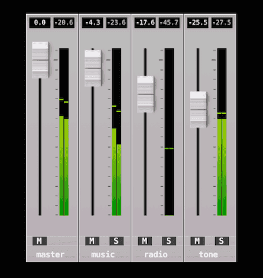
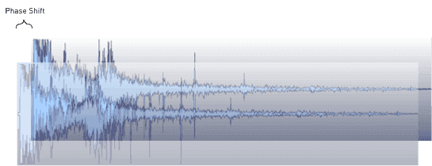

# 사운드

Defold의 사운드 구현은 간단하지만 강력합니다. 알아두어야 할 개념은 두 가지뿐입니다.

사운드 컴포넌트
: 이 컴포넌트는 재생할 실제 사운드를 포함하며, 해당 사운드를 재생할 수 있습니다.

사운드 그룹
: 각 사운드 컴포넌트는 _그룹_에 속하도록 지정할 수 있습니다. 그룹을 사용하면 함께 속한 사운드를 직관적으로 쉽게 관리할 수 있습니다. 예를 들어 "sound_fx" 그룹을 설정해 두면, 해당 그룹에 속한 모든 사운드를 간단한 함수 호출로 더킹(ducking)할 수 있습니다.

## 사운드 컴포넌트 만들기

사운드 컴포넌트는 게임 오브젝트 안에 내장(in-place)으로만 인스턴스화할 수 있습니다. 새 게임 오브젝트를 만들고, 마우스 오른쪽 버튼을 눌러 <kbd>Add Component ▸ Sound</kbd>를 선택한 다음 *OK*를 누릅니다.


생성된 컴포넌트에는 설정해야 하는 프로퍼티가 있습니다:


*Sound*
: 프로젝트의 사운드 파일로 설정해야 합니다. 파일은 _Wave_, _Ogg Vorbis_ 또는 _Ogg Opus_ 포멧이어야 합니다. Defold는 8-bit 및 16-bit PCM Wave 파일을 지원합니다. Ogg Opus 재생은 선택 사항이며 [App Manifest](/manuals/app-manifest/#sound)의 **Include Sound Decoder: Opus**가 필요합니다. Opus decoder는 기본적으로 포함되지 않습니다.

*Looping*
: 체크하면 사운드가 _Loopcount_ 횟수만큼 재생되거나 명시적으로 중지할 때까지 반복 재생됩니다.

*Loopcount*
: 반복 사운드가 중지되기 전에 재생될 횟수입니다(0은 명시적으로 중지할 때까지 반복됨을 의미합니다).

*Group*
: 사운드가 속할 사운드 그룹 이름입니다. 이 프로퍼티가 비어 있으면 사운드는 내장 "master" 그룹에 할당됩니다.

*Gain*
: 컴포넌트에서 사운드의 게인(gain)을 직접 설정할 수 있습니다. 그러면 사운드 프로그램으로 돌아가 다시 익스포트하지 않고도 사운드의 게인을 쉽게 조정할 수 있습니다. 게인 계산 방법은 아래 자세한 설명을 참고하세요.

*Pan*
: 컴포넌트에서 사운드의 pan 값을 직접 설정할 수 있습니다. pan은 -1(왼쪽 45도)에서 1(오른쪽 45도) 사이의 값이어야 합니다.

*Speed*
: 컴포넌트에서 사운드의 speed 값을 직접 설정할 수 있습니다. 1.0은 일반 속도, 0.5는 절반 속도, 2.0은 두 배 속도입니다.


## 사운드 재생하기

사운드 컴포넌트를 올바르게 설정했다면 [`sound.play()`](/ref/sound/#sound.play:url-[play_properties]-[complete_function])를 호출하여 사운드를 재생할 수 있습니다:

```lua
sound.play("go#sound", {delay = 1, gain = 0.5, pan = -1.0, speed = 1.25})
```

::: sidenote
사운드 컴포넌트가 속해 있던 게임 오브젝트가 삭제되어도 사운드는 계속 재생됩니다. 사운드를 중지하려면 [`sound.stop()`](/ref/sound/#sound.stop:url)을 호출할 수 있습니다(아래 참고).
:::
컴포넌트로 보내는 각 메세지는 사운드의 또 다른 인스턴스를 재생하게 하며, 사용 가능한 사운드 버퍼가 가득 차면 엔진이 콘솔에 오류를 출력합니다. 일종의 게이팅 및 사운드 그룹화 메커니즘을 구현하는 것이 좋습니다.

## 사운드 중지하기

사운드 재생을 중지하려면 [`sound.stop()`](/ref/sound/#sound.stop:url)을 호출합니다:

```lua
sound.stop("go#sound")
```

## 게인


사운드 시스템에는 4단계의 게인이 있습니다:

- 사운드 컴포넌트에 설정된 게인.
- `sound.play()` 호출로 사운드를 시작할 때 설정한 게인, 또는 `sound.set_gain()` 호출로 voice의 게인을 변경할 때 설정한 게인.
- [`sound.set_group_gain()`](/ref/sound#sound.set_group_gain) 함수 호출로 그룹에 설정한 게인.
- "master" 그룹에 설정된 게인. `sound.set_group_gain(hash("master"), gain)`으로 변경할 수 있습니다.

[Sound 프로젝트 설정](/manuals/project-settings/#sound)에서 **Use Linear Gain**이 활성화된 경우(기본값), 출력 게인은 이 네 게인을 곱한 결과입니다. `1.0`은 unity gain(0 dB)입니다. linear gain을 비활성화하면 Defold가 믹싱 중 비선형 곡선을 적용하므로 네 값을 직접 곱하거나 아래의 decibel 변환을 사용해도 결과 출력 레벨을 나타내지 않습니다.

## 사운드 그룹

사운드 그룹 이름이 지정된 모든 사운드 컴포넌트는 그 이름의 사운드 그룹에 들어갑니다. 그룹을 지정하지 않으면 사운드는 "master" 그룹에 할당됩니다. 사운드 컴포넌트의 그룹을 명시적으로 "master"로 설정해도 같은 효과가 있습니다.

사용 가능한 모든 그룹을 가져오고, 문자열 이름을 가져오고, 게인, rms(http://en.wikipedia.org/wiki/Root_mean_square 참고) 및 피크 게인(peak gain)을 가져오거나 설정하는 함수들이 제공됩니다. 타겟 디바이스의 음악 플레이어가 실행 중인지 검사하는 함수도 있습니다:

```lua
-- 이 iPhone/Android 디바이스에서 사운드가 재생 중이면 모든 소리를 음소거합니다
if sound.is_music_playing() then
    for i, group_hash in ipairs(sound.get_groups()) do
        sound.set_group_gain(group_hash, 0)
    end
end
```

그룹은 해쉬값으로 식별됩니다. 문자열 이름은 [`sound.get_group_name()`](/ref/sound#sound.get_group_name)으로 가져올 수 있으며, 개발 도구에서 그룹 이름을 표시하는 데 사용할 수 있습니다. 예를 들면 그룹 레벨을 테스트하는 믹서가 있습니다.



::: important
사운드 그룹의 문자열 값은 릴리즈 빌드에서 사용할 수 없으므로, 그 값에 의존하는 코드를 작성하면 안 됩니다.
:::

**Use Linear Gain**이 활성화된 경우 양의 gain 값을 표준 공식으로 decibel로 변환합니다.

```math
db = 20 \times \log \left( gain \right)
```

```lua
for i, group_hash in ipairs(sound.get_groups()) do
    -- 이름 문자열은 디버그 빌드에서만 사용할 수 있습니다. 릴리즈 빌드에서는 "unknown_*"를 반환합니다.
    local name = sound.get_group_name(group_hash)
    local gain = sound.get_group_gain(group_hash)

    -- 데시벨로 변환합니다.
    local db = 20 * math.log10(gain)

    -- RMS(gain Root Mean Square)를 가져옵니다. 왼쪽과 오른쪽 채널을 따로 처리합니다.
    local left_rms, right_rms = sound.get_rms(group_hash, 2048 / 65536.0)
    left_rmsdb = 20 * math.log10(left_rms)
    right_rmsdb = 20 * math.log10(right_rms)

    -- 게인 피크를 가져옵니다. 왼쪽과 오른쪽을 따로 처리합니다.
    left_peak, right_peak = sound.get_peak(group_hash, 2048 * 10 / 65536.0)
    left_peakdb = 20 * math.log10(left_peak)
    right_peakdb = 20 * math.log10(right_peak)
end

-- master 게인을 +6 dB로 설정합니다(math.pow(10, 6/20)).
sound.set_group_gain("master", 1.995)
```

Defold 1.10.2에서는 사운드 mixer에 오랫동안 존재하던 약 3 dB의 감쇠를 수정했습니다. 이전 프로젝트의 mix가 이 감쇠를 보정하고 있었고 업그레이드 후 더 크게 들린다면 전역 **Sound ▸ Gain** 설정이나 영향을 받는 group gain을 다시 조정하세요.

## 사운드 게이팅

게임이 이벤트에서 같은 사운드를 재생하고 그 이벤트가 자주 트리거되면, 거의 같은 시점에 같은 사운드를 두 번 이상 재생할 위험이 있습니다. 이런 일이 발생하면 사운드가 _위상 이동(phase shifted)_ 되어 매우 눈에 띄는 아티팩트가 생길 수 있습니다.



이 문제를 해결하는 가장 쉬운 방법은 사운드 메세지를 필터링하고 정해진 시간 간격 안에서는 같은 사운드가 한 번 넘게 재생되지 않도록 하는 게이트를 만드는 것입니다:

```lua
-- "gate_time" 간격 안에는 같은 사운드를 재생하지 않습니다.
local gate_time = 0.3

function init(self)
    -- 재생된 사운드 타이머를 테이블에 저장하고, "gate_time"초 동안
    -- 테이블에 남아 있을 때까지 매 프레임 카운트다운합니다. 이후 제거합니다.
    self.sounds = {}
end

function update(self, dt)
    -- 저장된 타이머를 카운트다운합니다
    for k,_ in pairs(self.sounds) do
        self.sounds[k] = self.sounds[k] - dt
        if self.sounds[k] < 0 then
            self.sounds[k] = nil
        end
    end
end

function on_message(self, message_id, message, sender)
    if message_id == hash("play_gated_sound") then
        -- 현재 게이팅 테이블에 없는 사운드만 재생합니다.
        if self.sounds[message.soundcomponent] == nil then
            -- 사운드 타이머를 테이블에 저장합니다
            self.sounds[message.soundcomponent] = gate_time
            -- 사운드를 재생합니다
            sound.play(message.soundcomponent, { gain = message.gain })
        else
            -- 사운드 재생 시도가 게이트에 의해 차단되었습니다
            print("gated " .. message.soundcomponent)
        end
    end
end
```

게이트를 사용하려면 `play_gated_sound` 메세지를 보내고 타겟 사운드 컴포넌트와 사운드 게인을 지정하면 됩니다. 게이트가 열려 있으면 게이트가 타겟 사운드 컴포넌트로 `sound.play()`를 호출합니다:

```lua
msg.post("/sound_gate#script", "play_gated_sound", { soundcomponent = "/sounds#explosion1", gain = 1.0 })
```

::: important
이 이름은 Defold 엔진에서 예약되어 있으므로 게이트가 `play_sound` 메세지를 듣도록 만들 수 없습니다. 예약된 메세지 이름을 사용하면 예기치 않은 동작이 발생합니다.
:::


## 런타임 조작

런타임에서 여러 프로퍼티를 통해 사운드를 조작할 수 있습니다(사용법은 [API 문서](/ref/sound/)를 참고하세요). 다음 프로퍼티는 `go.get()`과 `go.set()`으로 조작할 수 있습니다:

`gain`
: 사운드 컴포넌트의 게인(`number`)입니다.

`pan`
: 사운드 컴포넌트의 pan(`number`)입니다. pan은 -1(왼쪽 45도)에서 1(오른쪽 45도) 사이의 값이어야 합니다.

`speed`
: 사운드 컴포넌트의 speed(`number`)입니다. 1.0은 일반 속도, 0.5는 절반 속도, 2.0은 두 배 속도입니다.

`sound`
: 사운드의 리소스 경로(`hash`)입니다. 리소스 경로를 사용해 `resource.set_sound(path, buffer)`로 사운드를 변경할 수 있습니다. 예:

```lua
local boom = sys.load_resource("/sounds/boom.wav")
local path = go.get("#sound", "sound")
resource.set_sound(path, boom)
```


## 프로젝트 구성

*game.project* 파일에는 사운드 컴포넌트와 관련된 몇 가지 [프로젝트 설정](/manuals/project-settings#sound)이 있습니다.

## 사운드 스트리밍

[스트리밍 사운드](/manuals/sound-streaming)도 지원할 수 있습니다.
