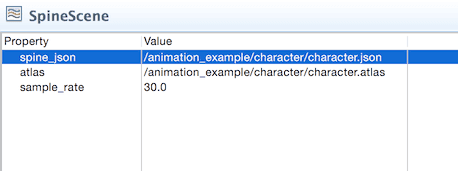
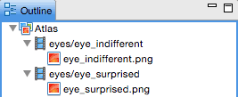

# Spine animation
이 매뉴얼은 스파인(Spine)이나 드래곤 본(Dragon Bone)으로부터 Defold로 스파인 애니메이션을 불러오는 방법을 설명합니다.

## Spine
스파인은 Esoteric Software에서 개발한 서드파티 애니메이션 툴이며, 골격 릭(skeletal rig)의 움직임을 조절하여 오브젝트의 다양한 부분을 움직이는 애니메이션을 만들 수 있습니다. 이는 캐릭터나 동물을 애니메이션 하는데 특히 유용하지만 밧줄, 자동차, 나뭇잎 같은 다른 오브젝트에도 잘 적용할 수 있습니다.

Defold는 런타임 평가(runtime evaluation) 및 스파인 JSON 포멧으로 된 애니메이션을 구현합니다.

Defold는 역기구학(IK = inverse kinematic)을 포함한 스파인 애니메이션 기능 대부분을 지원합니다.

> 현재, Defold는 X 혹은 Y축(axis)을 기준으로 뼈대를 뒤집는 애니메이션 키(animation keys)를 지원하지 않습니다. Defolds는 메쉬(mesh) 애니메이션을 지원하지만 오직 뼈대만 사용하므로 단일 버텍스를 애니메이션 할 수 없습니다. 만약 단일 버텍스(single vertices) 애니메이션이 필요하다면 뼈대를 통해 버텍스에만 100% 연결(bind)하고 뼈대를 애니메이션 해야 합니다.

## Concepts

#### Spine JSON data file
이 데이터 파일은 스켈레톤, 모든 이미지 슬롯의 이름, 스킨, 실제 애니메이션 데이터를 포함하고 있으며 이미지가 포함되어 있지 않습니다. 당신이 선택한 애니메이션 소프트웨어에서 이 파일을 만들어보세요.
#### Spine scene
Defold 리소스는 스파인 JSON 데이터 파일과 뼈대 슬롯(bone slots)을 그래픽으로 채우는데 사용되는 이미지 아틀라스를 함께 연결합니다.
#### Spine model
스파인 모델 컴포넌트는 그래픽 및 애니메이션을 화면에 표시하기 위해 게임 오브젝트에 넣어야 합니다. 이 컴포넌트는 애니메이션을 재생하고, 사용할 스킨과 모델을 렌더링 하기 위해 사용되는 메터리얼을 지정하는 스켈레톤 게임 오브젝트 계층구조(skeleton game object hierarchy)를 포함하고 있습니다. 자세한 내용은 [Spine Model](Spine%20model) 문서를 참고 바랍니다.

#### Spine Node
GUI씬에서 스파인 애니메이션을 사용하는 경우, 스파인 모델 컴포넌트 대신 스파인 GUI 노드를 사용하세요. 자세한 것은 [GUI Spine](Spine%20nodes) 문서를 참고 바랍니다.

## Animation tools
Defold가 지원하는 스파인 JSON 데이터 포멧은 Esoteric Software의 스파인 소프트웨어로 만들 수 있습니다. 게다가, 드래곤 본스(Dragon Bones) 또한 스파인 JSON 데이터 파일로 익스포트 할 수 있습니다.

스파인은 http://esotericsoftware.com 에서 사용 가능합니다.

드래곤 본스는 http://dragonbones.com 에서 사용 가능합니다.

## Importing a Spine character and animations
스파인에서 제작한 애니메이션과 모델이 있다면, Defold로 임포트하는 과정은 간단합니다:

1. 스파인 JSON 버전으로 애니메이션 데이터를 익스포트함
2. 익스포트된 JSON 파일을 프로젝트 아무데나 복사함
3. 모델과 관련된 모든 이미지를 프로젝트 아무데나 복사함
4. 아틀라스 파일을 만들어 이미지들을 추가함 (아틀라스를 만드는 방법은 [2D graphics](2D%20graphics) 문서를 참고)

드래곤 본즈(Dragon Bones)에서 작업하는 경우, 간단하게 Export Data Type을 **Spine**으로 하면 됩니다. 또한 Image Type으로는 **Images**를 선택하세요. 이렇게 하면 **.json** 파일과 필수적인 모든 이미지가 폴더로 익스포트됩니다. 그리고 나서 위의 설명대로 Defold에 추가하면 됩니다.

Defold에서 에니메이션 데이터와 이미지 파일을 임포트하고 셋업한 경우, 스파인 씬 파일(Spine scene file)을 생성해야 합니다:

1. 새로운 스파인 씬 파일을 생성함 (메인 메뉴에서 **New > Spine Scene File** 선택)
2. 스파인 씬 파일에서 **spine_json** 과 **atlas** 속성을 설정해서 임포트된 JSON 파일과 새로 생성한 아틀라스 파일을 참조함

## Creating SpineModel components
모든 데이터를 임포트하고 스파인 씬 파일을 준비하면, 스파인 모델을 만들 수 있습니다. 자세한 것은  [SpineModel](Spine%20model) 문서를 참고 바랍니다.

## Creating Spine GUI nodes
또한 GUI씬에서 스파인 애니메이션을 사용할 수도 있습니다. 자세한 것은 [GUI spine](Spine%20nodes) 문서를 참고 바랍니다.

## Animating Spine models and nodes
Defold는 Lua 인터페이스를 통해 애니메이션을 재생하는 방법에 대한 강력한 런타임 제어 기능을 제공합니다. 자세한 것은 [Animation](Animation) 문서를 참고 바랍니다.

## Atlas caveats
애니메이션 데이터는 뼈대에 사용된 이미지를 파일 접미사(suffix)가 생략된 이름으로 참조합니다. 스파인 소프트웨어에서 스파인 프로젝트로 이미지를 추가 하면 **Images** 아래의 계층에 리스트업 됩니다:

이 예제는 평평한 구조(flat structure)로 배치된 파일을 보여줍니다. 하지만 하위 폴더로 파일들을 정리할 수 있으며 이 파일들의 참조가 반영됩니다. 예를 들어, 디스크의 "head_parts/eyes.png" 파일을 슬롯에 사용하면 "head_parts/eyes"로 참조됩니다. 또한 이 이름은 JSON 파일로 익스포트 되어도 사용되므로, Defold 이미지 아틀라스를 생성할 때 모든 이름을 아틀라스 애니메이션과 일치시켜야 합니다.

**Add Images**를 선택하면 Defold는 추가된 파일과 같은 이름을 사용하는 애니메이션 그룹(animation group)을 자동적으로 생성하지만  파일명의 접미사(suffix)는 생략됩니다. 그러므로 애니메이션 그룹에 "eyes.png" 파일을 추가한 후엔 "eyes"라는 이름으로 참조됩니다. 이는 경로가 아니라 오직 파일 이름으로만 동작합니다.

그렇다면 애니메이션이 "head_parts/eyes"를 참조하고 있다면 어떻게 해야 할까요? 이름을 일치시키기 위한 가장 쉬운 방법은 애니메이션 그룹을 추가(아웃라인 창(**Outline**)의 Atlas 루트 노드에 마우스 오른쪽 클릭 후 **Add Animation Group** 선택)하는 것 입니다. 그리고 애니메이션 그룹의 이름을 "head_parts/eyes"로 바꾸고(경로가 아니고 / 문자가 들어간 이름일 뿐) 이 그룹에 "eyes.png"파일을 추가하면 됩니다.

스파인 모델(Spine model)을 애니메이션으로 움직이게 하려면  [Animation](Animation) 문서를 참고 바랍니다.

