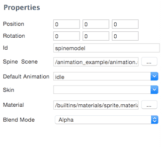
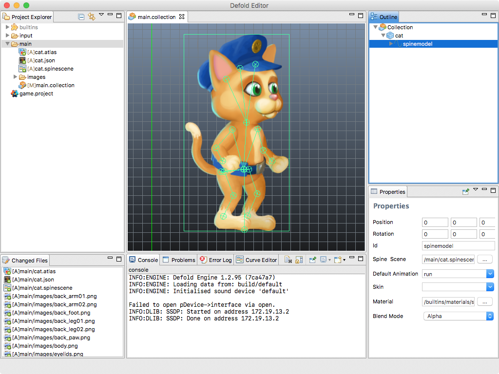

# Spine Model
스파인 모델 컴포넌트는 스파인 골격 애니메이션을 Defold로 불러오는데 사용됩니다.

## Creating SpineModel components
게임 오브젝트를 만들어 스파인 모델(**SpineModel**) 컴포넌트를 넣어봅시다. 내장(in-place) 컴포넌트(게임 오브젝트에서 마우스 오른쪽 버튼 눌러 **Add Component** 선택)를 만들 수도 있고 먼저 파일을 만들어(메뉴에서 **New > Spine Model** 선택) 게임 오브젝트에 이 파일을 추가할 수도 있습니다. (게임 오브젝트에서 마우스 오른쪽 버튼 눌러 **Add Component From File** 선택)

스파인 컴포넌트는 아래와 같은 속성들을 가지고 있습니다:

#### Spine scene
미리 만들어 놓은 스파인 씬 파일(Spine scene file)을 설정합니다.

#### Default animation
모델로 시작하려는 애니메이션을 설정합니다.

#### Skin
모델에 스킨이 있다면, 원하는 스킨을 설정합니다.

#### Material
모델을 커스텀 메터리얼로 렌더링하려면, 이 속성을 바꾸십시오.

#### Blend Mode
기본 "Alpha" 이외의 블렌드 모드를 원한다면, 이 속성을 바꾸십시오.

이제 에디터에서 스파인 모델을 볼 수 있습니다.

## Runtime animation
Defold는 런타임시 에니메이션을 제어하기 위한 강력한 기능을 제공합니다. 자세한 것은 [Animation](/manuals/animation)을 참고 바랍니다.