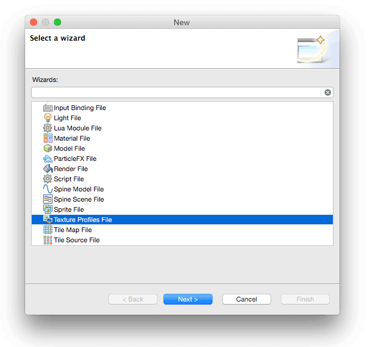

# Texture profiles
Defold는 자동 텍스쳐 프로세싱과 이미지 데이터 압축(**Atlas, Tile sources, Cubemaps** 그리고 모델과 GUI 등에서 사용되는 stand-alone 텍스쳐에서)을 지원합니다. 이 메뉴얼은 사용 가능한 기능에 대해 설명합니다.

압축은 메모리 공간을 줄이고 그래픽 하드웨어는 압축된 텍스쳐를 관리할 수 있습니다. 또한 압축은 이미지 리소스와 번들 사이즈를 줄이기도 합니다. PNG 파일 압축은 더 작은 파일로 생성할 수 있지만, PNG 파일을 메모리로 읽어올 경우 압축을 풀어야할 필요가 있습니다.

텍스처 처리는 특정 텍스쳐 프로파일을 통해 구성됩니다. 이 파일에서 프로파일을 생성해서 어떤 압축 포멧으로 특정 플랫폼 번들 생성시에 사용할지 나타냅니다. 그런 다음 프로파일이 파일 경로 패턴과 일치하는 파일들을 묶어서 프로젝트에서 어떤 파일이 어떻게 압축되는지를 정밀하게 제어할 수 있습니다.

사용 가능한 모든 텍스쳐 압축은 손실이 많기 때문에, 텍스쳐 데이터에 이상현상이 생길 수 있습니다. 이러한 이상현상은 원본 메터리얼이 어떻게 보이는지, 어떤 압축 방법을 사용했는지에 따라 크게 좌우됩니다. 원본 메터리얼을 테스트 해보고 최상의 결과를 위해 실험을 해보는 것이 좋습니다. 혹은 구글로 검색하는 것도 좋습니다.

> 압축은 자원 집중적이고 시간 소모적인 작업입니다. 그래서 압축할 텍스쳐 이미지들의 수량과 텍스쳐 포멧에 따라 빌드 시간이 아주 오래 걸릴 수도 있습니다.

## Texture profiles
각 프로젝트는 특정한 **.texture_profiles** 파일을 포함하고 있는데 이는 텍스쳐를 압축할 때 사용되는 구성을 포함하고 있습니다. 기본적으로 이 파일은 "builtins/graphics/default.texture_profiles" 경로에 있으며 모든 텍스쳐 리소스와 모든 플랫폼의 비압축 데이터를 남기는 프로파일과 일치하는 구성을 가집니다.

텍스쳐 압축을 추가하려면:

1. **File > New > Other…** 메뉴를 선택하고 "Texture Profiles File"를 선택해서 새 텍스쳐 프로파일 파일을 생성함(또는 "default.texture_profiles"를 "builtins"의 외부로 복사함)
2. "game.project"의 **texture_profiles** 항목을 새 파일을 지정하도록 수정
3. **.texture_profiles** 파일을 열어서 원하는 대로 수정함

editor preferences에서 텍스쳐 프로파일 사용 여부를 켜고 끌 수 있습니다. **File > Preferences** 를 선택하고 **Defold** 창에 포함된 **Enable texture profiles** 체크박스로 변경 가능합니다.

## Paths
텍스쳐 프로파일 파일의  **path_settings** 섹션은 경로 정규 표현식(path regular expressions)과 경로와 일치하는 리소스를 처리할 때 사용하는 **profile**의 이름을 포함하고 있습니다. 이 경로 정규 표현식은 "Ant Glob" 패턴 (자세한 것은  http://ant.apache.org/manual/dirtasks.html#patterns 참고)으로 표현됩니다. 패턴은 아래 처럼 와일드 카드(\*)를 사용해 표현될 수 있습니다.

#### \*
0개 이상의 문자와 일치합니다. 예를 들어 "sprite\*.png" 는 "sprite1.png", "sprite.png", "sprite_with_a_long_name.png" 파일들과 일치합니다.
#### ?
한 개의 문자와 일치합니다. 예를 들어 "sprite?.png"는 "sprite1.png", "spriteA.png" 와 일치하지만 "sprite.png" 또는 "sprite_with_a_long_name.png"와는 일치하지 않습니다.
#### '\*\*'
완전한 디렉토리 트리, 혹은 디렉토리의 이름으로 사용될 때 0개 이상의 디렉토리와 일치합니다. 예를 들어 "/gui/\*\*"는 "/gui" 디렉토리의 모든 하위디렉토리 및 모든 파일들과 일치합니다.

이 예제는 두 개의 경로 패턴(path patterns)과 해당 프로파일을 포함하고 있습니다.

#### "/gui/\*\*/\*.atlas"
"/gui" 디렉토리와 모든 하위 디렉터리의 모든 **.atlas** 파일들이 "gui_atlas" 프로파일로 처리됩니다.
#### "/\*\*/\*.atlas"
프로젝트 내의 어디서든지 모든 **.atlas** 파일들이  "atlas" 프로파일로 처리됩니다.

일치 작업은 위에서 아래 순서로 동작하기 때문에, 더 일반적인 경로를 뒷쪽에 배치하는 것이 좋습니다.  첫번째로 일치하는 리소스 경로가 사용된 후에는 먼저 사용된 매칭을 재정의 하지 않습니다. 만약 경로가 반대 순서가 된다면, 모든 아틀라스는 "atlas" 프로파일로 처리되며, "/gui" 디렉토리 내의 파일들도 처리됩니다.

프로파일 파일에서 어떤 경로로든 일치하지 않는 텍스쳐 리소스는 컴파일되어 거의 2배 가까이 스케일되며 그렇지 않으면 원래대로 남게 됩니다.

## Profiles
텍스쳐 프로파일 파일의  **profiles** 섹션에는 명명된 프로파일의 목록을 포함하고 있습니다. 각 프로파일은 한 개 이상의 플랫폼이 있으며, 각  **platform**은 프로퍼티의 목록에 의해 설명되어집니다.

#### os
일치하는 OS 플랫폼을 지정합니다. "OS_ID_GENERIC"는 장치의 dev-app builds를 포함하는 모든 플랫폼과 일치하며, "OS_ID_WINDOWS" 는 Windows 타겟 번들과 일치하며, "OS_ID_IOS"는 iOS 번들과 일치합니다.
#### formats
생성하려는 한 개 이상의 텍스쳐 포멧. 만약 여러 포멧이 지정되었다면, 각 포멧의 텍스쳐가 번들에서 생성되어 포함됩니다. 엔진은 런타임 플렛폼에 의해 지원되는 포멧의 텍스쳐를 선택합니다.
#### mipmaps
각 플랫폼마다, 밉맵의 생성 여부를 지정합니다. 이 프로퍼티는 "true" 또는 "false"로 설정할 수 있습니다.
#### max_texture_size
0이 아닌 값으로 설정하면, 텍스쳐의 픽셀 사이즈가 지정된 숫자만큼 제한됩니다. 지정된 값보다 큰 넓이나 높이를 가진 텍스쳐는 축소(scale down) 됩니다.

프로필에 추가되는 각 **formats**는 아래와 같은 프로퍼티를 가지고 있습니다.

#### format
텍스쳐를 인코딩 할 때 사용되는 포멧. 사용 가능한 텍스쳐 포멧은 아래를 참고 하십시오.
#### compression_level
압축된 이미지의 품질 수준을 설정합니다. 이 값의 범위는 "FAST" (낮은 품질, 빠른 압축) 에서 "NORMAL", "HIGH" 와 "BEST" (높은 품질, 느린 압축) 입니다.

### Texture formats
텍스쳐는 다양한 채널과 비트 깊이(bit depths)로 **손실(lossy)** 압축 또는 비압축 데이터로 처리될 수 있습니다. 고정된 압축은 이미지의 내용물과는 관계 없이 결과 이미지가 고정된 사이즈가 된다는 것을 의미하며, 압축하는 동안의 품질 손실은 원본 텍스쳐의 내용에 따라 달라진다는 뜻입니다.

현재는 아래와 같은 손실 압축 포멧을 지원하고 있습니다.

#### PVRTC
텍스쳐는 블록 단위로 압축됩니다. 4비트 모드(4BPP)에서는 4x4 픽셀을 하나의 블록으로 가집니다. 2비트 모드(2BPP)에서는 8x4 픽셀을 하나의 블록으로 가집니다. 한 블록은 항상 64 비트(8 바이트)의 메모리 공간을 가집니다. 이 포멧은 iPhone, iPod Touch, iPad의 모든 세대에서 사용되고 있습니다. (PowerVR GPU를 사용하는 특정 Android 장치도 이 형식을 지원함) Defold는 이 포멧에서 "V1" 접미사로 표시된 PVRTC1 포멧을 지원합니다.

#### ETC
Ericsson Texture Compression. 4x4 픽셀 그룹은 단일 64비트 word 형식으로 압축됩니다. 4x4 그룹은 절반으로 나뉘며 각각의 절반에는 한 개의 기본 색상이 할당됩니다. 그리고 나서 각 픽셀은 절반의 기본 색상으로부터 4개의 오프셋 값들 중 하나로 인코딩됩니다. Android는 2.2 버전(Froyo) 이후 부터 ETC1을 지원하며 Defold는 ETC1 압축 텍스쳐를 지원합니다.

| Format | Compression | Color | Note |
| :------------ | :------------ | :------------ | :------------ |
| TEXTURE_FORMAT_LUMINANCE | none  | One channel gray-scale, no alpha | RGB 채널이 하나로 곱해짐. Alpha는 버려짐 |
| TEXTURE_FORMAT_RGB | none | 3 channel color | Alpha는 버려짐 |
| TEXTURE_FORMAT_RGBA | none | 3 channel color and full alpha | - |
| TEXTURE_FORMAT_RGB_PVRTC2BPPV1 | 1:16 fixed | No alpha | 정사각형 이미지 필요. 정사각형이 아닌 이미지는 리사이징 됨 |
| TEXTURE_FORMAT_RGB_PVRTC4BPPV1 | 1:8 fixed | No alpha | 정사각형 이미지 필요. 정사각형이 아닌 이미지는 리사이징 됨 |
| TEXTURE_FORMAT_RGBA_PVRTC2BPPV1 | 1:16 fixed | Pre-multiplied alpha | 정사각형 이미지 필요. 정사각형이 아닌 이미지는 리사이징 됨 |
| TEXTURE_FORMAT_RGBA_PVRTC4BPPV1 | 1:8 fixed | Pre-multiplied alpha | 정사각형 이미지 필요. 정사각형이 아닌 이미지는 리사이징 됨 |
| TEXTURE_FORMAT_RGB_ETC1 | 1:6 fixed | No alpha | - |
