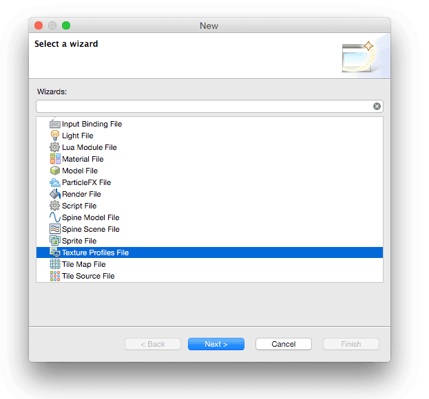
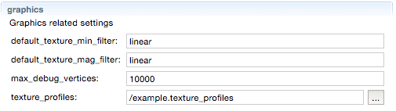
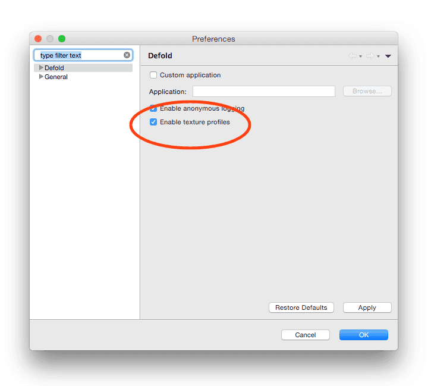
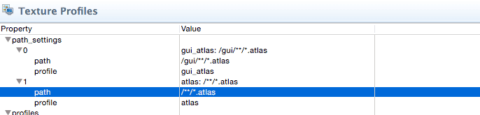
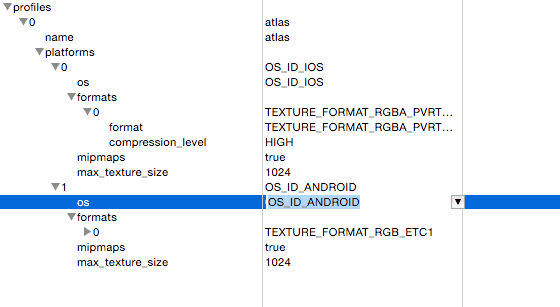

# 텍스쳐 프로파일

Defold는 이미지 데이터(*Atlas*, *Tile sources*, *Cubemaps*, 그리고 모델, GUI 등에 사용되는 standalone 텍스쳐)의 자동 텍스쳐 처리와 압축을 지원합니다.

압축에는 소프트웨어 이미지 압축과 하드웨어 텍스쳐 압축, 두 가지 유형이 있습니다.

1. 소프트웨어 압축(PNG, JPEG 등)은 이미지 리소스의 저장 크기를 줄입니다. 따라서 최종 번들 크기가 더 작아집니다. 하지만 이미지 파일을 메모리로 읽을 때는 압축을 해제해야 하므로, 디스크에서는 작은 이미지라도 메모리 사용량은 클 수 있습니다.

2. 하드웨어 텍스쳐 압축도 이미지 리소스의 저장 크기를 줄입니다. 하지만 소프트웨어 압축과 달리 텍스쳐의 메모리 사용량도 줄입니다. 그래픽 하드웨어가 압축을 먼저 해제하지 않고도 압축된 텍스쳐를 직접 관리할 수 있기 때문입니다.

텍스쳐 처리는 특정 텍스쳐 프로파일을 통해 구성됩니다. 이 파일에서 특정 플랫폼용 번들을 만들 때 사용할 압축 포멧과 유형을 나타내는 _profiles_를 생성합니다. 그런 다음 _Profiles_를 일치하는 파일 _paths patterns_에 연결하여, 프로젝트의 어떤 파일을 어떻게 압축할지 세밀하게 제어할 수 있습니다.

사용 가능한 모든 하드웨어 텍스쳐 압축은 손실 압축이므로 텍스쳐 데이터에 아티팩트가 생깁니다. 이러한 아티팩트는 원본 자료의 모양과 사용한 압축 방식에 크게 좌우됩니다. 최상의 결과를 얻으려면 원본 자료를 테스트하고 실험해 보아야 합니다. 이 부분에서는 Google 검색도 도움이 됩니다.

번들 아카이브의 최종 텍스쳐 데이터(압축된 데이터 또는 원시 데이터)에 어떤 소프트웨어 이미지 압축을 적용할지 선택할 수 있습니다. Defold는 [Basis Universal](https://github.com/BinomialLLC/basis_universal) 및 [ASTC](https://www.khronos.org/opengl/wiki/ASTC_Texture_Compression) 압축 포멧을 지원합니다.

::: sidenote
압축은 리소스를 많이 사용하고 시간이 오래 걸리는 작업이며, 압축할 텍스쳐 이미지의 수와 선택한 텍스쳐 포멧 및 소프트웨어 압축 유형에 따라 빌드 시간이 _매우_ 길어질 수 있습니다.
:::

### Basis Universal

Basis Universal(줄여서 BasisU)은 이미지를 중간 포멧으로 압축하고, 런타임에 현재 장치의 GPU에 적합한 하드웨어 포멧으로 트랜스코딩합니다. Basis Universal 포멧은 고품질이지만 손실 포멧입니다.
모든 이미지는 게임 아카이브에 저장될 때 파일 크기를 더 줄이기 위해 LZ4로도 압축됩니다.

### ASTC

ASTC는 ARM이 개발하고 Khronos Group이 표준화한 유연하고 효율적인 텍스쳐 압축 포멧입니다. 다양한 블록 크기와 비트레이트를 제공하므로 개발자가 이미지 품질과 메모리 사용량의 균형을 효과적으로 맞출 수 있습니다. ASTC는 4×4부터 12×12 텍셀까지 다양한 블록 크기를 지원하며, 이는 텍셀당 8비트부터 텍셀당 0.89비트까지의 비트레이트에 해당합니다. 이러한 유연성 덕분에 텍스쳐 품질과 저장 요구사항 사이의 절충점을 세밀하게 제어할 수 있습니다.

ASTC는 4×4부터 12×12 텍셀까지 다양한 블록 크기를 지원하며, 이는 텍셀당 8비트부터 텍셀당 0.89비트까지의 비트레이트에 해당합니다. 이러한 유연성 덕분에 텍스쳐 품질과 저장 요구사항 사이의 절충점을 세밀하게 제어할 수 있습니다. 다음 표는 지원되는 블록 크기와 해당 비트레이트를 보여줍니다.

| 블록 크기(width x height) | 픽셀당 비트 수 |
| --------------------------- | -------------- |
| 4x4                         | 8.00           |
| 5x4                         | 6.40           |
| 5x5                         | 5.12           |
| 6x5                         | 4.27           |
| 6x6                         | 3.56           |
| 8x5                         | 3.20           |
| 8x6                         | 2.67           |
| 10x5                        | 2.56           |
| 10x6                        | 2.13           |
| 8x8                         | 2.00           |
| 10x8                        | 1.60           |
| 10x10                       | 1.28           |
| 12x10                       | 1.07           |
| 12x12                       | 0.89           |

#### 지원 장치

ASTC는 좋은 결과를 제공하지만 모든 그래픽 카드에서 지원되지는 않습니다. 다음은 벤더별 지원 장치의 간단한 목록입니다.

| GPU 벤더          | 지원                                                                  |
| ------------------ | --------------------------------------------------------------------- |
| ARM (Mali)         | OpenGL ES 3.2 또는 Vulkan을 지원하는 모든 ARM Mali GPU는 ASTC를 지원합니다. |
| Qualcomm (Adreno)  | OpenGL ES 3.2 또는 Vulkan을 지원하는 Adreno GPU는 ASTC를 지원합니다.          |
| Apple              | A8 칩 이후의 Apple GPU는 ASTC를 지원합니다.                            |
| NVIDIA             | ASTC 지원은 주로 모바일 GPU(예: Tegra 기반 칩)를 대상으로 합니다.     |
| AMD (Radeon)       | Vulkan을 지원하는 AMD GPU는 일반적으로 소프트웨어를 통해 ASTC를 지원합니다. |
| Intel (Integrated) | 최신 Intel GPU에서는 소프트웨어를 통해 ASTC가 지원됩니다.                  |

## 텍스쳐 프로파일

각 프로젝트에는 텍스쳐를 압축할 때 사용할 구성을 담은 특정 *.texture_profiles* 파일이 포함됩니다. 기본적으로 이 파일은 *builtins/graphics/default.texture_profiles*이며, 하드웨어 텍스쳐 압축 없이 RGBA를 사용하고 기본 ZLib 파일 압축을 사용하는 프로파일에 모든 텍스쳐 리소스를 일치시키는 구성을 가지고 있습니다.

텍스쳐 압축을 추가하려면:

- <kbd>File ▸ New...</kbd>를 선택하고 *Texture Profiles*를 선택하여 새 텍스쳐 프로파일 파일을 만듭니다. (또는 *default.texture_profiles*를 *builtins* 외부 위치로 복사합니다)
- 새 파일의 이름과 위치를 선택합니다.
- *game.project*의 *texture_profiles* 항목을 새 파일을 가리키도록 변경합니다.
- *.texture_profiles* 파일을 열고 요구사항에 맞게 구성합니다.

에디터 preferences에서 텍스쳐 프로파일 사용 여부를 켜고 끌 수 있습니다. <kbd>File ▸ Preferences...</kbd>를 선택합니다. *General* 탭에는 *Enable texture profiles* 체크박스 항목이 있습니다.

## Path Settings

텍스쳐 프로파일 파일의 *Path Settings* 섹션에는 경로 패턴 목록과, 해당 경로와 일치하는 리소스를 처리할 때 사용할 *profile*이 포함됩니다. 경로는 "Ant Glob" 패턴으로 표현됩니다(자세한 내용은 [문서](http://ant.apache.org/manual/dirtasks.html#patterns)를 참고하세요). 패턴은 다음 와일드카드를 사용해 표현할 수 있습니다.

`*`
: 0개 이상의 문자와 일치합니다. 예를 들어 `sprite*.png`는 *`sprite.png`*, *`sprite1.png`*, *`sprite_with_a_long_name.png`* 파일과 일치합니다.

`?`
: 정확히 한 문자와 일치합니다. 예를 들어 `sprite?.png`는 *sprite1.png*, *`spriteA.png`* 파일과 일치하지만 *`sprite.png`* 또는 *`sprite_with_a_long_name.png`* 파일과는 일치하지 않습니다.

`**`
: 전체 디렉토리 트리와 일치하거나, 디렉토리 이름으로 사용될 때는 0개 이상의 디렉토리와 일치합니다. 예를 들어 `/gui/**`는 */gui* 디렉토리와 그 모든 하위 디렉토리의 모든 파일과 일치합니다.

이 예제에는 두 개의 경로 패턴과 그에 해당하는 프로파일이 포함되어 있습니다.

`/gui/**/*.atlas`
: *`/gui`* 디렉토리 또는 그 하위 디렉토리에 있는 모든 *.atlas* 파일은 "gui_atlas" 프로파일에 따라 처리됩니다.

`/**/*.atlas`
: 프로젝트 어디에 있든 모든 *.atlas* 파일은 "atlas" 프로파일에 따라 처리됩니다.

더 일반적인 경로가 마지막에 놓여 있다는 점에 유의하세요. 일치 알고리즘은 위에서 아래로 동작합니다. 리소스 경로와 일치하는 첫 번째 항목이 사용됩니다. 목록에서 더 아래에 있는 일치 경로 표현식은 첫 번째 일치를 절대 재정의하지 않습니다. 경로가 반대 순서로 배치되었다면 *`/gui`* 디렉토리에 있는 파일까지 포함하여 모든 atlas가 "atlas" 프로파일로 처리되었을 것입니다.

프로파일 파일의 어떤 경로와도 일치하지 _않는_ 텍스쳐 리소스는 컴파일되고 가장 가까운 2의 거듭제곱 크기로 스케일되지만, 그 외에는 그대로 유지됩니다.

## 프로파일

텍스쳐 프로파일 파일의 *profiles* 섹션에는 이름이 지정된 프로파일 목록이 포함됩니다. 각 프로파일에는 하나 이상의 *platforms*가 포함되며, 각 플랫폼은 프로퍼티 목록으로 설명됩니다.

*Platforms*
: 일치하는 플랫폼을 지정합니다. `OS_ID_GENERIC`은 모든 플랫폼과 일치하고, `OS_ID_WINDOWS`는 Windows 타겟 번들과 일치하며, `OS_ID_IOS`는 iOS 번들과 일치하는 식입니다. `OS_ID_GENERIC`을 지정하면 모든 플랫폼에 포함된다는 점에 유의하세요.

::: important
두 [Path Settings](#path-settings)이 같은 파일과 일치하고 그 경로가 서로 다른 플랫폼을 가진 서로 다른 프로파일을 사용하면, **두** 프로파일이 모두 사용되고 **두 개의** 텍스쳐가 생성됩니다.
:::

*Formats*
: 생성할 하나 이상의 텍스쳐 포멧입니다. 여러 포멧을 지정하면 각 포멧의 텍스쳐가 생성되어 번들에 포함됩니다. 엔진은 런타임 플랫폼에서 지원되는 포멧의 텍스쳐를 선택합니다.

*Mipmaps*
: 체크하면 해당 플랫폼에 대한 밉맵이 생성됩니다. 기본값은 체크 해제입니다.

*Premultiply alpha*
: 체크하면 알파가 텍스쳐 데이터에 premultiply됩니다. 기본값은 체크입니다.

*Max Texture Size*
: 0이 아닌 값으로 설정하면 텍스쳐의 픽셀 크기가 지정한 숫자로 제한됩니다. 지정한 값보다 너비나 높이가 큰 텍스쳐는 축소됩니다.

프로파일에 추가된 각 *Formats*에는 다음 프로퍼티가 있습니다.

*Format*
: 텍스쳐를 인코딩할 때 사용할 포멧입니다. 사용 가능한 모든 텍스쳐 포멧은 아래를 참고하세요.

*Compressor*
: 텍스쳐를 인코딩할 때 사용할 compressor입니다.

*Compressor Preset*
: 결과 압축 이미지 인코딩에 사용할 압축 프리셋을 선택합니다. 각 compressor preset은 compressor마다 고유하며, 해당 설정은 compressor 자체에 따라 달라집니다. 이러한 설정을 단순화하기 위해 현재 압축 프리셋은 네 단계로 제공됩니다.

| 프리셋    | 설명                                          |
| --------- | --------------------------------------------- |
| `LOW`     | 가장 빠른 압축. 낮은 이미지 품질              |
| `MEDIUM`  | 기본 압축. 가장 좋은 이미지 품질              |
| `HIGH`    | 가장 느린 압축. 더 작은 파일 크기             |
| `HIGHEST` | 느린 압축. 가장 작은 파일 크기                |

`uncompressed` compressor에는 `uncompressed`라는 프리셋 하나만 있으며, 이는 텍스쳐에 압축이 적용되지 않음을 의미합니다.
사용 가능한 compressor 목록은 [Compressors](#compressors)를 참고하세요.

## 텍스쳐 포멧

그래픽 하드웨어 텍스쳐는 다양한 채널 수와 비트 깊이를 가진 비압축 데이터 또는 *손실* 압축 데이터로 처리될 수 있습니다. 고정된 하드웨어 압축은 결과 이미지가 이미지 내용과 관계없이 고정 크기가 된다는 뜻입니다. 즉, 압축 중의 품질 손실은 원본 텍스쳐의 내용에 따라 달라집니다.

Basis Universal 압축 트랜스코딩은 장치의 GPU 기능에 따라 달라지므로, Basis Universal 압축에 권장되는 포멧은 다음과 같은 범용 포멧입니다.
`TEXTURE_FORMAT_RGB`, `TEXTURE_FORMAT_RGBA`, `TEXTURE_FORMAT_RGB_16BPP`, `TEXTURE_FORMAT_RGBA_16BPP`, `TEXTURE_FORMAT_LUMINANCE`, `TEXTURE_FORMAT_LUMINANCE_ALPHA`.

Basis Universal transcoder는 `ASTC4x4`, `BCx`, `ETC2`, `ETC1`, `PVRTC1` 같은 여러 출력 포멧을 지원합니다.

현재 지원되는 손실 압축 포멧은 다음과 같습니다.

| 포멧                              | 압축        | 세부 정보  |
| --------------------------------- | ----------- | -------------------------------- |
| `TEXTURE_FORMAT_RGB`              | none        | 3채널 색상. Alpha는 버려집니다. |
| `TEXTURE_FORMAT_RGBA`             | none        | 3채널 색상과 전체 alpha.    |
| `TEXTURE_FORMAT_RGB_16BPP`        | none        | 3채널 색상. 5+6+5비트. |
| `TEXTURE_FORMAT_RGBA_16BPP`       | none        | 3채널 색상과 전체 alpha. 4+4+4+4비트. |
| `TEXTURE_FORMAT_LUMINANCE`        | none        | 1채널 회색조, alpha 없음. RGB 채널이 하나로 곱해집니다. Alpha는 버려집니다. |
| `TEXTURE_FORMAT_LUMINANCE_ALPHA`  | none        | 1채널 회색조와 전체 alpha. RGB 채널이 하나로 곱해집니다. |

ASTC의 경우 채널 수는 항상 4(RGB + alpha)이며, 포멧 자체가 블록 압축의 크기를 정의합니다.
이 포멧들은 ASTC compressor와만 호환됩니다. 다른 조합은 빌드 오류를 발생시킵니다.

`TEXTURE_FORMAT_RGBA_ASTC_4X4`
`TEXTURE_FORMAT_RGBA_ASTC_5X4`
`TEXTURE_FORMAT_RGBA_ASTC_5X5`
`TEXTURE_FORMAT_RGBA_ASTC_6X5`
`TEXTURE_FORMAT_RGBA_ASTC_6X6`
`TEXTURE_FORMAT_RGBA_ASTC_8X5`
`TEXTURE_FORMAT_RGBA_ASTC_8X6`
`TEXTURE_FORMAT_RGBA_ASTC_8X8`
`TEXTURE_FORMAT_RGBA_ASTC_10X5`
`TEXTURE_FORMAT_RGBA_ASTC_10X6`
`TEXTURE_FORMAT_RGBA_ASTC_10X8`
`TEXTURE_FORMAT_RGBA_ASTC_10X10`
`TEXTURE_FORMAT_RGBA_ASTC_12X10`
`TEXTURE_FORMAT_RGBA_ASTC_12X12`

## Compressors

다음 텍스쳐 compressor가 기본으로 지원됩니다. 텍스쳐 파일이 메모리로 로드될 때 데이터는 압축 해제됩니다.

| 이름                              | 포멧                      | 설명                                                                                          |
| --------------------------------- | ------------------------- | --------------------------------------------------------------------------------------------- |
| `Uncompressed`                    | 모든 포멧                 | 압축이 적용되지 않습니다. 기본값입니다.                                                       |
| `BasisU`                          | 모든 RGB/RGBA 포멧        | Basis Universal 고품질 손실 압축. 품질 수준이 낮을수록 크기가 더 작아집니다. |
| `ASTC`                            | 모든 ASTC 포멧            | ASTC 손실 압축. 품질 수준이 낮을수록 크기가 더 작아집니다.                          |

::: sidenote
Defold는 텍스쳐 compressor 파이프라인에서 설치 가능한 compressor를 지원합니다. 이를 통해 WEBP 또는 완전히 커스텀한 방식 같은 텍스쳐 압축 알고리즘을 익스텐션으로 구현할 수 있습니다.
:::

## 예제 이미지

출력을 더 잘 이해할 수 있도록 예제를 하나 살펴보겠습니다.
이미지 품질, 압축 시간, 압축 크기는 항상 입력 이미지에 따라 달라지며 달라질 수 있다는 점에 유의하세요.

기본 이미지(1024x512):

### 압축 시간

| 프리셋    | 압축 시간        | 상대 시간     |
| --------- | ---------------- | ------------- |
| `LOW`     | 0m0.143s         | 0.5x            |
| `MEDIUM`  | 0m0.294s         | 1.0x            |
| `HIGH`    | 0m1.764s         | 6.0x            |
| `HIGHEST` | 0m1.109s         | 3.8x            |

### 신호 손실

비교는 `basisu` 도구를 사용해 수행했습니다(PSNR 측정).
100 dB는 신호 손실이 없음을 의미합니다. 즉, 원본 이미지와 같다는 뜻입니다.

| 프리셋    | 신호                                             |
| --------- | ------------------------------------------------ |
| `LOW`     | Max:  34 Mean: 0.470 RMS: 1.088 PSNR: 47.399 dB |
| `MEDIUM`  | Max:  35 Mean: 0.439 RMS: 1.061 PSNR: 47.620 dB |
| `HIGH`    | Max:  37 Mean: 0.898 RMS: 1.606 PSNR: 44.018 dB |
| `HIGHEST` | Max:  51 Mean: 1.298 RMS: 2.478 PSNR: 40.249 dB |

### 압축 파일 크기

원본 파일 크기는 1572882바이트입니다.

| 프리셋    | 파일 크기  | 비율    |
| --------- | ---------- | ------- |
| `LOW`     | 357225     | 22.71 %  |
| `MEDIUM`  | 365548     | 23.24 %  |
| `HIGH`    | 277186     | 17.62 %  |
| `HIGHEST` | 254380     | 16.17 %  |

### 이미지 품질

다음은 결과 이미지입니다(`basisu` 도구를 사용해 ASTC 인코딩에서 가져왔습니다).

`LOW`

`MEDIUM`

`HIGH`

`HIGHEST`

