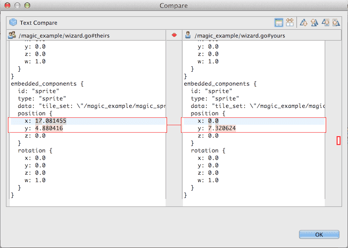

# Workflow
이 매뉴얼은 Defold에서 어떻게 에셋을 다루는지, 어떻게 강력한 리펙토링을 사용하여 당신의 프로젝트 구조를 쉽게 바꾸는지, 그리고 협업 방법 및 외부 에디터나 기본 Git 도구같은 고급 주제를 안내합니다.

## Assets
게임 프로젝트는 일반적으로 다양하고 전문적인 생산 프로그램으로 제작되는 그래픽, 3D모델, 사운드, 애니메이션 등 많은 수의 외부 에셋으로 구성되어 있습니다. Defold는 기본적으로 외부 툴로 별도 작업을 하고, 작업중인 파일을 저장하고, Defold로 에셋을 임포트하여 프로젝트 파일을 구조화 하는 것으로 마무리하는 작업흐름으로 셋팅되어 있습니다.

Git은 주로 소스코드나 텍스트 파일을 처리하도록 개발되었으며 이들 파일은 매우 적은 용량으로 저장할 수 있습니다. 각 버전 간의 변경사항만 저장되므로 프로젝트의 모든 파일들의 광범위한 변경 히스토리를 비교적 적은 비용으로 유지할 수 있습니다. 다만 이미지나 사운드 같은 바이너리 파일은 Git의 저장방식은 도움이 되지 않습니다. 체크인하고 동기화하는 각각의 새 버전은 거의 같은 공간을 차지합니다. 이는 일반적으로 최종 프로젝트 에셋(JPEG, PNG 이미지나 OGG같은 사운드 파일 등등)에는 중요한 이슈는 아니지만 작업중인 프로젝트 파일(PSD나 Protools 프로젝트 등등)엔 문제가 될 수도 있습니다. 이들 프로젝트나 파일의 타입은 목표로 하는 에셋보다 고해상도로 작업하는 것이 일반적이므로 용량이 매우 커질 수 있습니다.

일반적으로 Git에 대규모 작업파일을 올리는 것을 피하고 대신 백업을 유지하고 별도의 솔루션을 사용하는 것이 가장 좋은 방법입니다. 만약 큰 스케일의 에셋 파일 생성이 필요한 경우에는 간단한 스크립트를 짜서 최종 파일만 Defold 프로젝트 계층 폴더로 복사하는 방법이 일반적입니다.

## Refactoring
리펙토링은 설계를 개선하기 위하여 이미 개발된 코드나 에셋을 재구성하는 프로세스를 말합니다. 프로젝트를 개발하는 과정에서는 뭔가를 바꾸거나 옮겨야 할 일이 종종 발생하곤 합니다:

- 네이밍 컨벤션이나 명확성을 위해 이름을 변경할 필요가 있다.
- 프로젝트 계층구조에서 보다 논리적인 구조를 위해 코드나 에셋파일을 이동시킬 필요가 있다.
- 더 나은 기능을 갖춘 새 코드나 에셋이 삭제된 기존 것들을 대체할 필요가 있다.

Defold는 에셋이 사용되는 방식을 추적하여 효과적으로 리펙토링하고 에셋이 이동되거나 이름이 바뀔 경우 자동적으로 참조를 업데이트합니다. 개발자는 그냥 자유롭게 작업하면 되며 이 프로젝트는 파일이 조각나거나 붕괴되는 것을 두려워할 필요가 없는 유연한 구조로 되어 있습니다. Defold는 가능한 쉽게 리펙토링 작업을 할 수 있게 도움이 될 것입니다.

리펙토링 작업 동안에는 Defold는 자동적으로 참조를 업데이트 하지 않을 수도 있습니다.  이 경우에는 에디터가 이 문제를 해결 할 수 없지만 대신 유용한 에러신호를 제공할 것입니다.

예를 들어, Tilemap 컴포넌트를 게임 오브젝트에 추가하고나서 다시 이 컴포넌트 파일을 삭제하면, 게임 실행시 Defold 컴파일러는 에러를 발생할 것입니다. 이때 에디터는 프로젝트뷰, 게임오브젝트 또는 컬렉션 계층에서 모든 관련된 에러를 아이콘으로 표시하므로 해당 문제의 위치를 빠르게 찾는데 도움이 됩니다.

에러중에 일부는 당신이 에셋을 열어 수정했을 때 Defold가 즉시 에러항목을 표시되기도 하지만, 프로젝트뷰의 에러마크는 컴파일러가 실행될때에만 표시됩니다.

만약 외부 에디터(OS X의 Finder나 Windows의 Explorer나 Shell같은)로 파일의 이름을 바꾸거나 이동시킨다면 자동 리펙토링 메커니즘은 동작하지 않을 것입니다. Defold 에디터 외부에서 파일 작업을 한다면 에셋과 연결된 참조가 깨질 수도 있다는 것에 주의 바랍니다.

## Collaboration
Defold는 강력한 협업을 기반으로 개발되었습니다. 여러 팀의 멤버들은 같은 컨텐츠를 거의 마찰 없이 병렬적으로 작업 할 수 있습니다. Defold는 분산 협업 도구인 Git을 기반으로 설계되었습니다. Git은 광범위한 작업흐름도 다룰 수 있는 아주 강력한 도구입니다. Defold는 이 기능을 사용하여 간단하고도 강력한 기능을 제공합니다.

처음 프로젝트 작업을 시작하면 (**File > Open Project** 메뉴 선택), Defold는 이 프로젝트의 새로운 local branch를 생성할 것인지를 묻습니다.

**New branch**를 클릭하여 branch의 이름을 정합니다. 그리고 나면 Defold는 프로젝트 서버에 존재하는것과 똑같은 프로젝트 구조의 완전한 복제품을 생성합니다.  생성된 branch는 당신의 컴퓨터에만 존재합니다. 당신은 원하는 만큼 많이 만들거나 줄일 수도 있으며, 새 것을 만들거나 오래된 것을 삭제 할 수도 있습니다.

작업을 시작하고 프로젝트의 변경사항을 저장하면, 이 변경사항들은 현재 branch 안에 저장될 것입니다. 당신이 이 branch를 서버 레포지토리(repository)에 동기화(Synchronize)할 때까지 아무도 그 내용을 볼 수 없습니다.

#### Synchronizing
프로젝트 브랜치를 동기화하는 것은 서버의 마스터 브랜치(master branch)와 똑같이 만든다는 것을 의미합니다. 서버에서 변경된 사항은 무엇이든지 당신의 브랜치로 가져오며(pull) 당신의 로컬 브랜치에서 수정된 것이 무엇이든지 서버 레포지토리로 보냅니다(push).

다른 프로젝트 팀과 공유하는 당신의 현재 브랜치의 몇몇 작업을 막 끝냈다면, **File > Synchronize** 메뉴를 선택하여 변경사항을 점검하고 유용한 커밋 메세지를 입력할 수도 있습니다.

프로젝트에서 변경,추가,삭제된 모든 파일들은 이 창의 상단에 나열됩니다. 각 파일의 앞에는 주석이 달립니다:

**[M]**
당신의 브랜치에 있는 파일이 수정됨
**[A]**
당신의 브랜치로 파일이 추가됨
**[D]**
당신의 브랜치에서 파일이 삭제됨

파일에 반영된 변경사항을 확인하려면, 간단히 commit-list의 파일을 더블클릭하여 비교 창을 띄울 수 있습니다:

이 창은 파일의 두가지 버전을 보여줍니다. (수정된 파일의 경우와 추가/삭제된 파일의 경우가 다름) 왼쪽은 마지막으로 동기화 된 후에 서버에서 보여지는 파일이고, 오른쪽은 당신의 로컬 버전을 보여줍니다. 차이점을 명확하게 강조표시하여 신속하게 리뷰할 수 있습니다.

내장된 파일 비교 툴은 텍스트 파일에서만 동작합니다. 그러나 Defold는 모든 작업 파일(게임 오브젝트, 컬렉션, 아틀라스 등등)을 쉽게 이해할 수 있는 JSON 파일로 저장하므로 각 파일에 적용된 변경사항의 의미를 파악할 수 있습니다:

#### Resolving conflicts
만약 당신이 팀으로 일하고 있다면, 당신이 당신의 브랜치에서 작업하는 동안 다른 사람의 브랜치가 서버 레포지토리에 동기화 되었을 수도 있습니다. 당신이 서버로 변경사항을 푸쉬하기 직전에 몇몇 다른 팀 멤버 (혹은 다른 이유로 또 다른 브랜치를 사용하는 당신)가 변경사항을 푸쉬할 수도 있습니다.

이것은 문제가 되지 않으며, 대부분의 충돌은 자동적으로 해결될 수 있습니다. 하지만 변경 사항이 서버의 변경사항과 완전히 똑같은 위치의 파일이라면, Defold는 경고 메세지를 표시하고 충돌을 해결하기 위해 도움을 요청합니다.

당신의 버전을 유지할 것인지 서버의 버전을 유지할 것인지 선택할 수 있습니다. 충돌 내용을 보려면, 파일을 더블클릭하여 충돌을 강조표시한 비교창을 띄워 보시기 바랍니다.

> 이 에디터는 충돌하는 두 파일에서 변경사항을 선택하도록 하지는 않습니다. 이러한 작업이 필요한 경우는 별도의 병합툴(merge tool)을 사용하고 커맨드라인에서 Git 명령어를 사용하시기 바랍니다.

## External editors and tools(외부 편집기 그리고 도구)
Defold는 이미지를 드로잉하거나, 사운드 파일을 만들거나, 본 애니메이션을 만드는 등의 에디팅 도구를 제공하지 않습니다. 대부분 에셋들은 Defold가 아닌 특별한 도구를 활용하여 제작할 필요가 있습니다. Defold는 선호하는 외부도구에 관해서는 관심이 없습니다. 단지 어떤 이미지 프로그램이던 PNG 파일을 생성하고 어떤 사운드 프로그램이던 WAV파일을 저장할 수 있으며 어떤 캐릭터 애니메이션 프로그램이던 Spine JSON 파일을 추출(자세한 것은 [Spine 문서](/manuals/spine) 참고) 할 수만 있으면 됩니다.

Defold는 프로젝트의 에셋들의 변경사항을 감지하고 이에 따라 에디터 뷰를 업데이트 합니다. 업데이트 주기는 변경 즉시 발생하지는 않고 에디터에서 변경사항을 보려면 1~2초 정도가 걸립니다.

자동적인 에셋 추적은 필요에 따라 작업 흐름을 커스터마이징 할 수 있습니다.

#### Shell scripts / batch files(쉘 스크립트 / 배치 파일)
당신은 외부 스크립트를 활용하여 에셋들을 자동적으로 리빌드 할 수 있습니다. 예를 들어, 원본 이미지가 너무 고해상도이거나 전혀 다른 포멧의 파일이라면 당신은 스크립트나 배치파일을 사용해서 이미지 크기를 줄이거나 파일포멧을 변경하여 프로젝트 파일구조의 적당한 위치에 복사 할 수 있습니다.

#### Data generation(데이터 생성)
당신은 특정 도구를 사용하여 특별한 데이터(table 구조 같은)를 생성 할 수 있으며, 이를 Lua 스크립트 파일에 쓸 수도 있습니다.

## Opening assets in the text editor(텍스트 에디터로 에셋 열기)
Defold는 편집하려는 항목에 적합한 에디터를 자동적으로 선택합니다. 하지만 Defold 텍스트 에디터에서 특정 프로젝트 파일을 직접 여는 것도 가능합니다. 특정 상황에서 이 방식은 꽤 유용하며, 충돌을 해결할 때 도움되는 파일 형식을 숙지하시기 바랍니다.

텍스트 에디터에서 파일을 열기 위해, 프로젝트 뷰의 파일에 오른쪽-클릭하고 **Open With > Text Editor** 메뉴를 선택하세요:

Defold는 특정 파일에 대해 에디터를 선택한 것을 기억합니다. 특정 파일을 텍스트 에디터(Text Editor)로 열었다면, 그 파일을 더블클릭하는 것으로 자동적으로 텍스트 에디터에서 열리게 할 수 있습니다. 파일에 대해 선택된 에디터 정보를 초기화 하려면, 그냥 파일에 오른쪽-클릭후에 **Open With > [Filetype Editor]** 를 선택하십시오. [Filetype Editor]는 파일의 종류에 맞게 사용되는 에디터의 종류입니다. (예: 게임오브젝트를 위한 씬에디터(Scene Editor), 타일소스를 위한 타일소스에디터(Tile Source Editor) 등등)

텍스트 에디터를 통해 파일을 작업하는 것은 추가적인 주의가 필요합니다. 만약 파일내용이 꼬인다면 지정된 에디터에서 파일을 열 수 없게 됩니다. 예를 들어, 게임 오브젝트 파일을 수정하는데 오브젝트 이름의 끝에 쌍따옴표하나를 빼먹었다고 칩시다.

텍스트 에디터에서 이 파일을 저장하고 씬에디터로 다시 열려고 하면, Defold는 에러를 발생하고 당신은 이 에러를 직접 고쳐야(재편집하거나 변경사항을 되돌리거나) 합니다:

Defold는 문제를 해결하기에 유용한 에러메세지를 보여주고 때로는 에러를 쉽게 추적할 수 있습니다. 추가적인 도움이 필요하다면 변경된 파일창(Changed Files pane)의 파일을 더블클릭하여 마지막 동기화 이후의 모든 변경사항을 볼 수 있습니다.

## Git
Defold는 Git을 사용하여 모든 파일들의 버전 추적을 간단하고 쉽게 이해할 수 있습니다.

* 에디터에서 생성한 각 브랜치는 원격 프로젝트 레포지토리의 복사본이고, 별도의 폴더에 저장됩니다.
* 로컬에서 작업한 변경사항은 복사된 로컬 레포지토리에 저장됩니다.
* 프로젝트를 동기화(Synchronize)하면 다음과 같은 일이 발생합니다:
    * 변경사항이 로컬 레포지토리에 커밋됨(commit)
    * 에디터가 원격 레포지토리에서 변경사항을 가져오고(pull), 이것을 로컬 레포지토리에 병합함(merge)
    * 병합시 충돌이 발생하면(conflicts), 이 문제를 해결하라는 창이 뜸(resolve)
    * 마지막으로, 변경사항이 원격 레포지토리로 전송됨(push)

Git 명령줄 도구에서는 에디터의 도움없이 수동적으로 명령을 수행할 수도 있습니다. 예를 들어, 레포지토리의 커밋 히스토리를 추적하려면:

    git log

그리고 특정 커밋으로부터 체크아웃을 하려면:

    git checkout <commit hash> <file path>

원한다면 직접 워크플로우를 개선하여 팀 멤버간의 변경사항을 작업변경 즉시 가져오게 할 수도 있습니다. 두 명 이상의 실험적인 브랜치 작업환경이 필요한 경우 Git을 활용하는 것을 고려해 보시기 바랍니다. Git에 대한 자세한 설명은 http://git-scm.com 에 방문 바랍니다.

## Line endings and Windows(줄바꿈과 윈도우)
당신의 컴퓨터에서 텍스트 파일을 편집중에 **Return**키를 누르면, 보이지 않는 문자 시퀀스가 줄의 맨끝에 삽입됩니다.  다른 운영체제에서는 역사적인 이유로 인해 다른 시퀀스가 사용됩니다. 가장 일반적인 내용으로는...

#### Unix and Mac OS X
단일 Line Feed 문자 (LF, "\n", 0x0A 또는 십진수의 10)
#### Windows
Carriage Return 문자 다음으로 Line Feed 문자 (CR+LF, "\r\n", 0x0D0A)
#### Mac OS 9 (and earlier)
단일 Carriage Return 문자 (CR, "\r", 0x0D 또는 십진수의 13)

> 줄바꿈(line ending)에 대해 더 자세히 알고 싶다면,  https://ko.wikipedia.org/wiki/새줄_문자 를 참고하세요.

팀에서 여러 운영체제를 사용하여 함께 작업하는 경우, 줄바꿈 방식은 문제를 유발할 수 있습니다. Defold의 프로젝트뷰에서 새 파일을 생성하면 Unix 방식의 개행문자를 사용하므로 Defold에서만 텍스트 파일을 편집한다면 별 문제가 없지만 외부툴로 또 다른 개행문자를 사용하는 경우는 문제가 될 수 있습니다.

한 팀원이 윈도우 운영체제를 사용하고 별도의 외부 툴로 Lua 스크립트를 편집하여 윈도우용 개행문자를 사용했다고 가정해 봅시다. 이후에 그 팀원은 Defold Lua 에디터로 그 스크립트 파일을 열어봤지만 눈으로 보기엔 별 문제가 없어 보여 즉시 서버 레포지토리로 변경사항을 동기화 시킵니다.

한편, Mac OS X를 사용중인 다른 팀원이 동일한 파일을 열어 편집하고 있습니다. 일반적으로두 팀원간의 변경작업이 완료되면 스크립트 파일의 동일하지 않은 부분만 Git이 자동적으로 충돌을 해결하고 병합하는게 보통입니다. 하지만 두번째 팀원이 동기화 작업후 Defold가 충돌을 감지하고  파일을 더블클릭하여 비교창을 띄워보면, 모든 줄마다 충돌에 대한 하이라이트가 표시되게 됩니다:

두 파일의 개행문자가 서로 다르게 인코딩되었기 때문에 발생한 문제입니다. 한쪽은 **LF**를 개행문자로 사용했고 다른 한쪽은 **CR+LF**를 개행문자로 사용했기 때문에 각 줄마다 충돌이 발생했고 이 문제를 해결해야만 합니다. 팀원들이 외부 툴들을 자주 사용한다면 개행문자 충돌은 매 번 발생할 수 있습니다.

#### Line endings in Defold(디폴드의 개행문자)
Defold는 개행문자를 볼 수 있거나 변경할 수 있는 도구를 내장하고 있습니다. **File > Preferences…** 메뉴를 선택하여 환경설정(preferences)에서 공백문자(whitespace)가 보이게 켤 수 있습니다:

이 셋팅은 에디터에서 **LF, CR, Space, Tab**과 같은 모든 공백문자를 나타나게 합니다:

또한 **File > Convert Line Delimiters To > …** 메뉴 옵션을 통해서 현재 열린 파일을 셋팅하기 위해 원하는 구분기호(delimiter)의 종류를 선택할 수 있습니다.

#### Make Git deal with line endings properly(Git이 줄바꿈을 잘 처리도록 만들기)
Git은 여러가지 방법으로 줄바꿈을 처리하도록 구성할 수 있습니다:

    $ git config --global core.autocrlf input
    # OS X에서 줄바꿈을 제대로 하기 위해 Git 설정하기

전역 Git 설정인 core.autocrlf는 파라미터를 한 개 가지는데:

##### false
기본값이며 Git이 파일의 줄바꿈을 다루지 않습니다. 당신은 **LF, CR+LF** 개행문자를 혼합하여 체크인 할 수 있으며 Git은 상관하지 않습니다. 여러 종류의 운영체제를 사용한다면 이 셋팅은 사용하지 않는 것이 좋습니다.

##### true
Git은 모든 텍스트 파일들을 처리합니다. 작업 디렉토리에 쓰여질 때 모든 **LF** 개행문자를 **CR+LF**로 바꾸고 다시 레포지토리로 체크인 할때는 **LF**로 되돌려 줍니다. 이 셋팅은 Windows 환경에서 유용합니다.

##### input
Git은 모든 텍스트 파일들을 처리합니다. 레포지토리로 체크인 할 때 모든 **CR+LF**를 **LF** 개행문자로 바꿔주며 체크아웃할때는 파일을 건드리지 않습니다. 이 셋팅은 Unix나 OS X 환경에서 유용합니다.

레포지토리에 ".gitattributes" 파일을 생성하여 Git이 줄바꿈을 다루는 방법에 대해 더 세밀하게 제어할 수도 있습니다:

    # 유저가 core.autocrlf 를 셋팅하지 않은 경우, 기본 동작 설정
    * text=auto

    # 체크아웃시 항상 텍스트파일을 정규화하고 네이티브 줄바꿈 형식으로 변환할지에 대해 명시적으로 선언하기
    *.c text
    *.h text
    *.sh eol=lf
    *.lua text
    *.py text
    *.script text
    *.gui_script text
    *.go text

    # 수정되면 안되는 바이너리 파일들을 명시함
    *.png binary
    *.jpg binary
    *.apk binary
    *.ipa binary
    *.jar binary
    *.zip binary
    *.ogg binary

 ".gitattributes"에 관한 자세한 사항은 http://git-scm.com/book/ko/v2/Git맞춤-Git-Attributes 를 참고 바랍니다.
