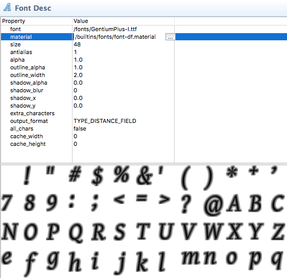
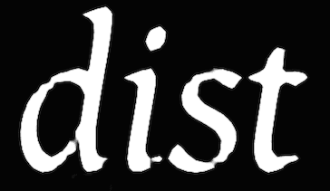

Font files
==========

Fonts are used to render label components and text nodes in GUI scenes. This manual describes how Defold handles fonts and how to bring fonts onto the screen in your games.

Font files in TrueType, OpenType or BMFont format can be added to your project and be automatically into a graphical format that Defold can render. Two font rendering techniques are available, bitmap and distance field, each with its specific benefits and drawbacks.

## Creating a font

To create a font for use in Defold, simply create a new Font file by selecting *File > New > Font File* (or right click in the *Project Explorer* and create the file).

You also need to import a font into your Defold project. Simply drag a TrueType or OpenType (or BMFont, see below) file into the *Project Explorer* and drop it in a good spot.

::: sidenote
Shadow rendering of fonts is currently disabled by default because of performance reasons. It is fairly easy to write a custom shader that renders shadows (at some cost) if you need them. In the future, Defold will be able to select an appropriate shader based on used features.
:::

*font*
: In the font editor, set this property to the imported TTF, OTF or *.fnt* file (you can click the *...* button to browse for the file). The editor will immediately create the font data and show a preview in the font editor.

*material*
: The material to use when rendering this font. Make sure to change this if you are creating a distance field font or a BMFont (see below for more on these).

*size*
: The target size of the glyphs in pixels.

*antialias*
: If the font should be antialiased when baked onto the target bitmap. Set to 0 if you want pixel perfect font rendering.

*alpha*
: The value of the alpha channel. 0.0--1.0 where 0.0 means transparent and 1.0 opaque.

*outline_alpha*
: The value of the alpha channel for the generated outline. 0.0--1.0.

*outline_width*
: The width of the generated outline in pixels. Set to 0 for no outline.

*shadow_alpha*
: The value of the alpha channel for the generated shadow. 0.0--1.0.

*shadow_blur*
: The blur radius in pixels for the generated shadow.

*shadow_x*
: The horizontal offset of the generated shadow.

*shadow_y*
: The vertical offset of the generated shadow.

*extra_characters*
: By default the font will include the ASCII printable characters (character codes 32-126). To manually include additional characters, list them in this property field.

*output_format*
: This property controls the type of font that is generated.

+
* `TYPE_BITMAP`. For OTF and TTF files, the imported font is converted into a font sheet texture where the bitmap data is used to render text nodes. The color channels are used to encode different aspects of the font, such as the face shape, outline and drop shadow. The preview shows the raw font texture with the font face in the red channel, the outline in the green channel and shadow in the blue channel. The pixel density of the font is fixed so it will look good in its generated size or scaled down. Bitmap fonts are very fast to render but size limited--scaling up a bitmap font quickly creates artifacts.
* `TYPE_DISTANCE_FIELD` The imported font is converted into a font sheet texture where the pixel data represent not screen pixels but distances to the font edge. See below for details.

*all_chars*
: If you set this property to `true` all glyphs available in the source file are included in the output.

*cache_width*
: Set this to constrain the width of the glyph cache bitmap. When the engine renders text, it looks on the cache bitmap for a glyph. If it does not exist there it will be added to the cache before rendering. If the cache bitmap is too small to contain the glyphs the engine is asked to render, an error (`ERROR:RENDER: Out of available cache cells! Consider increasing cache_width or cache_height for the font.`) is signalled. If this value is 0 then the cache size is automatically.

*cache_height*
: Set this to constrain the height of the glyph cache bitmap. If this value is 0 then the cache size is automatically.

::: sidenote
The ASCII printable characters are:
space ! " # $ % & ' ( ) * + , - . / 0 1 2 3 4 5 6 7 8 9 : ; < = > ? @ A B C D E F G H I J K L M N O P Q R S T U V W X Y Z [ \ ] ^ _ ` a b c d e f g h i j k l m n o p q r s t u v w x y z { | } ~
:::

## Bitmap BMFonts

In addition to generated bitmaps Defold supports prebaked bitmap "BMFont" format fonts. These fonts consists of a PNG font sheet with all the glyphs. In addition, a *.fnt* file contains information on where on the sheet each glyph can be found as well as size and kerning information.

These types of fonts provide no performance improvement from bitmap fonts generated from TrueType or OpenType font files, but can include arbitrary graphics, coloring and shadows right in the image.

Add the generated *.fnt* and *.png* files to your Defold project. These files should reside in the same folder. Create a new font file and set the *font* property to the *.fnt* file. Make sure that *output_format* is set to "TYPE_BITMAP". Defold will not generate a bitmap but use the one provided in the PNG.

::: sidenote
To create a BMFont, you need to use a tool that can generate the appropriate files. Several options exist:

* [Bitmap Font Generator](http://www.angelcode.com/products/bmfont/), a Windows only tool provided by AngelCode.
* [Shoebox](http://renderhjs.net/shoebox/), a free Adobe Air based app for Windows and MacOS.
* [Hiero](https://github.com/libgdx/libgdx/wiki/Hiero), an open source Java based tool.
* [Glyph Designer](https://71squared.com/glyphdesigner), a commercial MacOS tool from 71 Squared.
* [bmGlyph](https://www.bmglyph.com), a commercial MacOS tool from Sovapps.
:::

## Distance field fonts

To create a distance field font, simply select "TYPE_DISTANCE_FIELD" as *output_format*. This creates a distance field map for the font. When the engine renders the font, a special shader is required to interprets the distance data and use that to create a sharp font edge. Distance field fonts are more resource intensive than bitmap fonts, but allow for much greater sizing flexibility.

Make sure to change the *material* property of the font to "builtins/fonts/font-df.material" (or any other material that can handle the distance field data) when you create the font--or the font will not use the correct shader when it is rendered to screen.

## Artifacts and best practices

Generally, bitmap fonts are best when the font is rendered with no scaling. They are faster to render to screen than distance field fonts.

Distance field fonts respond very good to upscaling. Bitmap fonts, on the other hand, being just pixelated images will increase in size so the pixels will grow as the font is scaled, resulting in blocky artifacts. The following is a scaled sample at font size 48 pixels. The text has been scaled up roughly 8 times.

When scaling down, the situation is the opposite. The pixel texture can be scaled down and be antialiased by the rendering hardware. The following is a zoom of the same sample font at size 48 pixels. The text has been scaled down to half the size:

Distance field fonts will produce other types of artifacts in certain situations. If the font glyphs contain very thin lines and you render the font at a small size (the *size* property), the resulting distance field texture is not dense enough to hold the data required to express critical points in the glyphs. Text may then render like this:

To remedy the problem, create the font at a larger size.

