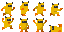
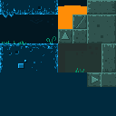
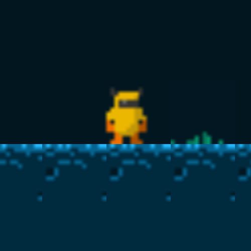
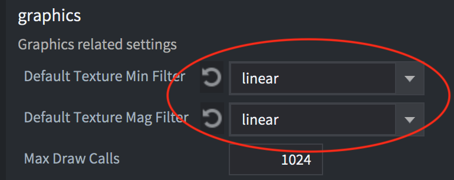
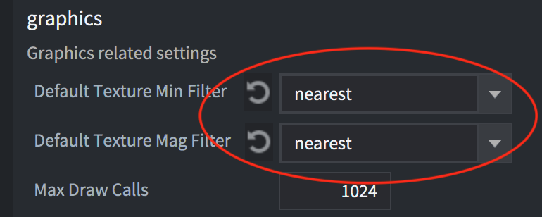
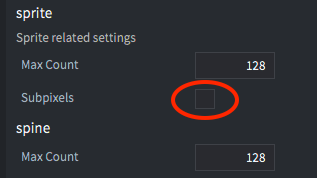
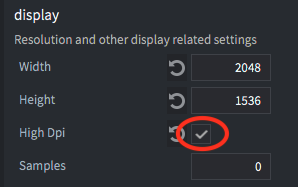
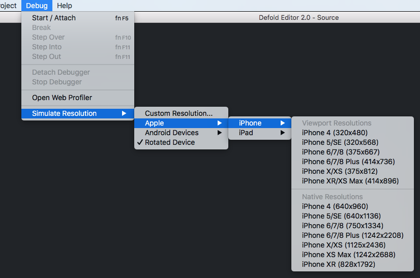

# Wprowadzenie

Jest wiele elementów do przemyślenia podczas dopasowywania gry do różnych wielkości ekranów:

* Czy jest to gra retro w niskiej rozdzielczości (pixel art)? Czy może nowoczesna gra z grafiką HD wysokiej jakości?
* Jak gra powinna zachowywać się na różnej wielkości ekranach uruchomiona na pełnym ekranie?
  * Czy gracz powinien widzieć większy fragment mapy/gry przy większej rozdzielczości? Czy może grafika powinna być skalowana do rozdzielczości, ąby zawsze pokazywać ten sam fragment?
* Jak gra powinna sobie radzić z różnymi proporcjami ekranu niż ta, którą podasz w ustawieniach *game.project*?
  * Czy gracz powinien widzieć większy fragment mapy/gry przy większej rozdzielczości? Czy może fragmenty poza proporcjami powinny być zasłonięte przez czarne paski? Czy elementy interfejsu (GUI) powinny być przeskalowane?
* Jaki rodzaj menu i elementów interfejsu potrzebujesz? Jak powinny się adaptować do zmian rozdzielczości i orientacji?
  * Czy menu i elementy interfejsu powinny zmieniać rozplanowanie wraz ze zmianą orientacji i rozdzielczości czy utrzymywać stałą pozycję?

Ta instrukcja próbuje odpowiedzieć na poniższe pytania i wskazać najlepsze praktyki.


## Jak zmienić sposób wyświetlania grafiki

Defold wykorzystuje skrypt do renderowania (opracowywania, rysowania i wyświetlania grafiki), tzw. "*render script*", który daje całkowitą kontrolę nad sposobem wyświetlania grafiki na ekranie. Render script definiuje kolejność rysowania elementów oraz co i jak ma być rysowane. Domyślne zachowanie skryptu to rysowanie takiej samej ilości pikseli określonej przez wysokość i szerokość wpisaną w ustawieniach w pliku *game.project* file, niezależnie od tego, czy rozmiar okna został zmieniony lub rozdzielczość urządzenia jest inna. Powoduje to rozciągnięcie obrazu, gdy współczynnik proporcji ekranu się zmieni oraz przeskalowany, kiedy rozmiar okna ulegnie zmianie. W niektórych grach jest to oczywiście akceptowalne, ale  jest bardziej prawdopodobne, że chcesz pokazać w takich przypadkach większą lub mniejszą część zawartości ekranu lub przynajmniej przeskalować grafikę bez zmieniania współczynnika proporcji. Domyślny sposób renderowania może więc być z łatwością zmieniony, a więcej o tym możesz się dowiedzieć tutaj: [Instrukcja renderowania](https://www.defold.com/manuals/render/#default-view-projection).


## Retro/Grafika 8-bitowa/Pixel art

Retro grafika często odnosi się do gier naśladujących styl graficzny starych gier z okresy urządzeń z ekranami o niskiej rozdzielczości i ograniczonej palecie barw. Jako przykład Nintendo Entertainment System (NES) ma rozdzielczość 256x240, Commodore 64 - 320x200, a Gameboy - 160x144, a rozdzielczości te są tylko ułamkiem rozdzielczości współczesnych ekranów. Aby umożliwić wyświetlanie takiej grafiki na nich musi ona być przeskalowana kilkukrotnie. Jednym z prostszych sposobów na wyświetlanie takiej grafiki jest wyrysowanie całej grafiki w niskiej rozdzielczości i przybliżenie widoku w momencie renderowania. Można to łatwo zrobić w Defoldzie używając render scriptu i [Stałej Projekcji](/manuals/render/#fixed-projection) ustawionej z odpowiednim zoomem.

Weźmy ten zestaw kafelków i postać ([stąd](https://ansimuz.itch.io/grotto-escape-game-art-pack)) i użyjmy do stworzenia gry w rozdzielczości 320x200:





Ustaw rozdzielczość 320x200 w pliku *game.project* i uruchom grę - po uruchomieniu ujrzysz:


Okno na nowoczesnym monitorze o wysokiej rozdzielczości jest niezwykle małe! Powiększając rozmiar okna czterokrotnie do 1280x800 będzie bardziej przystępne:


Rozmiar okna jest w porządku, więc teraz potrzeba zmienić sposób wyświetlania grafiki wewnątrz, ponieważ w chwili oecnej jest zbyt mała i ciężko jest zobaczyć cokolwiek co się dzieje w grze. Możemy użyć render scriptu aby ustawić stałą i przybliżoną projekcję:

```Lua
msg.post("@render:", "use_fixed_projection", { zoom = 4 })
```

Co da nam rezultat:


Jest lepiej. Okno i grafika mają odpowiedni rozmiar, ale po przyjrzeniu się bliżej widzimy problem:



Obraz jest rozmazany! Jest to spowodowane domyślnym sposobem próbkowania grafiki renderowanej przez GPU podczas przybliżania widoku. Domyślne ustawienie w pliku *game.project* w sekcji *Graphics* to *linear* (liniowe):



Zmiana na *nearest* (najbliższy) da nam rezultat:




I mamy przejrzystą grafikę pikselową do naszej gry retro! Jest nawet więcej elementów do rozważenia, jak na przykład wyłączenie sub-pikseli dla sprite'ów w *game.project*:



Gdy opcja Subpixels jest wyłączona grafiki nigdy nie będą wyświetlana w częściach piskeli, a zamiast tego przystosowane do siatki pełnych pikseli.

## Grafika w wysokiej rozdzielczości (HD)

Podczas pracy z grafiką w wysokiej rozdzielczości należy podejść do ustawień w inny sposób niż do grafiki retro. Z grafiką bitmapową musisz przygotować obrazy w takiej rozdzielczości, aby wyglądały ostro i przejrzyście na monitorach o wysokiej rozdzielczości wyświetlone w skali 1:1.

Tutaj również należy wprowadzić zmiany w skrypcie renderowania. W tym przypadku należy skalować grafikę razem ze zmianą rozdzielczości z zachowaniem oryginalnego współczynnika proporcji ekranu:

```Lua
msg.post("@render:", "use_fixed_fit_projection")
```

Zapewni to zmianę przybliżenia widoku w taki sposób, że na ekranie będzie widoczna zawsze taka sama część grafiki/zawartości określona w pliku *game.project*, lub tylko z dodatkowym obszarem wyświetlonym nad i pod lub obok oryginalnego obrazu w zależności od tego czy współczynnik proporcji ekranu będzie inny niż oryginalny.

Powinno się określić wysokość i szerokość obrazu w pliku *game.project* do rozmiaru, który pozwoli na wyświetlenie Twoich grafik bez przeskalowania.

### Ustawienie High DPI i ekrany Retina

Jeśli chcesz również wspierać ekrany Retina możesz to włączyć w pliku *game.project* w sekcji *Display*(Wyświetlacz):



Pozwoli to na tworzenie bufora High DPI na wyświetlaczach/ekranach, które wspierają taką technologię. Gra będzie wyświetlana w rozdzielczości dwukrotnie większej niż ta ustawiona oryginalnie, która jednak nadal pozostanie rozdzielczościa postrzeganą przez logikę gry. Oznacza to, że wszystkie pomiary pozostają takie same i zawartość renderowana w skali 1x również. Ale gdy zaimportujesz obrazy w wysokiej rozdzielczości i zmniejszysz dwukrotnie, będą nadal wyświetlane jako High DPI na ekranie.


## Tworzenie interfejsu adaptacyjnego

System do tworzenia elementów interfejsu użytkownika (GUI - ang. Graphical User Interface) opiera się na kilku podstawowych blokach, tzw. [węzłach](/manuals/gui/#node-types), i mimo, że wygląda na uproszczony, można dzięki niemu stworzyć zaawansowane elementy, przyciski, indykatory, menusy i pop-upy. Tworzone przez Ciebie GUI może być skonfigurowane do automatycznej adaptacji do różnych wielkości ekranów i zmian orientacji. Możesz przykłądowo zachować węzły zakotwiczone do góru, dołu lub boków ekranu i mogą one zachowywać lub zmieniać swój rozmiar i skalę. Zależności pomiędzy węzłami, jak i również ich rozmiarami mogą być również skonfigurowane, aby dostosować się do zmian rozdzielczości i orientacji.

### Właściwości węzłów

Każdy węzeł w systemie GUI ma swoją oś (ang. pivot), horyzontalne i wertykalne zakotwiczenie (ang. anchor) oraz tryb dopasowania (ang. adjust mode).

* *Pivot* definiuje punkt środkowy węzła.
* *Anchor* (kotwica) kontroluje zmianę położenia pionowego lub poziomego kiedy granice sceny, lub granice węzła-rodzica są rozciągnięte, aby dostosować się do zmiany rozmiaru ekranu.
* *Adjust mode* (tryb dopasowania) kontroluje co dzieje się z węzłem, gdy granice sceny lub węzła-rodzica są dopasowane do wypełnienia ekranu.

Więcej o tych właściwościach możesz przeczytać [w tej instrukcji do GUI](/manuals/gui/#node-properties).

### Rozplanowanie elementów (Layouts)

Defold oferuje interfejsy GUI, które automatycznie dopasowują się do różnych wielkości ekranów i orientacji na urządzeniach mobilnych. Używając tych właściwości możesz zaprojektować GUI, które adaptuje się do zmian współczynnika proporcji i orientacji ekranu na ekranach o różnych rozmiarach. Można również skonfigurować rozplanowanie elementów dla konkretnych modeli urządzeń. Możesz się dowiedzieć o tym więcej [w tej instrukcji do layout'ów GUI](/manuals/gui-layouts/)


## Testowanie ekranów o różnych wielkościach

Defold oferuje menu do debugowania, które zawiera opcję symulowania rozdzielczości konretnego urządzenia lub dowolnej rozdzielczości. Gdy aplikacja jest uruchomiona możesz kliknąć <kbd>Debug->Simulate Resolution</kbd> i wybrać jedno z urządzeń z listy. Okno aplikacji zmieni rozmiar i będziesz widzieć, jak Twoja gra wygląda na ekranie o danej rozdzielczości z danym współczynnikiem proporcji.


