# Wprowadzenie

Podczas dostosowywania gry i grafiki do różnych rozmiarów ekranu warto wziąć pod uwagę kilka kwestii:

* Czy jest to gra retro z niską rozdzielczością i pikselową grafiką, czy nowoczesna gra z grafiką HD wysokiej jakości?
* Jak gra powinna się zachowywać w trybie pełnoekranowym na ekranach o różnych rozmiarach?
  * Czy gracz powinien widzieć więcej zawartości gry na ekranie o wysokiej rozdzielczości, czy grafika powinna skalować się adaptacyjnie, aby zawsze pokazywać ten sam obszar?
* Jak gra powinna radzić sobie z proporcjami obrazu innymi niż te ustawione w pliku *game.project*?
  * Czy gracz powinien widzieć więcej zawartości gry? A może powinny pojawić się czarne pasy? A może elementy GUI powinny zostać przeskalowane?
* Jakiego rodzaju menu i elementy GUI na ekranie są potrzebne i jak powinny się dostosowywać do różnych rozmiarów ekranu oraz orientacji?
  * Czy menu i inne elementy GUI powinny zmieniać układ po zmianie orientacji, czy raczej zachowywać ten sam układ niezależnie od orientacji?

Ta instrukcja omawia część z tych zagadnień i podaje zalecane praktyki.


## Jak zmienić sposób renderowania zawartości

Skrypt do renderowania Defold daje pełną kontrolę nad całym potokiem renderowania. Skrypt renderowania decyduje zarówno o kolejności, jak i o tym, co oraz w jaki sposób jest rysowane. Domyślne zachowanie skryptu renderowania polega na tym, że zawsze rysuje ten sam obszar pikseli, zdefiniowany przez szerokość i wysokość w pliku *game.project*, niezależnie od tego, czy rozmiar okna został zmieniony albo rzeczywista rozdzielczość ekranu się nie zgadza. W efekcie zawartość rozciągnie się, jeśli zmieni się proporcja obrazu, albo zostanie przybliżona lub oddalona, jeśli zmieni się rozmiar okna. W niektórych grach może to być akceptowalne, ale częściej zależy nam na pokazaniu większej lub mniejszej części zawartości gry, gdy rozdzielczość lub proporcje obrazu są inne, albo przynajmniej na zachowaniu proporcji podczas skalowania. Domyślne zachowanie rozciągania można łatwo zmienić, a więcej informacji na ten temat znajdziesz w [instrukcji renderowania](https://www.defold.com/manuals/render/#default-view-projection).


## Grafika retro/8-bitowa

Grafika retro/8-bitowa często oznacza gry naśladujące styl graficzny starych konsol i komputerów, z ich niską rozdzielczością oraz ograniczoną paletą kolorów. Na przykład Nintendo Entertainment System (NES) miał rozdzielczość 256x240, Commodore 64 - 320x200, a Gameboy - 160x144, czyli wszystkie te wartości stanowią tylko ułamek rozdzielczości współczesnych ekranów. Aby gry naśladujące ten styl graficzny i taką rozdzielczość były grywalne na nowoczesnym ekranie o wysokiej rozdzielczości, grafikę trzeba kilkukrotnie przeskalować lub przybliżyć. Jednym z prostych sposobów jest tworzenie całej grafiki w niskiej rozdzielczości i stylu, który chcesz naśladować, a następnie powiększanie jej podczas renderowania. W Defold można to łatwo osiągnąć, używając skryptu renderowania i [Fixed Projection](/manuals/render/#fixed-projection) ustawionej na odpowiednią wartość zoom.

Weźmy ten tileset i postać ([źródło](https://ansimuz.itch.io/grotto-escape-game-art-pack)) i użyjmy ich w 8-bitowej grze retro w rozdzielczości 320x200:

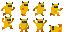

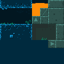

Ustawienie 320x200 w pliku *game.project* i uruchomienie gry da taki efekt:

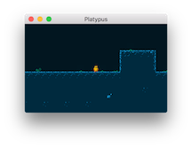

Okno jest na nowoczesnym ekranie o wysokiej rozdzielczości bardzo małe! Zwiększenie rozmiaru okna czterokrotnie, do 1280x800, sprawia, że staje się ono bardziej odpowiednie dla współczesnego monitora:

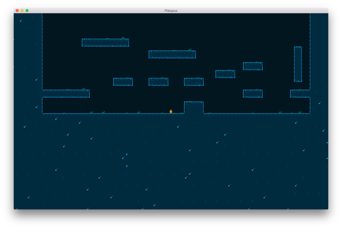

Skoro rozmiar okna jest już bardziej sensowny, musimy jeszcze zrobić coś z grafiką. Jest tak mała, że trudno zorientować się, co dzieje się w grze. Możemy użyć skryptu renderowania, aby ustawić stałą, powiększoną projekcję:

```Lua
msg.post("@render:", "use_fixed_projection", { zoom = 4 })
```

::: sidenote
Ten sam efekt można uzyskać, podłączając [komponent Camera](manuals/camera/) do obiektu gry, zaznaczając *Orthographic Projection* i ustawiając *Orthographic Zoom* na 4.0:


:::

To da następujący wynik:

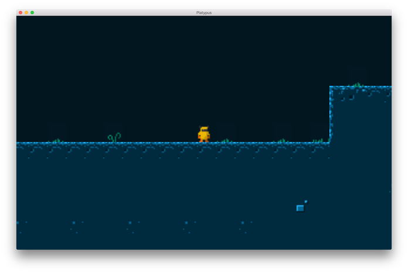

Jest lepiej. Okno i grafika mają już sensowny rozmiar, ale po bliższym przyjrzeniu się widać wyraźny problem:

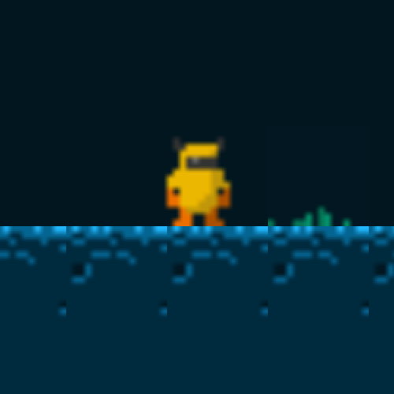

Grafika jest rozmyta! Wynika to ze sposobu próbkowania powiększonej grafiki z tekstury podczas renderowania przez GPU. Domyślne ustawienie w pliku *game.project* w sekcji Graphics to *linear*:

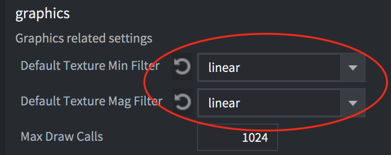

Zmiana tego ustawienia na *nearest* daje oczekiwany rezultat:

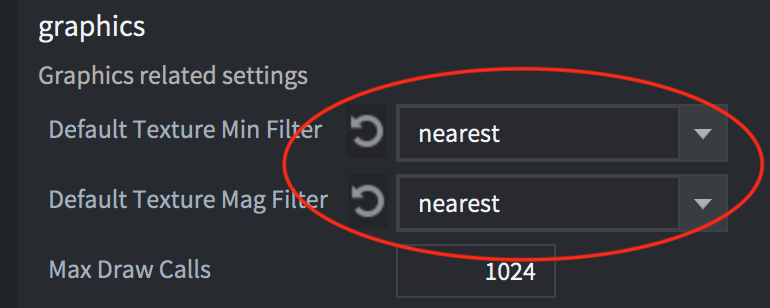

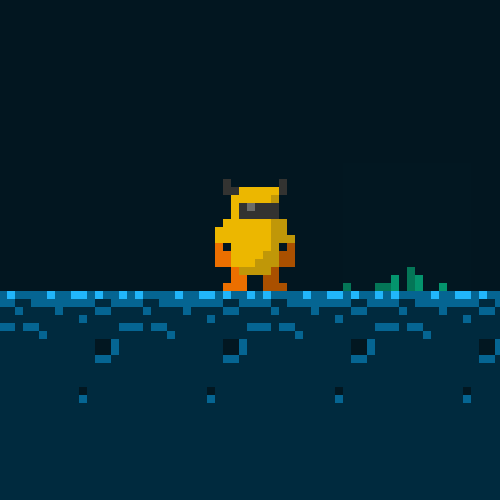

Teraz mamy ostrą, pikselową grafikę naszej retro gry. Jest jeszcze więcej rzeczy do rozważenia, na przykład wyłączenie subpikseli dla sprite'ów w pliku *game.project*:

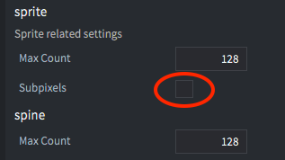

Gdy opcja Subpixels jest wyłączona, sprite'y nigdy nie są renderowane na półpikselach i zawsze są przyciągane do najbliższego pełnego piksela.

## Grafika o wysokiej rozdzielczości

W przypadku grafiki o wysokiej rozdzielczości trzeba podejść do konfiguracji projektu i zawartości inaczej niż przy grafice retro/8-bitowej. W przypadku grafiki bitmapowej należy tworzyć zasoby w taki sposób, aby dobrze wyglądały na ekranie o wysokiej rozdzielczości przy skali 1:1.

Podobnie jak w przypadku grafiki retro/8-bitowej trzeba zmienić skrypt renderowania. Tutaj zależy nam na tym, aby grafika skalowała się wraz z rozmiarem ekranu, zachowując oryginalne proporcje obrazu:

```Lua
msg.post("@render:", "use_fixed_fit_projection")
```

Dzięki temu ekran będzie się zmieniał tak, aby zawsze pokazywać tę samą ilość zawartości określoną w pliku *game.project*, ewentualnie z dodatkową zawartością widoczną nad i pod głównym obszarem albo po bokach, zależnie od tego, czy proporcje obrazu są inne.

Powinieneś skonfigurować szerokość i wysokość w pliku *game.project* na taki rozmiar, który pozwoli wyświetlać zawartość gry bez skalowania.

### Ustawienie High DPI i ekrany Retina

Jeśli chcesz także wspierać ekrany Retina, możesz włączyć tę opcję w pliku *game.project* w sekcji Display:

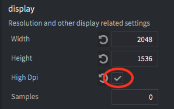

Spowoduje to utworzenie bufora wysokiego DPI na ekranach, które to obsługują. Gra będzie renderowana w rozdzielczości dwukrotnie większej niż ta ustawiona w polach Width i Height, które nadal pozostaną logiczną rozdzielczością używaną w skryptach i właściwościach. Oznacza to, że wszystkie wartości pomiarów pozostaną takie same, a zawartość renderowana w skali 1x będzie wyglądała tak samo. Jeśli jednak zaimportujesz obrazy w wysokiej rozdzielczości i przeskalujesz je do 0.5x, będą one wyświetlane na ekranie jako High DPI.


## Tworzenie adaptacyjnego GUI

System tworzenia komponentów GUI opiera się na kilku podstawowych elementach, czyli [węzłach](/manuals/gui/#node-types). Choć może wydawać się uproszczony, można go wykorzystać do tworzenia wszystkiego, od przycisków po złożone menu i popupy. Tworzone GUI można skonfigurować tak, aby automatycznie dostosowywało się do zmian rozmiaru ekranu i orientacji. Na przykład można przypinać węzły do górnej, dolnej lub bocznych krawędzi ekranu, a węzły mogą zachowywać swój rozmiar albo się rozciągać. Relację między węzłami, a także ich rozmiar i wygląd, można również skonfigurować tak, aby zmieniały się wraz ze zmianą rozmiaru ekranu lub orientacji.

### Właściwości węzłów

Każdy węzeł w GUI ma punkt pivot, poziome i pionowe zakotwiczenie oraz tryb dopasowania.

* Punkt pivot określa środek węzła.
* Tryb anchor określa, jak zmienia się pozycja pionowa i pozioma węzła, gdy granice sceny lub granice węzła nadrzędnego są rozciągane tak, aby dopasować się do fizycznego rozmiaru ekranu.
* Ustawienie adjust mode określa, co dzieje się z węzłem, gdy granice sceny lub granice węzła nadrzędnego są dopasowywane do fizycznego rozmiaru ekranu.

Więcej informacji o tych właściwościach znajdziesz w [instrukcji GUI](/manuals/gui/#node-properties).

### Układy

Defold obsługuje GUI, które automatycznie dostosowują się do zmian orientacji ekranu na urządzeniach mobilnych. Dzięki tej funkcji możesz zaprojektować GUI, które dopasowuje się do orientacji i proporcji obrazu na szerokim zakresie rozmiarów ekranów. Można też tworzyć układy odpowiadające konkretnym modelom urządzeń. Więcej informacji o tym systemie znajdziesz w [instrukcji GUI Layouts](/manuals/gui-layouts/)


## Testowanie różnych rozmiarów ekranu

Menu Debug zawiera opcję symulowania rozdzielczości konkretnego modelu urządzenia albo własnej rozdzielczości. Gdy aplikacja jest uruchomiona, możesz wybrać <kbd>Debug->Simulate Resolution</kbd> i wskazać jeden z modeli urządzeń z listy. Okno uruchomionej aplikacji zmieni rozmiar i będziesz mógł sprawdzić, jak gra wygląda w innej rozdzielczości lub przy innych proporcjach obrazu.

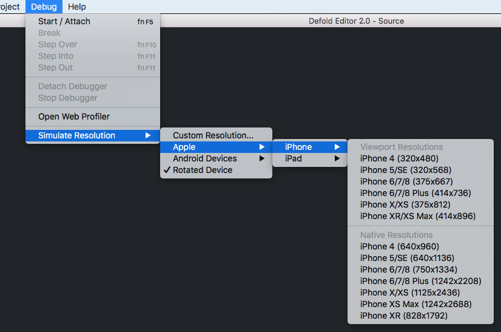
