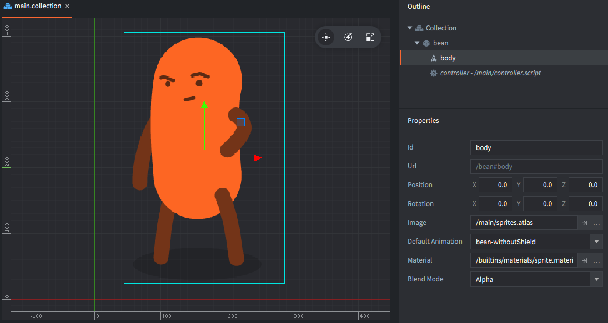
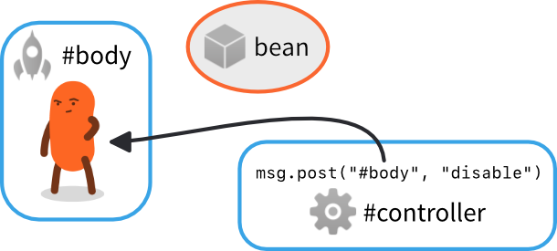
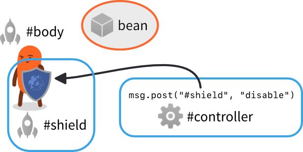
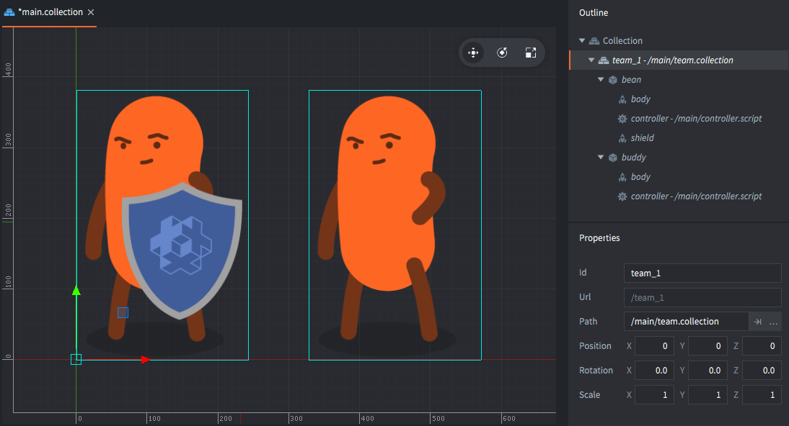
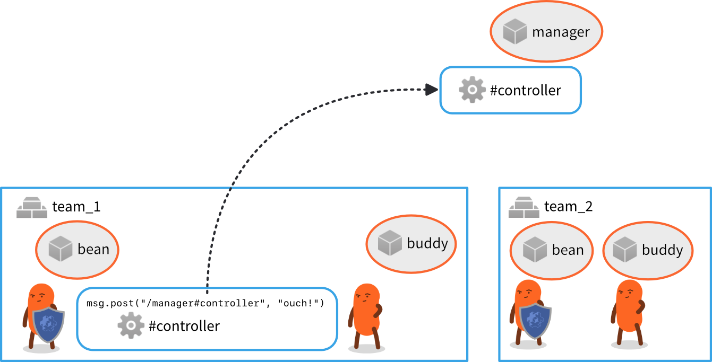
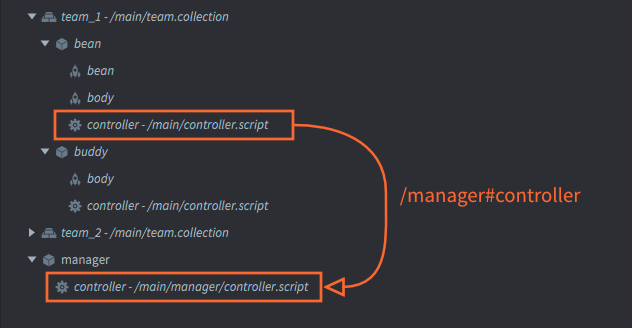

# Adresowanie

Kod, który kontroluje grę musi obejmować zasięgiem wszystkie obiekty i komponenty, aby poruszać, skalować, animować, usuwać czy manipulować co gracz widzi i słyszy. Umożliwia to mechanizm adresowania w silniku Defold.

## Identyfikatory

Defold wykorzystuje adresy (tzw. URL z ang. Uniform Resource Locator)) aby odnosić się do obiektów i komponentów. Te adresy składają się z identyfikatorów (ID). Poniżej przedstawiono wszystkie przykłady tego, jak Defold wykorzystuje adresy. W tej instrukcji przeanalizujemy je szczegółowo:

```lua
local id = factory.create("#enemy_factory")
label.set_text("my_gameobject#my_label", "Hello World!")

local pos = go.get_position("my_gameobject")
go.set_position(pos, "/level/stuff/other_gameobject")

msg.post("#", "hello_there")
local id = go.get_id(".")
```

Rozpocznijmy bardzo prostym przykładem. Załóżmy, że masz obiekt (game object) z pojedynczym komponentem typu sprite. Masz również pod tym obiektem komponent typu skrypt, który kontroluje ten obiekt. Taka hierarchia w edytorze powinna wyglądać tak:



Załóżmy, że chcesz wyłączyć komponent typu sprite zaraz, gdy gra się uruchomi, aby pokazać go później. Można to z łatwością zrobić przez umieszczenie poniższego kodu w pliku *"controller.script"*:

```lua
function init(self)
    msg.post("#body", "disable") -- <1>
end
```
1. Nie przejmuj się na tę chwilę znakiem '#'. Powrócimy do tego.

Będzie to działać tak jak oczekiwaliśmy. Gdy gra się uruchomi, skrypt *adresując* komponent typu sprite poprzez jego identyfikator "body" i użyje tego adresu aby wysłać do niego specjalną *wiadomość* o treści "disable" (ang. wyłącz). Efektem tej specjalnej wiadomości silnika jest to, że w komponencie sprite zostanie ukryty/wyłączony. Schematowo, ustawienie wygląda następująco:



Identyfkatory w ustawieniu są arbitralne. Tutaj, my wybraliśmy aby nadać obiektowi identyfikator "bean" (ang. fasola), a jego komponent typu sprite ma identyfikator "body" (ang. ciało), a skrypt kontrolujący postać został nazwany "controller".

::: sidenote
Jeśli sam nie wybierzesz identyfikatora, edytor zrobi to za Ciebie. Kiedykowliek tworzysz nowy obiekt lub komponent w edytorze zostaje mu przydzielony z góry unikalny *Id*.

- Obiekty (ang. game objects) mają z góry przypisany Id "go" z numerem ("go2", "go3" itd.).
- Komponenty dostają Id odpowiadające typowi ("sprite", "sprite2", "label", "sound" itp.).

Oczywiście możesz pozostać przy tak wygenerowanych nazwach, ale zachęcamy do ich zmiany na dobre, opisowe i znaczące nazwy.
:::

Teraz dodajmy kolejny komponent typu sprite dając postaci tarczę:


Nowy komponent musi mieć unikalną nazwę w obrębie danego obiektu. Jeśli spróbujesz ponownie nazwać komponent "body", będzie to niejednoznaczne i skrypt nie będzie "wiedział", do którego "body" ma wysłać wiadomość "disable". Dlatego wybieramy nową, znaczącą i unikalną nazwę "shield" (ang. tarcza). Teraz można dowolnie włączać i wyłączać sprite'y "body" i "shield".



::: sidenote
Jeśli spróbujesz nadać nieunikalną nazwę, edytor i tak zasygnalizuje błąd, więc w praktyce to nigdy nie jest problem nie do zauważenia:


:::

Zobaczmy teraz co się stanie, gdy dodamy więcej obiektów. Załóżmy, że chcesz stworzyć małą drużynę "fasolek". Decydujesz się nazwać jeden z obiektów "bean", a drugi "buddy" (ang. kolega). Ponadto, kiedy "bean" będzie przez chwilę bezczynny, powinien powiedzieć swojemu koledze "buddy", aby zaczął tańczyć. Można to zrobić przez wysłanie niestandradowej wiadomości o treści "dance" (ang. tańcz) ze skryptu "controller" obiektu "bean" do skryptu "controller" obiektu "buddy":


::: sidenote
Są tutaj dwa komponenty typu skrypt nazwane "controller", ale każdy w osobnym obiekcie, więc jest to całkowicie dozwolone, ponieważ ich całkowite nazwy (adresy) uwzględniające identyfikatory obiektów są od siebie różne. Nowy obiekt tworzy więc tzw. nowy kontekst nazewniczy.
:::

Ponieważ wysyłamy wiadomość do komponentu poza naszym obiektem ("bean"), w kodzie musimy określić, do którego komponentu "controller" nasza wiadomość powinna być wysłana. Musimy więc w tym przypadku określić zarówno identyfikator obiektu (game object id) i komponentu (component id). Pełny adres komponentu "controller" z obiektu "buddy" brzmi więc: `"buddy#controller"` i adres ten składa się z dwóch części.

- Najpierw określamy identyfikator obiektu ("buddy"),
- następnie wstawiamy wspomniany już znak oddzielenia id obiektu od komponentu ("#"),
- i na końcu dodajemy identyfikator komponentu ("controller").

Wracając do poprzedniego przykładu z jednym obiektem (game object) widzimy, że zostawiając identyfikator obiektu pusty w adresie (brak id przed "#") jest automatycznie wnioskowany komponent z tego samego obiektu co skrypt, który wysyła taką wiadomość - kod adresuje więc komponenty z *własnego obiektu*.

Przykładowo, `"#body"` oznacza, że adresujemy komponent "body" we własnym obiekcie. Jest to bardzo przydatne uproszczenie, ponieważ można dzięki temu stworzyć generyczny kod, który będzie działał jako skrypt dla *dowolnego* obiektu, jeśli tylko posiada on komponent "body".

## Kolekcje

Kolekce (ang. collections) umożliwiają tworzenie grup i hierarchi obiektów (game objects) i wykorzystywania ich w kontrolowany sposób. Używa się plików typu kolekcja jak szablonów (tzw. "prototypów" czy "prefabów") w edytorze kiedy chcesz umieścić w grze obiekty.

Załóżmy, że chcesz utworzyć grupę "fasolek" jak powyżej, ale do ogólnego użytku. Dobrym sposobem na to jest stworzenie szablonu w nowym pliku *collection file* (nazwij go "team.collection"). Umieść obiekty w tym pliku (w taki sam sposób jak tworzyłeś grupę powyżej w głównej kolekcji (main bootstrap collection)) i zapisz go. Następnie utwórz instancję tej kolekcji (tego pliku) w głównej kolekcji gry i nadaj mu identyfikator "team_1":



Z taką strukturą obiekt "bean" może wciąż odnosić się do komponentu "controller" w skrypcie obiektu "buddy" poprzez adres `"buddy#controller"`.


I jeśli dodasz kolejną instancję kolekcji "team.collection" (nazwij ją "team_2"), kod uruchomiony wewnątrz kolekcji "team_2" również będzie działał. Obiekt "bean" z instancji kolekcji "team_2" może wciąż wysyłać wiadomości do skryptu "controller" w obiekcie "buddy" poprzez adres `"buddy#controller"`. Dzieje się tak z tego samego powodu, z którego mogliśmy to doprowadzić do działania w przypadku dwóch obiektów:


## Adresowanie relatywne

Adres `"buddy#controller"` działa dla obiektów z obu kolekcji, ponieważ jest *relatywny* czy też względny. Każda z instancji kolekcji "team_1" i "team_2" tworzy nowy kotekst nazweniczy (czy też "namespace"). Defold omija więc duplikowanie nazw przez używanie zarówno identyfikatorów komponentów i obiektów jak i kolekcji w celu tworzenia adresu:


- W obrębie kontekstu nazewniczego kolekcji "team_1", obiekty "bean" i "buddy" mają unikalne adresy.
- Analogicznie, W obrębie kontekstu nazewniczego kolekcji "team_2", obiekty "bean" i "buddy" mają również unikalne adresy.

Adresowanie relatywne (względne) działa dzięki automatycznemu używaniu identyfikatora własnej, obecnej kolekcji (czy też własnego kontekstu nazewniczego) przy tworzeniu adresu każdego komponentu. Jest to również niezwykle przydatne, ponieważ możesz tworzyć grupy obiektów z tym samym kodem dla każdego z nich i wykorzystywać je wielokrotnie w grze.

### Skróty

Defold pozwala na używanie dwóch przydatnych skrótów przy tworzeniu adresu, bez określania konkretnego adresu URL komponentu ("#") czy obiektu ("."):

:[Shorthands](../shared/url-shorthands.md)

## Ścieżki do obiektów

Aby poprawnie zrozumieć mechanizm adresowania, spójrzmy co się stanie, gdy zbudujesz i uruchomisz projekt:

1. Edytor początkowo wczytuje kolekcję główną (bootstrap main collection) ("main.collection") i całą jej zawartość (obiekty i inne kolekcje wewnątrz).
2. Dla każdego obiektu statycznego (którego instancja już istnieje), kompilator tworzy identyfikator (adres). Te są zbudowane korzystając ze "ścieżek" startując od źródła kolekcji bootstrapowej (root), w dół hierarchi aż do danego obiektu. Znak '/' jest dodawany przy każdym zejściu poziomu hierarchi.

Dla przykładu powyżej, gra uruchomi się startując z 4 obiektami:

- /team_1/bean
- /team_1/buddy
- /team_2/bean
- /team_2/buddy

::: sidenote
Adresy komponentów są przechowywane jako "posiekane" / "skrócone" (ang. hashed - i może lepiej jako programista używać angielskiej nazwy (hash)[https://pl.wikipedia.org/wiki/Funkcja_skrótu]- przyp. tłumacza) wartości. W czasie działania program przechowuje adresy również jako "shaszowane" dla każdej instancji w kolekcji, która jest w użyciu, aby zachować ciągłość nazwy adresu absolutnego (bezwzględnego).
:::

W czasie działania programu, grupowanie kolekcji nie istnieje. Nie ma sposobu na sprawdzenie do jakiej kolekcji przynależy dany obiekt przed kompilacją. Nie jest też możliwe manipulowanie wszystkimi obiektami w kolekcji naraz. Jeśli jednak potrzebujesz wykorzystywać takie operacje  możesz z łatwością śledzić adres w kodzie. Każdy identyfikator obiektu jest statyczny, jest więc gwarantowane, że zostanie stały przez cały cykl życia obiektu. Oznacza to, że można bezpiecznie przechować id obiektu i używać go później.

## Adresowanie absolutne

Jest oczywiście możliwe używanie bezwzględnych (absolutnych) adresów komponentów podczas adresowania. W wielu przypadkach adresowanie relatywne jest prefereowane z powodu możliwości wielokrotnego wykorzystania kodu, ale są przypadki, gdzie wymagane jest adresowanie absolutne.

Na przykład, załóżmy, że chcesz stworzyć jeden manager AI, który będzie śledził stan wszytkich obiektów "fasolek". Chcesz, żeby "fasolki" raportowały swój status do managera, a manager podejmował taktyczne decyzje i wydawał rozkazy każdej "fasolce" bazując na jej stanie. W tym przypadku jest całkowicie sensowne użycie absolutnego adresowania do wysyłania wiadomości do managera, którego jedną instancję utworzysz w głównej kolekcji bootstrapowej obok wielu instancji "fasolek".


Każda "fasolka" jest odpowiedzialna za wysyłanie wiadomości ze statusem do managera AI: "contact", jeśli zauważy wroga lub "ouch!", gdy otrzyma obrażenia. Aby to działało, skrypt obiektu "fasolki" może użyć absolutnego adresu skryptu "controller" managera AI nazwanego pragmatycznie "manager".

Każdy adres, który rozpoczyna się znakiem '/' będzie właśnie rozkodowywany od źródła kolekcji (root). W tym przypadku odpowiada to "rootowi" *kolekcji bootstrapowej*, która jest wczytywana wraz ze startem gry.

Adres absolutny skryptu managera to `"/manager#controller"` i będzie on zawsze opisywał ten skrypt, niezależnie od tego, skąd wiadomość zostanie wysłana.





## Identyfikatory haszowane (skrócone)

Silnik Defold przechowuje wszystkie identyfikatory jako "shaszowane" wartości. Wszystkie funkcje, które przyjmują jako argument komponent lub obiekt (game object) akceptują "obiekty" typu string, hash lub URL. Powyżej używaliśmy tylko stringów do adresowania.

Kiedy pobierasz identyfikator obiektu, silnik Defold zawsze zwróci ścieżkę absolutną identyfkatora, która jest haszowana:

```lua
local my_id = go.get_id()
print(my_id) --> hash: [/path/to/the/object]

local spawned_id = factory.create("#some_factory")
print(spawned_id) --> hash: [/instance42]
```

Możesz użyć takiego identyfikatora zamiast adresu w postaci stringa lub skonstruować go samemu. Pamiętaj jednak, że shaszowany identyfikator odpowiada adresowi utworzonemu ze ścieżki do obiektu, czyli adresowi absolutnemu:

::: sidenote
Powodem, dla którego musimy podać stringi do stworzenia adresu relatywnego jest tworzenie przez silnik Defold na nowo haszowanego id bazującego na haszowanym stanie danego kontekstu nazewniczego (kolekcji) z podanym stringiem dodanym do hasza.
:::

```lua
local spawned_id = factory.create("#some_factory")
local pos = vmath.vector3(100, 100, 0)
go.set_position(pos, spawned_id)

local other_id = hash("/path/to/the/object")
go.set_position(pos, other_id)

-- This will not work! Relative addresses must be given as strings.
local relative_id = hash("my_object")
go.set_position(pos, relative_id)
```

## URL

Aby dopełnić obraz adresowania, spójrzmy na pełny format adresu w silniku Defold: adres URL.

URL jest obiektem, zazwyczaj zapisywany jako specjalnie sformatowany string. Ogólny URL w Defoldzie składa się z trzech części:

`[socket:][path][#fragment]`

socket
: Identyfikuje świat, w którym obiekt istnieje (instancję kolekcji). Jest to ważne podczas pracy z [Pełnomocnikami Kolekcji (Collection Proxy)](/manuals/collection-proxy) i jest później wykorzystywane do _dynamicznie załadowanej kolekcji_.

path
: Część adresu URL zawierająca pełne id danego obiektu (game object).

fragment
: Identyfkator danego komponentu pod danym obiektem.

Tak jak wcześniej, możesz zostawić niektóre pola puste pozwalając silnikowi na wydedukowanie, o jaki element chodzi zakładając domyślne wartości jak powyżej. Bardzo rzadko jest potrzeba określania socketu, za to często musisz określić path. W przypadkach, gdy chcesz się odnieść do obiektu z innego świata (kolekcji) niż obecna, będziesz podawać socket.Przykładowo, pełny URL skryptu "controller" obiektu "manager" wygląda następująco:

`"main:/manager#controller"`

a skrypt "controller" obiektu "buddy" w kolekcji "team_2" to:

`"main:/team_2/buddy#controller"`

Możemy do nich wysłać wiadomości:

```lua
-- Send "hello" to the manager script and team buddy bean
msg.post("main:/manager#controller", "hello_manager")
msg.post("main:/team_2/buddy#controller", "hello_buddy")
```

## Konstruowanie obiektów URL

Obiekty URL mogą być również kontruowane w kodzie:

```lua
-- Construct URL object from a string:
local my_url = msg.url("main:/manager#controller")
print(my_url) --> url: [main:/manager#controller]
print(my_url.socket) --> 786443 (internal numeric value)
print(my_url.path) --> hash: [/manager]
print(my_url.fragment) --> hash: [controller]

-- Construct URL from parameters:
local my_url = msg.url("main", "/manager", "controller")
print(my_url) --> url: [main:/manager#controller]

-- Build from empty URL object:
local my_url = msg.url()
my_url.socket = "main" -- specify by valid name
my_url.path = hash("/manager") -- specify as string or hash
my_url.fragment = "controller" -- specify as string or hash

-- Post to target specified by URL
msg.post(my_url, "hello_manager!")
```
