# Adresowanie

Kod, który steruje działającą grą, musi mieć możliwość dotarcia do każdego obiektu gry i komponentu, aby przesuwać, skalować, animować, usuwać i manipulować tym, co gracz widzi i słyszy. Mechanizm adresowania w silniku Defold sprawia, że jest to możliwe.

## Identyfikatory

Defold wykorzystuje adresy (czyli URL-e, ale na razie odłóżmy tę kwestię na bok), aby odnosić się do obiektów gry i komponentów. Adresy te składają się z identyfikatorów. Poniżej znajdziesz przykłady zastosowań adresów w silniku Defold; w tej instrukcji przyjrzymy się im dokładnie:

```lua
local id = factory.create("#enemy_factory")
label.set_text("my_gameobject#my_label", "Hello World!")

local pos = go.get_position("my_gameobject")
go.set_position(pos, "/level/stuff/other_gameobject")

msg.post("#", "hello_there")
local id = go.get_id(".")
```

Zacznijmy od bardzo prostego przykładu. Załóżmy, że masz obiekt gry zawierający pojedynczy komponent typu sprite. Pod tym obiektem znajduje się komponent typu skrypt, który go kontroluje. Taki układ w edytorze wygląda mniej więcej tak:

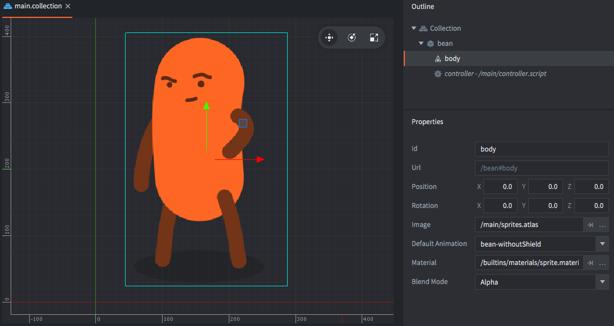

Chcesz wyłączyć sprite na starcie gry, żeby potem pokazać go ponownie. Wystarczy umieścić poniższy kod w pliku "controller.script":

```lua
function init(self)
    msg.post("#body", "disable") -- <1>
end
```

1. Nie przejmuj się na razie znakiem '#'. Wrócimy do tego za moment.

Działa to zgodnie z oczekiwaniami. Gdy gra startuje, komponent skryptowy adresuje komponent sprite po identyfikatorze "body" i używa tego adresu, aby wysłać do niego wiadomość "disable". Efektem tej specjalnej wiadomości silnika jest to, że komponent sprite ukrywa grafikę. Schematycznie sytuacja wygląda następująco:

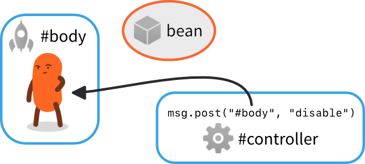

Identyfikatory w tym ustawieniu są dowolne. Tutaj zdecydowaliśmy się nadać obiektowi gry identyfikator "bean", jego komponentowi sprite identyfikator "body", a skrypt kontrolujący postać nazwaliśmy "controller".

::: sidenote
Jeśli nie wybierzesz własnego identyfikatora, edytor zrobi to za Ciebie. Kiedy tworzysz nowy obiekt gry lub komponent, automatycznie ustawiane jest unikalne *Id*.

- Obiekty gry (ang. game objects) otrzymują domyślnie identyfikator "go" z kolejnym numerem ("go2", "go3" itd.).
- Komponenty dostają identyfikator odpowiadający typowi ("sprite", "sprite2", "label", "sound" itd.).

Możesz pozostać przy tych automatycznie przypisanych nazwach, ale zachęcamy do zmiany ich na opisowe, celowe identyfikatory.
:::

Teraz dodajmy kolejny komponent sprite i wyposażmy fasolkę w tarczę:

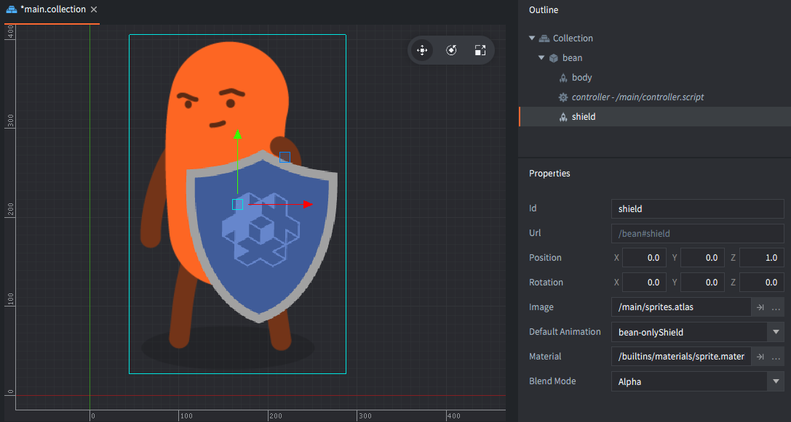

Nowy komponent musi mieć unikatowy identyfikator w obrębie obiektu gry. Gdybyś ponownie nazwał go "body", kod byłby niejednoznaczny – nie wiadomo, do którego sprite'a wysłać wiadomość "disable". Dlatego wybieramy unikalny, opisowy identyfikator "shield". W ten sposób możemy włączać i wyłączać sprite'y "body" i "shield" niezależnie.

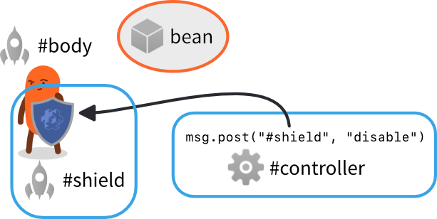

::: sidenote
Jeśli spróbujesz użyć tego samego identyfikatora dwa razy, edytor zgłosi błąd, więc w praktyce nigdy nie ma z tym problemu:

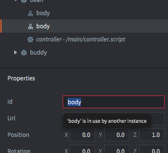
:::

Przyjrzyjmy się teraz, co się stanie, gdy dodasz kolejne obiekty. Załóżmy, że chcesz połączyć dwie fasolki w mały zespół. Nazwijmy jeden obiekt "bean", a drugiemu nadajmy nazwę "buddy". Chcemy też, żeby gdy "bean" przez chwilę stoi w miejscu, powiedział "buddy", żeby zaczął tańczyć. Robimy to wysyłając niestandardową wiadomość "dance" ze skryptu "controller" obiektu "bean" do skryptu "controller" obiektu "buddy":

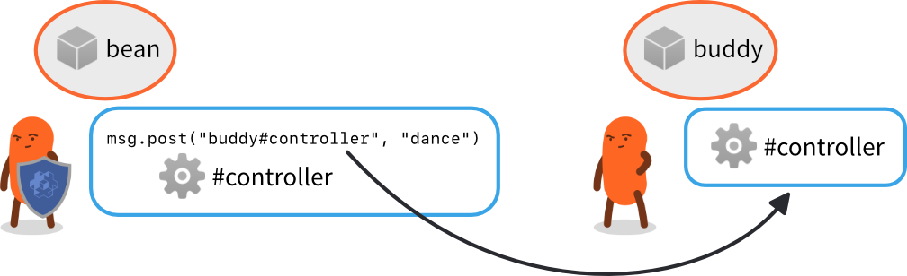

::: sidenote
Widzimy tu dwa komponenty skryptowe o nazwie "controller", ale każdy w innym obiekcie gry, więc jest to całkowicie legalne. Dla każdego obiektu tworzy się nowy kontekst nazewniczy.
:::

Ponieważ adresat wiadomości znajduje się poza obiektem wysyłającym ("bean"), kod musi określić, który komponent "controller" powinien ją otrzymać. Trzeba więc podać zarówno identyfikator obiektu gry, jak i identyfikator komponentu. Pełny adres komponentu to `"buddy#controller"` i składa się z dwóch części.

- Najpierw określamy identyfikator obiektu gry ("buddy"),
- następnie wstawiamy znak oddzielający obiekt i komponent ("#"),
- a na końcu podajemy identyfikator komponentu ("controller").

Wracając do poprzedniego przykładu z jednym obiektem gry, widzimy, że pomijając część identyfikującą obiekt (czyli nie wpisując nic przed "#"), kod odwołuje się do komponentów we *własnym obiekcie*.

Na przykład `"#body"` to adres komponentu "body" wewnątrz tego samego obiektu gry. To bardzo wygodne uproszczenie, ponieważ pozwala pisać generyczny kod, który będzie działał dla *dowolnego* obiektu, jeśli tylko zawiera komponent "body".

## Kolekcje

Kolekcje (ang. collections) pozwalają tworzyć grupy lub hierarchie obiektów gry i korzystać z nich wielokrotnie w kontrolowany sposób. W edytorze używa się plików kolekcji jako szablonów (czyli "prototypów" albo "prefabów") przy dodawaniu zawartości do gry.

Załóżmy, że chcesz wygenerować dużą liczbę duetów bean/buddy. Dobrym sposobem jest stworzenie nowego pliku kolekcji (nazwa "team.collection"), zbudowanie w nim obiektów i zapisanie go. Następnie umieść instancję tego pliku w głównej kolekcji bootstrapowej i nadaj instancji identyfikator, na przykład "team_1":

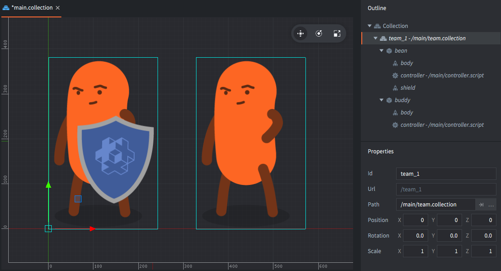

Dzięki takiej strukturze obiekt "bean" nadal może odwoływać się do komponentu "controller" obiektu "buddy" za pomocą adresu `"buddy#controller"`.

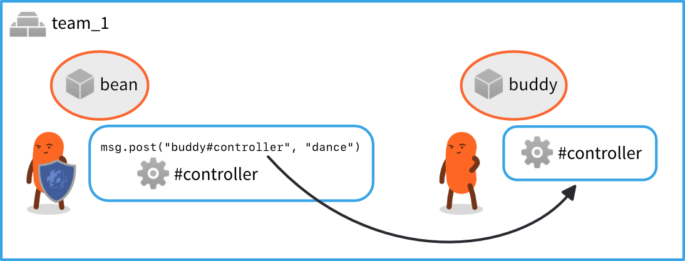

Jeśli dodasz drugą instancję "team.collection" (nazwij ją "team_2"), kod działający wewnątrz komponentów skryptowych tej instancji zadziała dokładnie tak samo. Obiekt "bean" z instancji "team_2" dalej może wysyłać wiadomości do komponentu "controller" obiektu "buddy" przez adres `"buddy#controller"`.

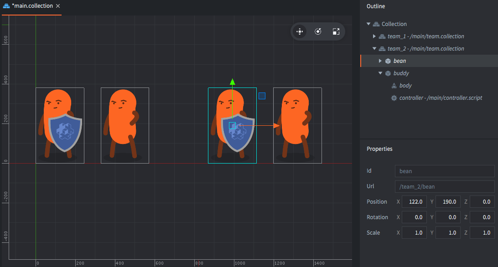

## Adresowanie relatywne

Adres `"buddy#controller"` działa dla obiektów z obu kolekcji, ponieważ jest *relatywny*. Każda instancja kolekcji "team_1" i "team_2" tworzy własny kontekst nazewniczy, czyli przestrzeń nazw. Defold unika kolizji nazw, uwzględniając ten kontekst przy adresowaniu:

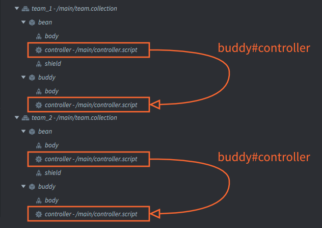

- W ramach kontekstu nazewniczego kolekcji "team_1" obiekty "bean" i "buddy" mają unikalne identyfikatory.
- W analogiczny sposób w kontekście kolekcji "team_2" identyfikatory "bean" i "buddy" również są unikatowe.

Adresowanie relatywne działa dzięki temu, że podczas rozwiązywania adresu Defold automatycznie dopisuje aktualny kontekst nazewniczy. To bardzo praktyczne, ponieważ pozwala tworzyć grupy obiektów z taką samą logiką i wielokrotnie wykorzystywać je w grze.

### Skróty

Defold udostępnia dwa przydatne skróty, które pozwalają wysyłać wiadomości bez określania pełnego URL:

:[Shorthands](../shared/url-shorthands.md)

## Ścieżki do obiektów

Aby zrozumieć mechanizm nazewnictwa, spójrzmy, co się dzieje po zbudowaniu i uruchomieniu projektu:

1. Edytor wczytuje kolekcję bootstrapową ("main.collection") i całą zawartość (obiekty gry i inne kolekcje).
2. Dla każdego statycznego obiektu gry kompilator tworzy identyfikator. Tworzy się ścieżka, która zaczyna się w "źródle" (ang. root - korzeń) kolekcji bootstrapowej i schodzi przez kolejne kolekcje aż do obiektu. Na każdym poziomie hierarchii dokleja się znak '/'.

W naszym przykładzie gra uruchomi się z czterema obiektami:

- /team_1/bean
- /team_1/buddy
- /team_2/bean
- /team_2/buddy

::: sidenote
Identyfikatory są przechowywane jako wartości haszowane. Runtime przechowuje również stan haszowania dla każdej kolekcji, co pozwala kontynuować przeliczanie relatywnych ciągów na identyfikatory absolutne.
:::

W czasie działania grupowanie kolekcji znika. Nie da się ustalić, do której kolekcji należał dany obiekt przed kompilacją. Nie można też w prosty sposób manipulować wszystkimi obiektami z kolekcji naraz. Jeśli potrzebujesz takich operacji, samodzielnie je śledź w kodzie. Identyfikator każdego obiektu jest stały przez cały czas życia obiektu. Oznacza to, że bezpiecznie można go przechować i użyć później.

## Adresowanie absolutne

Można też używać pełnych identyfikatorów opisanych powyżej. W większości przypadków preferuje się adresowanie relatywne, bo umożliwia ponowne użycie zawartości, ale zdarzają się sytuacje, gdy konieczne jest adresowanie absolutne.

Na przykład wyobraź sobie menedżera AI, który śledzi stan każdej fasolki. Chcesz, żeby fasolki raportowały swój status do menedżera, a on na podstawie tych informacji podejmował decyzje i wydawał rozkazy. W takim przypadku sensowne jest stworzenie jednego obiektu gry z komponentem skryptowym i umieszczenie go w głównej kolekcji bootstrapowej obok instancji zespołów.

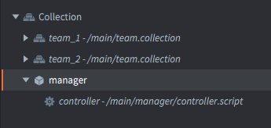

Każda fasolka odpowiada za wysyłanie wiadomości statusowych do menedżera: "contact" gdy zauważy wroga lub "ouch!" gdy dostanie obrażenia. Żeby to zadziałało, skrypt obiektu fasolki wykorzystuje absolutny adres, aby wysłać wiadomość do komponentu "controller" obiektu "manager".

Każdy adres rozpoczynający się od '/' jest rozwiązywany względem korzenia świata gry. Odpowiada to korzeniowi *kolekcji bootstrapowej*, która ładuje się przy starcie gry.

Absolutnym adresem skryptu menedżera jest `"/manager#controller"` i niezależnie od miejsca użycia zawsze wskaże właściwy komponent.

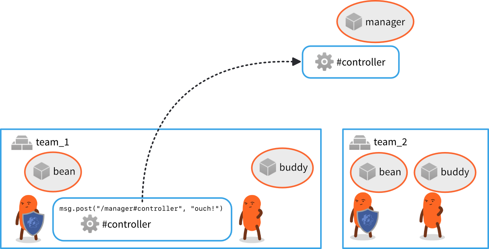

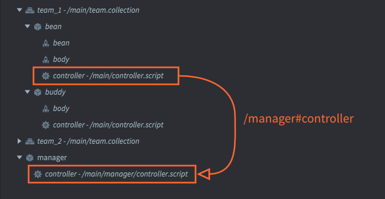

## Identyfikatory haszowane (skrócone)

Silnik przechowuje wszystkie identyfikatory jako wartości haszowane. Wszystkie funkcje przyjmujące jako argument komponent lub obiekt gry akceptują string, hash lub obiekt URL. Powyżej pokazywaliśmy adresowanie z użyciem stringów.

Kiedy pobierasz identyfikator obiektu, silnik Defold zawsze zwraca haszowaną ścieżkę absolutną:

```lua
local my_id = go.get_id()
print(my_id) --> hash: [/path/to/the/object]

local spawned_id = factory.create("#some_factory")
print(spawned_id) --> hash: [/instance42]
```

Możesz użyć takiego identyfikatora zamiast stringa albo samodzielnie go skonstruować. Pamiętaj jednak, że haszowany identyfikator odpowiada ścieżce do obiektu, czyli adresowi absolutnemu:

::: sidenote
Powodem, dla którego adresy relatywne muszą być podawane jako stringi, jest fakt, że silnik buduje nowy identyfikator haszowany na podstawie stanu haszowania aktualnego kontekstu nazewniczego (kolekcji) z dopisanym ciągiem tekstowym.
:::

```lua
local spawned_id = factory.create("#some_factory")
local pos = vmath.vector3(100, 100, 0)
go.set_position(pos, spawned_id)

local other_id = hash("/path/to/the/object")
go.set_position(pos, other_id)

-- This will not work! Relative addresses must be given as strings.
local relative_id = hash("my_object")
go.set_position(pos, relative_id)
```

## URL

Żeby dopełnić obraz, spójrzmy na pełny format adresu w silniku Defold: URL.

URL to obiekt, zwykle zapisywany jako specjalnie sformatowany string. Ogólny format URL-a wygląda tak:

`[socket:][path][#fragment]`

socket
: Identyfikuje świat gry, do którego należy cel (instancję kolekcji). Jest to istotne podczas pracy z [Pełnomocnikami kolekcji (Collection Proxy)](/manuals/collection-proxy) i służy do określenia _dynamicznie załadowanej kolekcji_.

path
: Ta część adresu URL zawiera pełny identyfikator docelowego obiektu gry.

fragment
: Identyfikator komponentu znajdującego się pod wskazanym obiektem gry.

Jak widzieliśmy wcześniej, w większości przypadków można pominąć niektóre fragmenty adresu. Zwykle nie trzeba podawać socketu, a czasami nie trzeba też podawać ścieżki. Gdy jednak chcesz odwołać się do świata innego niż aktualny, musisz określić socket. Przykładowo pełny string URL-a skryptu "controller" obiektu "manager" to:

`"main:/manager#controller"`

a kontroler kolegi z "team_2" to:

`"main:/team_2/buddy#controller"`

Możemy wysyłać wiadomości do tych komponentów:

```lua
-- Send "hello" to the manager script and team buddy bean
msg.post("main:/manager#controller", "hello_manager")
msg.post("main:/team_2/buddy#controller", "hello_buddy")
```

## Konstruowanie obiektów URL

Obiekty URL można także tworzyć programowo w kodzie Lua:

```lua
-- Construct URL object from a string:
local my_url = msg.url("main:/manager#controller")
print(my_url) --> url: [main:/manager#controller]
print(my_url.socket) --> 786443 (internal numeric value)
print(my_url.path) --> hash: [/manager]
print(my_url.fragment) --> hash: [controller]

-- Construct URL from parameters:
local my_url = msg.url("main", "/manager", "controller")
print(my_url) --> url: [main:/manager#controller]

-- Build from empty URL object:
local my_url = msg.url()
my_url.socket = "main" -- specify by valid name
my_url.path = hash("/manager") -- specify as string or hash
my_url.fragment = "controller" -- specify as string or hash

-- Post to target specified by URL
msg.post(my_url, "hello_manager!")
```
