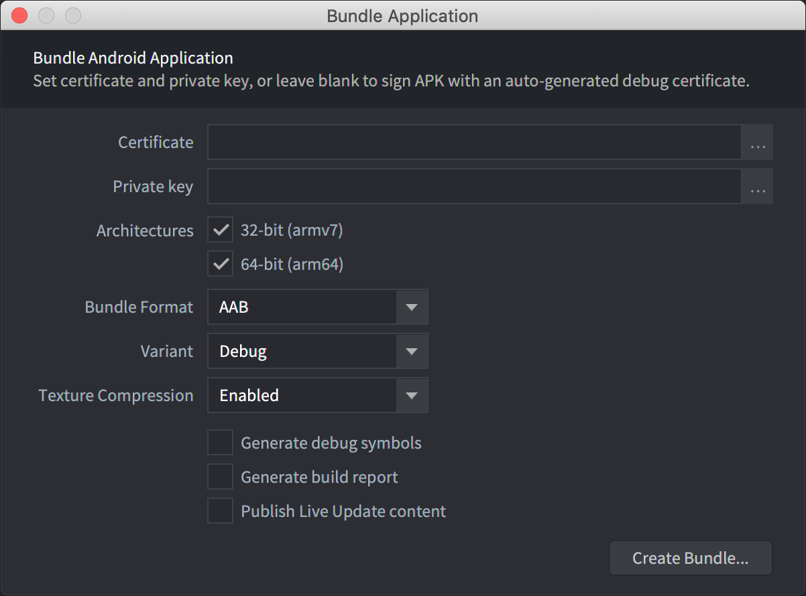
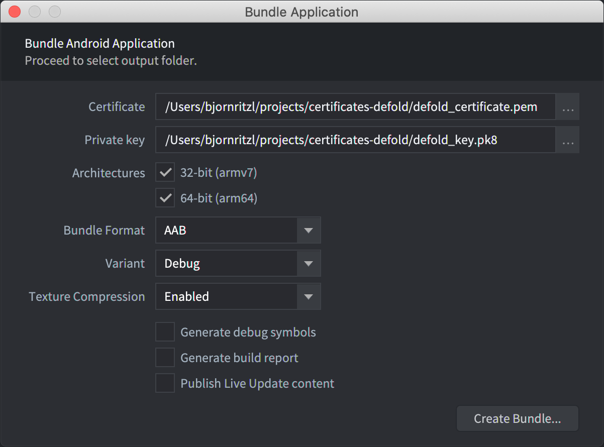
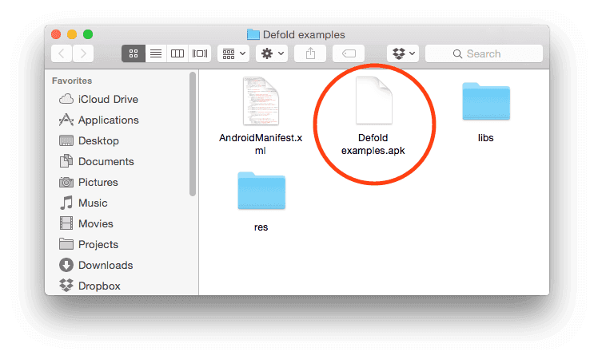

# Android development

Urządzenia z systemem Android pozwalają na swobodne otwieranie Twoich własnych aplikacji i gier. Jest bardzo łatwo zbudować wersję gry i skopiować ją na takie urządzenie. Instrukcja ta opisuje kroki procesu pakowania aplikacji na system Android. Podczas tworzenia oprogramowania z Defoldem, otwieranie i testowanie Twojej gry poprzez specjalną aplikacją zwaną [development app](/manuals/dev-app) jest często preferowane, ponieważ umożliwia szybkie przeładowanie zawartości nawet podczas działania programu i programowanie urządzenia bezprzewodowo.

## Proces podpisywania Android i Google Play

Android wyamaga, aby aplikacje, które chcesz zainstalować na urządzeniu były cyfrowo podpisane. W przeciwieństwie do iOS, gdzie wszystkie certyfikaty są przyznawane przez Apple, Android umożliwia własnoręczne podpisanie aplikacji, więc można swobodnie tworzyć certyfikaty i klucze wymagane do podpisywania.

Proces tworzenia certyfikatów i kluczy może wyglądać na skomplikowany, ale podczas tworzenia oprogramowania Defold go automatyzuje. Kiedy tworzysz aplikację i pakujesz ją do paczki (ang. Android application bundle) możesz podać specyficzny certyfikat i klucz. Jeśli tego nie zrobisz, Defold wygeneruje je za Ciebie i podpisze aplikację automatycznie.

Ważne, aby zaapamiętać, że przy releasowaniu aplikacji na Google Play, będziesz musiał stworzyć certyfikat i klucz, którymi właśnie podpiszesz tę aplikację. Powodem tego jest to, że _podczas publikowania zaktualizowanej wersji aplikacji użyć musisz tego samego podpisu jak dotychczasowa wersja_. Jeśli podpiszesz aplikację innym kluczem, Google Play odrzuci aktualizację i będziesz musiał opublikować aplikację jako osobna, nowa aplikacja.

Możesz przeczytać więcej na ten temat na stronie [Google Play developer console](https://play.google.com/apps/publish/).

## Tworzenie certyfikatów i kluczy

Musisz stworzyć certyfikaty w formacie *.pem*, a klucze w formacie *.pk8*. Możesz je wygenerować korzystając z narzędzia `openssl`:

```sh
$ openssl genrsa -out key.pem 2048
$ openssl req -new -key key.pem -out request.pem
$ openssl x509 -req -days 9999 -in request.pem -signkey key.pem -out certificate.pem
$ openssl pkcs8 -topk8 -outform DER -in key.pem -inform PEM -out key.pk8 -nocrypt
```

Uzyskasz dzięki temu pliki *certificate.pem* i *key.pk8*, które użyjesz do podpisania aplikacji.

::: important
Upewnij się, że przechowywujesz certyfikaty i klucze w bezpiecznym miejscu. Jeśli je zgubisz, _nie będziesz mógł_ w żaden sposób zaktualizować aplikacji na Google Play.
:::

## Tworzenie paczki - Android application bundle

Edytor Defold umożliwia łatwe stworzenie paczki z aplikacją. Przed pakowaniem określasz, których ikon należy używać, wersję produktu itd. w pliku "game.project". Więcej tutaj: [plik konfiguracyjny projektu](/manuals/project-settings/#android).

Aby stworzyć paczkę kliknij <kbd>Project ▸ Bundle... ▸ Android Application...</kbd> w menu.

Jeśli chcesz, aby Defold automatycznie stworzył certyfikat, zostaw pola *Certificate* i *Private key* puste:



Jeśli chcesz podpisać paczkę własnym certyfikatem i kluczem, wskaż odpowiednie pliki *.pem* i *.pk8*:



Defold wspiera tworzenie zarówno paczek APK i AAB. Wybierz APK lub AAB z rozwijanej listy "Bundle Format".

Kliknij <kbd>Create Bundle</kbd> po skonfigurowaniu wszystkich ustawień. Będziesz poproszony o wskazanie lokalizacji na Twoim urządzeniu do zapisania zbudowanej paczki.



### Instalowanie paczek na Androidzie

#### Instalowanie APK

Plik *.apk* może być skopiowany na Twoje urządzenie z systemem Android przy użyciu narzędzia `adb` (zobacz poniżej) lub załadowane do Google Play poprzez [Google Play developer console](https://play.google.com/apps/publish/).

```
$ adb install Defold\ examples.apk
4826 KB/s (18774344 bytes in 3.798s)
  pkg: /data/local/tmp/my_app.apk
Success
```

#### Instalowanie AAB

Plik *.aab* może być załadowany do Google Play poprzez [Google Play developer console](https://play.google.com/apps/publish/). Jest również możliwe wygenerowanie pliku *.apk* z pliku *.aab*, aby zainstalować je lokalnie dzięki [Android bundletool](https://developer.android.com/studio/command-line/bundletool).

## Pozwolenia

Silnik Defold wymaga niektórych pozwoleń, aby wszystkie jego elementy mogły działać. Pozwolenia są zdefiniowane w pliku `AndroidManifest.xml`, wybranym w pliku "game.project": [plik konfiguracyjny projektu](/manuals/project-settings/#android). Możesz dowiedzieć się więcej na temat pozwoleń w systemie Android w [oficjalnej dokumenetacji](https://developer.android.com/guide/topics/permissions/overview). Następujące pozwolenia są wymagane przy użyciu domyślnego pliku manifest:

### android.permission.INTERNET i android.permission.ACCESS_NETWORK_STATE (Protection level: normal)
Pozwala aplikacji na otwieranie połączeń internetowych i uzyskiwaniu informacji na temat sieci. Potrzebne są przy dostępie do Internetu. ([Android official docs](https://developer.android.com/reference/android/Manifest.permission#INTERNET)) i ([Android official docs](https://developer.android.com/reference/android/Manifest.permission#ACCESS_NETWORK_STATE)).

### android.permission.WRITE_EXTERNAL_STORAGE (Protection level: dangerous)
Pozwala aplikacji na zapisywanie do pamięci zewnętrznej. Od poziomu 19 API to pozwolenie nie jest wymagane do zapisu i odczytu plików w lokalizacji przeznaczonej dla Twojej aplikacji (otrzymanej przez Context.getExternalFilesDir(String) i Context.getExternalCacheDir()). To pozwolenie jest wymagane, gdy chcesz zapisywać do lub odczytywać dane z plików z dysku (używając metod z io.* lub sys.save/load) poza lokalizacją wskazaną przez [sys.get_save_file()](/ref/sys/#sys.get_save_file:application_id-file_name) i mając `android:minSdkVersion` ustawione na mniejsze niż 19 w pliku manifest. ([Android official docs](https://developer.android.com/reference/android/Manifest.permission#WRITE_EXTERNAL_STORAGE)).

### android.permission.WAKE_LOCK (Protection level: normal)
Pozwala na użwanie PowerManagera, aby powstrzymać procesor przed przyciemnianiem ekranu lub wygaszaniem. Potrzebne jest do tego, by tymczasowo powstrzymać urządzenie przed uśpieniem podczas otrzymywania powiadomień. ([Android official docs](https://developer.android.com/reference/android/Manifest.permission#WAKE_LOCK))


## Narzędzie adb - Android Debug Bridge

Narzędzie `adb` jest łatwym i wszechstronnym programem do interakcji z urządzeniami z systemem Android. Możesz ściągnąć je i zainstalować jako część Android SDK Platform-Tools, dla systemów Mac, Linux czy Windows.

Ściągnij Android SDK Platform-Tools z: [https://developer.android.com/studio/releases/platform-tools](https://developer.android.com/studio/releases/platform-tools). Znajdziesz narzędzie *adb* w */platform-tools/*. Alternatywnie, paczki dla konkretnych platform mogą zostać zainstalowane przez odpowiednie managery paczek.

Na Ubuntu Linux:

```
$ sudo apt-get install android-tools-adb
```

Na Fedora 18/19:

```
$ sudo yum install android-tools
```

Na Mac OS X (Homebrew)

```
$ brew cask install android-platform-tools
```

Możesz sprawdzić czy `adb` działa łącząc Twoje urządzenie z systemem Android do Twojego komputera przez USB i użyć komendy:

```
$ adb devices
List of devices attached
31002535c90ef000    device
```

Jeśli Twoje urządzenie się nie pojawi, upewnij się najpierw czy zezwolono na *USB debugging* na urządzeniu mobilnym. Otwórz ustawienia *Settings* i wyszukaj *Developer options* (lub *Development*).


## Debugowanie paczki z aplikacją

Paczka zbudowana w trybie Debug silnika (czyli z opcją "Debug" zaznaczoną podczas budowania paczki) będzie wysyłać wszystkie swoje logi do systemu Android. Uzyskaj dostęp do tych logów przez narzędzie `adb` używając komendy`logcat`. Prawdopodobnie też będziesz chcieć przefiltrować wynik używając tagu (`-s [tagname]`):

```
$ adb logcat -s "defold"
--------- beginning of /dev/log/system
--------- beginning of /dev/log/main
I/defold  ( 6210): INFO:DLIB: SSDP started (ssdp://192.168.0.97:58089, http://0.0.0.0:38637)
I/defold  ( 6210): INFO:ENGINE: Defold Engine 1.2.50 (8d1b912)
I/defold  ( 6210): INFO:ENGINE: Loading data from:
I/defold  ( 6210): INFO:ENGINE: Initialised sound device 'default'
I/defold  ( 6210):
D/defold  ( 6210): DEBUG:SCRIPT: Hello there, log!
...
```

## FAQ
:[Android FAQ](../shared/android-faq.md)
