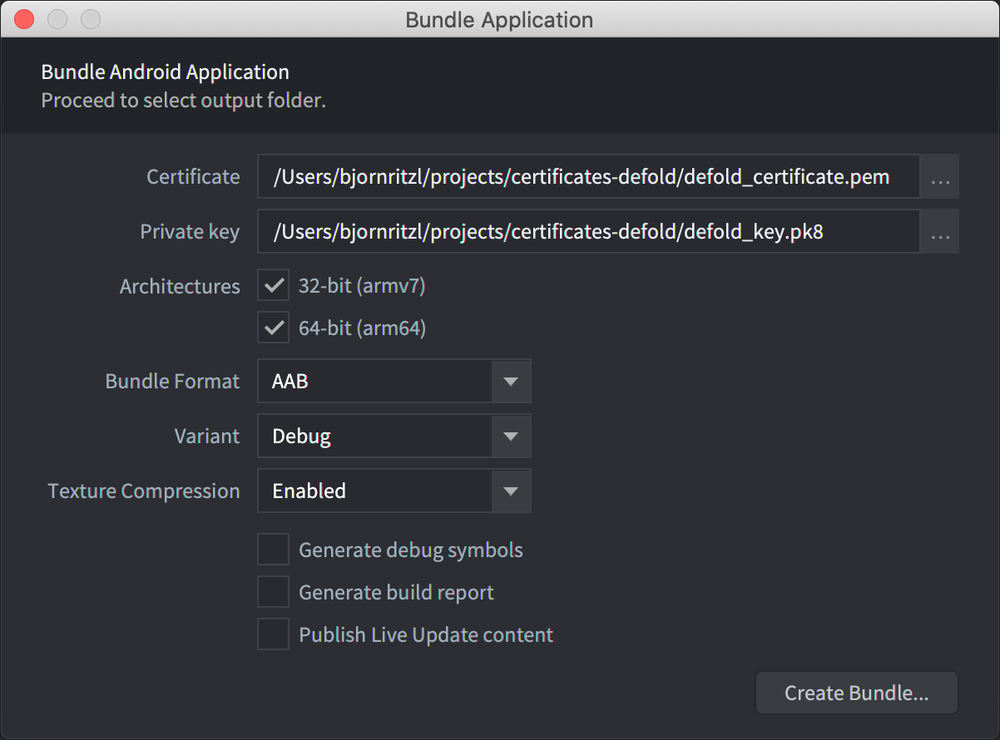
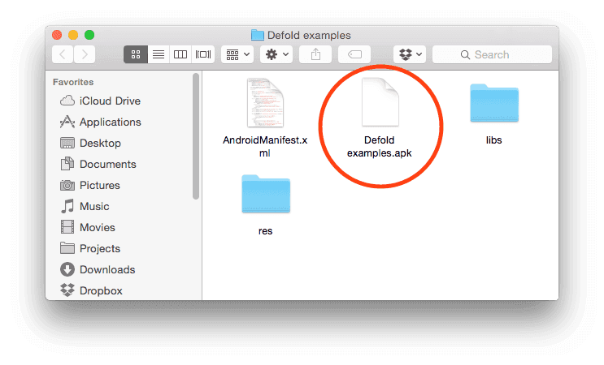

# Programowanie na Androidzie

Urządzenia z Androidem pozwalają swobodnie uruchamiać na nich własne aplikacje. Bardzo łatwo jest zbudować wersję gry i skopiować ją na urządzenie z Androidem. Ta instrukcja wyjaśnia kolejne kroki pakowania gry na Androida. Podczas tworzenia często wygodniej jest uruchamiać grę przez [development app](/manuals/dev-app), ponieważ umożliwia szybkie przeładowywanie zawartości i kodu bezpośrednio na urządzeniu.

## Proces podpisywania dla Androida i Google Play

Android wymaga, aby wszystkie pliki APK były przed instalacją na urządzeniu lub aktualizacją cyfrowo podpisane certyfikatem. Jeśli używasz Android App Bundles, musisz podpisać tylko swój pakiet aplikacji przed przesłaniem go do Play Console, a [Play App Signing](https://developer.android.com/studio/publish/app-signing#app-signing-google-play) zajmie się resztą. Możesz też ręcznie podpisać aplikację przed wysłaniem do Google Play, do innych sklepów z aplikacjami lub do dystrybucji poza sklepami.

Gdy tworzysz pakiet aplikacji Android z edytora Defold albo za pomocą [narzędzia wiersza poleceń](/manuals/bob), możesz podać keystore, który zawiera certyfikat i klucz, oraz hasło do keystore. Te dane zostaną użyte do podpisania aplikacji. Jeśli ich nie podasz, Defold wygeneruje debug keystore i użyje go do podpisania pakietu aplikacji.

::: important
**Nigdy** nie przesyłaj aplikacji do Google Play, jeśli została podpisana za pomocą debug keystore. Zawsze używaj własnego, osobnego keystore.
:::

## Tworzenie keystore

::: sidenote
Proces podpisywania Androida w Defold zmienił się w wersji 1.2.173: zamiast osobnego klucza i certyfikatu używa teraz keystore. [Więcej informacji w tym poście na forum](https://forum.defold.com/t/upcoming-change-to-the-android-build-pipeline/66084).
:::

Keystore możesz utworzyć [w Android Studio](https://developer.android.com/studio/publish/app-signing#generate-key) albo z poziomu terminala / wiersza poleceń:

```bash
keytool -genkey -v -noprompt -dname "CN=John Smith, OU=Area 51, O=US Air Force, L=Unknown, ST=Nevada, C=US" -keystore mykeystore.keystore -storepass 5Up3r_53cR3t -alias myAlias -keyalg RSA -validity 9125
```

To utworzy plik keystore o nazwie `mykeystore.keystore`, zawierający klucz i certyfikat. Dostęp do klucza i certyfikatu będzie chroniony hasłem `5Up3r_53cR3t`. Klucz i certyfikat będą ważne przez 25 lat, czyli 9125 dni. Wygenerowany klucz i certyfikat będą identyfikowane aliasem `myAlias`.

::: important
Pamiętaj, aby przechowywać keystore i powiązane z nim hasło w bezpiecznym miejscu. Jeśli sam podpisujesz i przesyłasz aplikacje do Google Play, a keystore lub jego hasło zostanie utracone, nie będzie żadnego sposobu, aby zaktualizować aplikację w Google Play. Możesz tego uniknąć, korzystając z Google Play App Signing i pozwalając Google podpisywać aplikacje za Ciebie.
:::

## Tworzenie pakietu aplikacji Android

Edytor pozwala łatwo utworzyć samodzielny pakiet aplikacji dla gry. Przed pakowaniem możesz określić, której ikony lub których ikon użyć dla aplikacji, ustawić kod wersji itd. w pliku *game.project* [plik ustawień projektu](/manuals/project-settings/#android).

Aby spakować grę, wybierz <kbd>Project ▸ Bundle... ▸ Android Application...</kbd> z menu.

Jeśli chcesz, aby edytor automatycznie tworzył losowe debug certyfikaty, pozostaw pola *Keystore* i *Keystore password* puste:


Jeśli chcesz podpisać pakiet konkretnym keystore, wskaż pola *Keystore* i *Keystore password*. Oczekuje się, że *Keystore* będzie miał rozszerzenie pliku `.keystore`, a hasło ma być zapisane w pliku tekstowym z rozszerzeniem `.txt`. Można też podać *Key password*, jeśli klucz w keystore ma inne hasło niż sam keystore:



Defold obsługuje tworzenie zarówno plików APK, jak i AAB. Wybierz APK albo AAB z listy rozwijanej Bundle Format.

Naciśnij <kbd>Create Bundle</kbd>, gdy skonfigurujesz ustawienia pakietu aplikacji. Zostaniesz wtedy poproszony o wskazanie miejsca na komputerze, w którym pakiet ma zostać utworzony.



:[Warianty budowania](../shared/build-variants.md)

### Instalowanie pakietu aplikacji Android

#### Instalowanie APK

Plik *`.apk`* można skopiować na urządzenie za pomocą narzędzia `adb` albo przesłać do Google Play przez [Google Play developer console](https://play.google.com/apps/publish/).

:[Android ADB](../shared/android-adb.md)

```bash
$ adb install Defold\ examples.apk
4826 KB/s (18774344 bytes in 3.798s)
  pkg: /data/local/tmp/my_app.apk
Success
```

#### Instalowanie APK z poziomu edytora

Plik *`.apk`* możesz zainstalować i uruchomić za pomocą pól wyboru edytora "Install on connected device" i "Launch installed app" w oknie Bundle:


Aby ta funkcja działała, musisz mieć zainstalowany ADB oraz włączone *USB debugging* na podłączonym urządzeniu. Jeśli edytor nie potrafi wykryć lokalizacji narzędzia wiersza poleceń ADB, musisz ją wskazać w [Preferences](/manuals/editor-preferences/#tools).

#### Instalowanie AAB

Plik *.aab* można przesłać do Google Play przez [Google Play developer console](https://play.google.com/apps/publish/). Można też wygenerować plik *`.apk`* z pliku *.aab*, aby zainstalować go lokalnie za pomocą [Android bundletool](https://developer.android.com/studio/command-line/bundletool).

## Uprawnienia

Silnik Defold wymaga szeregu różnych uprawnień, aby działały wszystkie jego funkcje. Uprawnienia są definiowane w pliku `AndroidManifest.xml`, wskazanym w pliku *game.project* [plik ustawień projektu](/manuals/project-settings/#android). Więcej o uprawnieniach Androida można przeczytać w [oficjalnej dokumentacji](https://developer.android.com/guide/topics/permissions/overview). W domyślnym manifeście są wymagane następujące uprawnienia:

### android.permission.INTERNET i android.permission.ACCESS_NETWORK_STATE (Protection level: normal)
Pozwalają aplikacjom otwierać gniazda sieciowe i uzyskiwać informacje o sieciach. Te uprawnienia są potrzebne do korzystania z Internetu. ([Android official docs](https://developer.android.com/reference/android/Manifest.permission#INTERNET)) oraz ([Android official docs](https://developer.android.com/reference/android/Manifest.permission#ACCESS_NETWORK_STATE)).

### android.permission.WAKE_LOCK (Protection level: normal)
Pozwala używać PowerManager WakeLocks, aby zapobiec usypianiu procesora lub wygaszaniu ekranu. To uprawnienie jest potrzebne do tymczasowego powstrzymania urządzenia przed przejściem w stan uśpienia podczas odbierania powiadomienia push. ([Android official docs](https://developer.android.com/reference/android/Manifest.permission#WAKE_LOCK))

## Using AndroidX
AndroidX to duże ulepszenie oryginalnej Android Support Library, która nie jest już rozwijana. Pakiety AndroidX całkowicie zastępują Support Library, zapewniając pełną zgodność funkcji i nowe biblioteki. Większość rozszerzeń Androida w [Asset Portal](/assets) obsługuje AndroidX. Jeśli nie chcesz używać AndroidX, możesz je jawnie wyłączyć na rzecz starej Android Support Library, zaznaczając `Use Android Support Lib` w [application manifest](https://defold.com/manuals/app-manifest/).


## FAQ
:[Android FAQ](../shared/android-faq.md)
