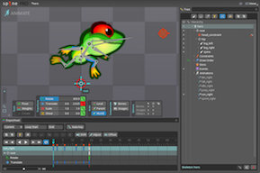
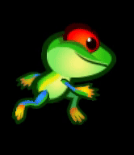
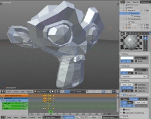
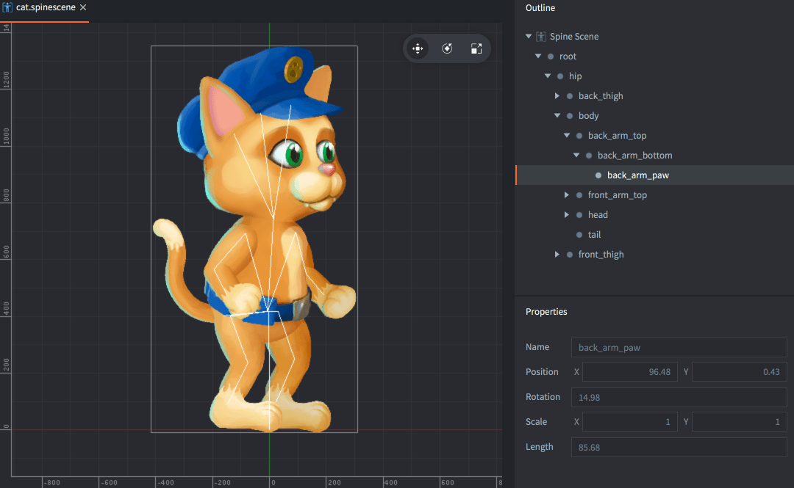

# Animacja

Defold posiada wbudowane wsparcie dla różnych typów animacji, których możesz używać jako źródło dla komponentów graficznych:

* Animacja poklatkowa (Flip-book)
* Animacja szkieletowa 2D (Spine)
* Animacja szkieletowa 3D (3D skinned)
* Animacja właściwości

## Flip-book - animacja poklatkowa

Animacja poklatkowa składa się z serii obrazów, które są pokazywane jeden za drugim, więc patrząc na nie sprawiają wrażenie ruchu. Technika ta jest bardzo podobna do tradycyjnej animacji używanej w kinematografii [https://pl.wikipedia.org/wiki/Animacja](https://pl.wikipedia.org/wiki/Animacja) i oferuje nieograniczoną kontrolę, ponieważ każda klatka może być modyfikowana indywidualnie. Jednakże pamięć zajmowana przez wszystkie obrazy składające się na taką animację może być duża w zależności od ilości klatek i ich wielkości. Płynność animacji zależy od liczby klatek pokazywanych w każdej sekundzie (FPS z ang. frames per second), co wymaga oczywiście większej ilości pracy. Animacje typu flip-book w Defoldzie są przechowywane albo jako indywidualne obrazy umieszczone w galerii zwanej [Atlas](/manuals/atlas), albo jako obrazy umieszczone w bezpośrednim sąsiedztwie, w poziomej sekwencji jak kafelki w tzw. [Tile Source](/manuals/tilesource).

  {.inline}
  {.inline}

## Spine - animacja szkieletowa

Wsparcie dla animacji typu Spine w Defoldzie umożliwia tworzenie animacji szkieletowych z obrazów 2D (https://pl.wikipedia.org/wiki/Rigging). Jest to zupełnie inna technika niż animacja flip-book i bliżej jej do płynnych ruchów, bez podzielenia obrazu na poszatkowane klatki. Przykładowo w animacjach wykorzystujących wycinanki [https://en.wikipedia.org/wiki/Cutout_animation](https://en.wikipedia.org/wiki/Cutout_animation) osobne części (np. korpus, ramiona, nogi, oczy itp.) są poruszane indywidualnie w każdej klatce z zachowaniem stałego szkieletu i określonych połączeń między częściami, np. przegubów. Animacja typu Spine umożliwia stworzenie właśnie takiego wirtualnego, niewidzialnego szkieletu składającaego się z hierarchii konkretnie połączonych części - _kości_ (ang. bones) połączonych w łańcuchy kinematyczne. Taki szkielet, czy z ang. _rig_, jest właśnie animowany i przyczepione są do każdej z kości odpowiednie części - obrazy. Defold wspiera animacje stworzone w lub wyeksportowane do [formatu Spine JSON](http://esotericsoftware.com/spine-json-format). Animacja szkieletowa jest zwykle bardzo płynna, ponieważ silnik interpoluje położenie i orientację każdej z "kości" dla każdej klatki.

  Szczegóły dotyczące importowania danych z programu Spine do komponentu "Spine model" w Defoldzie znajdziesz tutaj: [Instrukcja Spine](/manuals/spine).

  {.inline}
  {.inline}

## Animacja szkieletowa 3D

Animacja szkieletowa trójwymiarowych modeli jest podobna do animacji typu Spine, z tym, że działa również w trójwymiarze. Model 3D nie jest jednak podzielony na osobne części związane ze sobą w łańcuch kinematyczny, a w zamian tego, ruch "kości" deformuję siatkę wierzchołków (ang. vertices) reprezentującą obiekt 3D, a Ty masz kontrolę nad tym w jaki sposób kości wpływają na taką deformację.

  Szczegóły dotyczące importowania danych 3D do komponentu "Model" w Defoldzie znajdziesz tutaj: [Instrukcja Modeli 3D](/manuals/model).

  {.inline srcset="images/animation/blender_animation@2x.png 2x"}
  {.inline}

## Animacja właściwości

Wszystkie numeryczne właściwości (liczby, wektory (vector3, vector4) i kwaterniony) i stałe [shader'ów](https://pl.wikipedia.org/wiki/Shader) mogą być animowane przez wbudowany system animacji, używając funkcji [`go.animate()`](https://defold.com/ref/stable/go/#go.animate). Defold automatycznie "wyśrodkuje" właściwości dla Ciebie w zależności od podanego sposobu odtwarzania (ang. playback) czy funkcji "wygładzania" (ang. easing - więcej: [Easing functions](https://easings.net)) predefiniowanych lub Twoich własnych.

  {.inline srcset="images/animation/property_animation@2x.png 2x"}
  {.inline}

## Odtwarzanie animacji poklatkowych (flip-book)

Sprite'y i węzły interfejsu GUI mogą odtwarzać animacje poklatkowe i masz nad tym całkowitą kontrolę w trakcie działania programu.

Sprite'y
: Aby odtworzyć animację w trakcie działania programu używa się funkcji [`sprite.play_flipbook()`](/ref/sprite/?q=play_flipbook#sprite.play_flipbook:url-id-[complete_function]-[play_properties]). Poniżej przykład.

Węzły interfejsu GUI
: Aby odtworzyć animację w trakcie działania programu używa się funkcji [`gui.play_flipbook()`](/ref/gui/?q=play_flipbook#gui.play_flipbook:node-animation-[complete_function]-[play_properties]). Poniżej przykład.

::: sidenote
Tryb odtwarzania (playback mode) "once ping-pong" odtworzy animację klatka po klatce do samego końca, a następnie odtworzy ją jeszcze raz w odwrotnej kolejności, od tyłu, ale do **drugiej** klatki animacji, a nie do pierwszej. Jest to zabieg służący łatwemu wiązaniu animacji w łańcuchy.
:::

### Przykład animacji poklatkowej ze spritem

Załóżmy, że Twoja gra posiada możliwość uniku, która pozwala graczom nacisnąć klawisz, aby wykonać unik. Możesz wykonać 4 animacje, żeby w pełni pokazać unik:

"idle"
: Zapętlona animacja stojącej postaci będącej w bezczynności.

"dodge_idle"
: Zapętlona animacja postaci pochylonej, będącej w trakcie trwania uniku.

"start_dodge"
: Jednokrtotnie odtwarzana animacja postaci w momencie przejścia animacji z pozycji stojącej do pochylonej w celu wykonania uniku.

"stop_dodge"
: Jednokrtotnie odtwarzana animacja postaci w momencie przejścia animacji z pozycji uniku z powrotem do pozycji stojącej.

Skrypt poniżej przedstawia potrzebną logikę:

```lua

local function play_idle_animation(self)
    if self.dodge then
        sprite.play_flipbook("#sprite", hash("dodge_idle"))
    else
        sprite.play_flipbook("#sprite", hash("idle"))
    end
end

function on_input(self, action_id, action)
    -- "dodge" is our input action
    if action_id == hash("dodge") then
        if action.pressed then
            sprite.play_flipbook("#sprite", hash("start_dodge"), play_idle_animation)
            -- remember that we are dodging
            self.dodge = true
        elseif action.released then
            sprite.play_flipbook("#sprite", hash("stop_dodge"), play_idle_animation)
            -- we are not dodging anymore
            self.dodge = false
        end
    end
end
```

### Przykład animacji poklatkowej z węzłem GUI

Przy wyborze obrazu i animacji dla węzła interfejsu graficznego (box, pie) tak naprawdę właśnie przypisujesz źródło obrazów (atlas lub tile source) i domyślną animację, tak samo jak w przypadku sprite'ów. Galeria taka jest statycznie przypisana do węzła, ale animacja może być zmieniona w trakcie trwania programu. Nieruchome obrazki są traktowane jako jednoklatkowa animacja, więc zamiana obrazu jest jednoznaczna z odtworzeniem innej animacji poklatkowej (flip-book) na węźle:

```lua
local function flipbook_done(self)
    msg.post("#", "jump_completed")
end

function init(self)
    local character_node = gui.get_node("character")
    -- This requires that the node has a default animation in the same atlas or tile source as
    -- the new animation/image we're playing.
    gui.play_flipbook(character_node, "jump_left", flipbook_done)
end
```

Jako trzeci argument można podać opcjonalną funkcję, która jest wywoływana w momencie zakończenia animacji (flipbook_done) - to tzw. callback. Będzie ona wywołana po skończeniu animacji, więc tylko takich, które nie są zapętlone, czyli tryby playback: `gui.PLAYBACK_ONCE_*`.

## Przykład animacji szkieletowej Spine

Aby odtworzyć animację na Twoim modelu, po prostu użyj funkcji [`spine.play_anim()`](/ref/spine#spine.play_anim):

```lua
local function anim_done(self)
    -- the animation is done, do something useful...
end

function init(self)
    -- Play the "walk" animation on component "spinemodel" and blend against previous
    -- animation for the first 0.1 seconds, then call callback.
    local anim_props = { blend_duration = 0.1 }
    spine.play_anim("#spinemodel", "run", go.PLAYBACK_LOOP_FORWARD, anim_props, anim_done)
end
```

{srcset="images/animation/spine_ingame@2x.png 2x"}

Jeśli animacja jest odtwarzana w trybach `go.PLAYBACK_ONCE_*` i podałeś funkcję callback w `spine.play_anim()`, funkcja ta zostanie wywołana na końcu animacji. See below for information on callbacks.

### Animacja kursora na modelu Spine

Jako dodatek do `spine.play_anim()` komponenty zwane *Modele Spine* posiadają właściwość zwaną "kursor" (z ang. cursor), którą można animować przy użyciu funkcji `go.animate()`. Jest to wartość numeryczna między 0 i 1, gdzie 0 oznacza początek animacji, a 1 oznacza koniec animacji:

```lua
-- Set the animation on the spine model but don't run it.
spine.play_anim("#spinemodel", "run_right", go.PLAYBACK_NONE)

-- Set the cursor to position 0
go.set("#spinemodel", "cursor", 0)

-- Tween the cursor slowly between 0 and 1 pingpong with in-out quad easing.
go.animate("#spinemodel", "cursor", go.PLAYBACK_LOOP_PINGPONG, 1, go.EASING_INOUTQUAD, 6)
```

::: important
Przy uśrednianiu (tweening) lub ustawianiu kursora, wydarzenia na osi czasu mogą nie być startowane w spodziewanym czasie.
:::

### Model Spine - hierarchia kości

Indywidualne kości w szkielecie Spine są reprezentowane wewnętrznie przez podstawowe obiekty (game objects). W panelu *Outline* komponentu typu model Spine ukazana jest cała hierarchia. Możesz tu zobaczyć nazwę każdej z kości (bone) i ich miejsce w hierarchii.

{srcset="images/animation/spine_bones@2x.png 2x"}

Znając nazwy poszczególnych kości możesz uzyskać id danej instancji kości w czasie działania programu i dowolnie nią manipulować. Funkcja [`spine.get_go()`](/ref/spine#spine.get_go) zwraca id danej kości a Ty możesz, przykładowo, przypisać inne obiekty jako dzieci danej kości - czyli np. wręczyć postaci pistolet w miejscu ręki, który będzie od tej pory za nią naturalnie "podążał":

```lua
-- Attach pistol game object to the hand of the heroine
local hand = spine.get_go("heroine#spinemodel", "front_hand")
msg.post("pistol", "set_parent", { parent_id = hand })
```

### Model Spine - wydarzenia na osi czasu

Animacje szkieletowe mogą wywoływać wydarzenia w określonym czasie poprzez wysłanie wiadomości w konkretnym momencie. Jest to bardzo przydatne dla wydarzeń, które powinny być zsynchronizowane z animacją, jak na przykład odtworzenie odgłosu kroku w momencie dotknięcia stopą podłogi (np. gdy stopa jest w najniższym położeniu) czy odtworzenie w tym czasie efektu cząsteczkowego reprezentującego unoszącą się chmurę kurzu. Można w takim wydarzeniu odrzucić lub dołączyć dowolny obiekt do kości czy wywołać jakąkolwiek inną funckję.

Wydarzenia są dodawane w programie Spine i pokazane na osi czasu:


Każde wydarzenie jest określone przez identyfikator ("bump" w przykładzie powyżej) i może ponadto posiadać dodatkową informację:

Integer
: Wartość numeryczna całkowita.

Float
: Wartość numeryczna zmiennoprzecinkowa.

String
: Wartość słowna, tzw. string.

Kiedy animacja jest odtwarzana i następuje dane wydarzenie to wiadomość o treści `spine_event` jest wysyłana do skryptu, który tę animację uruchomił wywołaniem `spine.play()`. Wiadomość ta posiada tablicę z powyższymi informacjami oraz innymi przydatnymi niejednokrotnie elementami:

`t`
: Liczba sekund, które upłynęły już od początku animacji.

`animation_id`
: Shaszowana nazwa (id) animacji.

`string`
: Opisana wyżej shaszowana wartość słowna.

`float`
: Opisana wyżej wartość numeryczna zmiennoprzecinkowa.

`integer`
: Opisana wyżej wartość numeryczna całkowita.

`event_id`
: Shaszowana nazwa (id) wydarzenia.

`blend_weight`
: Wartość opisująca jak dużo z animacji jest "zblendowane" w danej chwili. 0 oznacza, że nic z obecnej animacji nie jest jeszcze zblendowane, a 1, że 100% animacji jest już zblendowane.

```lua
-- Spine animation contains events that are used to play sounds in sync with the animation.
-- These arrive here as messages.
function on_message(self, message_id, message, sender)
  if message_id == hash("spine_event") and message.event_id == hash("play_sound") then
    -- Play animation sound. The custom event data contains the sound component and the gain.
    local url = msg.url("sounds")
    url.fragment = message.string
    sound.play(url, { gain = message.float })
  end
end
```

## 3D Model animation

Models are animated with the [`model.play_anim()`](/ref/model#model.play_anim) function:

```lua
function init(self)
    -- Start the "wiggle" animation back and forth on #model
    model.play_anim("#model", "wiggle", go.PLAYBACK_LOOP_PINGPONG)
end
```

::: important
Defold wspiera obecnie tylko gotowe animacje (baked). Animacje muszą mieć macierze dla każdej z animowanych kości na każdą z klatek animacji, a nie osobno pozycję, rotację i skalę jako osobne pola. 

Animacje są interpolowane liniowo. Jeśli stworzysz bardziej zaawansowaną krzywą animacji, animacje muszę być przygotowane wcześniej w programie przed eksportem (prebaked).

Klipy animacji (animation clips) w formacie Collada nie są obecnie wspierane. Aby używać wielu animacji na model, wyeksportuj je do osobnego pliku *.dae* i zbierz wszystkie pliki do osobnego pliku *.animationset* w edytorze Defold.
:::

### Model 3D  - hierarchia szkieletu

Kości szkieletu modelu 3D są reprezentowane wewnętrznie również jako obiekty (game objects).

Możesz uzyskać id danej instancji kości w czasie działania programu i dowolnie nią manipulować. Funkcja [`model.get_go()`](/ref/model#model.get_go) zwraca id obiektu danej kości.

```lua
-- Get the middle bone go of our wiggler model
local bone_go = model.get_go("#wiggler", "Bone_002")

-- Now do something useful with the game object...
```

### Model 3D - animacja kursora

Tak jak powyżej dla komponentów typu Spine, modele 3D mogą być animowane przy użyciu tzw. kursora (ang. `cursor`):

```lua
-- Set the animation on #model but don't start it
model.play_anim("#model", "wiggle", go.PLAYBACK_NONE)
-- Set the cursor to the beginning of the animation
go.set("#model", "cursor", 0)
-- Tween the cursor between 0 and 1 pingpong with in-out quad easing.
go.animate("#model", "cursor", go.PLAYBACK_LOOP_PINGPONG, 1, go.EASING_INOUTQUAD, 3)
```

## Animowanie właściwości

Aby animować właściwości (ang. properties) obiektu lub komponentu użyj funkcji `go.animate()`. Dla właściwości węzłów GUI, analogiczną funkcją jest `gui.animate()`.

```lua
-- Set the position property y component to 200
go.set(".", "position.y", 200)
-- Then animate it
go.animate(".", "position.y", go.PLAYBACK_LOOP_PINGPONG, 100, go.EASING_OUTBOUNCE, 2)
```

Aby zatrzymać wszystkie animacje danej właściwości, wywołaj `go.cancel_animations()`, a dla węzłów GUI, analogicznie: `gui.cancel_animation()` lub dookreśl, które właściwości chcesz zatrzymać:

```lua
-- Stop euler z rotation animation on the current game object
go.cancel_animation(".", "euler.z")
```

Jeśli zatrzymasz animacje właściwości, która jest właściwością "kompozytową" (składającą się z kilku osobnych wartości, jak np. `vector3 position`), osobne animacje każdego z elementów składowych danej właściwości (`position.x`, `position.y` i `position.z`) zostaną zatrzymane.

[Instrukcja do właściwości](/manuals/properties) zawiera wszystkie informacje na temat dostępnych właściwości obiektów, komponentów i węzłów GUI.

## Animowanie właściwości węzłów GUI

Prawie każdą właściwość (ang. property) węzła GUI można animować. Możesz przykładowo ukryć węzeł poprzez ustawienie jego koloru na całkowicie przezroczysty, a następnie pokazać przez płynne pojawianie się animując kolor do wartości koloru białego (nieprzezroczystego):

```lua
local node = gui.get_node("button")
local color = gui.get_color(node)
-- Animate the color to white
gui.animate(node, gui.PROP_COLOR, vmath.vector4(1, 1, 1, 1), gui.EASING_INOUTQUAD, 0.5)
-- Animate the outline red color component
gui.animate(node, "outline.x", 1, gui.EASING_INOUTQUAD, 0.5)
-- And move to x position 100
gui.animate(node, hash("position.x"), 100, gui.EASING_INOUTQUAD, 0.5)
```

## Playback modes - tryby odtwarzania

Animacje w Defoldzie mogą być odtwarzane w różnych trybach - np. jednokrotnie lub w pętli. Jest to określone przez tryby odtwarzania (ang. playback modes):

* go.PLAYBACK_NONE
* go.PLAYBACK_ONCE_FORWARD
* go.PLAYBACK_ONCE_BACKWARD
* go.PLAYBACK_ONCE_PINGPONG
* go.PLAYBACK_LOOP_FORWARD
* go.PLAYBACK_LOOP_BACKWARD
* go.PLAYBACK_LOOP_PINGPONG

Tryb pingpong odtwarza animację raz w poprawnej kolejności, do przodu, a następnie od tyłu. Analogiczne tryby służą do kontroli elementów (węzłów) GUI:

* gui.PLAYBACK_NONE
* gui.PLAYBACK_ONCE_FORWARD
* gui.PLAYBACK_ONCE_BACKWARD
* gui.PLAYBACK_ONCE_PINGPONG
* gui.PLAYBACK_LOOP_FORWARD
* gui.PLAYBACK_LOOP_BACKWARD
* gui.PLAYBACK_LOOP_PINGPONG

## Easing - funkcje wygładzania

Funkcje wygładzania (ang. easing) opisują w jaki sposób animowane wartości zmieniają się w czasie. Obrazy poniżej przedstawiają wykresy funkcji tych wartości w czasie:

Dla animowania wartości obiektów i komponentów przy użyciu `go.animate()`:

|---|---|
| go.EASING_LINEAR | |
| go.EASING_INBACK | go.EASING_OUTBACK |
| go.EASING_INOUTBACK | go.EASING_OUTINBACK |
| go.EASING_INBOUNCE | go.EASING_OUTBOUNCE |
| go.EASING_INOUTBOUNCE | go.EASING_OUTINBOUNCE |
| go.EASING_INELASTIC | go.EASING_OUTELASTIC |
| go.EASING_INOUTELASTIC | go.EASING_OUTINELASTIC |
| go.EASING_INSINE | go.EASING_OUTSINE |
| go.EASING_INOUTSINE | go.EASING_OUTINSINE |
| go.EASING_INEXPO | go.EASING_OUTEXPO |
| go.EASING_INOUTEXPO | go.EASING_OUTINEXPO |
| go.EASING_INCIRC | go.EASING_OUTCIRC |
| go.EASING_INOUTCIRC | go.EASING_OUTINCIRC |
| go.EASING_INQUAD | go.EASING_OUTQUAD |
| go.EASING_INOUTQUAD | go.EASING_OUTINQUAD |
| go.EASING_INCUBIC | go.EASING_OUTCUBIC |
| go.EASING_INOUTCUBIC | go.EASING_OUTINCUBIC |
| go.EASING_INQUART | go.EASING_OUTQUART |
| go.EASING_INOUTQUART | go.EASING_OUTINQUART |
| go.EASING_INQUINT | go.EASING_OUTQUINT |
| go.EASING_INOUTQUINT | go.EASING_OUTINQUINT |

Dla animowania wartości węzłów GUI przy użyciu `gui.animate()`:

|---|---|
| gui.EASING_LINEAR | |
| gui.EASING_INBACK | gui.EASING_OUTBACK |
| gui.EASING_INOUTBACK | gui.EASING_OUTINBACK |
| gui.EASING_INBOUNCE | gui.EASING_OUTBOUNCE |
| gui.EASING_INOUTBOUNCE | gui.EASING_OUTINBOUNCE |
| gui.EASING_INELASTIC | gui.EASING_OUTELASTIC |
| gui.EASING_INOUTELASTIC | gui.EASING_OUTINELASTIC |
| gui.EASING_INSINE | gui.EASING_OUTSINE |
| gui.EASING_INOUTSINE | gui.EASING_OUTINSINE |
| gui.EASING_INEXPO | gui.EASING_OUTEXPO |
| gui.EASING_INOUTEXPO | gui.EASING_OUTINEXPO |
| gui.EASING_INCIRC | gui.EASING_OUTCIRC |
| gui.EASING_INOUTCIRC | gui.EASING_OUTINCIRC |
| gui.EASING_INQUAD | gui.EASING_OUTQUAD |
| gui.EASING_INOUTQUAD | gui.EASING_OUTINQUAD |
| gui.EASING_INCUBIC | gui.EASING_OUTCUBIC |
| gui.EASING_INOUTCUBIC | gui.EASING_OUTINCUBIC |
| gui.EASING_INQUART | gui.EASING_OUTQUART |
| gui.EASING_INOUTQUART | gui.EASING_OUTINQUART |
| gui.EASING_INQUINT | gui.EASING_OUTQUINT |
| gui.EASING_INOUTQUINT | gui.EASING_OUTINQUINT |

{.inline}
{.inline}
{.inline}
{.inline}
{.inline}
{.inline}
{.inline}
{.inline}
{.inline}
{.inline}
{.inline}
{.inline}
{.inline}
{.inline}
{.inline}
{.inline}
{.inline}
{.inline}
{.inline}
{.inline}
{.inline}
{.inline}
{.inline}
{.inline}
{.inline}
{.inline}
{.inline}
{.inline}
{.inline}
{.inline}
{.inline}
{.inline}
{.inline}
{.inline}
{.inline}
{.inline}
{.inline}
{.inline}
{.inline}
{.inline}
{.inline}

## Własne funkcje wygładzania

Możesz tworzyć własne funkcje wygładzania zdefiniowane jako specjalny `vector` ze zbiorem odpowiednich, kolejnych wartości i użyć go zamiast predefiniowanych stałych przedstawionych powyżej. Wektor ten reprezentuje krzywą zmiany wartości numerycznej od wartości startowej (`0`) do wartości końcowej (`1`). Silnik interpoluje w czasie działania programu te wartości liniowo.

Na przykład, wektor:

```lua
local values = { 0, 0.4, 0.2, 0.2, 0.5. 1 }
local my_easing = vmath.vector(values)
```

stworzy następującą krzywą:


W poniższym przykładzie wartość y pozycji obiektu skacze między aktualną pozycją startową, a pozycją docelową 200:

```lua
local values = { 0, 0, 0, 0, 0, 0, 0, 0,
                 1, 1, 1, 1, 1, 1, 1, 1,
                 0, 0, 0, 0, 0, 0, 0, 0,
                 1, 1, 1, 1, 1, 1, 1, 1,
                 0, 0, 0, 0, 0, 0, 0, 0,
                 1, 1, 1, 1, 1, 1, 1, 1,
                 0, 0, 0, 0, 0, 0, 0, 0,
                 1, 1, 1, 1, 1, 1, 1, 1 }
local square_easing = vmath.vector(values)
go.animate("go", "position.y", go.PLAYBACK_LOOP_PINGPONG, 200, square_easing, 2.0)
```

a krzywa ruchu wygląda jak sygnał prostokątny:


## Funkcje po zakończeniu animacji - callbacks

Wszystkie funkcje animacji (`go.animate()`, `gui.animate()`, `gui.play_flipbook()`, `gui.play_spine_anim()`, `sprite.play_flipbook()`, `spine.play_anim()` i `model.play_anim()`) przyjmują opcjonalną funkcję zwaną callback jako ostatni argument. Ta funkcja jest wywoływana w momencie zakończenia animacji. Nie jest więc nigdy wywoływana, dla animacji, które są zapętlone, ani w przypadku, gdy animacja jest ręcznie zatrzymana przez funkcje rodzaju `go.cancel_animations()`. Callback może być użyty do uruchomienia wydarzeń, które powinny wystartować w momencie końca animacji, bez wiedzy programisty o czasie jej trwania lub do uruchomienia następnej animacji, zaraz po zakończeniu obecnej.

Dokładna sygnatura funkcji callback różni się nieco dla różnych funkcji animacji (różne argumenty). Sprawdź dokumentację API dla funkcji, którą chcesz użyć.

```lua
local function done_bouncing(self, url, property)
    -- We're done animating. Do something...
end

function init(self)
    go.animate(".", "position.y", go.PLAYBACK_ONCE_FORWARD, 100, go.EASING_OUTBOUNCE, 2, 0, done_bouncing)
end
```
