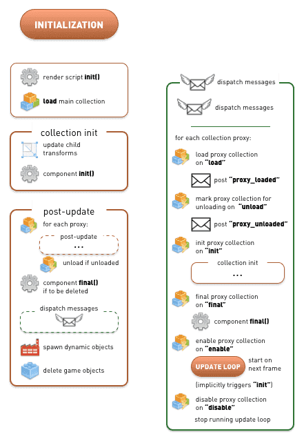

# Cykl życia aplikacji

Cykl życia aplikacji czy gry w silniku Defold jest w ogólności prosty. Silnik przechodzi przez 3 etapy: 
* inicjalizacja (initialization),
* aktualizacja w pętli (update loop),
* finalizacja (finalization).


W wielu przypadkach nie jest w ogóle wymagana dogłębna wiedza o wewnętrznych procesach silnika Defold. Możesz jednak potrzebować kontrolować lub zbadać pewne skrajne przypadki, wyjątkowe sytuacje, w których potrzebna jest wiedza o kolejności wykonywanych operacji. Dokument ten opisuje jak silnik Defold obsługuje aplikację od początku do końca.

Aplikacja startuje poprzez zainicjalizowanie wszystkiego, co jest potrzebne do pracy silnika. Defold wczytuje główną kolekcję bootstrapową i wywołuje funkcje [`init()`](/ref/go#init) **wszystkich** załadowanych komponentów. Funkcja `init()` może być napisana w języku Lua w skryptach obiektów i GUI, co pozwala na własną inicjalizację.

Aplikacja przechodzi następnie do pętli aktualizacyjnej, która trwa przez większość jej czasu działania, aż do zakończenia programu i przejścia do fazy finalizacyjnej. Każda klatka wyświetlana na ekranie, obiekty i komponenty aplikacji są aktualizowane. Dla każdego skryptu i skryptu GUI specjalna funkcja [`update()`](/ref/go#update) jest wywoływana. Podczas aktualizacji wiadomości są rozsyłane do odbiorców, dźwięki są odtwarzane, a cała grafika jest renderowana i wyświetlana.

W pewnym momencie cykl życia aplikacji dobiega końca. Jeszcze przed tym, zanim aplikacja zamknie się, silnik wyjdzie z pętli aktualizacyjnej i przejdzie do fazy finalizacyjnej. Defold przygotuje wtedy wszystkie załadowane obiekty i kolekcje do usunięcia. Specjalna funkcja [`final()`](/ref/go#final) każdego z komponentów zostanie wywołana, co pozwola na własne procedury finalizacji. Następnie obiekty są usuwane i główna kolekcja jest opuszczana.

## Faza inicjalizacyjna

Diagram poniżej zawiera szczegółowe rozplanowanie kroków inicjalizacji. Kroki we fragmencie rozsyłania wiadomości (ang. "dispatch messages") tuż przed tworzeniem instancji obiektów dynamicznych (ang. "spawn dynamic objects") zostały opisane szczegółowo w osobnym bloku gwoli przejrzystości.



Silnik w zasadzie podejmuje więcej kroków podczas inicjalizacji, jeszcze przed załadowaniem głównej kolekcji. Inicjalizowane są: profiler pamięci (memory profiler), gniazda (sockets), grafika, urządzenia wejścia (HID), dźwięk, fizyka i wiele innych modułów. Plik konfiguracyjny (*game.project*) jest wtedy również wczytywany i wykorzystywany.

Pierwszym punktem wejściowym, w którym użytkownik przejmuje kontrolę, już na samym końcu fazy inicjalizacji, jest funkcja `init()` specjalnego skryptu do renderowania (ang. render script).

Główna kolekcja jest następnie załadowywana i inicjalizowana. Wszystkie obiekty (game objects) w tej kolekcji są wtedy tworzone i przypisywana jest im oraz ich dzieciom pozycja, orientacja i skala (całościowo po ang. transform - macierz transformacji). Funkcje `init()` wszystkich załadowanych komponentów są wywoływane, jeśli istnieją.

::: sidenote
Kolejność w jakiej funkcje `init()` komponentów są wywoływane jest nieokreślona. Nie można zakładać, że silnik zainicjalizuje obiekty zawsze w tej samej kolejności.
:::

Ponieważ w funkcji `init()` możesz już wysyłać wiadomości, tworzyć nowe obiekty przy użyciu fabryk (factory), przeznaczać obiekty do usunięcia i wiele innych rzeczy, silnik Defold wykonuje zaraz po inicjalizacji jedno przejście "post-update". W przejściu tym rozsyłane są otrzymywane są wysłane wiadomości oraz tworzone i usuwane obiekty. Przejście to zawiera więc również funkcję rozsyłania wiadomości ("dispatch messages"), gdzie nie tylko zakolejkowane wiadomości są wysyłane, ale także obsługiwane są wiadomości do pełnomocników kolekcji (collection proxies). Każda kolejna aktualizacja tych pełnomocników (aktywowanie, dezaktywowanie, wczytywanie i oznaczanie jako gotowe do zwolnienia) są wykonywane w tych krokach.

Analizując diagram powyżej dostrzegamy możliwość załadowania pełnomocnika kolekcji [(collection proxy)](/manuals/collection-proxy) w funckji `init()`, zainicjalizowania jej obiektów, a następnie zwolnienia kolekcji - wszystko to jeszcze przed pierwszym wywołaniem funkcji `update()` pierwszego komponentu, czyli przed wyjściem z fazy inicjalizacyjnej do pętli aktualizacyjnej:

```lua
function init(self)
    print("init()")
    msg.post("#collectionproxy", "load")
end

function update(self, dt)
    -- The proxy collection is unloaded before this code is reached.
    print("update()")
end

function on_message(self, message_id, message, sender)
    if message_id == hash("proxy_loaded") then
        print("proxy_loaded. Init, enable and then unload.")
        msg.post("#collectionproxy", "init")
        msg.post("#collectionproxy", "enable")
        msg.post("#collectionproxy", "unload")
        -- The proxy collection objects’ init() and final() functions
        -- are called before we reach this object’s update()
    end
end
```

## Faza aktualizacyjna - pętla

Pętla aktualizacyjna (update loop) przez cały czas trwania aplikacji jest wykonywana w każdej klatce. Sekwencja aktualizacji przedstawiona na diagramie poniżej jest podzielona na logiczne sekcje gwoli przejrzystości. Rozsyłanie wiadomości (ang. "dispatch messages") jest ponadto dodatkowo podzielona z tego samego powodu:


## Wejścia

Wejścia są odczytywane ze wspieranego urządzenia, na którym działa aplikacja i mapowane zgodnie z zasadami umieszczonymi w opisie wiązania wejść [(ang. input bindings)](/manuals/input), a następnie rozsyłane. Każdy obiekt (game object), który zadeklarował przechwytywanie wejść (ang. acquired input focus) otrzymuje wejścia wysłane do funkcji `on_input()` jego wszystkich komponentów, w tym oczywiście skryptów i skryptów GUI komponentów GUI. Jeśli obiekt posiada oba, do wszystkich zostaną wysłane wejścia, zakładając oczywiście, że zadeklarowały przechwytywanie wejść.

Każdy obiekt, który zadeklarował przechwytywanie wejść i posiada jednego lub więcej pełnomocników kolekcji przesyła wejścia do komponentów wewnątrz tych pełnomocników. Proces ten działa rekursywnie dla każdych obiektów wewnątrz aktywnych pełnomocników, itd.

## Aktualizacja komponentów

Silnik przechodzi przez każdy obiekt w głównej kolekcji i jeśli którykolwiek z komponentów posiada funkcję `update()` będzie ona wywołana. Jeśli komponentem jest pełnomocnik kolekcji, każdy komponent takiego pełnomocnika jest sprawdzany rekursywnie w dół i aktualizowany zgodnie z wszystkimi krokami opisanymi powyżej.

::: sidenote
Kolejność w jakiej funkcje `update()` komponentów są wywoływane jest nieokreślona. Nie można zakładać, że silnik zaktualizuje obiekty zawsze w tej samej kolejności.
:::

W następnej kolejności wszystkie wiadomości są rozsyłane. A ponieważ każdy z komponentów, który otrzymuje wiadomość, w funkcji `on_message()` może wysyłać dodatkowo następne wiadomości, więc ten sam mechanizm rozsyłania wiadomości (ang. message dispatcher) działa dopóki kolejka wiadomości nie zostanie opróżniona. Istnieje jednak limit takich iteracji przejścia przez kolejkę wiadomości. Szczegóły znajdziesz w opisie [przesyłania wiadomości](/manuals/message-passing) w sekcji "Zaawansowane" (ang. "Advanced topics").

Jeśli chodzi o wiadomości do obiektów kolizji (ang. collision object) i wiadomości dotyczących silnika fizycznego (odpowiedzi kolizji, przełączników (ang. triggers), promieni (ang. ray_cast), itp.) są one rozsyłane podczas obsługi każdego z obiektów do wszystkich komponentów, które posiadają funkcję `on_message()`.

Macierze transformacji (ang. transforms) są później tworzone i aplikowane do obiektów, ich komponentów i kolejnych obiektów-dzieci- zmieniana jest ich pozycja, orientacja i skala.

## Aktualizacja renderowania

Sekcja aktualizacji renderowania rozsyła i obsługuje wiadomości przesłane do specjalnego gniazda (ang. socket) `@render` (np. wiadomości `set_view_projection` dla kamery, ustawianie koloru czyszczenia ekranu `set_clear_color`, itp.). Następnie wywoływana jest funkcja `update()` skryptu renderowania (ang. render script).

## Post-aktualizacja

Po aktualizacji uruchamiana jest sekwencja tzw. post-aktualizacji. Zwalnia ona z pamięci pełnomocników kolekcji, którzy zostali do takiego zwolnienia oznaczeni (zdezaktywowani podczas rozsyłania wiadomości - sekwencji "dispatch messages"). Każdy obiekt, który jest przeznaczony do usunięcia wywołuje funkcję `final()` we wszystkich komponentach, jeśli istnieje. Kod w funkcji `final()` może również wysyłać wiadomości, więc dodatkowe przejście przez kolejkę wiadomości jest uruchamiane na końcu.

Każdy komponent typu fabryka (ang. factory), który został oznaczony jako gotowy do utworzenia obiektu, w tym momencie utworzy taki obiekt. Na końcu obiekty, które są przeznaczone do usunięcia zostają usunięte.

Ostatnim krokiem pętli aktualizacyjnej jest obsługa wiadomości kolejnego, specjalnego gniazda `@system` (wiadomości `exit`, `reboot`, przełączanie profilera, startowanie i zatrzymywanie przechwytywania video, itp.). Następnie renderowana jest grafika. Podczas renderowania grafiki, tworzone jest przychwytywanie video, tak samo jak i wizualizacja profilera (zobacz [dokumentację do debugowania](/manuals/debugging).)

## Klatki na sekundę i krok czasowy kolekcji

Liczba klatek na sekundę (równa liczbie pętli aktualizacyjnych na sekundę) może być ustawiona w pliku konfiguracyjnym projektu (*game.project*) lub dynamicznie przez wysłanie wiadomości `set_update_frequency` do specjalnego gniazda `@system`. Dodatkowo, możliwe jest ustawienie kroku czasowego (ang. _time step_) dla pełnomocników kolekcji indywidualnie poprzez wysłanie wiadomości `set_time_step`. Zmiana czasu kroku kolekcji nie wpływa na liczbę klatek na sekundę - jedynie na aktualizację fizyki oraz wartość `dt` przekazywaną do funkcji `update().` Zauważ również, że zmiana kroku czasowego nie zmienia samej liczby wywołań funkcji `update()`, które są wywoływane w każdej klatce - a ta nie ulega zmianie.

(Szczegóły znajdziesz w [Instrukcji do pełnomocników kolekcji](/manuals/collection-proxy) i [`set_time_step`](/ref/collectionproxy#set-time-step))

## Faza finalizacyjna

Kiedy aplikacja jest zamykana, najpierw kończona jest ostatnia pętla aktualizacyjna, która zwolni wszystkich pełnomocników kolekcji: finalizując i usuwając wszystkie obiekty w każdym z nich.

Kiedy to się zakończy silnik przejdzie do sekwencji finalizacyjnej, która zamknie główną kolekcję i jej obiekty:


Funkcje `final()` wszystkich komponentów zostaną najpierw wywołane. Jeśli w kodzie tych funkcji wysyłane są jeszcze jakieś wiadomości, zostaną one wysłane i obsłużone. Ostatecznie, wszystkie obiekty zostaną usunięte i główna kolekcja zostanie zwolniona.

Silnik będzie kontynuował jeszcze finalizację i zwalnianie elementów wewnętrznych, takich jak: konfiguracja projektu, profiler pamięci, itd.

Aplikacja jest na końcu zamknięta.