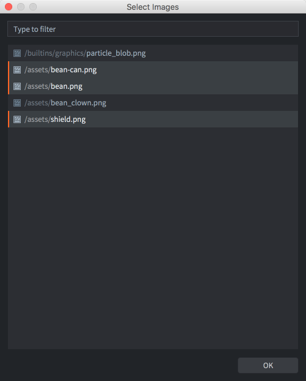

# Atlas (Galeria obrazów)

Chociaż pojedyncze obrazy często są używane jako źródło dla sprite'ów, ze względów wydajnościowych obrazy muszą być łączone w większe zestawy obrazów, nazywane atlasy. Kombinowanie zestawów mniejszych obrazów w atlasy jest szczególnie ważne na urządzeniach mobilnych, gdzie pamięć i moc obliczeniowa są przeważnie mniejsze niż na komputerach stacjonarnych lub dedykowanych konsolach do gier.

W Defoldzie zasób atlasu to lista oddzielnych plików obrazów, które automatycznie są łączone w większy obraz.


## Tworzenie Atlasu

Wybierz <kbd>New... ▸ Atlas</kbd> z menu kontekstowego w panelu *Assets*. Nazwij nowy plik atlasu. Edytor otworzy teraz plik w edytorze atlasu. Właściwości atlasu są widoczne w
panelu *Properties* (Właściwości), dzięki czemu możesz je edytować (szczegóły poniżej).

Musisz wypełnić atlas obrazami lub animacjami, zanim będziesz mógł go użyć jako źródła grafiki dla komponentów obiektu, takich jak Sprite'y i komponenty ParticleFX.

Upewnij się, że dodałeś obrazy do projektu (przeciągnij i upuść pliki obrazów we właściwe miejsce w panelu *Assets*).

Dodawanie pojedynczych obrazów
: Kliknij <kbd>prawym przyciskiem myszy</kbd> główny wpis Atlas w panelu *Outline*.

  Wybierz <kbd>Add Images</kbd> z menu kontekstowego, aby dodać pojedyncze obrazy.

  Pojawi się okno dialogowe, z którego możesz znaleźć i wybrać obrazy, które chcesz dodać do atlasu. Zauważ, że możesz filtrować pliki obrazów i wybierać je wielokrotnie.

  {srcset="images/atlas/add@2x.png 2x"}

  Dodane obrazy są wymienione w *Outline*, a pełny atlas można zobaczyć w centrum widoku edytora. Może być konieczne naciśnięcie <kbd>F</kbd> (<kbd>View ▸ Frame Selection</kbd> w menu), aby dopasować zaznaczenie.

  {srcset="images/atlas/single_images@2x.png 2x"}

Dodawanie animacji flipbook
: Kliknij <kbd>przyciskiem myszy</kbd> główny wpis Atlas w panelu *Outline*.

  Wybierz <kbd>Add Animation Group</kbd> z menu kontekstowego, aby utworzyć grupę animacji flipbook.

  Nowa, pusta grupa animacji o domyślnej nazwie ("New Animation") zostaje dodana do atlasu.

  Kliknij <kbd>prawym przyciskiem myszy</kbd> na nową grupę i wybierz <kbd>dd Images</kbd> z menu kontekstowego.

  Pojawi się okno dialogowe, z którego możesz znaleźć i wybrać obrazy, które chcesz dodać do grupy animacji.

  {srcset="images/atlas/add_animation@2x.png 2x"}

  Naciśnij <kbd>Spację</kbd> z wybraną grupą animacji, aby ją obejrzeć. Dostosuj właściwości animacji w obszarze *Properties* według potrzeb (patrz poniżej).

  {srcset="images/atlas/animation_group@2x.png 2x"}

Możesz zmieniać kolejność obrazów w Outline, wybierając je i naciskając <kbd>Alt + W górę/w dół</kbd>. Możesz również łatwo tworzyć duplikaty, kopiując i wklejając obrazy w zarysie (z menu <kbd>Edit</kbd>, menu kontekstowego po kliknięciu prawym przyciskiem myszy lub za pomocą skrótów klawiszowych).

## Właściwości Atlasu

Każdy zasób atlasu posiada zestaw właściwości, które są widoczne w obszarze *Properties*, gdy wybierasz główny element w panelu *Outline*.

Size (Rozmiar)
: Pokazuje obliczony łączny rozmiar wynikowego zasobu tekstury. Szerokość i wysokość są ustawiane na najbliższą potęgę dwójki. Zauważ, że jeśli włączysz kompresję tekstury, niektóre formaty wymagają tekstur kwadratowych. Niekwadratowe tekstury zostaną wtedy zmienione rozmiarem i wypełnione pustą przestrzenią, aby stworzyć teksturę kwadratową. Szczegóły można znaleźć w [instrukcji do profilów tekstur](/manuals/texture-profiles/)

Margin (Margines)
: Liczba pikseli, która powinna być dodawana między każdym obrazem.

Inner Padding (Wewnętrzny margines)
: Liczba pustych pikseli, która powinna być wypełniana wokół każdego obrazu.

Extrude Borders (Wytłoczenie granic)
: Liczba krawędziowych pikseli, która powinna być wielokrotnie dodawana wokół każdego obrazu. Kiedy fragment shader próbuje pobierać piksele na krawędzi obrazu, piksele z obrazu sąsiada (na tym samym atlasie tekstury) mogą się przeniknąć. Wydłużenie krawędzi rozwiązuje ten problem.

Oto przykłady różnych ustawień właściwości z czterema kwadratowymi obrazami o wymiarach 64x64 pikseli dodanymi do atlasu. Zauważ, jak atlas przeskakuje do rozmiaru 256x256, kiedy tylko obrazy nie mieszczą się w 128x128, co skutkuje marnowaniem dużej przestrzeni tekstury.

{srcset="images/atlas/atlas_properties@2x.png 2x"}

## Właściwości Obrazu

Każdy obraz w atlasie posiada zestaw właściwości:

Id
: Identyfikator obrazu (tylko do odczytu).

Size (Rozmiar)
: Szerokość i wysokość obrazu (tylko do odczytu).

Sprite Trim Mode (Trymowanie Sprite'a)
: Sposób renderowania sprite'a. Domyślnie sprite jest renderowany jako prostokąt (Trymowanie Sprite'a ustawione na Off - Wyłączone). Jeśli sprite zawiera wiele przezroczystych pikseli, może być bardziej wydajne, aby renderować sprite jako kształt nierektangularny, używając od 4 do 8 wierzchołków. Zauważ, że trymowanie sprite'a nie działa razem z sprite'ami typu slice-9.

Image (Obraz)
: Ścieżka do samego obrazu.

{srcset="images/atlas/image_properties@2x.png 2x"}

## Właściwości Animacji

Oprócz listy obrazów, które są częścią grupy animacyjnej (Animation Group), dostępny jest zestaw właściwości:

Id
: Identyfikator/nazwa animacji.

Fps
: Szybkość odtwarzania animacji wyrażona w klatkach na sekundę (Frames Per Second).

Flip horizontal (Odbicie w poziomie)
: Odbija animację w poziomie.

Flip vertical (Odbicie w pionie)
: Odbija animację w pionie.

Playback (Odtwarzanie)
: Określa, w jaki sposób animacja ma być odtwarzana:

  - `None` - animacja nie jest odtwarzana wcale, wyświetlany jest pierwszy obraz.
  - `Once Forward` - odtwarza animację raz od pierwszego do ostatniego obrazu.
  - `Once Backward` - odtwarza animację raz od ostatniego do pierwszego obrazu.
  - `Once Ping Pong` - odtwarza animację raz od pierwszego do ostatniego obrazu, a następnie z powrotem do pierwszego obrazu.
  - `Loop Forward` - odtwarza animację cyklicznie od pierwszego do ostatniego obrazu.
  - `Loop Backward` - odtwarza animację cyklicznie od ostatniego do pierwszego obrazu.
  - `Loop Ping Pong` - odtwarza animację cyklicznie od pierwszego do ostatniego obrazu, a następnie z powrotem do pierwszego obrazu.

## Tworzenie tekstury i atlasu w czasie wykonania programu (Runtime)

Począwszy od Defold 1.4.2 możliwe jest tworzenie zasobu tekstury i atlasu w czasie wykonania.

### Tworzenie zasobu tekstury w czasie wykonania

Użyj funkcji [`resource.create_texture(path, params)`](https://defold.com/ref/stable/resource/#resource.create_texture:path-table), aby utworzyć nowy zasób tekstury:

```lua
  local params = {
    width  = 128,
    height = 128,
    type   = resource.TEXTURE_TYPE_2D,
    format = resource.TEXTURE_FORMAT_RGBA,
  }
  local my_texture_id = resource.create_texture("/my_custom_texture.texturec", params)
```

Kiedy tekstura jest utworzona użyj funkcji [`resource.set_texture(path, params, buffer)`](https://defold.com/ref/stable/resource/#resource.set_texture:path-table-buffer) w celu ustawienia pikseli tekstury:

```lua
  local width = 128
  local height = 128
  local buf = buffer.create(width * height, { { name=hash("rgba"), type=buffer.VALUE_TYPE_UINT8, count=4 } } )
  local stream = buffer.get_stream(buf, hash("rgba"))

  for y=1, height do
      for x=1, width do
          local index = (y-1) * width * 4 + (x-1) * 4 + 1
          stream[index + 0] = 0xff
          stream[index + 1] = 0x80
          stream[index + 2] = 0x10
          stream[index + 3] = 0xFF
      end
  end

  local params = { width=width, height=height, x=0, y=0, type=resource.TEXTURE_TYPE_2D, format=resource.TEXTURE_FORMAT_RGBA, num_mip_maps=1 }
  resource.set_texture(my_texture_id, params, buf)
```

::: sidenote
Istnieje także możliwość użycia funkcji `resource.set_texture()`, aby zaktualizować podregion tekstury, korzystając z szerokości i wysokości bufora mniejszych niż pełny rozmiar tekstury i zmieniając parametry x i y w funkcji resource.set_texture().
:::

Teksturę można użyć bezpośrednio na [komponencie modelu](/manuals/model/) za pomocą `go.set()`:

```lua
  go.set("#model", "texture0", my_texture_id)
```

### Tworzenie atlasu w czasie wykonania

Jeśli tekstura ma być używana na [komponencie sprite'a](/manuals/sprite/), musi najpierw zostać użyta w atlasie. Użyj funckji [`resource.create_atlas(path, params)`](https://defold.com/ref/stable/resource/#resource.create_atlas:path-table), aby utworzyć atlas:

```lua
  local params = {
    texture = texture_id,
    animations = {
      {
        id          = "my_animation",
        width       = width,
        height      = height,
        frame_start = 1,
        frame_end   = 2,
      }
    },
    geometries = {
      {
        vertices  = {
          0,     0,
          0,     height,
          width, height,
          width, 0
        },
        uvs = {
          0,     0,
          0,     height,
          width, height,
          width, 0
        },
        indices = {0,1,2,0,2,3}
      }
    }
  }
  local my_atlas_id = resource.create_atlas("/my_atlas.texturesetc", params)

  -- assign the atlas to the 'sprite' component on the same go
  go.set("#sprite", "image", my_atlas_id)

  -- play the "animation"
  sprite.play_flipbook("#sprite", "my_animation")

```
