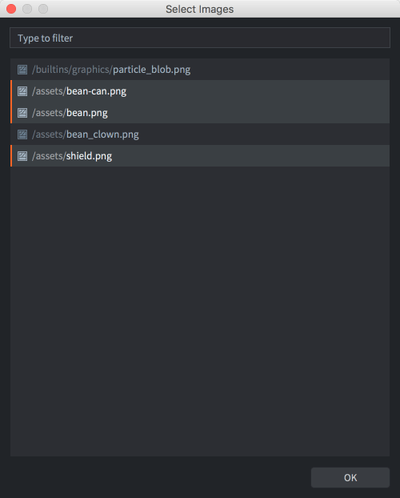
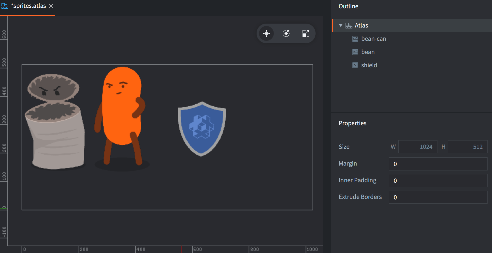
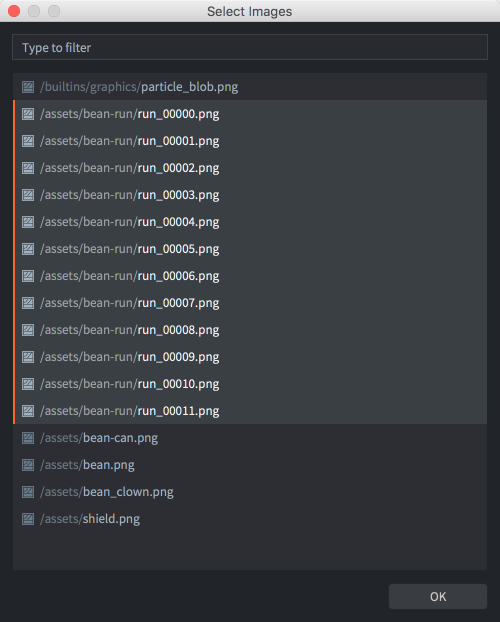
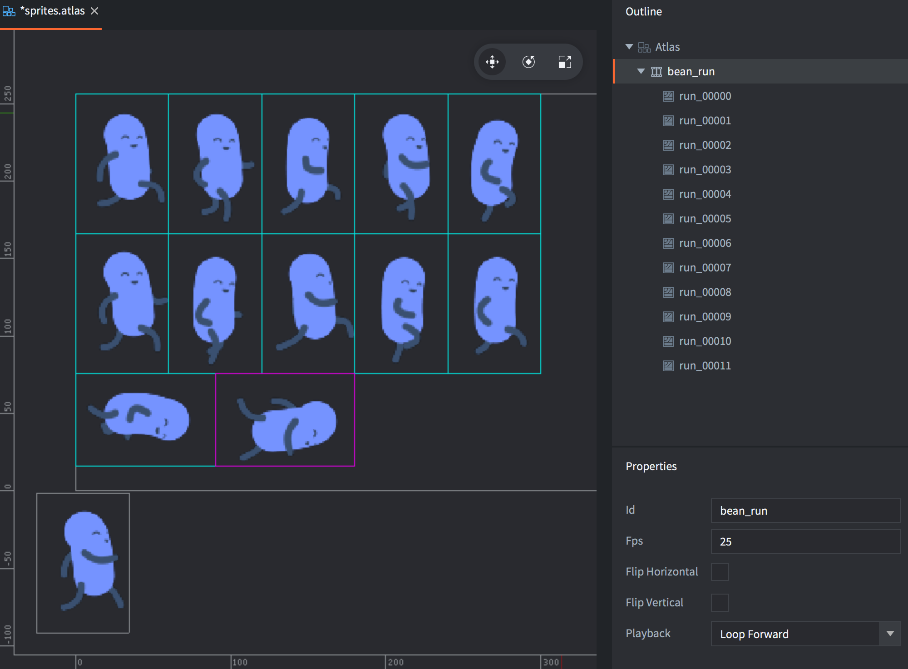
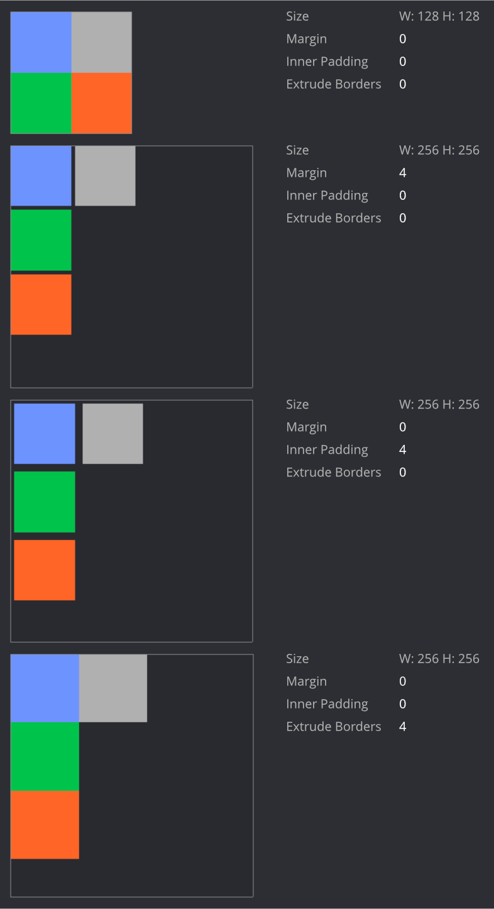

# Atlas

Chociaż pojedyncze obrazy są często używane jako źródło sprite'ów, ze względów wydajnościowych obrazy trzeba łączyć w większe zestawy, zwane atlasami. Łączenie mniejszych obrazów w atlasy jest szczególnie ważne na urządzeniach mobilnych, gdzie pamięć i moc obliczeniowa są mniejsze niż na komputerach stacjonarnych lub konsolach do gier.

W Defold zasób atlasu to lista oddzielnych plików obrazów, które są automatycznie łączone w jeden większy obraz.

## Tworzenie atlasu

Wybierz <kbd>New... ▸ Atlas</kbd> z menu kontekstowego w *Assets* browserze. Nadaj nazwę nowemu plikowi atlasu. Edytor otworzy teraz plik w edytorze atlasu. Właściwości atlasu są widoczne w panelu *Properties*, więc możesz je edytować (szczegóły znajdziesz poniżej).

Musisz najpierw wypełnić atlas obrazami lub animacjami, zanim użyjesz go jako źródła grafiki dla komponentów obiektu, takich jak Sprite i ParticleFX.

Upewnij się, że dodałeś obrazy do projektu, przeciągając pliki obrazów w odpowiednie miejsce w *Assets* browserze.

Dodawanie pojedynczych obrazów
: Przeciągnij obrazy z panelu *Asset* do widoku edytora.

  Alternatywnie kliknij <kbd>Right click</kbd> główny wpis Atlas w panelu *Outline*.

  Wybierz <kbd>Add Images</kbd> z menu kontekstowego, aby dodać pojedyncze obrazy.

  Otworzy się okno dialogowe, w którym możesz znaleźć i zaznaczyć obrazy, które chcesz dodać do atlasu. Zwróć uwagę, że możesz filtrować pliki obrazów i wybierać wiele plików naraz.

  

  Dodane obrazy są wyświetlane w *Outline*, a cały atlas można zobaczyć w środkowym widoku edytora. Może być konieczne naciśnięcie <kbd>F</kbd> (<kbd>View ▸ Frame Selection</kbd> z menu), aby dopasować widok do zaznaczenia.

  

Adding flipbook animations
: Kliknij <kbd>Right click</kbd> główny wpis Atlas w panelu *Outline*.

  Wybierz <kbd>Add Animation Group</kbd> z menu kontekstowego, aby utworzyć grupę animacji flipbook.

  Do atlasu zostanie dodana nowa, pusta grupa animacji z domyślną nazwą ("New Animation").

  Przeciągnij obrazy z panelu *Asset* do widoku edytora, aby dodać je do aktualnie zaznaczonej grupy.

  Alternatywnie kliknij <kbd>Right click</kbd> nową grupę i wybierz <kbd>Add Images</kbd> z menu kontekstowego.

  Otworzy się okno dialogowe, w którym możesz znaleźć i zaznaczyć obrazy, które chcesz dodać do grupy animacji.

  

  Naciśnij <kbd>Space</kbd> z zaznaczoną grupą animacji, aby ją podejrzeć, i użyj <kbd>Ctrl/Cmd+T</kbd>, aby zamknąć podgląd. Dostosuj *Properties* animacji według potrzeb (patrz poniżej).

  

Możesz zmieniać kolejność obrazów w Outline, zaznaczając je i naciskając <kbd>Alt + Up/down</kbd>. Możesz też łatwo tworzyć duplikaty, kopiując i wklejając obrazy w outline (z menu <kbd>Edit</kbd>, z menu kontekstowego po kliknięciu prawym przyciskiem myszy lub skrótami klawiaturowymi).

## Właściwości atlasu

Każdy zasób atlasu ma zestaw właściwości. Są one widoczne w panelu *Properties*, gdy zaznaczysz element główny w widoku *Outline*.

Size
: Pokazuje obliczony łączny rozmiar wynikowego zasobu tekstury. Szerokość i wysokość są ustawiane na najbliższą potęgę dwójki. Jeśli włączysz kompresję tekstury, niektóre formaty wymagają tekstur kwadratowych. Tekstury niekwadratowe zostaną wtedy przeskalowane i wypełnione pustą przestrzenią, aby stały się kwadratowe. Szczegóły znajdziesz w [Texture profiles manual](/manuals/texture-profiles/).

Margin
: Liczba pikseli, które należy dodać między każdym obrazem.

Inner Padding
: Liczba pustych pikseli, które należy dodać wokół każdego obrazu.

Extrude Borders
: Liczba pikseli krawędzi, które należy wielokrotnie dodać wokół każdego obrazu. Gdy fragment shader próbuje próbkować piksele na krawędzi obrazu, piksele sąsiedniego obrazu (na tej samej teksturze atlasu) mogą „przeciekać”. Wyekstrudowanie krawędzi rozwiązuje ten problem.

Max Page Size
: Maksymalny rozmiar strony w atlasie wielostronicowym. Można tego użyć do podzielenia atlasu na wiele stron tego samego atlasu, aby ograniczyć jego rozmiar, a jednocześnie korzystać tylko z jednego draw call. Ta funkcja musi być używana razem z materiałami obsługującymi atlas wielostronicowy, znajdującymi się w `/builtins/materials/*_paged_atlas.material`.


Rename Patterns
: Przecinkiem (´,´) rozdzielona lista wzorców wyszukiwania i zamiany, gdzie każdy wzorzec ma postać `search=replace`.
  Oryginalna nazwa każdego obrazu (nazwa bazowa pliku) zostanie przekształcona przy użyciu tych wzorców. Na przykład wzorzec `hat=cat,_normal=` zmieni nazwę obrazu `hat_normal` na `cat`. Jest to przydatne przy dopasowywaniu animacji między atlasami.

Oto przykłady różnych ustawień właściwości z czterema kwadratowymi obrazami 64x64 dodanymi do atlasu. Zwróć uwagę, jak atlas przeskakuje do 256x256, gdy obrazy przestają mieścić się w 128x128, co powoduje duże marnotrawstwo miejsca w teksturze.



## Właściwości obrazu

Każdy obraz w atlasie ma zestaw właściwości:

Id
: Id obrazu (tylko do odczytu).

Size
: Szerokość i wysokość obrazu (tylko do odczytu).

Pivot
: Punkt pivot obrazu (w jednostkach). Lewy górny róg ma wartość (0,0), a prawy dolny (1,1). Domyślna wartość to (0.5, 0.5). Pivot może znajdować się poza zakresem 0-1. To właśnie w tym punkcie obraz zostanie wyśrodkowany, gdy będzie użyty np. w spricie. Możesz zmienić pivot, przeciągając uchwyt pivot w widoku edytora. Uchwyt będzie widoczny tylko wtedy, gdy zaznaczony jest jeden obraz. Przypinanie można włączyć, przytrzymując <kbd>Shift</kbd> podczas przeciągania.

Sprite Trim Mode
: Sposób renderowania sprite'a. Domyślnie sprite jest renderowany jako prostokąt (Sprite Trim Mode ustawiony na Off). Jeśli sprite zawiera dużo przezroczystych pikseli, bardziej wydajne może być renderowanie go jako kształtu nieprostokątnego przy użyciu od 4 do 8 wierzchołków. Zwróć uwagę, że przycinanie sprite'a nie działa razem ze sprite'ami slice-9.

Image
: Ścieżka do samego obrazu.


## Właściwości animacji

Oprócz listy obrazów należących do grupy animacji dostępny jest zestaw właściwości:

Id
: Nazwa animacji.

Fps
: Szybkość odtwarzania animacji, wyrażona w klatkach na sekundę (FPS).

Flip horizontal
: Odbija animację w poziomie.

Flip vertical
: Odbija animację w pionie.

Playback
: Określa, jak animacja ma być odtwarzana:

  - `None` nie odtwarza niczego, wyświetlany jest pierwszy obraz.
  - `Once Forward` odtwarza animację raz od pierwszego do ostatniego obrazu.
  - `Once Backward` odtwarza animację raz od ostatniego do pierwszego obrazu.
  - `Once Ping Pong` odtwarza animację raz od pierwszego do ostatniego obrazu, a następnie z powrotem do pierwszego obrazu.
  - `Loop Forward` odtwarza animację wielokrotnie od pierwszego do ostatniego obrazu.
  - `Loop Backward` odtwarza animację wielokrotnie od ostatniego do pierwszego obrazu.
  - `Loop Ping Pong` odtwarza animację wielokrotnie od pierwszego do ostatniego obrazu, a następnie z powrotem do pierwszego obrazu.

## Tworzenie tekstury i atlasu w czasie działania programu

Począwszy od Defold 1.4.2 można tworzyć teksturę i atlas w czasie działania programu.

### Tworzenie zasobu tekstury w czasie działania programu

Użyj [`resource.create_texture(path, params)`](https://defold.com/ref/stable/resource/#resource.create_texture:path-table), aby utworzyć nowy zasób tekstury:

```lua
  local params = {
    width  = 128,
    height = 128,
    type   = resource.TEXTURE_TYPE_2D,
    format = resource.TEXTURE_FORMAT_RGBA,
  }
  local my_texture_id = resource.create_texture("/my_custom_texture.texturec", params)
```

Gdy tekstura zostanie utworzona, użyj [`resource.set_texture(path, params, buffer)`](https://defold.com/ref/stable/resource/#resource.set_texture:path-table-buffer), aby ustawić piksele tekstury:

```lua
  local width = 128
  local height = 128
  local buf = buffer.create(width * height, { { name=hash("rgba"), type=buffer.VALUE_TYPE_UINT8, count=4 } } )
  local stream = buffer.get_stream(buf, hash("rgba"))

  for y=1, height do
      for x=1, width do
          local index = (y-1) * width * 4 + (x-1) * 4 + 1
          stream[index + 0] = 0xff
          stream[index + 1] = 0x80
          stream[index + 2] = 0x10
          stream[index + 3] = 0xFF
      end
  end

  local params = { width=width, height=height, x=0, y=0, type=resource.TEXTURE_TYPE_2D, format=resource.TEXTURE_FORMAT_RGBA, num_mip_maps=1 }
  resource.set_texture(my_texture_id, params, buf)
```

::: sidenote
Możliwe jest również użycie `resource.set_texture()`, aby zaktualizować podregion tekstury, korzystając z bufora o szerokości i wysokości mniejszych niż pełny rozmiar tekstury oraz zmieniając parametry x i y przekazywane do `resource.set_texture()`.
:::

Teksturę można użyć bezpośrednio na [model component](/manuals/model/) za pomocą `go.set()`:

```lua
  go.set("#model", "texture0", my_texture_id)
```

### Tworzenie atlasu w czasie działania programu

Jeśli tekstura ma być używana na [sprite component](/manuals/sprite/), najpierw musi zostać użyta przez atlas. Użyj [`resource.create_atlas(path, params)`](https://defold.com/ref/stable/resource/#resource.create_atlas:path-table), aby utworzyć atlas:

```lua
  local params = {
    texture = texture_id,
    animations = {
      {
        id          = "my_animation",
        width       = width,
        height      = height,
        frame_start = 1,
        frame_end   = 2,
      }
    },
    geometries = {
      {
        vertices  = {
          0,     0,
          0,     height,
          width, height,
          width, 0
        },
        uvs = {
          0,     0,
          0,     height,
          width, height,
          width, 0
        },
        indices = {0,1,2,0,2,3}
      }
    }
  }
  local my_atlas_id = resource.create_atlas("/my_atlas.texturesetc", params)

  -- przypisz atlas do komponentu 'sprite' w tym samym obiekcie gry
  go.set("#sprite", "image", my_atlas_id)

  -- odtwórz "animację"
  sprite.play_flipbook("#sprite", "my_animation")

```
