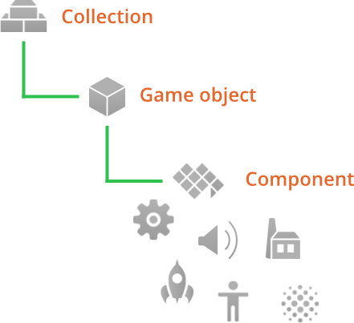
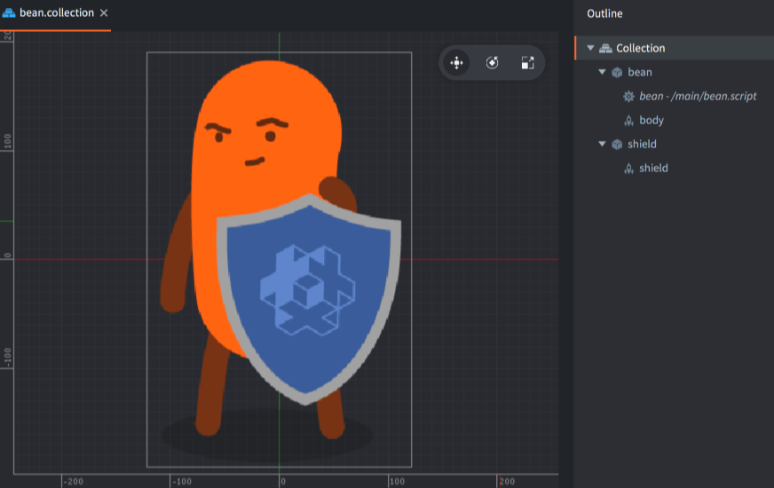
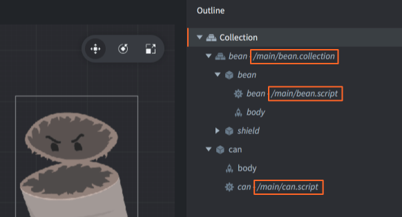
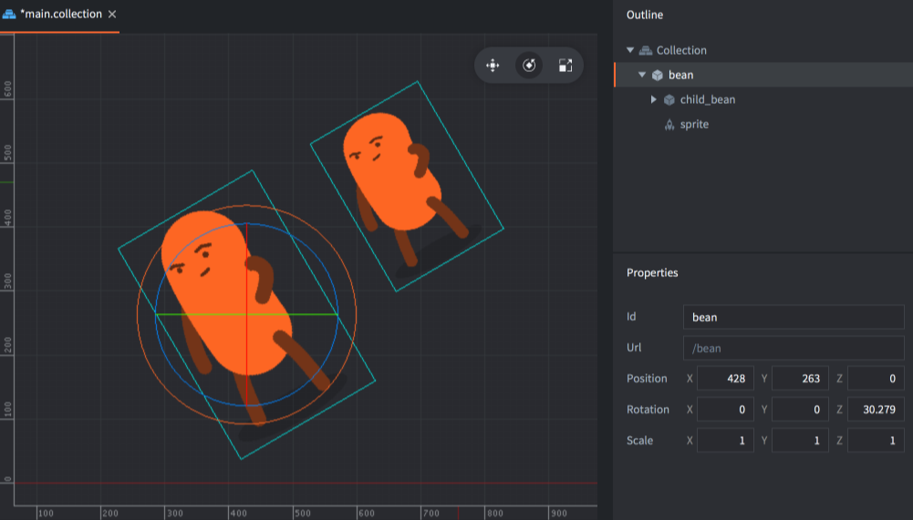

#  Podstawowe elementy do budowania aplikacji

W samym sercu koncepcji silnika Defold znajduje się kilka elementów, których zrozumienie ułatwia dalszą pracę z silnikiem. Instrukcja ta wyjaśnia czym są takie bloki służące do budowania aplikacji. Po zapoznaniu się z poniższą instrukcją, warto przejść do [Instrukcji adresowania](/manuals/addressing) i [przesyłania wiadomości](/manuals/message-passing). Na stronie Defold znajdziesz również [tutoriale](/tutorials/getting-started) dla początkujących dostępne nawet z poziomu edytora, aby umożliwić Ci szybki start z silnikiem Defold.

{srcset="images/building_blocks/building_blocks@2x.png 2x"}

Przy budowaniu gier na silniku Defold używa się trzech podstawowych elementów:

Kolekcja (Collection)
: Kolekcja jest plikiem używanym do stworzenia struktury Twojej gry. W kolekcjach buduje się hierarchię obiektów gry (poniżej) i innych kolekcji. Kolekcja jest więc po prostu zbiorem obiektów i innych kolekcji. Zazwyczaj używa się ich do stworzenia struktury całych poziomów w grach czy też grup wrogów, postaci, pocisków czy innych elementów (wielu obiektów).

Obiekt gry (Game object)
: Obiekty gry są pojemnikami zawierającymi identyfikator (id), pozycję, orientację i skalę oraz mogą zawierać dodatkowo tzw. komponenty (poniżej). Są używane zazwyczaj do tworzenia postaci gracza, innych pojedynczych elementów, lub systemów tworzenia zasad gry oraz jako elementy wczytujące i zwalniające dane poziomy.

Komponent (Component)
: Komponenty to elementy, które są umieszczane wewnątrz obiektów, aby nadać im cechy zgodne z ich typem - reprezentację wizualną (sprite, model, particlefx), dźwiękową (sound) czy logiczną (script). Są zazwyczaj używane do stworzenia sprite'ów czy modeli postaci, dodawania skryptów do obiektów czy efektów dźwiękowych czy cząsteczkowych.

## Kolekcje

Kolekcje mają strukturę drzewa, która przechowuje obiekty i inne kolekcje. Kolekcje są zawsze przechowywane w formie pliku.

Kiedy Defold startuje, wczytuje pojedynczą, główną _kolekcję bootrstrapową_ określoną w pliku "game.project". Kolekcja bootstrapowa jest często nazywana "main.collection" (i tak jest też domyślnie nazwana po otwarciu każdego nowego projektu), ale oczywiście możesz używać dowolnej nazwy.

Kolekcja może zawierać obiekty i inne kolekcje (przez referencję do pliku sub-kolekcji) zagnieżdżone na dowolną "głębokość". Poniżej jest przykład kolekcji "main.collection". Zawiera ona jeden obiekt gry (z id "can")i jedną sub-kolekcję (z id "bean"). Sub-kolekcja ta zawiera z kolei obiekty "bean" i "shield".

{srcset="images/building_blocks/collection@2x.png 2x"}

Zauważ, że sub-kolekcja z id "bean" jest przechowywana w osobnym pliku nazwanym "/main/bean.collection", a kolekcja nadrzędna "main.collection" zawiera do tego pliku jedynie referencję:

{srcset="images/building_blocks/bean_collection@2x.png 2x"}

Nie można zaadresować kolekcji samej w sobie, ponieważ nie istnieją obiekty w czasie rzeczywistym, które reprezentują kolekcje "main" czy "bean" - nie można więc wysłać wiadomości do kolekcji samej w sobie, a tylko do obiektów i komponentów. Jednak czasem chcesz wysłać wiadomość do obiektu z innej kolekcji niż kolekcja, w której nadawca się znajduje, więc dlatego określą się ścieżkę (ang. _path_) do takiego obiektu z uwzględnieniem id kolekcji (Szczegóły znajdziesz w [Instrukcji adresowania](/manuals/addressing)):

```lua
-- file: can.script
-- get position of the "bean" game object in the "bean" collection
local pos = go.get_position("bean/bean")
```

Kolekcja dodawana do innej kolekcji jest zawsze referencją do _pliku_ kolekcji:

Naciśnij <kbd>Prawy-przycisk-myszki</kbd> na kolekcji w panelu *Outline* i wybierz <kbd>Add Collection File</kbd>.

## Obiekty gry

Obiekty gry to bardzo proste obiekty posiadające indywidualny czas życia w trakcie wykonywania programu. Posiadają pozycję, orientację i skalę, a parametry te mogą być manipulowane i animowane osobno w czasie działania programu.

```lua
-- animate X position of "can" game object
go.animate("can", "position.x", go.PLAYBACK_LOOP_PINGPONG, 100, go.EASING_LINEAR, 1.0)
```

Obiekty gry mogą być używane jako puste obiekty (jako znacznik pozycji (ang. waypoint, startpoint, checkpoint etc.)), ale najczęściej zawierają komponenty, takie jak sprite'y, dźwięki, skrypty, modele, fabryki, efekty cząsteczkowe i inne. Obiekty te są tworzone albo z poziomu edytora i umieszczane bezpośrednio w plikach kolekcji (statycznie) albo dynamicznie, w kodzie, dzięki fabrykom (ang. _factory_).

Obiekty gry są więc dodawane jako nowe obiekty zdefiniowane w pliku kolekcji lub również w pliku kolekcji, ale jako referencja do osobnego pliku z definicją obiektu gry:

Naciśnij <kbd>Prawy-przycisk-myszki</kbd> na kolekcji w panelu *Outline* i wybierz <kbd>Add Game Object</kbd> (dodasz definicję do kolekcji) or <kbd>Add Game Object File</kbd> (dodasz do kolekcji referencję do pliku z definicją obiektu).

Jest to jeszcze dogłębniej wytłumaczone poniżej.


## Komponenty

:[components](../shared/components.md)

Odsyłamy do osobnej [Instrukcji do komponentów](/manuals/components/), gdzie znajduje się lista wszystkich komponentów silnika Defold.

## Obiekty dodawane bezpośrednio i z pliku

Kiedy tworzysz _plik_ kolekcji, obiektu gry lub nawet komponentu (np. w panelu *Assets*), tak naprawdę tworzysz tylko szablon, prototyp (ang. blueprint, prototype). Tworzy to tylko i wyłącznie plik w strukturze Twojego projektu, natomiast nic nie jest dodawane do samej gry. Aby stworzyć _instancję_ kolekcji, obiektu czy komponentu do gry, która bazuje na takim pliku-szablonie, dodać należy taką instancję w jednej z Twoich kolekcji.

W panelu *Outline* możesz zobaczyć na jakim pliku bazuje dana instancja, jeśli była ona stworzona z pliku, a nie bezpośrednio w panelu *Outline* właśnie. Przykładowo, kolekcja "main.collection"  poniżej zawiera trzy instancje, które bazują na już utworzonych plikach:

1. Sub-kolekcja "bean".
2. Komponent typu skrypt "bean" w obiekcie "bean"  w sub-kolekcji "bean".
3. Komponent typu skrypt "can" w obiekcie "can".

{srcset="images/building_blocks/instance@2x.png 2x"}

Korzyścią z używania szablonów/plików jest zdecydowanie możliwość stworzenia wielu instancji obiektu gry lub kolekcji i zmiana ich wszystkich naraz w jednym pliku:

{srcset="images/building_blocks/go_instance@2x.png 2x"}

Przy zmianie pliku każda instancja utworzona z tego pliku zostaje natychmiastowo zaktualizowana:

{srcset="images/building_blocks/go_instance2@2x.png 2x"}

## Hierarchia obiektów gry - relacja rodzic-dziecko

W pliku kolekcji możesz tworzyć hierarchie obiektów gry (game objects) w ten sposób, że jeden z obiektów jest dzieckiem innego obiektu - rodzica. Po prostu <kbd>przeciągnij</kbd> jeden z obiektów gry i <kbd>upuść</kbd> nad innym obiektem - zostanie on umieszczony w drzewku pod tym obiektem i stanie się jego dzieckiem:

{srcset="images/building_blocks/childing@2x.png 2x"}

Relacja rodzic-dziecko jest dynamiczną relacją wpływającą na zmianę pozycji, orientacji i skali obu obiektów. Każda transformacja tych wartości zaaplikowana do obiektu rodzica zostanie następnie zaaplikowana do obiektu dziecka, aby ich wzajemna, względna pozycja/orientacja/skala pozostała taka sama, 1:1, zarówno w edytorze jak i w czasie działania programu:

{srcset="images/building_blocks/child_transform@2x.png 2x"}

Z kolei wszystkie transformacje na obiekcie dziecku są wykonywane w układzie odniesienia rodzica. W edytorze Defold możesz wybrać, czy operacje na obiekcie dziecku są wykonywane w układzie lokalnym rodzica (local space) czy w głównym układzie odniesienia (world space) klikając <kbd>Edit ▸ World Space</kbd> (domyślnie ustawione) lub <kbd>Edit ▸ Local Space</kbd>.

Jest też możliwe zmienienie rodzica danego obiektu przez wysłanie do niego wiadomości `set_parent`.

```lua
local parent = go.get_id("bean")
msg.post("child_bean", "set_parent", { parent_id = parent })
```

Częstym błędem jest postrzeganie przypisania obiektu jako dziecka innego obiektu w kolekcji jako zmiana miejsca tego obiektu w hierarchii kolekcji. Są to jednak dwie osobne rzeczy. Relacje rodzic-dziecko dynamicznie zmieniają graf w panelu *Outline*, co pozwala wizualnie ją przedstawić. Jedyną rzeczą, która określa adres obiektu jest jej miejsce w hierarchii kolekcji. Adres jest statyczny podczas całego cyklu życia obiektu.
