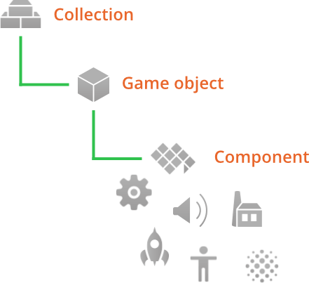
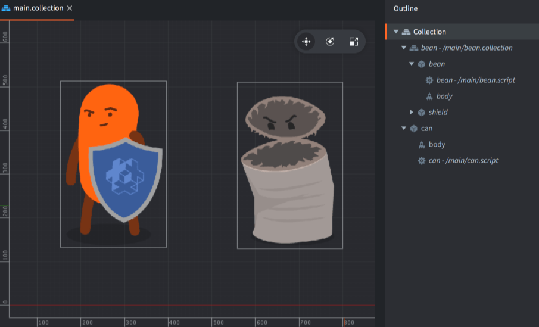
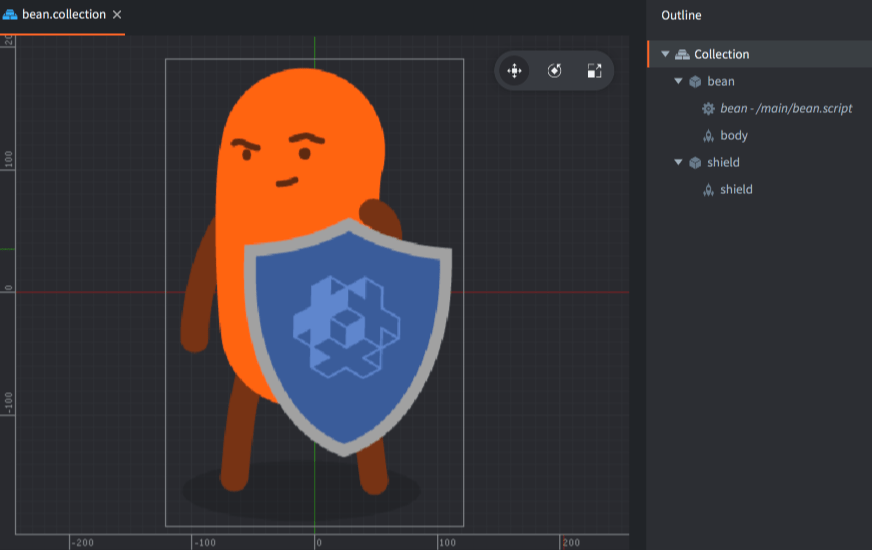
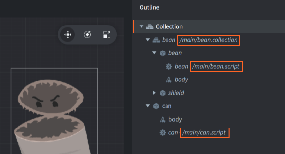
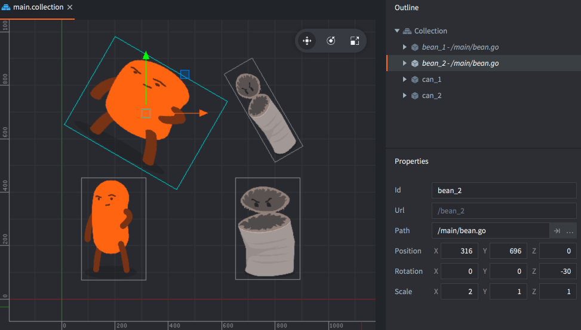
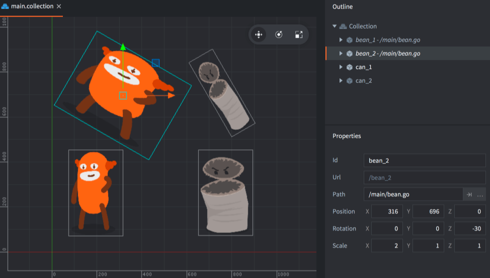
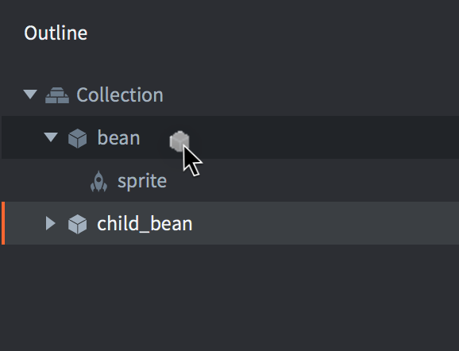
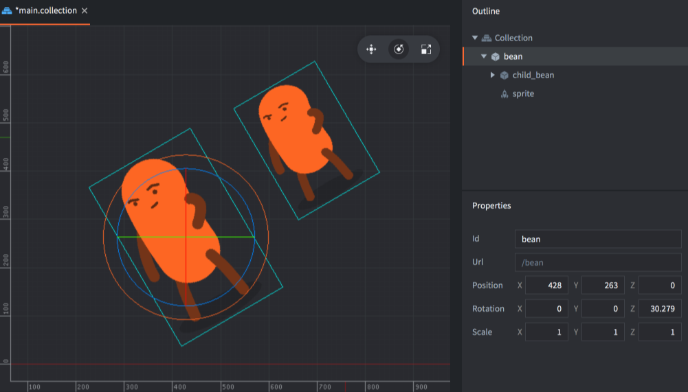

#  Podstawowe elementy

W centrum projektu Defold stoi kilka kluczowych pojęć, które warto dobrze poznać. Ta instrukcja wyjaśnia, z czego składają się podstawowe elementy Defold. Po jej przeczytaniu przejdź do [instrukcji adresowania](/manuals/addressing) i [instrukcji przesyłania wiadomości](/manuals/message-passing). W edytorze dostępny jest też zestaw [tutoriali](/tutorials/getting-started), które pomogą szybko zacząć pracę.



Do budowy gry w Defold używa się trzech podstawowych typów elementów:

Kolekcja
: Kolekcja to plik służący do strukturyzowania gry. W kolekcjach buduje się hierarchie obiektów gry i innych kolekcji. Zwykle wykorzystuje się je do organizacji poziomów, grup przeciwników albo postaci złożonych z kilku obiektów gry.

Obiekt gry
: Obiekt gry to kontener z identyfikatorem, pozycją, rotacją i skalą. Służy do przechowywania komponentów. Zwykle wykorzystuje się go do tworzenia postaci gracza, pocisków, systemu zasad gry albo wczytywacza poziomów.

Komponent
: Komponenty to elementy umieszczane w obiekcie gry, aby nadać mu wizualną, dźwiękową i/lub logiczną reprezentację w grze. Zwykle wykorzystuje się je do tworzenia sprite'ów postaci, skryptów, efektów dźwiękowych albo efektów cząsteczkowych.

## Kolekcje

Kolekcje są strukturami drzewiastymi, które przechowują obiekty gry i inne kolekcje. Kolekcja jest zawsze zapisana w pliku.

Gdy silnik Defold uruchamia się, wczytuje jedną _bootstrap collection_ zgodnie z ustawieniami w pliku *game.project*. Taka kolekcja bootstrapowa często nazywa się "main.collection", ale możesz użyć dowolnej nazwy.

Kolekcja może zawierać obiekty gry i inne kolekcje, odwołując się do pliku podkolekcji, na dowolnej głębokości zagnieżdżenia. Oto przykład pliku "main.collection". Zawiera on jeden obiekt gry z identyfikatorem "can" oraz jedną podkolekcję z identyfikatorem "bean". Sama podkolekcja zawiera z kolei dwa obiekty gry: "bean" i "shield".



Zwróć uwagę, że podkolekcja o identyfikatorze "bean" jest zapisana we własnym pliku "/main/bean.collection" i w "main.collection" występuje tylko jako odwołanie:



Nie można adresować samych kolekcji, ponieważ nie ma w czasie działania obiektów odpowiadających kolekcjom "main" i "bean". Czasami jednak identyfikator kolekcji jest potrzebny jako część _ścieżki_ do obiektu gry. Szczegóły znajdziesz w [instrukcji adresowania](/manuals/addressing):

```lua
-- plik: can.script
-- pozycja obiektu gry "bean" w kolekcji "bean"
local pos = go.get_position("bean/bean")
```

Kolekcję zawsze dodaje się do innej kolekcji jako odwołanie do pliku kolekcji:

Kliknij prawym przyciskiem myszy kolekcję w widoku *Outline* i wybierz <kbd>Add Collection File</kbd>.

## Obiekty gry

Obiekty gry to proste obiekty, z których każdy ma własny cykl życia w czasie działania gry. Mają pozycję, rotację i skalę, którymi można sterować i które można animować w czasie działania.

```lua
-- animuje pozycję X obiektu gry "can"
go.animate("can", "position.x", go.PLAYBACK_LOOP_PINGPONG, 100, go.EASING_LINEAR, 1.0)
```

Obiekty gry mogą być puste, na przykład jako znaczniki pozycji, ale zwykle wyposaża się je w różne komponenty, takie jak sprite'y, dźwięki, skrypty, modele, fabryki i inne. Obiekty gry są tworzone w edytorze, umieszczane w plikach kolekcji albo dynamicznie tworzone w czasie działania przez komponenty _factory_.

Obiekty gry można dodać bezpośrednio w kolekcji albo jako odwołanie do pliku obiektu gry:

Kliknij prawym przyciskiem myszy kolekcję w widoku *Outline* i wybierz <kbd>Add Game Object</kbd> (dodanie bezpośrednio) lub <kbd>Add Game Object File</kbd> (dodanie jako odwołanie do pliku).

## Komponenty

:[components](../shared/components.md)

Zobacz [przegląd komponentów](/manuals/components/), aby uzyskać listę wszystkich dostępnych typów komponentów.

## Obiekty dodawane bezpośrednio lub przez odwołanie

Gdy tworzysz _plik_ kolekcji, obiektu gry lub komponentu, tworzysz to, co nazywa się prototypem (w innych silnikach spotyka się też określenia "prefab" i "blueprint"). Taki krok dodaje tylko plik do struktury projektu, nic jeszcze nie trafia do uruchomionej gry. Aby dodać instancję kolekcji, obiektu gry lub komponentu opartą na pliku prototypu, trzeba wstawić ją do jednego z plików kolekcji.

W widoku Outline możesz sprawdzić, na jakim pliku bazuje instancja obiektu. Plik "main.collection" zawiera trzy instancje oparte na plikach:

1. Podkolekcję "bean".
2. Komponent skryptowy "bean" w obiekcie gry "bean" w podkolekcji "bean".
3. Komponent skryptowy "can" w obiekcie gry "can".



Zaleta tworzenia plików prototypów staje się szczególnie widoczna, gdy masz wiele instancji obiektu gry lub kolekcji i chcesz zmienić je wszystkie naraz:



Zmieniając plik prototypu, natychmiast aktualizujesz każdą instancję, która z niego korzysta.


Tutaj zmieniono obraz sprite'a w pliku prototypu i wszystkie instancje korzystające z tego pliku zostały od razu zaktualizowane:



## Hierarchie rodzic-dziecko obiektów gry

W pliku kolekcji możesz budować hierarchie obiektów gry tak, aby jeden lub więcej obiektów gry był dzieckiem jednego obiektu-rodzica. Po prostu przeciągnij jeden obiekt gry i upuść go na drugi, a przeciągany obiekt stanie się dzieckiem celu:



Hierarchia rodzic-dziecko to dynamiczna relacja wpływająca na to, jak obiekty reagują na transformacje. Każda transformacja, czyli ruch, obrót lub skalowanie, zastosowana do obiektu zostanie z kolei zastosowana do jego dzieci, zarówno w edytorze, jak i w czasie działania:



Z kolei przesunięcia dziecka są wykonywane w lokalnej przestrzeni rodzica. W edytorze możesz wybrać, czy chcesz edytować obiekt-dziecko w przestrzeni lokalnej czy w przestrzeni świata, wybierając <kbd>Edit ▸ World Space</kbd> (domyślnie) albo <kbd>Edit ▸ Local Space</kbd>.

Możliwe jest też zmienienie rodzica obiektu w czasie działania przez wysłanie do obiektu wiadomości `set_parent`.

```lua
local parent = go.get_id("bean")
msg.post("child_bean", "set_parent", { parent_id = parent })
```

::: important
Częstym nieporozumieniem jest myślenie, że miejsce obiektu gry w hierarchii kolekcji zmienia się wtedy, gdy staje się on częścią hierarchii rodzic-dziecko. To jednak dwie zupełnie różne rzeczy. Hierarchie rodzic-dziecko dynamicznie zmieniają graf sceny, co pozwala wizualnie łączyć obiekty. Jedyną rzeczą, która określa adres obiektu gry, jest jego miejsce w hierarchii kolekcji. Adres pozostaje statyczny przez cały czas życia obiektu.
:::
