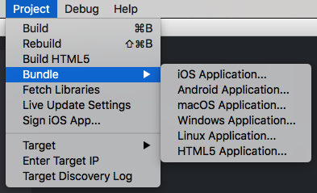

# Tworzenie pakietu aplikacji

Podczas pracy nad aplikacją warto wyrobić sobie nawyk jak najczęstszego testowania gry na platformach docelowych. Pomaga to wcześnie wykrywać problemy z wydajnością, gdy są jeszcze znacznie łatwiejsze do naprawienia. Zalecamy też testowanie na wszystkich platformach docelowych, aby znaleźć rozbieżności, na przykład w shaderach. Podczas tworzenia wersji mobilnych możesz używać [aplikacji deweloperskiej na urządzenia mobilne (mobile development app)](/manuals/dev-app/) do przesyłania zawartości do aplikacji zamiast za każdym razem tworzyć pełny pakiet i przechodzić przez cykl odinstalowania oraz ponownej instalacji.

Pakiet aplikacji dla wszystkich platform obsługiwanych przez Defold możesz utworzyć bezpośrednio w edytorze Defold, bez potrzeby korzystania z zewnętrznych narzędzi. Możesz też tworzyć pakiety z wiersza poleceń za pomocą naszego narzędzia wiersza poleceń [Bob](/manuals/bob/). Utworzenie pakietu aplikacji wymaga połączenia sieciowego, jeśli projekt zawiera jedno lub więcej [rozszerzeń natywnych](/manuals/extensions).

## Tworzenie pakietu w edytorze

Pakiet aplikacji tworzysz z menu projektu, wybierając <kbd>Project ▸ Bundle...</kbd>:

Wybranie dowolnej z tych opcji otworzy okno dialogowe Bundle dla wybranej platformy.

### Raporty budowania

Podczas tworzenia pakietu gry możesz utworzyć raport budowania. Jest to bardzo przydatne, jeśli chcesz zorientować się w rozmiarze wszystkich zasobów wchodzących w skład pakietu gry. Po prostu zaznacz pole wyboru <kbd>Generate build report</kbd> podczas tworzenia pakietu.

Więcej informacji o raportach budowania znajdziesz w [podręczniku profilowania](/manuals/profiling/#build-reports).

### Android

Tworzenie pakietu aplikacji dla Androida (.apk) opisano w [podręczniku Androida](/manuals/android/#creating-an-android-application-bundle).

### iOS

Tworzenie pakietu aplikacji dla iOS (.ipa) opisano w [podręczniku iOS](/manuals/ios/#creating-an-ios-application-bundle).

### macOS

Tworzenie pakietu aplikacji dla macOS (.app) opisano w [podręczniku macOS](/manuals/macos).

### Linux

Tworzenie pakietu aplikacji dla systemu Linux nie wymaga żadnej konkretnej konfiguracji ani opcjonalnych ustawień specyficznych dla platformy w [pliku ustawień projektu *game.project*](/manuals/project-settings/#linux).

### Windows

Tworzenie pakietu aplikacji dla systemu Windows (.exe) opisano w [podręczniku Windows](/manuals/windows).

### HTML5

Tworzenie pakietu aplikacji HTML5 oraz opcjonalną konfigurację opisano w [podręczniku HTML5](/manuals/html5/#creating-html5-bundle).

#### Facebook Instant Games

Można utworzyć specjalną wersję pakietu aplikacji HTML5 dla Facebook Instant Games. Proces ten opisano w [podręczniku Facebook Instant Games](/manuals/instant-games/).

## Tworzenie pakietu z wiersza poleceń

Edytor używa naszego narzędzia wiersza poleceń [Bob](/manuals/bob/) do tworzenia pakietów aplikacji.

Na co dzień prawdopodobnie będziesz budować projekt i tworzyć pakiety aplikacji bezpośrednio w edytorze Defold. W innych sytuacjach możesz chcieć automatycznie generować pakiety aplikacji, na przykład wsadowo budować je dla wszystkich platform docelowych przy wydawaniu nowej wersji albo przygotowywać nocne kompilacje najnowszej wersji gry, na przykład w środowisku CI. Budowanie i tworzenie pakietów aplikacji można wykonywać poza normalnym przepływem pracy edytora, korzystając z [narzędzia wiersza poleceń Bob](/manuals/bob/).

## Układ pakietu

Logiczny układ pakietu wygląda tak:

Pakiet jest zapisywany w folderze. W zależności od platformy folder ten może zostać także spakowany do archiwum `.apk` lub `.ipa`.
Zawartość folderu zależy od platformy.

Oprócz plików wykonywalnych proces tworzenia pakietu zbiera również wymagane zasoby dla danej platformy, na przykład pliki zasobów `.xml` dla Androida.

Za pomocą ustawienia [bundle_resources](https://defold.com/manuals/project-settings/#bundle-resources) możesz skonfigurować zasoby, które powinny zostać umieszczone w pakiecie w niezmienionej postaci.
Możesz to kontrolować osobno dla każdej platformy.

Zasoby gry znajdują się w pliku `game.arcd` i są indywidualnie kompresowane algorytmem LZ4.
Za pomocą ustawienia [custom_resources](https://defold.com/manuals/project-settings/#custom-resources) możesz skonfigurować zasoby, które powinny zostać umieszczone w `game.arcd` z kompresją.
Do tych zasobów można uzyskać dostęp za pomocą funkcji [`sys.load_resource()`](https://defold.com/ref/sys/#sys.load_resource).

## Wersje `release` i `debug`

Podczas tworzenia pakietu aplikacji możesz wybrać wariant `debug` lub `release`. Różnice między nimi są niewielkie, ale warto o nich pamiętać:

* Wersje `release` nie zawierają [profilera](/manuals/profiling)
* Wersje `release` nie zawierają [rejestratora ekranu](/ref/stable/sys/#start_record)
* Wersje `release` nie wyświetlają wyników działania `print()` ani danych wyjściowych generowanych przez natywne rozszerzenia
* Wersje `release` mają wartość `is_debug` w `sys.get_engine_info()` ustawioną na `false`
* Wersje `release` nie wykonują odwrotnego wyszukiwania wartości `hash` podczas wywoływania `tostring()`. W praktyce oznacza to, że `tostring()` dla wartości typu `url` lub `hash` zwróci ich numeryczną reprezentację, a nie oryginalny ciąg (`'hash: [/camera_001]'` vs `'hash: [11844936738040519888 (unknown)]'`)
* Wersji `release` nie można wybrać w edytorze jako celu dla [szybkiego przeładowania](/manuals/hot-reload) i podobnych funkcji
